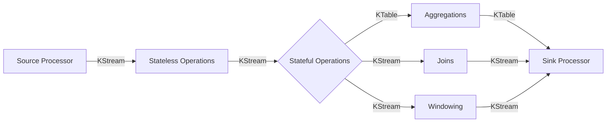

# Kafka代码实例：StreamsAPI详解

## 1. 背景介绍
### 1.1 Kafka简介
#### 1.1.1 Kafka的定义与特点
#### 1.1.2 Kafka在大数据领域的应用
#### 1.1.3 Kafka生态系统概览
### 1.2 Kafka Streams的诞生
#### 1.2.1 Kafka Streams的起源与发展历程
#### 1.2.2 Kafka Streams解决的痛点问题
#### 1.2.3 Kafka Streams与其他流处理框架的比较

## 2. 核心概念与联系
### 2.1 Streams DSL
#### 2.1.1 Streams DSL的设计理念
#### 2.1.2 Streams DSL的核心抽象
#### 2.1.3 Streams DSL的编程模型
### 2.2 Processor API  
#### 2.2.1 Processor API的设计理念
#### 2.2.2 Processor API的核心组件
#### 2.2.3 Processor API的编程模型
### 2.3 状态存储
#### 2.3.1 状态存储的概念与作用
#### 2.3.2 状态存储的类型与选择
#### 2.3.3 状态存储的配置与管理
### 2.4 时间语义
#### 2.4.1 事件时间与处理时间
#### 2.4.2 窗口操作与时间边界
#### 2.4.3 Kafka Streams对时间语义的支持

## 3. 核心算法原理具体操作步骤
### 3.1 数据重分区
#### 3.1.1 数据重分区的概念与作用
#### 3.1.2 数据重分区的具体实现
#### 3.1.3 自定义分区器的开发步骤
### 3.2 数据聚合
#### 3.2.1 数据聚合的概念与作用 
#### 3.2.2 KTable的聚合操作
#### 3.2.3 窗口聚合的实现步骤
### 3.3 数据连接
#### 3.3.1 流流连接
#### 3.3.2 流表连接
#### 3.3.3 表表连接
### 3.4 数据处理拓扑
#### 3.4.1 逻辑拓扑与物理拓扑
#### 3.4.2 拓扑的构建与优化
#### 3.4.3 拓扑的执行与监控

## 4. 数学模型和公式详细讲解举例说明
### 4.1 Kafka Streams中的数学建模
#### 4.1.1 流处理的数学抽象
#### 4.1.2 Kafka Streams中的关键数学概念
### 4.2 聚合函数的数学原理
#### 4.2.1 基于代数结构的聚合
#### 4.2.2 基于窗口模型的聚合
### 4.3 数据分区的数学原理
#### 4.3.1 数据分区的哈希算法
#### 4.3.2 数据分区的负载均衡模型

## 5. 项目实践：代码实例和详细解释说明
### 5.1 环境准备
#### 5.1.1 JDK安装与配置
#### 5.1.2 Kafka集群搭建
#### 5.1.3 Kafka Streams依赖引入
### 5.2 流处理应用开发
#### 5.2.1 Streams DSL代码实例
#### 5.2.2 Processor API代码实例
#### 5.2.3 自定义处理器与连接器
### 5.3 状态存储应用
#### 5.3.1 状态存储的配置与使用
#### 5.3.2 状态存储的查询与交互
#### 5.3.3 状态存储的容错与恢复
### 5.4 交互式查询
#### 5.4.1 交互式查询的概念与作用
#### 5.4.2 实现交互式查询的步骤
#### 5.4.3 交互式查询的最佳实践

## 6. 实际应用场景
### 6.1 实时数据分析
#### 6.1.1 用户行为分析
#### 6.1.2 异常检测
#### 6.1.3 实时报表
### 6.2 事件驱动系统
#### 6.2.1 实时推荐系统
#### 6.2.2 实时风控系统
#### 6.2.3 物联网数据处理
### 6.3 数据管道
#### 6.3.1 数据清洗与转换
#### 6.3.2 数据归一化与富化
#### 6.3.3 数据分发与集成

## 7. 工具和资源推荐
### 7.1 集成开发工具
#### 7.1.1 IDEA插件
#### 7.1.2 Maven配置
#### 7.1.3 Gradle配置
### 7.2 测试与调试工具
#### 7.2.1 Kafka集群管理工具
#### 7.2.2 消息查看与重放工具
#### 7.2.3 流处理应用监控工具
### 7.3 学习资源
#### 7.3.1 官方文档
#### 7.3.2 技术博客
#### 7.3.3 开源项目

## 8. 总结：未来发展趋势与挑战
### 8.1 Kafka Streams的优势
#### 8.1.1 原生Kafka集成
#### 8.1.2 轻量级流处理
#### 8.1.3 实时性与容错性
### 8.2 Kafka Streams的局限性
#### 8.2.1 生态系统不够成熟
#### 8.2.2 大状态应用支持有限
#### 8.2.3 SQL支持不够完善
### 8.3 Kafka Streams的未来展望
#### 8.3.1 与Kafka生态系统的深度融合
#### 8.3.2 支持更加丰富的流处理场景
#### 8.3.3 提供更加友好的开发体验

## 9. 附录：常见问题与解答
### 9.1 如何选择Streams DSL与Processor API？
### 9.2 如何实现Exactly-Once语义？
### 9.3 如何进行流处理应用的测试？
### 9.4 如何处理数据倾斜问题？
### 9.5 如何实现动态扩容与重平衡？



上图是Kafka Streams处理流程的简要Mermaid流程图，展示了从Source Processor开始，数据经过一系列Stateless和Stateful操作，最终到达Sink Processor的过程。其中，Stateless Operations包括map、filter等无状态转换操作；Stateful Operations包括Aggregations、Joins和Windowing等有状态操作，分别产生KTable和KStream。

Kafka Streams提供了高度抽象的Streams DSL（Domain Specific Language）和低阶的Processor API两种编程模型，开发者可以根据实际需求选择不同的抽象级别。Streams DSL基于KStream和KTable提供了声明式的操作，简化了流处理程序的编写；而Processor API则提供了更高的灵活性和控制力，允许开发者自定义处理逻辑和状态存储。

下面是一个使用Streams DSL进行单词计数的代码示例：

```java
// 定义输入输出的Topic名称
String inputTopic = "input-topic";
String outputTopic = "output-topic";

// 配置Kafka Streams
Properties props = new Properties();
props.put(StreamsConfig.APPLICATION_ID_CONFIG, "wordcount-app");
props.put(StreamsConfig.BOOTSTRAP_SERVERS_CONFIG, "localhost:9092");
props.put(StreamsConfig.DEFAULT_KEY_SERDE_CLASS_CONFIG, Serdes.String().getClass());
props.put(StreamsConfig.DEFAULT_VALUE_SERDE_CLASS_CONFIG, Serdes.String().getClass());

// 创建Topology
StreamsBuilder builder = new StreamsBuilder();
KStream<String, String> textLines = builder.stream(inputTopic);
KTable<String, Long> wordCounts = textLines
    .flatMapValues(value -> Arrays.asList(value.toLowerCase().split("\\W+")))
    .groupBy((key, word) -> word)
    .count(Materialized.<String, Long, KeyValueStore<Bytes, byte[]>>as("counts-store"));
wordCounts.toStream().to(outputTopic, Produced.with(Serdes.String(), Serdes.Long()));

// 创建KafkaStreams实例并启动
KafkaStreams streams = new KafkaStreams(builder.build(), props);
streams.start();
```

以上代码首先定义了输入输出的Topic名称，然后配置了Kafka Streams的相关参数。接着使用StreamsBuilder创建了一个Topology，包括从输入Topic读取文本行、按单词分组、进行计数以及将结果写入输出Topic的过程。最后创建KafkaStreams实例并启动流处理程序。

该示例中使用了flatMapValues对每行文本进行分词，groupBy对单词进行分组，count对单词出现次数进行计数。count方法的结果是一个KTable，代表单词到出现次数的映射关系。为了将结果写回Kafka，需要先调用toStream方法将KTable转换为KStream。

Kafka Streams中的状态存储发挥了重要作用，上例中的count方法就隐式地创建了一个状态存储，用于维护单词的计数状态。开发者也可以显式创建状态存储，用于保存自定义的状态信息。Kafka Streams提供了多种状态存储的选择，包括基于RocksDB的KeyValueStore、WindowStore和SessionStore等。

Kafka Streams还引入了灵活的时间语义，支持事件时间和处理时间两种时间概念。基于时间窗口的聚合操作允许开发者根据时间边界对数据进行分组和计算，如滑动窗口、滚动窗口和会话窗口等。

下面是一个使用事件时间窗口进行单词计数的代码示例：

```java
// 定义窗口大小为30秒
Duration windowSize = Duration.ofSeconds(30);

// 创建Topology
StreamsBuilder builder = new StreamsBuilder();
KStream<String, String> textLines = builder.stream(inputTopic);
KTable<Windowed<String>, Long> wordCounts = textLines
    .flatMapValues(value -> Arrays.asList(value.toLowerCase().split("\\W+")))
    .groupBy((key, word) -> word)
    .windowedBy(TimeWindows.of(windowSize).advanceBy(windowSize))
    .count(Materialized.<String, Long, WindowStore<Bytes, byte[]>>as("counts-store"));
wordCounts.toStream().map((key, value) -> new KeyValue<>(key.key(), value))
    .to(outputTopic, Produced.with(Serdes.String(), Serdes.Long()));
```

该示例中使用了windowedBy方法对数据流进行窗口划分，每30秒一个窗口。count方法的结果是一个KTable<Windowed<String>, Long>，其中Windowed<String>代表窗口化的单词，Long代表单词在该窗口内的出现次数。最后使用map方法将Windowed<String>还原为String写入输出Topic。

除了以上示例，Kafka Streams还支持多种常见的流处理操作，如数据重分区、连接、分支等。开发者可以使用这些操作灵活地组合出复杂的流处理拓扑。

总的来说，Kafka Streams提供了一种简单而强大的流处理方式，它与Kafka天然集成，支持本地状态存储和容错处理，同时提供了灵活的时间语义和窗口操作。这使得开发者能够专注于流处理逻辑的实现，而不必过多关注底层的数据传输和状态管理。

然而，Kafka Streams目前的生态系统还不够成熟，与Spark Streaming、Flink等流处理框架相比，其在社区支持、应用案例、SQL支持等方面还有一定差距。同时，对于超大规模状态的流处理应用，Kafka Streams的支持也有限。

未来Kafka Streams有望与Kafka生态系统进行更加深入的融合，提供更加丰富的流处理语义和更加友好的开发体验。同时，随着社区的不断发展和完善，Kafka Streams有望成为流处理领域的重要选择之一。

作者：禅与计算机程序设计艺术 / Zen and the Art of Computer Programming