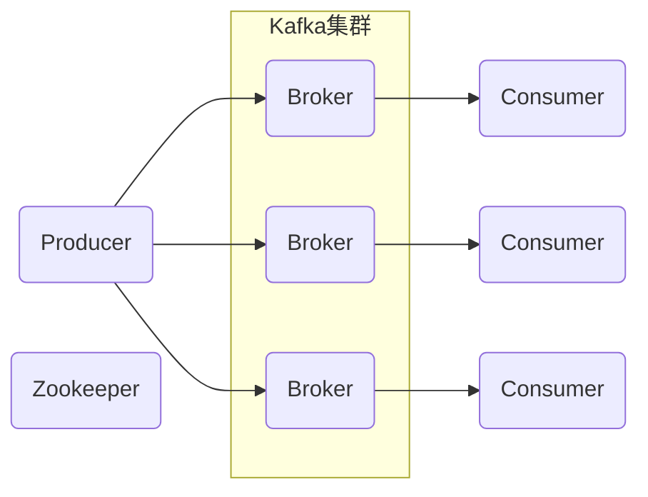
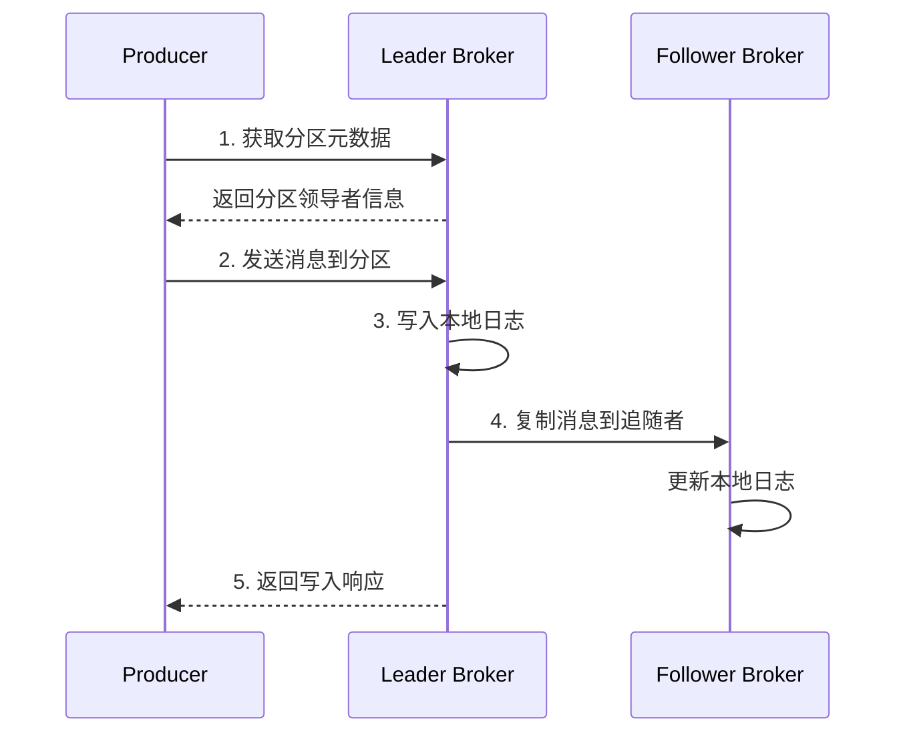
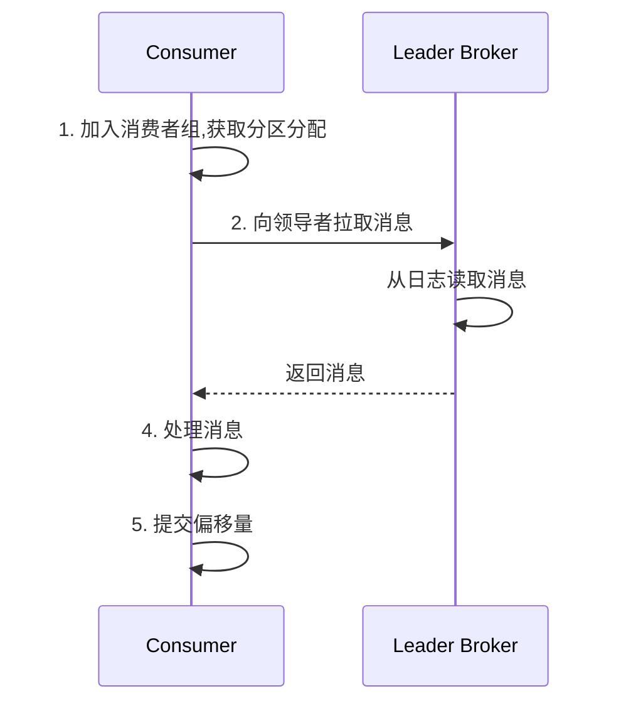
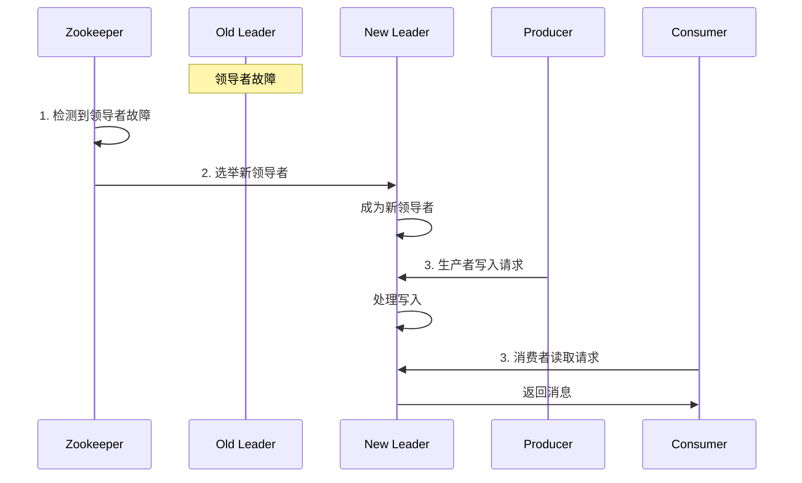

# Kafka原理与代码实例讲解

## 1. 背景介绍

Apache Kafka是一个分布式流处理平台,最初由LinkedIn公司开发,后来被顶级开源社区Apache软件基金会所收录。它是一个分布式、分区的、多副本的、多订阅者的消息队列系统,旨在为处理实时数据提供一个统一、高吞吐、低延迟的平台。

Kafka的主要设计目标是提供一个统一的高吞吐的平台,使其能够处理公司网站的所有活动(activity)数据流。这些活动数据流包括网页访问记录(pageview)、服务器日志(server log)以及统计或持久化数据等。

Kafka具有以下四个关键能力:

1. 作为消息队列,可以发布和订阅消息流。
2. 可以持久化消息流,并支持通过时间维度对消息流进行存储和访问。
3. 可以在消费者群组中对消息流进行处理。
4. 将处理后的数据连接到外部系统进行进一步处理。

Kafka的一些典型应用场景包括:

- 消息队列:连接不同的系统或应用程序,基于消息队列的数据管道。
- 网站活动跟踪:收集网站用户活动数据,用于实时监控和在线/离线分析。
- 日志收集:收集分布在多个服务器的日志,用于集中处理和分析。
- 流式处理:对实时数据流进行低延迟处理、转换和分析。
- 事件源(Event Sourcing):通过日志捕获应用程序的每一个状态变更,实现数据的完全可重放和高度的系统透明性。

## 2. 核心概念与联系

### 2.1 核心组件

Kafka由几个关键组件组成:

1. **Producer(生产者)**: 发布消息到Kafka主题的客户端进程。
2. **Consumer(消费者)**: 从Kafka主题订阅消息的客户端进程。
3. **Topic(主题)**: Kafka中的消息类别,每个主题可以有零个或多个消费者订阅。
4. **Partition(分区)**: 每个主题被分为一个或多个分区,分区是消息的提交单位。
5. **Broker(代理)**: Kafka集群中的单个服务器实例。
6. **Zookeeper**: 用于管理和协调Kafka代理的分布式系统。



### 2.2 核心概念

1. **主题(Topic)和分区(Partition)**

Kafka将消息流组织到主题(Topic)中。每个主题被分为一个或多个分区(Partition),每个分区在集群中的不同代理(Broker)上有多个副本(Replica)。这种分区和复制机制不仅提高了吞吐量,还增强了容错能力。

2. **生产者(Producer)和消费者(Consumer)**

生产者发布消息到指定的主题,消费者从主题订阅并消费消息。生产者将消息负载均衡到主题的不同分区上,消费者可以从一个或多个分区读取消息。

3. **消费者组(Consumer Group)**

消费者组由多个消费者实例组成,每个实例属于同一个组。消息在组内均匀分布,即一个分区只能被组内的一个消费者实例消费。这种设计可以实现负载均衡和容错能力。

4. **偏移量(Offset)**

偏移量是消费者在分区中的位置,用于控制从何处开始读取分区数据。偏移量由消费者所有,并存储在Kafka或Zookeeper中。

5. **复制(Replication)**

为了容错,分区会在集群中的多个代理上保留多个副本。其中一个副本是领导者(Leader),其他是追随者(Follower)。所有生产和消费操作都是通过领导者完成。

## 3. 核心算法原理具体操作步骤

### 3.1 生产者发送消息流程

生产者发送消息到Kafka主题的流程如下:

1. 生产者从主题元数据中获取分区领导者信息。
2. 生产者将消息发送给分区的领导者。
3. 领导者将消息写入本地日志。
4. 追随者从领导者拉取消息更新本地日志。
5. 消息写入完成后,领导者向生产者返回一个响应。



### 3.2 消费者消费消息流程

消费者从Kafka主题消费消息的流程如下:

1. 消费者加入消费者组,订阅主题并获取分区分配情况。
2. 消费者向领导者发送拉取请求,获取消息。
3. 领导者从本地日志读取消息并返回给消费者。
4. 消费者处理消息。
5. 消费者提交偏移量。



### 3.3 故障处理

Kafka采用主从复制的方式实现高可用性。当分区的领导者发生故障时,其中一个追随者会被选举为新的领导者,继续提供读写服务。

1. Zookeeper检测到领导者故障。
2. 在剩余的追随者中选举出新的领导者。
3. 新领导者开始接收生产者的写入请求和消费者的读取请求。



## 4. 数学模型和公式详细讲解举例说明

在Kafka中,一个关键的设计目标是提供高吞吐量和低延迟。为了实现这一目标,Kafka采用了一些优化策略,包括批量发送、零拷贝和内存映射文件等。我们可以使用一些数学模型来量化这些优化策略的效果。

### 4.1 吞吐量模型

假设我们有一个Kafka集群,包含N个代理(Broker),每个代理有M个分区。每个分区的写入吞吐量为$W_{partition}$,读取吞吐量为$R_{partition}$。那么整个集群的总写入吞吐量$W_{total}$和总读取吞吐量$R_{total}$可以表示为:

$$W_{total} = N \times M \times W_{partition}$$
$$R_{total} = N \times M \times R_{partition}$$

我们可以看到,总吞吐量与代理数量N和分区数量M成正比。增加代理或分区的数量可以提高总吞吐量。

### 4.2 延迟模型

在Kafka中,消息的延迟主要来自以下几个部分:

1. 生产者发送延迟 $d_{send}$
2. 代理写入延迟 $d_{write}$
3. 复制延迟 $d_{replication}$
4. 消费者拉取延迟 $d_{fetch}$
5. 消费者处理延迟 $d_{process}$

那么端到端的总延迟$d_{total}$可以表示为:

$$d_{total} = d_{send} + d_{write} + d_{replication} + d_{fetch} + d_{process}$$

其中,生产者发送延迟和消费者处理延迟取决于客户端的性能。代理写入延迟和复制延迟取决于磁盘I/O速度和网络带宽。消费者拉取延迟取决于网络带宽和消费者处理能力。

为了降低延迟,我们可以采取以下策略:

- 增加代理的内存缓冲区大小,减少磁盘I/O
- 使用零拷贝技术,减少内存拷贝开销
- 优化网络配置,提高网络带宽
- 增加消费者实例数量,提高消费能力

### 4.3 分区分配模型

在Kafka中,消费者组内的消费者实例会均匀地分配到主题的不同分区。假设一个主题有P个分区,消费者组有C个消费者实例,那么每个消费者实例平均分配到的分区数量为:

$$\frac{P}{C}$$

如果$P > C$,那么每个消费者实例将分配到$\lceil\frac{P}{C}\rceil$个分区。如果$P < C$,那么$C-P$个消费者实例将没有分配到任何分区。

为了实现更好的负载均衡,我们可以适当调整分区数量P和消费者实例数量C,使得$\frac{P}{C}$接近1。这样可以避免个别消费者实例过载或闲置。

## 5. 项目实践:代码实例和详细解释说明

在这一部分,我们将通过代码示例来演示如何使用Kafka进行消息的生产和消费。我们将使用Java语言和Kafka官方提供的客户端API。

### 5.1 Maven依赖

首先,我们需要在Maven项目中添加Kafka客户端的依赖:

```xml
<dependency>
    <groupId>org.apache.kafka</groupId>
    <artifactId>kafka-clients</artifactId>
    <version>3.3.1</version>
</dependency>
```

### 5.2 生产者示例

下面是一个简单的Kafka生产者示例,它向名为"test"的主题发送消息:

```java
import org.apache.kafka.clients.producer.KafkaProducer;
import org.apache.kafka.clients.producer.ProducerRecord;
import java.util.Properties;

public class ProducerExample {
    public static void main(String[] args) {
        // 配置Kafka生产者属性
        Properties props = new Properties();
        props.put("bootstrap.servers", "localhost:9092");
        props.put("key.serializer", "org.apache.kafka.common.serialization.StringSerializer");
        props.put("value.serializer", "org.apache.kafka.common.serialization.StringSerializer");

        // 创建Kafka生产者实例
        KafkaProducer<String, String> producer = new KafkaProducer<>(props);

        // 发送消息
        for (int i = 0; i < 10; i++) {
            String message = "Message " + i;
            ProducerRecord<String, String> record = new ProducerRecord<>("test", message);
            producer.send(record);
            System.out.println("Sent message: " + message);
        }

        // 关闭生产者
        producer.close();
    }
}
```

在这个示例中,我们首先配置了Kafka生产者的属性,包括`bootstrap.servers`(Kafka集群地址)、`key.serializer`和`value.serializer`(用于序列化消息键和值的序列化器)。

然后,我们创建了一个`KafkaProducer`实例,并使用`send`方法向"test"主题发送了10条消息。每条消息都是一个`ProducerRecord`对象,包含了主题名称和消息值。

最后,我们关闭了生产者实例。

### 5.3 消费者示例

下面是一个简单的Kafka消费者示例,它从名为"test"的主题消费消息:

```java
import org.apache.kafka.clients.consumer.ConsumerRecord;
import org.apache.kafka.clients.consumer.ConsumerRecords;
import org.apache.kafka.clients.consumer.KafkaConsumer;
import java.time.Duration;
import java.util.Collections;
import java.util.Properties;

public class ConsumerExample {
    public static void main(String[] args) {
        // 配置Kafka消费者属性
        Properties props = new Properties();
        props.put("bootstrap.servers", "localhost:9092");
        props.put("group.id", "test-group");
        props.put("key.deserializer", "org.apache.kafka.common.serialization.StringDeserializer