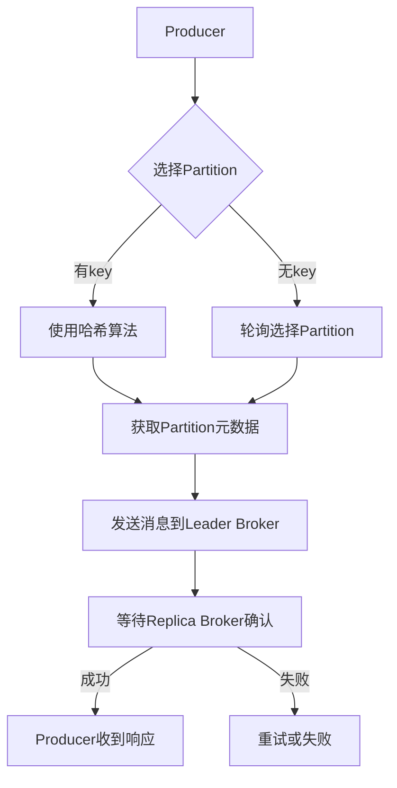
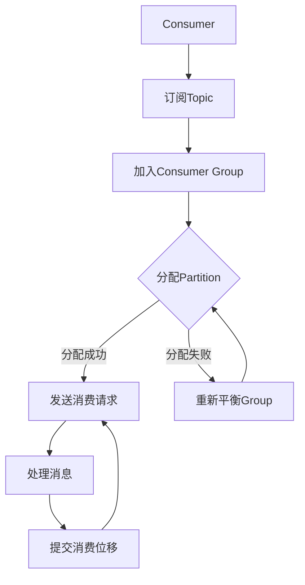

# Kafka在智慧城市数据汇聚中的应用

## 1. 背景介绍

随着城市化进程的加快和信息技术的飞速发展,智慧城市建设已成为全球城市发展的重要趋势。智慧城市的核心是通过现代信息技术手段,实现城市运行的智能化管理和服务,提高城市运营效率,节约资源能源,保护环境,从而更好地服务于城市的可持续发展。

在智慧城市的建设中,数据是智能化管理和服务的基础。智慧城市涉及交通、环境、公共安全、市政设施等多个领域,每个领域都产生着大量的实时数据,这些数据需要高效地进行采集、传输、存储和处理,才能为智慧城市的各项应用提供数据支撑。因此,构建一个高效、可靠的数据汇聚平台就显得尤为重要。

Apache Kafka作为一个分布式的流式数据平台,在智慧城市的数据汇聚中发挥着关键作用。它能够实时地从各个数据源采集数据,并以高吞吐量、低延迟的方式对数据进行传输和存储,为下游的数据处理系统提供数据源。本文将重点介绍Kafka在智慧城市数据汇聚中的应用,包括Kafka的核心概念、工作原理、部署架构等,并结合实际案例进行分析和讨论。

## 2. 核心概念与联系

在介绍Kafka在智慧城市数据汇聚中的应用之前,我们先来了解一下Kafka的核心概念。

### 2.1 Topic和Partition

Kafka以Topic作为数据记录的逻辑单元,每个Topic可以被进一步分为若干个Partition。生产者(Producer)将数据发送到指定的Topic,而消费者(Consumer)则从Topic中消费数据。

```
graph LR
    subgraph Kafka Cluster
    Partition1 --> Partition2
    Partition2 --> Partition3
    Partition3 --> Partition4
    end
    Producer1 --> Topic1
    Producer2 --> Topic1
    Topic1 --> Partition1
    Topic1 --> Partition2
    Topic1 --> Partition3
    Topic1 --> Partition4
    Consumer1 --> Topic1
    Consumer2 --> Topic1
```

Partition的引入主要有以下两个目的:

1. **提高并行度**:由于一个Partition只能被一个Consumer Group中的一个消费者消费,因此将Topic分为多个Partition可以提高并行消费的能力。
2. **提高容错性**:Kafka允许为每个Partition设置多个副本,副本分布在不同的Broker上,以防止单点故障导致数据丢失。

### 2.2 Producer和Consumer

Producer是发布消息的角色,它负责将数据发送到指定的Topic。在发送数据时,Producer需要指定数据所属的Topic以及数据的key。Kafka会根据key的值,使用内置的哈希算法选择将数据发送到哪个Partition。

Consumer是消费消息的角色,它需要先订阅感兴趣的Topic,然后持续从Topic中消费数据。为了实现消费的负载均衡和容错,Kafka引入了Consumer Group的概念。一个Consumer Group由多个Consumer实例组成,这些实例之间会自动进行协作,每个实例只需消费订阅Topic的一部分Partition即可。

### 2.3 Broker和Zookeeper

Broker是Kafka集群中的服务节点,它负责存储和管理数据。每个Broker会存储部分Topic的Partition,并且为了提高容错性,每个Partition都会在多个Broker上存储多个副本。

Zookeeper是Kafka集群中的协调者,它负责管理和监控整个Kafka集群。Zookeeper会维护Broker、Topic、Partition等元数据信息,并协调Producer和Consumer与Broker之间的交互。

## 3. 核心算法原理具体操作步骤

### 3.1 Producer发送消息流程

当Producer向Kafka发送消息时,它会经历以下几个步骤:

1. **选择Partition**:Producer根据消息的key,使用内置的哈希算法选择将消息发送到哪个Partition。如果没有指定key,Kafka会使用轮询的方式将消息均匀地分布到不同的Partition。

2. **获取Partition元数据**:Producer需要从Zookeeper获取目标Partition的元数据信息,包括Partition的Leader Broker以及Replica Broker列表。

3. **发送消息到Leader Broker**:Producer将消息发送到Leader Broker,Leader Broker会先将消息写入本地日志文件,然后将消息复制到所有Replica Broker。

4. **等待Replica Broker确认**:Leader Broker等待所有同步Replica Broker确认已经接收到消息,然后向Producer返回一个响应,表示消息已经成功写入。

5. **Producer收到响应**:Producer收到Leader Broker的响应后,就可以继续发送下一批消息了。



### 3.2 Consumer消费消息流程

Consumer消费消息的流程如下:

1. **订阅Topic**:Consumer向Zookeeper发送订阅请求,订阅感兴趣的Topic。

2. **加入Consumer Group**:Consumer向Zookeeper注册自己所属的Consumer Group,并获取该Group中所有Consumer的列表。

3. **分配Partition**:Zookeeper根据Consumer Group中Consumer的数量,为每个Consumer分配一部分Partition的消费权利。

4. **发送消费请求**:Consumer向负责存储该Partition的Broker发送消费请求,获取该Partition的消息。

5. **处理消息**:Consumer处理从Broker接收到的消息,并周期性地向Broker发送心跳请求,维持消费状态。

6. **提交消费位移**:Consumer将已经消费的消息位移(offset)提交到Zookeeper或Kafka内部的特殊Topic中,用于在发生故障时进行消费位移的恢复。



## 4. 数学模型和公式详细讲解举例说明

在Kafka中,有一些重要的数学模型和公式,对于理解Kafka的工作原理和性能优化非常有帮助。

### 4.1 分区分配算法

Kafka采用了一种基于"Range Partitioning"的分区分配算法,用于在Consumer Group中平衡分配Partition的消费权利。该算法的核心思想是将所有Partition按照某种顺序排列,然后将这些Partition均匀地分配给Consumer Group中的每个Consumer实例。

假设有N个Partition,M个Consumer实例,则每个Consumer实例平均需要消费$\lceil \frac{N}{M} \rceil$个Partition。算法的具体步骤如下:

1. 将所有Partition按照某种顺序排列,得到一个有序列表$P = \{p_1, p_2, \dots, p_N\}$。
2. 将Consumer实例按照某种顺序排列,得到一个有序列表$C = \{c_1, c_2, \dots, c_M\}$。
3. 从$P$的第一个Partition$p_1$开始,依次将Partition分配给$C$中的Consumer实例,直到所有Partition都被分配完毕。

例如,假设有6个Partition和3个Consumer实例,则分配过程如下:

$$
\begin{array}{c|ccc}
\text{Partition} & c_1 & c_2 & c_3 \\
\hline
p_1 & p_1 &     &     \\
p_2 &     & p_2 &     \\
p_3 & p_3 &     &     \\
p_4 &     & p_4 &     \\
p_5 &     &     & p_5 \\
p_6 & p_6 &     &     \\
\end{array}
$$

可以看到,该算法能够实现Partition的均匀分配,从而平衡每个Consumer实例的负载。

### 4.2 复制因子和ISR

为了提高Kafka的容错性,每个Partition都会在多个Broker上存储多个副本。其中,一个副本被选举为Leader,负责处理Producer的写入请求和Consumer的读取请求。其他副本被称为Follower,它们只负责从Leader复制数据,以保持与Leader的数据一致性。

复制因子(Replication Factor)用于控制每个Partition应该有多少个副本。例如,如果复制因子设置为3,则每个Partition会有3个副本,分布在3个不同的Broker上。复制因子越大,容错性就越高,但同时也会增加存储和网络开销。

在Follower副本中,有一部分副本会被选为同步副本(In-Sync Replica,ISR),它们需要与Leader保持高度同步,以确保数据的一致性。如果某个Follower副本落后太多,就会被临时踢出ISR列表,直到它重新赶上Leader的进度。

ISR的大小会影响Kafka的可用性和一致性。如果ISR过小,一旦Leader出现故障,可能就无法选举出新的Leader,导致整个Partition不可用。如果ISR过大,则需要等待更多的Follower副本同步完成,会降低写入性能。因此,ISR的大小需要根据实际情况进行权衡和调整。

## 5. 项目实践:代码实例和详细解释说明

为了更好地理解Kafka在智慧城市数据汇聚中的应用,我们来看一个具体的项目实践案例。

假设我们需要构建一个智慧交通系统,该系统需要实时采集城市中各个路口的交通数据(如车流量、车速等),并将这些数据发送到Kafka集群中。同时,我们还需要一个实时数据处理系统,从Kafka消费这些交通数据,进行分析和计算,为交通管控和路径规划提供决策支持。

### 5.1 Producer代码示例

下面是一个使用Java编写的Producer示例代码,用于将交通数据发送到Kafka:

```java
import org.apache.kafka.clients.producer.KafkaProducer;
import org.apache.kafka.clients.producer.ProducerRecord;

import java.util.Properties;

public class TrafficDataProducer {
    public static void main(String[] args) {
        // 配置Kafka Producer
        Properties props = new Properties();
        props.put("bootstrap.servers", "kafka1:9092,kafka2:9092,kafka3:9092");
        props.put("key.serializer", "org.apache.kafka.common.serialization.StringSerializer");
        props.put("value.serializer", "org.apache.kafka.common.serialization.StringSerializer");

        // 创建Kafka Producer实例
        KafkaProducer<String, String> producer = new KafkaProducer<>(props);

        // 模拟生成交通数据
        for (int i = 0; i < 100; i++) {
            String intersection = "intersection-" + (i % 10);
            int traffic = (int) (Math.random() * 1000);
            int speed = (int) (Math.random() * 100);

            // 构建Kafka消息
            ProducerRecord<String, String> record = new ProducerRecord<>("traffic-data", intersection, traffic + "," + speed);

            // 发送消息到Kafka
            producer.send(record);
            System.out.println("Sent traffic data: " + record.value());
        }

        // 关闭Producer
        producer.flush();
        producer.close();
    }
}
```

在这个示例中,我们首先配置了Kafka Producer的一些参数,如Broker地址、序列化器等。然后,我们模拟生成了100条交通数据,每条数据包含路口编号、车流量和车速信息。我们将这些数据封装成Kafka消息,并发送到名为"traffic-data"的Topic中。

### 5.2 Consumer代码示例

下面是一个使用Java编写的Consumer示例代码,用于从Kafka消费交通数据:

```java
import org.apache.kafka.clients.consumer.ConsumerRecord;
import org.apache.kafka.clients.consumer.ConsumerRecords;
import org.apache.kafka.clients.consumer.KafkaConsumer;

import java.time.Duration;
import java.util.Arrays;
import java.util.Properties;

public class TrafficDataConsumer {
    public static void main(String[] args) {
        // 配置Kafka Consumer
        Properties props = new Properties();
        props.put("bootstrap.servers", "kafka1:9092,kafka2