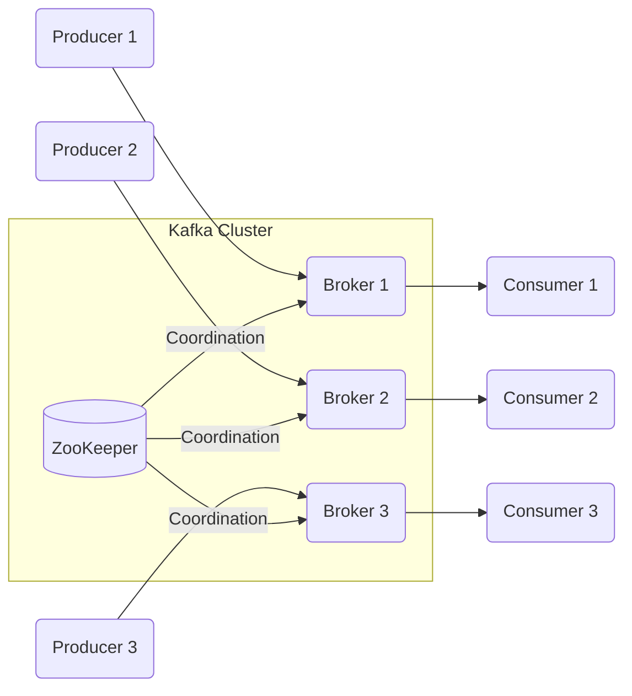
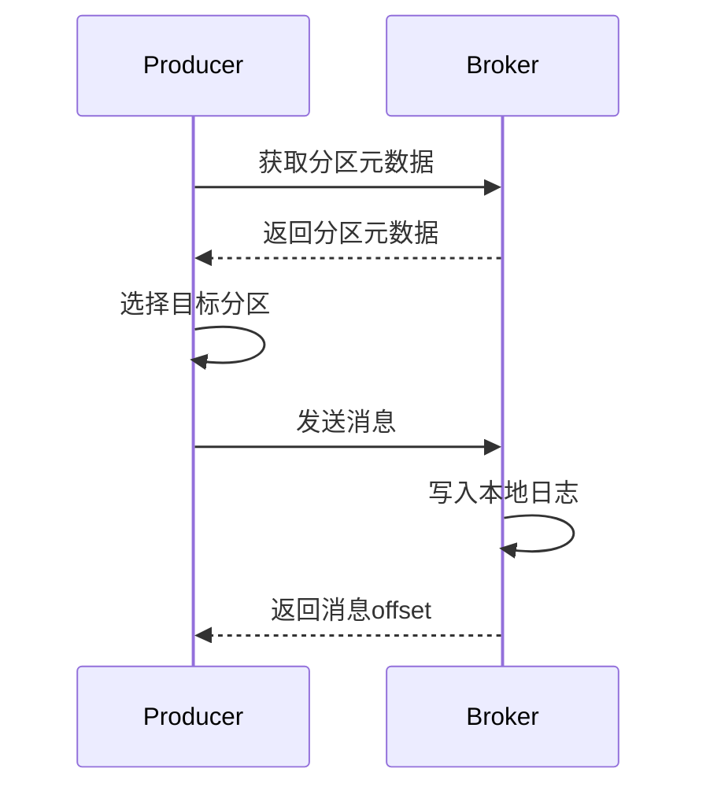
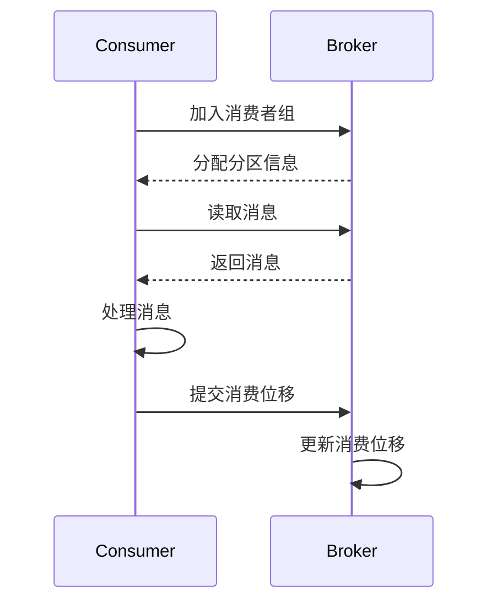
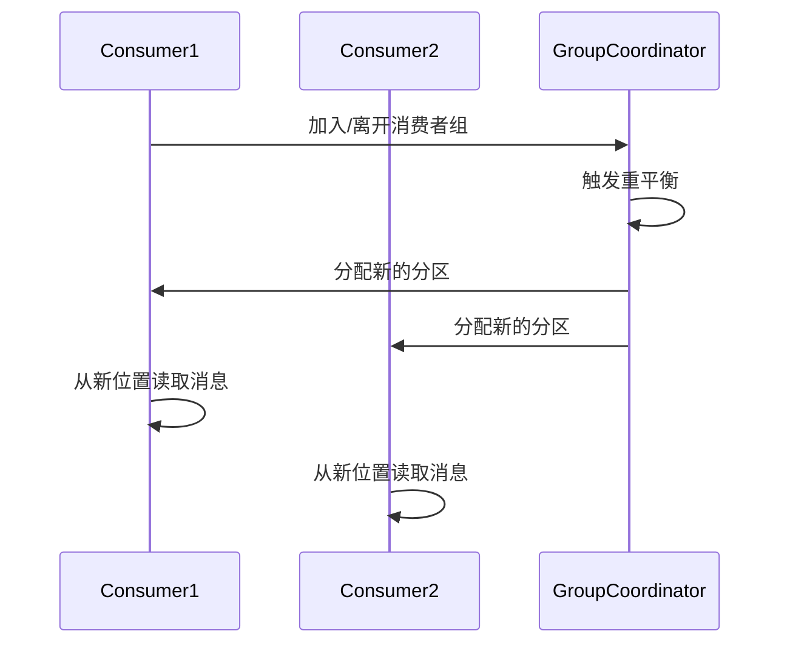

# Kafka生产者消费者API原理与代码实例讲解

## 1.背景介绍

Apache Kafka是一个分布式流处理平台,它提供了一种统一、高吞吐、低延迟的方式来处理实时数据流。Kafka被广泛应用于日志收集、消息系统、数据管道、流式处理、事件源等场景。其核心概念是将数据流组织为不同的主题(Topic),生产者(Producer)向主题发布消息,消费者(Consumer)从主题订阅并消费这些消息。

### 1.1 Kafka架构

Kafka集群通常由多个Broker组成,形成一个服务器集群。每个Broker存储一部分Topic的数据,每个Topic又被划分为多个分区(Partition),分区中的消息按照时间顺序组织。生产者将消息发送到指定Topic的Partition中,消费者则从分区中读取并消费消息。



### 1.2 生产者和消费者

Kafka生产者是负责发布消息到Kafka主题的客户端,而消费者则是从主题订阅并消费这些消息的客户端。生产者和消费者通过简单的API与Kafka集群进行交互。

## 2.核心概念与联系

### 2.1 主题(Topic)

主题是Kafka中消息的逻辑订阅单元,生产者将消息发送到特定的主题,消费者则从该主题订阅消息。主题由一个或多个分区(Partition)组成,每个分区中的消息按照时间顺序存储。

### 2.2 分区(Partition)

分区是Kafka中存储消息的基本单元,每个分区都是一个有序的、不可变的消息序列。分区可以分布在集群中的不同Broker上,以实现负载均衡和容错。消费者从分区中读取消息,而不是直接从主题中读取。

### 2.3 生产者(Producer)

生产者负责将消息发送到Kafka集群中的指定主题。生产者可以选择将消息发送到特定的分区,也可以由Kafka自动平衡分区。生产者还可以设置消息的键(Key)来实现消息的分区。

### 2.4 消费者(Consumer)

消费者是从Kafka主题订阅并消费消息的客户端。消费者通过订阅一个或多个主题,并从分区中读取消息。消费者可以组成消费者组(Consumer Group),每个消费者组内的消费者实例只消费分区的一部分消息,实现消费负载的均衡。

### 2.5 消费者组(Consumer Group)

消费者组是Kafka提供的可扩展性和容错性机制。每个消费者组由多个消费者实例组成,组内的消费者实例共同消费订阅主题的所有分区。每个分区只能被组内的一个消费者实例消费,这样可以避免重复消费。如果某个消费者实例失败,分区将被重新分配给其他实例,确保消息不会丢失。

## 3.核心算法原理具体操作步骤

### 3.1 生产者发送消息

生产者发送消息的基本步骤如下:

1. 生产者获取主题的分区元数据信息,包括分区数量、分区领导者等。
2. 生产者根据消息键(Key)和分区策略,选择将消息发送到哪个分区。
3. 生产者将消息序列化后发送到选定的分区领导者Broker。
4. 分区领导者Broker将消息写入本地日志文件,并向生产者返回一个offset(消息在分区中的位置)。
5. 生产者可以选择等待Broker的确认,以确保消息成功写入。



### 3.2 消费者消费消息

消费者消费消息的基本步骤如下:

1. 消费者向Broker发送加入消费者组的请求,并获取分配的分区信息。
2. 消费者根据分区信息,从分区领导者Broker读取消息。
3. 消费者处理消息,并向Broker提交消费位移(offset)。
4. 如果消费者失败,分区将被重新分配给其他消费者实例。



### 3.3 消费者组重平衡

当消费者组中的消费者实例数量发生变化时,Kafka会触发重平衡过程,重新分配分区给组内的消费者实例。重平衡过程如下:

1. 某个消费者实例加入或离开消费者组。
2. 组协调器(Group Coordinator)开始重平衡过程。
3. 组协调器将分区重新分配给组内的活跃消费者实例。
4. 消费者实例根据新的分区分配,开始从新的分区位置读取消息。



## 4.数学模型和公式详细讲解举例说明

### 4.1 分区分配策略

Kafka采用范围分区(Range Partitioning)和哈希分区(Hash Partitioning)两种分区分配策略。

#### 4.1.1 范围分区

范围分区将消息键按照某个范围映射到不同的分区。假设有N个分区,消息键为K,则分区P可以通过以下公式计算:

$$P = \left\lfloor \frac{K}{K_{max}} \times N \right\rfloor$$

其中$K_{max}$是消息键的最大值。这种策略适用于消息键是有序的场景,例如时间戳或连续数值。

#### 4.1.2 哈希分区

哈希分区根据消息键的哈希值,将消息映射到不同的分区。假设有N个分区,消息键为K,则分区P可以通过以下公式计算:

$$P = \text{hash}(K) \bmod N$$

这种策略可以确保具有相同键的消息总是被分配到同一个分区,适用于需要按键分区的场景。

### 4.2 消费位移(Offset)管理

Kafka为每个分区维护一个逻辑消费位移,表示消费者已经消费到的位置。消费者可以选择三种位移管理策略:

1. **自动提交位移**:消费者自动周期性地向Broker提交位移。
2. **手动提交位移**:消费者手动控制何时向Broker提交位移。
3. **手动控制位移**:消费者完全控制位移的存储和管理。

对于自动提交位移,Kafka使用以下公式计算新的提交位移:

$$\text{NewOffset} = \max(\text{CurrentOffset}, \text{LastCommittedOffset}) + 1$$

其中$\text{CurrentOffset}$是消费者当前消费的位移,$\text{LastCommittedOffset}$是上次提交的位移。这种策略可以确保不会丢失或重复消费消息。

## 5.项目实践:代码实例和详细解释说明

### 5.1 生产者示例

以下是使用Java编写的Kafka生产者示例:

```java
// 创建Kafka生产者属性
Properties props = new Properties();
props.put("bootstrap.servers", "localhost:9092");
props.put("key.serializer", "org.apache.kafka.common.serialization.StringSerializer");
props.put("value.serializer", "org.apache.kafka.common.serialization.StringSerializer");

// 创建Kafka生产者实例
Producer<String, String> producer = new KafkaProducer<>(props);

// 发送消息
String topic = "my-topic";
String key = "message-key";
String value = "Hello, Kafka!";

ProducerRecord<String, String> record = new ProducerRecord<>(topic, key, value);
producer.send(record, (metadata, exception) -> {
    if (exception == null) {
        System.out.println("Message sent: " + metadata.offset());
    } else {
        System.err.println("Failed to send message: " + exception.getMessage());
    }
});

// 关闭生产者
producer.flush();
producer.close();
```

1. 首先创建Kafka生产者属性,包括Broker地址、键值序列化器等。
2. 使用属性创建Kafka生产者实例。
3. 创建`ProducerRecord`对象,指定主题、键和值。
4. 调用`producer.send()`方法发送消息,可以设置回调函数处理发送结果。
5. 最后关闭生产者实例。

### 5.2 消费者示例

以下是使用Java编写的Kafka消费者示例:

```java
// 创建Kafka消费者属性
Properties props = new Properties();
props.put("bootstrap.servers", "localhost:9092");
props.put("group.id", "my-group");
props.put("key.deserializer", "org.apache.kafka.common.serialization.StringDeserializer");
props.put("value.deserializer", "org.apache.kafka.common.serialization.StringDeserializer");

// 创建Kafka消费者实例
Consumer<String, String> consumer = new KafkaConsumer<>(props);

// 订阅主题
String topic = "my-topic";
consumer.subscribe(Collections.singletonList(topic));

// 消费消息
while (true) {
    ConsumerRecords<String, String> records = consumer.poll(Duration.ofMillis(100));
    for (ConsumerRecord<String, String> record : records) {
        System.out.println("Received message: " + record.value());
    }
}
```

1. 首先创建Kafka消费者属性,包括Broker地址、消费者组ID、键值反序列化器等。
2. 使用属性创建Kafka消费者实例。
3. 调用`consumer.subscribe()`方法订阅主题。
4. 使用`consumer.poll()`方法从主题读取消息。
5. 处理接收到的消息。

## 6.实际应用场景

Kafka生产者和消费者API在以下场景中广泛应用:

1. **日志收集**:将应用程序日志作为消息发送到Kafka,由消费者进行日志处理和分析。
2. **消息队列**:生产者发送消息到Kafka,消费者从Kafka读取并处理消息,实现异步解耦。
3. **数据管道**:将数据从源系统发送到Kafka,再由消费者从Kafka读取数据,实现数据集成和ETL(提取、转换、加载)。
4. **流式处理**:生产者将实时数据流发送到Kafka,消费者从Kafka读取数据进行实时处理和分析。
5. **事件源(Event Sourcing)**:将应用程序的状态变更作为事件发送到Kafka,消费者从Kafka读取事件并重建应用程序状态。

## 7.工具和资源推荐

以下是一些常用的Kafka工具和资源:

1. **Kafka命令行工具**:Kafka自带的命令行工具,可用于创建主题、发送和消费消息等操作。
2. **Kafka Manager**:开源的Kafka集群管理工具,提供Web UI界面管理Kafka集群。
3. **Kafka监控工具**:如Kafka Manager、Kafka Eagle等,用于监控Kafka集群的运行状态和性能指标。
4. **Kafka客户端库**:各种编程语言的Kafka客户端库,如Java、Python、Go等。
5. **Kafka Stream**:Kafka提供的流式处理API,可以在Kafka上进行低延迟的流式计算。
6. **Kafka官方文档**:Apache Kafka官方文档,提供详细的概念介绍、API使用指南等信息。
7. **Kafka相关书籍**:如《Kafka权威指南》、《Kafka Stream实战》等,深入探讨Kafka原理和实践。

## 8.总结:未来发展趋势与挑战

Kafka作为分布式流处理平