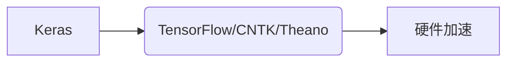

# Keras 原理与代码实战案例讲解

## 1.背景介绍

在过去几年中,深度学习已经成为机器学习领域最热门的研究方向之一。作为一种强大的技术,深度学习已被广泛应用于计算机视觉、自然语言处理、语音识别等多个领域,并取得了令人瞩目的成就。然而,由于深度学习模型的复杂性,从模型设计到训练部署的整个过程都存在诸多挑战,这使得深度学习的实际应用面临了一定的门槛。

Keras是一个高度模块化的神经网络库,由Francis Chollet于2015年开发。它的主要目标是实现快速实验深度神经网络的想法,使得代码简单且高度模块化,极大地降低了深度学习模型的开发难度。Keras不只是一个封装好的工具包,它也是一个分层的深度学习库,可以轻松地构建各种类型的神经网络模型。自发布以来,Keras凭借其简单、高效、模块化的特点,迅速获得了广泛的关注和应用,成为了Python深度学习生态系统中最受欢迎的库之一。

## 2.核心概念与联系

### 2.1 Keras核心概念

Keras的核心数据结构是模型(Model),它用于构建神经网络的架构。模型由层(Layer)组成,层是构建模型的基本单元。层可以有多种形式,例如全连接层、卷积层、池化层等。每个层都会对输入数据进行某种形式的转换,并将转换后的数据传递给下一层。

为了构建模型,我们需要首先定义输入张量(Input Tensor),然后通过层的组合和堆叠来构建网络的架构。Keras支持两种方式来定义模型:

1. 序贯式模型(Sequential Model):通过将层按顺序堆叠来构建模型。这种方式适用于简单的线性堆栈模型,如多层感知机和卷积神经网络。

2. 函数式模型(Functional Model):通过定义输入张量和输出张量,并使用层对象来描述它们之间的关系,从而构建任意结构的模型。这种方式非常灵活,可以构建有向无环图(DAG)结构的模型,如Inception网络和残差网络。

### 2.2 Keras与其他深度学习框架的联系

虽然Keras是一个独立的深度学习库,但它并不是孤立存在的。事实上,Keras是建立在其他深度学习框架之上的高级接口,如TensorFlow、CNTK和Theano。这意味着Keras可以利用这些底层框架提供的高性能数值计算能力,同时保持了自身的简单性和模块化。

Keras与底层框架的关系可以用下图来描述:



Keras作为高级API,为用户提供了简单易用的接口,而底层框架则负责执行实际的数值计算和硬件加速。这种设计使得Keras可以专注于提供友好的用户体验,而无需关注底层的实现细节。

值得一提的是,自从TensorFlow 2.0版本发布以来,Keras已经被直接集成到TensorFlow中,成为了TensorFlow的官方高级API。这使得Keras和TensorFlow的结合更加紧密,为用户提供了更加一致和无缝的开发体验。

## 3.核心算法原理具体操作步骤 

### 3.1 模型构建

在Keras中,构建神经网络模型的过程分为以下几个步骤:

#### 3.1.1 定义输入张量

使用`Input`函数定义输入张量的形状,例如:

```python
from keras.layers import Input

inputs = Input(shape=(28, 28, 1))  # 输入张量的形状为 (28, 28, 1)
```

#### 3.1.2 堆叠层

使用层对象对输入张量进行变换,并将变换后的张量传递给下一层。例如,对于一个简单的全连接网络:

```python
from keras.layers import Dense

x = Dense(64, activation='relu')(inputs)  # 全连接层,64个神经元
x = Dense(10, activation='softmax')(x)    # 输出层,10个神经元
```

#### 3.1.3 构建模型

根据输入张量和输出张量,使用`Model`函数构建模型:

```python
from keras.models import Model

model = Model(inputs=inputs, outputs=x)
```

对于序贯式模型,可以使用`Sequential`函数:

```python
from keras.models import Sequential

model = Sequential([
    Dense(64, activation='relu', input_shape=(28, 28, 1)),
    Dense(10, activation='softmax')
])
```

### 3.2 模型训练

在训练模型之前,需要首先配置模型的训练过程,包括优化器、损失函数和评估指标等。

```python
model.compile(optimizer='adam',
              loss='categorical_crossentropy',
              metrics=['accuracy'])
```

然后,使用`fit`函数进行模型训练:

```python
model.fit(x_train, y_train,
          batch_size=32,
          epochs=10,
          validation_data=(x_val, y_val))
```

其中,`x_train`和`y_train`分别表示训练数据和标签,`batch_size`表示每次迭代使用的批大小,`epochs`表示迭代的次数,`validation_data`用于在训练过程中评估模型的性能。

### 3.3 模型评估和预测

使用`evaluate`函数评估模型在测试数据上的性能:

```python
loss, accuracy = model.evaluate(x_test, y_test)
print(f'Test loss: {loss:.4f}')
print(f'Test accuracy: {accuracy:.4f}')
```

使用`predict`函数对新的数据进行预测:

```python
predictions = model.predict(x_new)
```

## 4.数学模型和公式详细讲解举例说明

深度学习模型的核心是神经网络,而神经网络的数学基础则是人工神经元和激活函数。在这一节中,我们将详细介绍这些基本概念及其相关的数学模型和公式。

### 4.1 人工神经元

人工神经元是神经网络的基本计算单元,它模拟了生物神经元的工作原理。一个人工神经元接收多个输入,对每个输入赋予一个权重,然后将加权输入求和,最后通过一个激活函数产生输出。

设有 $n$ 个输入 $x_1, x_2, \ldots, x_n$,对应的权重为 $w_1, w_2, \ldots, w_n$,偏置项为 $b$,激活函数为 $f$,则神经元的输出 $y$ 可以表示为:

$$y = f\left(\sum_{i=1}^{n}w_ix_i + b\right)$$

在神经网络中,多个神经元组合在一起形成层,层与层之间通过权重相连。每个神经元的输出将作为下一层的输入,经过多层传递和变换,最终得到网络的输出。

### 4.2 激活函数

激活函数是神经网络中一个非常重要的组成部分,它引入了非线性,使得神经网络能够拟合复杂的函数。常见的激活函数包括sigmoid函数、tanh函数、ReLU函数等。

#### 4.2.1 Sigmoid函数

Sigmoid函数的数学表达式为:

$$\sigma(x) = \frac{1}{1 + e^{-x}}$$

其函数图像如下:

```mermaid
graph LR
    S((Sigmoid函数))
    S-->|y=1/(1+e^(-x))|G[函数图像]
```

Sigmoid函数的输出范围在(0,1)之间,常用于二分类问题的输出层。但是由于存在梯度消失的问题,在隐藏层中使用效果不佳。

#### 4.2.2 Tanh函数

Tanh函数的数学表达式为:

$$\tanh(x) = \frac{e^x - e^{-x}}{e^x + e^{-x}}$$

其函数图像如下:

```mermaid
graph LR
    T((Tanh函数))
    T-->|y=(e^x-e^(-x))/(e^x+e^(-x))|G[函数图像]
```

Tanh函数的输出范围在(-1,1)之间,相比于Sigmoid函数,它是一种零均值的函数,收敛速度更快。但同样存在梯度消失的问题。

#### 4.2.3 ReLU函数

ReLU(Rectified Linear Unit)函数的数学表达式为:

$$\text{ReLU}(x) = \max(0, x)$$

其函数图像如下:

```mermaid
graph LR
    R((ReLU函数))
    R-->|y=max(0,x)|G[函数图像]
```

ReLU函数在正半轴上是线性的,在负半轴上为0。它的优点是计算简单、收敛速度快,并且能有效解决梯度消失问题。因此,ReLU函数在深度神经网络的隐藏层中被广泛使用。

### 4.3 损失函数

在训练神经网络时,我们需要定义一个损失函数(Loss Function)来衡量模型的预测结果与真实标签之间的差距。通过最小化损失函数,我们可以不断调整模型的参数,使得模型的预测结果逐渐接近真实值。

常见的损失函数包括均方误差(Mean Squared Error, MSE)、交叉熵损失(Cross-Entropy Loss)等。

#### 4.3.1 均方误差

均方误差是回归问题中常用的损失函数,它衡量的是预测值与真实值之间的欧几里得距离。设有 $n$ 个样本,预测值为 $\hat{y}_i$,真实值为 $y_i$,则均方误差可以表示为:

$$\text{MSE} = \frac{1}{n}\sum_{i=1}^{n}(\hat{y}_i - y_i)^2$$

均方误差的优点是计算简单,但对于异常值较为敏感。

#### 4.3.2 交叉熵损失

交叉熵损失常用于分类问题,它衡量的是预测概率分布与真实标签分布之间的差异。设有 $C$ 个类别,对于第 $i$ 个样本,其预测概率分布为 $\hat{p}_i = (\hat{p}_{i1}, \hat{p}_{i2}, \ldots, \hat{p}_{iC})$,真实标签为 $y_i = (y_{i1}, y_{i2}, \ldots, y_{iC})$,则交叉熵损失可以表示为:

$$\text{CrossEntropy} = -\frac{1}{n}\sum_{i=1}^{n}\sum_{j=1}^{C}y_{ij}\log\hat{p}_{ij}$$

交叉熵损失的优点是能够直接度量概率分布之间的差异,并且对于小概率事件也较为敏感。

### 4.4 优化算法

在训练神经网络时,我们需要使用优化算法来最小化损失函数,从而找到最优的模型参数。常见的优化算法包括梯度下降(Gradient Descent)、动量优化(Momentum)、RMSProp、Adam等。

#### 4.4.1 梯度下降

梯度下降是最基本的优化算法,它根据损失函数对参数的梯度,沿着梯度的反方向更新参数。设有参数 $\theta$,学习率为 $\alpha$,损失函数为 $J(\theta)$,则梯度下降的更新规则为:

$$\theta = \theta - \alpha\nabla_\theta J(\theta)$$

其中,梯度 $\nabla_\theta J(\theta)$ 可以通过反向传播算法计算得到。

#### 4.4.2 动量优化

动量优化在梯度下降的基础上引入了动量项,使得参数的更新不仅考虑当前梯度,还考虑了之前的更新方向。设动量参数为 $\beta$,速度向量为 $v$,则动量优化的更新规则为:

$$\begin{align}
v &= \beta v - \alpha\nabla_\theta J(\theta) \\
\theta &= \theta + v
\end{align}$$

动量优化能够加速收敛,并且有助于跳出局部最优解。

#### 4.4.3 Adam优化算法

Adam(Adaptive Moment Estimation)是一种自适应学习率的优化算法,它结合了动量优化和RMSProp算法的优点。Adam不仅能够加速收敛,而且对于不同的参数自动调整学习率,从而提高了优化效率。

Adam算法的更新规则较为复杂,感兴趣的读者可以参考相关文献进一步了解。

## 5.项目实践:代码实例和详细解释说明

在这一节中,我们将通过一个实际的案例来演示如何使用Keras构建、训练和评估一个深度神经网