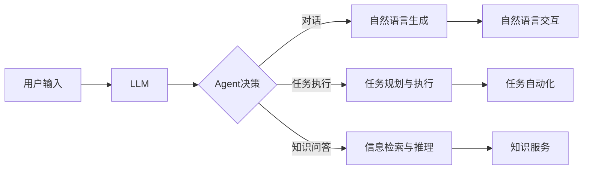

# LLM-based Agent

## 1. 背景介绍
### 1.1 人工智能的发展历程
#### 1.1.1 早期的人工智能
#### 1.1.2 机器学习的兴起
#### 1.1.3 深度学习的突破

### 1.2 自然语言处理的进展
#### 1.2.1 早期的自然语言处理技术
#### 1.2.2 神经网络在自然语言处理中的应用
#### 1.2.3 Transformer 模型的出现

### 1.3 大语言模型（LLM）的崛起
#### 1.3.1 GPT 系列模型
#### 1.3.2 BERT 及其变体
#### 1.3.3 LLM 在各领域的应用

## 2. 核心概念与联系
### 2.1 Agent 的定义与特征
#### 2.1.1 Agent 的定义
#### 2.1.2 Agent 的关键特征
#### 2.1.3 Agent 与传统程序的区别

### 2.2 LLM 与 Agent 的结合
#### 2.2.1 LLM 为 Agent 提供自然语言理解能力
#### 2.2.2 LLM 增强 Agent 的知识表示和推理能力
#### 2.2.3 LLM 赋予 Agent 更自然的交互方式

### 2.3 LLM-based Agent 的优势
#### 2.3.1 更强的语言理解和生成能力
#### 2.3.2 更广泛的知识覆盖面
#### 2.3.3 更灵活的任务适应能力

## 3. 核心算法原理具体操作步骤
### 3.1 基于 LLM 的 Agent 架构
#### 3.1.1 LLM 作为 Agent 的语言模型
#### 3.1.2 结合强化学习的 Agent 决策机制
#### 3.1.3 多模态信息融合与交互

### 3.2 LLM-based Agent 的训练流程
#### 3.2.1 预训练阶段：在大规模语料上训练 LLM
#### 3.2.2 微调阶段：针对特定任务微调 LLM
#### 3.2.3 强化学习阶段：通过与环境交互优化 Agent 决策

### 3.3 LLM-based Agent 的推理过程
#### 3.3.1 接收用户输入并进行语义理解
#### 3.3.2 结合知识库与上下文进行推理决策
#### 3.3.3 生成自然语言响应并执行相应操作

## 4. 数学模型和公式详细讲解举例说明
### 4.1 Transformer 模型的数学原理
#### 4.1.1 自注意力机制
#### 4.1.2 多头注意力
#### 4.1.3 位置编码

### 4.2 强化学习中的数学模型
#### 4.2.1 马尔可夫决策过程（MDP）
#### 4.2.2 值函数与策略函数
#### 4.2.3 贝尔曼方程

### 4.3 示例：基于 LLM 的对话系统中的数学原理
#### 4.3.1 语言模型的概率计算
#### 4.3.2 Beam Search 解码算法
#### 4.3.3 强化学习在对话策略优化中的应用

## 5. 项目实践：代码实例和详细解释说明
### 5.1 使用 GPT-3 构建一个简单的聊天机器人
#### 5.1.1 调用 GPT-3 API 的代码实现
#### 5.1.2 设计合适的 Prompt 以引导 GPT-3 生成所需响应
#### 5.1.3 处理用户输入与 GPT-3 生成结果的交互逻辑

### 5.2 基于 BERT 的情感分析任务
#### 5.2.1 使用 BERT 进行文本特征提取的代码实现
#### 5.2.2 搭建情感分类模型并进行微调
#### 5.2.3 模型评估与结果分析

### 5.3 结合 LLM 与强化学习的 Agent 实例
#### 5.3.1 环境设置与 Agent 的状态空间设计
#### 5.3.2 使用 LLM 作为 Agent 的策略网络
#### 5.3.3 通过强化学习算法优化 Agent 的决策策略

## 6. 实际应用场景
### 6.1 智能客服系统
#### 6.1.1 利用 LLM 理解用户咨询并生成回复
#### 6.1.2 结合知识库为用户提供个性化解答
#### 6.1.3 通过强化学习不断优化客服策略

### 6.2 个性化推荐系统
#### 6.2.1 利用 LLM 对用户评论进行情感分析
#### 6.2.2 结合用户画像与上下文信息进行推荐
#### 6.2.3 通过强化学习优化推荐策略以提高用户满意度

### 6.3 智能助手与任务自动化
#### 6.3.1 利用 LLM 理解用户意图并分解任务
#### 6.3.2 通过 Agent 自主完成多步骤任务
#### 6.3.3 持续学习并适应用户偏好与习惯

## 7. 工具和资源推荐
### 7.1 主流的 LLM 模型与 API
#### 7.1.1 OpenAI GPT 系列模型与 API
#### 7.1.2 Google BERT 及其变体
#### 7.1.3 微软 Megatron-Turing NLG

### 7.2 强化学习平台与库
#### 7.2.1 OpenAI Gym
#### 7.2.2 Google Dopamine
#### 7.2.3 RLlib

### 7.3 LLM-based Agent 开发框架
#### 7.3.1 Hugging Face Transformers
#### 7.3.2 OpenAI Gym Wrappers
#### 7.3.3 Ray Serve

## 8. 总结：未来发展趋势与挑战
### 8.1 LLM-based Agent 的发展前景
#### 8.1.1 更大规模、更高效的 LLM 模型
#### 8.1.2 多模态 Agent 的崛起
#### 8.1.3 个性化与专业化 Agent 的普及

### 8.2 面临的挑战与问题
#### 8.2.1 数据隐私与安全
#### 8.2.2 算法偏差与公平性
#### 8.2.3 可解释性与可控性

### 8.3 未来的研究方向
#### 8.3.1 基于因果推理的 Agent
#### 8.3.2 元学习与自适应 Agent
#### 8.3.3 多智能体协作与交互

## 9. 附录：常见问题与解答
### 9.1 LLM-based Agent 与传统的规则系统有何区别？
### 9.2 如何选择合适的 LLM 模型以构建 Agent？ 
### 9.3 强化学习在 Agent 开发中的作用是什么？
### 9.4 如何处理 LLM 生成结果的不确定性与偏差？
### 9.5 LLM-based Agent 在实际应用中需要注意哪些问题？

大语言模型（LLM）的出现为构建更加智能、自然的 Agent 系统带来了新的机遇。LLM 强大的语言理解与生成能力，使得 Agent 能够更好地理解用户意图，并生成流畅、合理的响应。同时，LLM 广泛的知识覆盖面也为 Agent 提供了丰富的背景知识，使其能够适应多样化的任务需求。

在 LLM-based Agent 的实现中，Transformer 模型是其核心组件。Transformer 中的自注意力机制和多头注意力，使得模型能够捕捉输入文本中的长距离依赖关系，从而更好地理解语义。同时，位置编码的引入也使得模型能够感知输入序列中单词的顺序信息。

除了 LLM，强化学习也是构建智能 Agent 的重要技术。通过将 Agent 的决策过程建模为马尔可夫决策过程（MDP），并使用值函数与策略函数来优化 Agent 的行为策略，可以使 Agent 在与环境的交互中不断学习和适应。

在实际项目中，我们可以使用 GPT-3、BERT 等主流的 LLM 模型，并结合 OpenAI Gym、Dopamine 等强化学习平台，来构建 LLM-based Agent。通过设计合适的 Prompt、搭建决策模型、并进行微调与强化学习，我们可以实现一个能够自然交互、自主决策的智能 Agent 系统。

LLM-based Agent 在智能客服、个性化推荐、任务自动化等领域都有广泛的应用前景。但同时，我们也需要注意数据隐私、算法偏差等问题，并不断探索因果推理、元学习等新的研究方向，以构建更加鲁棒、可解释、可控的 Agent 系统。

未来，随着 LLM 模型的不断发展，以及多模态、个性化 Agent 的崛起，LLM-based Agent 必将在人机交互领域扮演越来越重要的角色，为人类的工作和生活带来更多智能化的助力。

以上是一个简单的 LLM-based Agent 的架构示意图。用户的输入首先经过大语言模型（LLM）进行语义理解，然后 Agent 根据理解到的意图与背景知识，通过决策模块选择合适的操作，如进行自然语言生成、任务规划执行、信息检索与推理等。最终，Agent 将生成的自然语言响应返回给用户，或执行相应的任务，或提供所需的知识服务。

LLM-based Agent 代表了人工智能技术发展的新趋势，它的出现为构建更加智能、自然、高效的人机交互系统开辟了新的道路。随着 LLM 模型的不断发展，以及强化学习、因果推理、元学习等技术的不断进步，LLM-based Agent 必将在未来得到更加广泛的应用，并为人类社会的发展带来更多的惊喜与可能。

作者：禅与计算机程序设计艺术 / Zen and the Art of Computer Programming