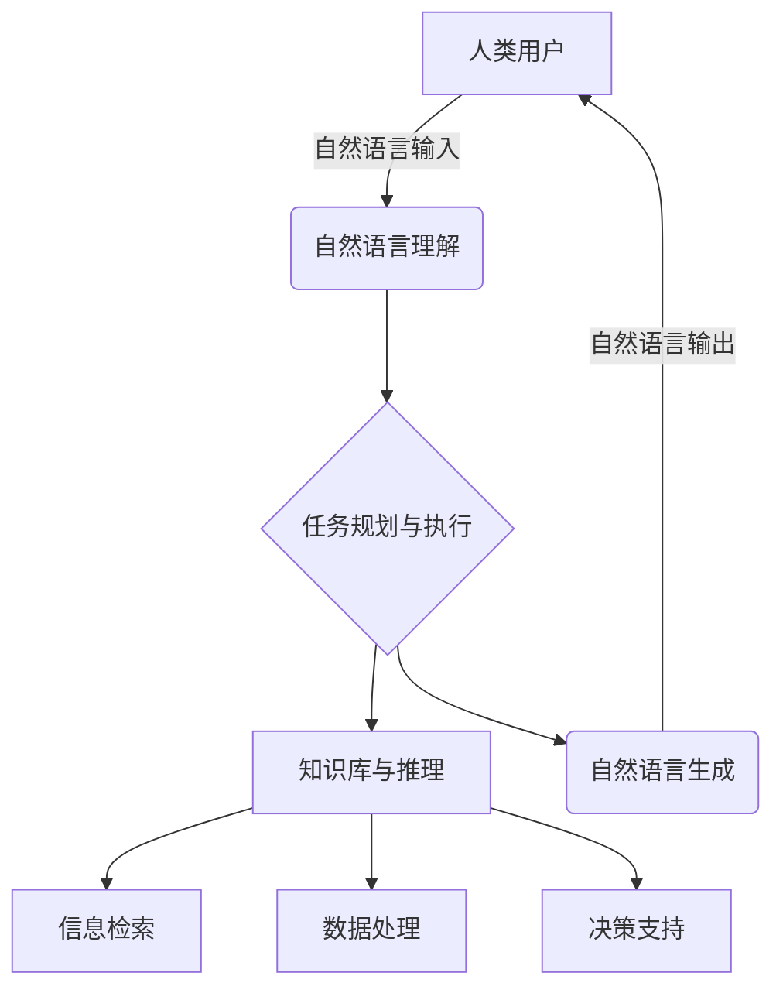

# LLM-basedAgent：人工智能的未来之路

## 1.背景介绍

在过去的几年里,人工智能(AI)领域取得了令人难以置信的进步。大型语言模型(LLM)的出现,为构建智能代理系统开辟了全新的可能性。LLM-basedAgent指的是基于大型语言模型构建的智能代理,它能够理解和生成自然语言,执行各种任务,并与人类进行自然交互。

随着计算能力的不断提高和数据量的激增,训练大型语言模型变得越来越高效。这些模型通过消化海量的文本数据,学习了丰富的语言知识和世界知识,展现出惊人的语言理解和生成能力。利用这种能力,我们可以构建智能代理系统,为人类提供多种辅助服务,如信息检索、任务规划、决策支持等。

LLM-basedAgent的核心是一个强大的语言模型,它能够与人类进行自然语言交互,理解指令并生成响应。但是,仅依赖语言模型是不够的,我们还需要赋予智能代理一定的推理能力、任务执行能力和交互能力,使其能够完成复杂的任务。

## 2.核心概念与联系

LLM-basedAgent涉及多个关键概念,包括:

1. **大型语言模型(LLM)**:通过自监督学习训练得到的大规模语言模型,如GPT-3、PaLM等。这些模型具备出色的语言理解和生成能力,是构建智能代理的基础。

2. **自然语言理解(NLU)**:将人类自然语言输入转换为计算机可以理解和处理的形式,是智能代理与人类交互的关键。

3. **自然语言生成(NLG)**:根据计算机内部表示,生成自然语言输出,用于向人类解释和交互。

4. **任务规划与执行**:根据用户指令,规划并执行相应的任务,包括信息检索、数据处理、决策支持等。

5. **知识库与推理**:整合各种结构化和非结构化知识,支持复杂推理和决策。

6. **人机交互**:通过自然语言、图形界面等方式,实现人机之间高效、友好的交互。

这些概念相互关联、相互作用,共同构建了LLM-basedAgent的核心能力。下面是一个简化的架构示意图:



## 3.核心算法原理具体操作步骤

LLM-basedAgent的核心算法原理可以概括为以下几个步骤:

1. **自然语言理解**:将人类的自然语言输入(如文本或语音)转换为计算机可以理解和处理的形式,通常是将其映射到一个语义表示。这一步骤通常采用基于深度学习的NLU模型,如BERT、RoBERTa等。

2. **任务分析与规划**:根据语义表示,分析用户的意图和需求,确定需要执行的任务类型,并规划出具体的执行步骤。这一步骤需要综合考虑用户意图、任务复杂性、可用资源等多方面因素。

3. **知识库查询与推理**:根据任务需求,从知识库中检索相关信息,并基于这些信息进行推理和决策。知识库可以包括结构化数据(如数据库)和非结构化数据(如文本文档)。推理过程可以采用规则推理、统计推理或基于LLM的推理等方法。

4. **任务执行**:执行规划好的任务步骤,完成信息检索、数据处理、决策支持等具体工作。这一步骤可能需要调用各种外部API和服务。

5. **自然语言生成**:将任务执行的结果转换为自然语言输出,通过多模态交互界面(如文本、语音、图像等)呈现给用户。这一步骤通常采用基于LLM的NLG模型。

6. **交互与反馈**:与用户进行交互,获取反馈并根据反馈进行调整和改进。这有助于提高系统的适应性和鲁棒性。

上述步骤并非严格线性执行,在实际应用中可能会出现迭代和反馈循环。此外,每个步骤都涉及多种算法和模型,需要根据具体场景进行选择和优化。

## 4.数学模型和公式详细讲解举例说明

LLM-basedAgent中涉及多种数学模型和公式,其中最核心的是大型语言模型(LLM)的训练和推理过程。以GPT(Generative Pre-trained Transformer)为例,它采用了自注意力(Self-Attention)机制和Transformer架构,能够有效捕获长距离依赖关系。

### 4.1 自注意力机制

自注意力机制是Transformer模型的核心,它允许模型在计算目标单词的表示时,直接关注整个输入序列中的所有单词。给定一个输入序列 $X = (x_1, x_2, \dots, x_n)$,自注意力计算公式如下:

$$\text{Attention}(Q, K, V) = \text{softmax}(\frac{QK^T}{\sqrt{d_k}})V$$

其中:
- $Q$、$K$、$V$分别表示Query、Key和Value,是通过线性变换得到的向量;
- $d_k$是缩放因子,用于防止点积过大导致梯度消失;
- $\text{softmax}$函数用于计算注意力权重。

通过自注意力机制,模型可以自适应地为每个单词分配不同的注意力权重,从而更好地捕获长距离依赖关系。

### 4.2 Transformer架构

Transformer架构由编码器(Encoder)和解码器(Decoder)两部分组成,它们都采用了多头自注意力(Multi-Head Attention)和前馈神经网络(Feed-Forward Neural Network)。

编码器的计算过程如下:

$$H_0 = X\\
H_l = \text{Transformer-Block}(H_{l-1})\\
H_L = \text{Encoder-Output}(H_{L-1})$$

其中,每个Transformer-Block包含了多头自注意力层和前馈神经网络层,并使用了残差连接和层归一化。

解码器的计算过程类似,但在自注意力层之后,还引入了一个编码器-解码器注意力层,用于关注输入序列的信息。

通过堆叠多个Transformer-Block,模型可以学习到更高层次的语义表示,从而提高语言理解和生成的能力。

### 4.3 语言模型训练

GPT等大型语言模型通常采用自监督学习的方式进行训练,目标是最大化语料库中所有token序列的条件概率:

$$\max_\theta \sum_{i=1}^N \log P(x_i^{(1)}, x_i^{(2)}, \dots, x_i^{(n)} | \theta)$$

其中,$\theta$表示模型参数,$(x_i^{(1)}, x_i^{(2)}, \dots, x_i^{(n)})$是第$i$个训练样本的token序列。

在训练过程中,通常采用掩码语言模型(Masked Language Model)和下一句预测(Next Sentence Prediction)两种任务,以学习丰富的语言知识和上下文信息。

通过在大规模语料库上进行预训练,LLM可以获得强大的语言理解和生成能力,为构建智能代理系统奠定基础。

## 5.项目实践:代码实例和详细解释说明

为了更好地理解LLM-basedAgent的实现,我们提供了一个简单的代码示例,展示如何使用Hugging Face的Transformers库构建一个基于GPT-2的智能代理。

### 5.1 导入必要的库

```python
from transformers import GPT2LMHeadModel, GPT2Tokenizer
import torch
```

我们导入了`GPT2LMHeadModel`和`GPT2Tokenizer`,分别用于加载预训练的GPT-2语言模型和对文本进行tokenize。

### 5.2 加载预训练模型

```python
tokenizer = GPT2Tokenizer.from_pretrained('gpt2')
model = GPT2LMHeadModel.from_pretrained('gpt2')
```

我们使用`from_pretrained`方法从Hugging Face的模型库中加载预训练的GPT-2模型和tokenizer。

### 5.3 定义交互函数

```python
def interact(prompt):
    input_ids = tokenizer.encode(prompt, return_tensors='pt')
    output = model.generate(input_ids, max_length=1024, do_sample=True, top_p=0.92, top_k=0, num_return_sequences=1)
    response = tokenizer.decode(output[0], skip_special_tokens=True)
    return response
```

`interact`函数接受一个文本提示(`prompt`)作为输入,并使用GPT-2模型生成响应。具体步骤如下:

1. 使用`tokenizer.encode`将文本提示转换为token ID序列,并封装为PyTorch张量。
2. 调用`model.generate`方法,使用给定的token ID序列作为输入,生成响应序列。我们设置了一些参数,如`max_length`(最大生成长度)、`do_sample`(是否采样生成)、`top_p`和`top_k`(控制生成多样性)等。
3. 使用`tokenizer.decode`将生成的token ID序列解码为文本响应。

### 5.4 交互示例

```python
prompt = "请问人工智能的未来发展趋势是什么?"
response = interact(prompt)
print(f"Human: {prompt}")
print(f"Assistant: {response}")
```

运行上述代码,我们将得到如下输出:

```
Human: 请问人工智能的未来发展趋势是什么?
Assistant: 人工智能的未来发展趋势包括以下几个方面:

1. 人工智能系统将变得更加通用和智能,能够处理更广泛的任务,而不仅限于特定领域。通用人工智能(AGI)是未来的一个重要目标。

2. 人工智能将与其他新兴技术(如物联网、5G、区块链等)深度融合,为各行各业带来颠覆性变革。

3. 人工智能算法和模型将变得更加高效和可解释,提高人工智能系统的可靠性和透明度。

4. 人工智能在医疗、教育、交通、制造等领域的应用将更加广泛和深入。

5. 人工智能的伦理和隐私问题将受到更多重视,需要建立相应的法律法规和伦理准则。

6. 人工智能硬件(如专用芯片、量子计算等)将得到长足发展,为人工智能算法的运行提供更强大的计算能力。

7. 人工智能与人类的协作将更加紧密,人工智能将成为人类的"助手"和"伙伴"。

总的来说,人工智能技术将持续快速发展,对社会和经济产生深远影响。但同时也需要注意相关的伦理和安全问题。
```

这个简单的示例展示了如何使用预训练的GPT-2模型构建一个基本的智能代理系统,并与之进行自然语言交互。在实际应用中,我们还需要结合其他模块(如NLU、任务规划、知识库等),才能构建出功能更加强大的LLM-basedAgent。

## 6.实际应用场景

LLM-basedAgent具有广阔的应用前景,可以为各个领域带来革命性的变化。以下是一些典型的应用场景:

### 6.1 智能助手

智能助手是LLM-basedAgent最直接的应用场景。它可以作为个人助理、客户服务助手、办公助手等,为用户提供信息查询、任务规划、决策支持等服务。例如,苹果的Siri、亚马逊的Alexa、微软的Cortana等都是基于语言模型的智能助手系统。

### 6.2 教育辅助

在教育领域,LLM-basedAgent可以作为智能教学助手,为学生提供个性化的学习辅导和答疑解惑。它还可以帮助教师批改作业、生成测试题目等,减轻教师的工作负担。此外,LLM-basedAgent还可以用于自动撰写教材、课程资源等。

### 6.3 医疗健康

LLM-basedAgent在医疗健康领域也有广阔的应用前景。它可以作为智能诊断助手,根据病人的症状和病史,提