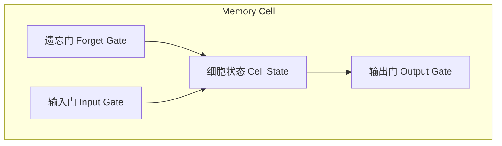

# LSTM的未来发展趋势：探索更强大的记忆机制

## 1.背景介绍

### 1.1 序列数据处理的重要性

在当今的数据密集型时代,我们每天都会产生和接收大量的序列数据,例如文本、语音、视频和时间序列数据。能够高效处理这些序列数据对于许多应用领域都至关重要,包括自然语言处理、语音识别、机器翻译、时间序列预测等。传统的机器学习算法在处理这种序列数据时存在明显的局限性,因为它们无法很好地捕捉序列中的长期依赖关系。

### 1.2 循环神经网络(RNN)的兴起

为了解决序列数据处理的挑战,循环神经网络(Recurrent Neural Networks, RNNs)应运而生。与传统的前馈神经网络不同,RNN能够通过内部状态的循环传递来捕捉序列数据中的动态行为和长期依赖关系。然而,标准的RNN在实践中仍然存在着梯度消失和梯度爆炸的问题,这使得它们难以学习长期依赖关系。

### 1.3 LSTM:解决长期依赖问题的突破

长短期记忆网络(Long Short-Term Memory, LSTM)作为RNN的一种变体,被提出来解决长期依赖问题。LSTM通过精心设计的门控机制和内部状态,使网络能够更好地捕捉长期依赖关系,从而在许多序列数据处理任务上取得了显著的成功。自从1997年被提出以来,LSTM已经成为处理序列数据的事实上的标准模型。

## 2.核心概念与联系

### 2.1 LSTM的核心构建块

LSTM网络的核心构建块是一个记忆细胞(Memory Cell),它由一个简单的递归神经网络组成,专门用于维护和操作细胞状态。记忆细胞包含四个主要部分:遗忘门(Forget Gate)、输入门(Input Gate)、细胞状态(Cell State)和输出门(Output Gate)。

#### 2.1.1 遗忘门(Forget Gate)

遗忘门决定了从上一时刻的细胞状态中保留多少信息,并丢弃不再需要的信息。这有助于LSTM摆脱不相关的过去信息,从而更好地捕捉当前输入序列的重要特征。

#### 2.1.2 输入门(Input Gate)

输入门控制着当前时刻的输入信息有多少需要被更新到细胞状态中。它根据当前输入和上一时刻的隐藏状态来计算出一个新的候选细胞状态向量。

#### 2.1.3 细胞状态(Cell State)

细胞状态是LSTM网络中最关键的部分,它就像一条传送带,负责将状态信息从序列的一端传递到另一端。细胞状态由遗忘门和输入门共同决定,并由当前输入和前一时刻的细胞状态计算得出。

#### 2.1.4 输出门(Output Gate)

输出门根据当前输入和细胞状态来决定输出什么值。它控制着细胞状态中的信息在多大程度上被用作当前时刻的输出。

通过这些精心设计的门控机制,LSTM能够学习长期依赖关系,并且可以灵活地决定在每个时间步长保留什么信息、忘记什么信息。这使得LSTM在处理长序列数据时表现出色,克服了标准RNN的局限性。

### 2.2 LSTM与其他序列模型的关系

除了LSTM之外,还有其他一些模型也被设计用于处理序列数据,例如门控循环单元(Gated Recurrent Unit, GRU)和注意力机制(Attention Mechanism)。

#### 2.2.1 GRU

GRU是一种与LSTM类似的门控循环神经网络变体。它的结构比LSTM更加简单,只有两个门:重置门(Reset Gate)和更新门(Update Gate)。GRU通过这两个门来控制前一时刻的状态信息和当前时刻的输入信息如何相互作用和更新。相比LSTM,GRU的参数更少,计算效率更高,但在某些任务上的表现可能略差于LSTM。

#### 2.2.2 注意力机制(Attention Mechanism)

注意力机制是一种全新的序列建模方法,它允许模型在编码序列时,动态地关注序列中的不同部分,并根据当前的上下文来分配注意力权重。通过注意力机制,模型可以更好地捕捉长期依赖关系,并且能够处理变长序列。注意力机制常与RNN或LSTM结合使用,以提高模型的性能。

虽然GRU和注意力机制都是强大的序列建模工具,但LSTM由于其独特的门控机制和内部状态设计,在捕捉长期依赖关系方面仍然表现出了卓越的能力。LSTM在许多应用领域都取得了出色的成绩,并成为了处理序列数据的事实上的标准模型。

## 3.核心算法原理具体操作步骤

在深入探讨LSTM的未来发展趋势之前,让我们先回顾一下LSTM的核心算法原理和具体操作步骤。

### 3.1 LSTM的前向传播过程

LSTM的前向传播过程包括以下几个步骤:

1. **遗忘门计算**

遗忘门决定了从上一时刻的细胞状态中保留多少信息。它根据当前输入 $x_t$ 和上一时刻的隐藏状态 $h_{t-1}$ 计算出一个介于0和1之间的权重向量 $f_t$:

$$f_t = \sigma(W_f \cdot [h_{t-1}, x_t] + b_f)$$

其中 $\sigma$ 是sigmoid激活函数,用于将值限制在0到1之间。 $W_f$ 和 $b_f$ 分别是遗忘门的权重矩阵和偏置向量。

2. **输入门计算**

输入门决定了当前输入 $x_t$ 有多少需要被更新到细胞状态中。它包括两个部分:一个sigmoid层决定更新的程度,另一个tanh层创建一个候选向量 $\tilde{C}_t$,用于对细胞状态进行部分更新。

$$i_t = \sigma(W_i \cdot [h_{t-1}, x_t] + b_i)$$
$$\tilde{C}_t = \tanh(W_C \cdot [h_{t-1}, x_t] + b_C)$$

其中 $W_i$、$W_C$、$b_i$ 和 $b_C$ 分别是输入门的权重矩阵和偏置向量。

3. **细胞状态更新**

细胞状态 $C_t$ 通过遗忘门 $f_t$ 和输入门 $i_t$ 共同决定,并由当前输入和前一时刻的细胞状态计算得出:

$$C_t = f_t * C_{t-1} + i_t * \tilde{C}_t$$

4. **输出门计算**

输出门决定了细胞状态中的信息在多大程度上被用作当前时刻的输出。首先,通过sigmoid门来决定细胞状态的哪些部分将被输出;然后,将细胞状态通过tanh函数处理,使其值介于-1到1之间;最后,将两者相乘得到最终的输出:

$$o_t = \sigma(W_o \cdot [h_{t-1}, x_t] + b_o)$$
$$h_t = o_t * \tanh(C_t)$$

其中 $W_o$ 和 $b_o$ 分别是输出门的权重矩阵和偏置向量。

通过这些精心设计的门控机制,LSTM能够学习长期依赖关系,并且可以灵活地决定在每个时间步长保留什么信息、忘记什么信息。这使得LSTM在处理长序列数据时表现出色,克服了标准RNN的局限性。

### 3.2 LSTM的反向传播过程

LSTM的反向传播过程与标准的反向传播算法类似,但由于LSTM的门控结构,导数的计算会更加复杂。我们需要计算每个门的梯度,以及细胞状态和隐藏状态的梯度,并将它们反向传播到前一时间步长。

具体来说,LSTM的反向传播过程包括以下步骤:

1. **计算输出门的梯度**

$$\frac{\partial L}{\partial o_t} = \frac{\partial L}{\partial h_t} * \tanh(C_t)$$
$$\frac{\partial L}{\partial W_o} = \frac{\partial L}{\partial o_t} * [h_{t-1}, x_t]^T$$
$$\frac{\partial L}{\partial b_o} = \sum \frac{\partial L}{\partial o_t}$$

2. **计算细胞状态的梯度**

$$\frac{\partial L}{\partial C_t} = \frac{\partial L}{\partial h_t} * o_t * (1 - \tanh^2(C_t)) + \frac{\partial L}{\partial C_{t+1}} * f_{t+1}$$

3. **计算遗忘门的梯度**

$$\frac{\partial L}{\partial f_t} = \frac{\partial L}{\partial C_t} * C_{t-1}$$
$$\frac{\partial L}{\partial W_f} = \frac{\partial L}{\partial f_t} * [h_{t-1}, x_t]^T$$
$$\frac{\partial L}{\partial b_f} = \sum \frac{\partial L}{\partial f_t}$$

4. **计算输入门和候选细胞状态的梯度**

$$\frac{\partial L}{\partial i_t} = \frac{\partial L}{\partial C_t} * \tilde{C}_t$$
$$\frac{\partial L}{\partial \tilde{C}_t} = \frac{\partial L}{\partial C_t} * i_t$$
$$\frac{\partial L}{\partial W_i} = \frac{\partial L}{\partial i_t} * [h_{t-1}, x_t]^T$$
$$\frac{\partial L}{\partial b_i} = \sum \frac{\partial L}{\partial i_t}$$
$$\frac{\partial L}{\partial W_C} = \frac{\partial L}{\partial \tilde{C}_t} * [h_{t-1}, x_t]^T$$
$$\frac{\partial L}{\partial b_C} = \sum \frac{\partial L}{\partial \tilde{C}_t}$$

5. **计算隐藏状态的梯度**

$$\frac{\partial L}{\partial h_{t-1}} = \frac{\partial L}{\partial f_t} * W_f[:, :n_h] + \frac{\partial L}{\partial i_t} * W_i[:, :n_h] + \frac{\partial L}{\partial \tilde{C}_t} * W_C[:, :n_h] + \frac{\partial L}{\partial o_t} * W_o[:, :n_h]$$

其中 $n_h$ 是隐藏状态的维度。

通过这种反向传播过程,我们可以计算出每个门、细胞状态和隐藏状态的梯度,并使用优化算法(如Adam或RMSProp)来更新LSTM的参数,从而使模型在训练数据上的性能不断提高。

## 4.数学模型和公式详细讲解举例说明

在上一节中,我们介绍了LSTM的核心算法原理和具体操作步骤。现在,让我们进一步深入探讨LSTM的数学模型和公式,并通过具体的例子来加深理解。

### 4.1 LSTM的数学表示

LSTM可以用以下数学公式来表示:

$$\begin{aligned}
f_t &= \sigma(W_f \cdot [h_{t-1}, x_t] + b_f) \\
i_t &= \sigma(W_i \cdot [h_{t-1}, x_t] + b_i) \\
\tilde{C}_t &= \tanh(W_C \cdot [h_{t-1}, x_t] + b_C) \\
C_t &= f_t * C_{t-1} + i_t * \tilde{C}_t \\
o_t &= \sigma(W_o \cdot [h_{t-1}, x_t] + b_o) \\
h_t &= o_t * \tanh(C_t)
\end{aligned}$$

其中:

- $x_t$ 是当前时间步长的输入向量
- $h_{t-1}$ 是前一时间步长的隐藏状态向量
- $f_t$、$i_t$ 和 $o_t$ 分别是遗忘门、输入门和输出门的激活值向量
- $\tilde{C}_t$ 是候选细胞状态向量
- $C_t$ 是当前时间步长的细胞状态向量
- $h_t$ 是当前时间步长的隐藏状态向量
- $W_f