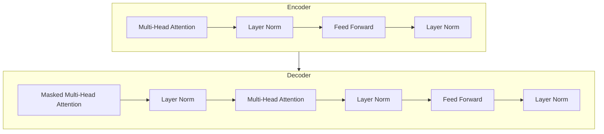

# Language Models 原理与代码实战案例讲解

## 1. 背景介绍

### 1.1 什么是语言模型?

语言模型(Language Model)是自然语言处理(NLP)领域的一个核心概念,它旨在捕捉语言的统计规律和语义关系。语言模型的主要任务是根据给定的上下文,预测下一个单词或标记出现的概率。

语言模型广泛应用于语音识别、机器翻译、文本生成、对话系统等多个领域。随着深度学习技术的发展,基于神经网络的语言模型(Neural Language Model)逐渐取代了传统的统计语言模型,展现出更强大的语言理解和生成能力。

### 1.2 语言模型的重要性

语言模型对于构建高质量的自然语言处理系统至关重要,主要体现在以下几个方面:

1. **消除歧义**: 自然语言存在大量的歧义性,语言模型可以根据上下文来消除歧义,正确理解语句的意图。
2. **提高准确性**: 语言模型可以预测出在给定上下文中最可能出现的词语或短语,从而提高系统的预测精度。
3. **生成自然语言**: 通过语言模型,我们可以生成通顺、流畅的自然语言文本,为对话系统、文本摘要等应用提供支持。
4. **语音识别**: 语言模型在语音识别中扮演着重要角色,可以提高系统对口语的识别准确率。

### 1.3 语言模型的发展历程

语言模型的发展大致可以分为三个阶段:

1. **统计语言模型**(Statistical Language Model): 基于统计学原理,利用大量语料库构建 N-gram 模型,通过计算词序列的概率来预测下一个词。常见的统计语言模型包括 N-gram 模型、Kneser-Ney 平滑等。

2. **神经网络语言模型**(Neural Network Language Model): 利用神经网络来学习语言的潜在特征,克服了统计语言模型的局限性。早期的神经网络语言模型包括前馈神经网络语言模型、循环神经网络语言模型等。

3. **transformer 语言模型**(Transformer Language Model): 自 2017 年 Transformer 模型提出以来,基于 Transformer 的语言模型取得了突破性进展,如 BERT、GPT、XLNet 等,在多个自然语言处理任务上取得了state-of-the-art的表现。

本文将重点介绍基于 Transformer 的语言模型,探讨其核心原理、算法细节以及实战案例。

## 2. 核心概念与联系

### 2.1 Transformer 模型

Transformer 模型是一种全新的基于注意力机制(Attention Mechanism)的神经网络架构,最初被提出用于机器翻译任务。它完全摒弃了序列建模中常用的循环神经网络(RNN)和卷积神经网络(CNN)结构,纯粹基于注意力机制来捕捉输入序列中任意两个位置之间的依赖关系。

Transformer 的核心组件包括:

1. **Encoder(编码器)**: 将输入序列编码为一系列连续的向量表示。
2. **Decoder(解码器)**: 基于编码器的输出,生成目标序列的概率分布。
3. **Multi-Head Attention(多头注意力机制)**: 捕捉输入序列中不同位置之间的依赖关系。
4. **Position Encoding(位置编码)**: 注入序列的位置信息。

Transformer 架构的自注意力机制使其能够高效地并行计算,从而显著提高了训练速度。此外,Transformer 不存在梯度消失或梯度爆炸的问题,能够更好地捕捉长距离依赖关系。

### 2.2 BERT 模型

BERT(Bidirectional Encoder Representations from Transformers) 是一种基于 Transformer 的双向编码器语言模型,由谷歌提出。BERT 通过预训练的方式学习上下文表示,然后在下游任务中进行微调(fine-tuning),取得了令人瞩目的成绩。

BERT 的核心创新点包括:

1. **Masked Language Model(掩码语言模型)**: 随机掩蔽部分输入词,模型需要根据上下文预测被掩蔽的词。这种方式有助于模型学习双向语境信息。
2. **Next Sentence Prediction(下一句预测)**: 判断两个句子是否连续,帮助模型捕捉句子间的关系。

BERT 在多个自然语言处理任务上取得了state-of-the-art的表现,如文本分类、命名实体识别、问答系统等,极大推动了 NLP 领域的发展。

### 2.3 GPT 模型

GPT(Generative Pre-trained Transformer)是一种基于 Transformer 解码器的自回归语言模型,由 OpenAI 提出。GPT 在大规模语料库上进行预训练,学习文本的概率分布,然后可以应用于多种下游任务,如文本生成、机器翻译、问答等。

与 BERT 不同,GPT 是一个单向语言模型,只能捕捉左侧上下文信息。GPT 的训练目标是最大化给定上文的条件下,预测正确的下一个词或标记的概率。

GPT 的后续版本 GPT-2 和 GPT-3 在模型规模和预训练语料库上都有了显著扩大,展现出了惊人的文本生成能力,可以生成看似人类水平的文本。不过,GPT 模型也存在一些潜在风险,如生成有偏见或不实信息的内容。

### 2.4 核心概念关系总结

Transformer、BERT 和 GPT 是当前语言模型领域的核心概念,它们之间存在紧密的联系:

1. Transformer 提出了全新的基于注意力机制的神经网络架构,为后续的语言模型奠定了基础。
2. BERT 是一种双向编码器语言模型,基于 Transformer 编码器,通过掩码语言模型和下一句预测任务进行预训练,学习上下文表示。
3. GPT 是一种单向解码器语言模型,基于 Transformer 解码器,通过自回归的方式进行预训练,学习文本的概率分布。

这三种模型各有侧重,但都展现出了卓越的语言理解和生成能力,推动了自然语言处理领域的快速发展。

## 3. 核心算法原理具体操作步骤

在探讨语言模型的核心算法原理之前,我们先介绍一下 Transformer 模型的基本架构和注意力机制的工作原理。

### 3.1 Transformer 模型架构

Transformer 模型由编码器(Encoder)和解码器(Decoder)两部分组成,如下图所示:

编码器由多个相同的层组成,每一层包括两个子层:

1. **Multi-Head Attention(多头注意力机制)**
2. **Feed Forward(前馈神经网络)**

解码器的结构与编码器类似,不过它还包含一个额外的注意力子层,用于处理解码器自身的输出。

### 3.2 注意力机制(Attention Mechanism)

注意力机制是 Transformer 模型的核心,它能够捕捉输入序列中任意两个位置之间的依赖关系。

给定一个查询向量(Query)和一组键值对(Key-Value),注意力机制的计算过程如下:

1. 计算查询向量与每个键向量之间的相似度得分。
2. 对相似度得分进行 softmax 操作,得到注意力权重。
3. 将注意力权重与值向量(Value)相乘,得到加权和作为注意力输出。

数学表示如下:

$$
\begin{aligned}
\text{Attention}(Q, K, V) &= \text{softmax}\left(\frac{QK^T}{\sqrt{d_k}}\right)V \\
\text{head}_i &= \text{Attention}\left(QW_i^Q, KW_i^K, VW_i^V\right)
\end{aligned}
$$

其中 $Q$、$K$、$V$ 分别表示查询、键和值;$d_k$ 是缩放因子;$W_i^Q$、$W_i^K$、$W_i^V$ 是投影矩阵,用于将 $Q$、$K$、$V$ 映射到不同的表示空间。

Multi-Head Attention 机制是将多个注意力头的输出进行拼接,从而捕捉不同的依赖关系:

$$
\text{MultiHead}(Q, K, V) = \text{Concat}(\text{head}_1, \ldots, \text{head}_h)W^O
$$

其中 $h$ 是注意力头的数量,$W^O$ 是一个可训练的投影矩阵。

### 3.3 Transformer 语言模型训练

Transformer 语言模型的训练过程可以分为两个阶段:预训练(Pre-training)和微调(Fine-tuning)。

**预训练阶段**:

1. 选择合适的预训练任务,如 BERT 的掩码语言模型和下一句预测,GPT 的自回归语言模型等。
2. 在大规模无标注语料库上进行预训练,学习通用的语言表示。

**微调阶段**:

1. 针对特定的下游任务(如文本分类、命名实体识别等),对预训练模型进行微调。
2. 在标注的任务数据集上进行监督式训练,更新模型参数。
3. 在测试集上评估模型性能。

通过预训练和微调的两阶段训练方式,Transformer 语言模型可以有效地利用大规模无标注语料库,学习通用的语言表示,并将这些知识迁移到特定的下游任务中,显著提高了模型的性能。

## 4. 数学模型和公式详细讲解举例说明

在上一节中,我们介绍了 Transformer 模型的核心算法原理,包括注意力机制和模型训练过程。接下来,我们将更深入地探讨 Transformer 语言模型的数学模型和公式。

### 4.1 自注意力机制(Self-Attention)

自注意力机制是 Transformer 模型的核心组件,它能够捕捉输入序列中任意两个位置之间的依赖关系。给定一个输入序列 $X = (x_1, x_2, \ldots, x_n)$,自注意力机制的计算过程如下:

1. 将输入序列 $X$ 线性映射到查询(Query)、键(Key)和值(Value)向量:

$$
\begin{aligned}
Q &= XW^Q \\
K &= XW^K \\
V &= XW^V
\end{aligned}
$$

其中 $W^Q$、$W^K$、$W^V$ 是可训练的投影矩阵。

2. 计算查询向量与每个键向量之间的相似度得分:

$$
\text{scores}(Q, K) = \frac{QK^T}{\sqrt{d_k}}
$$

其中 $d_k$ 是缩放因子,用于防止内积值过大导致梯度饱和。

3. 对相似度得分进行 softmax 操作,得到注意力权重:

$$
\text{Attention}(Q, K, V) = \text{softmax}\left(\frac{QK^T}{\sqrt{d_k}}\right)V
$$

4. 将注意力权重与值向量(Value)相乘,得到加权和作为注意力输出。

通过自注意力机制,Transformer 模型可以捕捉输入序列中任意两个位置之间的依赖关系,而不受序列长度的限制。

### 4.2 多头注意力机制(Multi-Head Attention)

为了进一步提高注意力机制的表示能力,Transformer 模型采用了多头注意力机制(Multi-Head Attention)。多头注意力机制将查询(Query)、键(Key)和值(Value)投影到不同的子空间,并在每个子空间中计算注意力,最后将所有