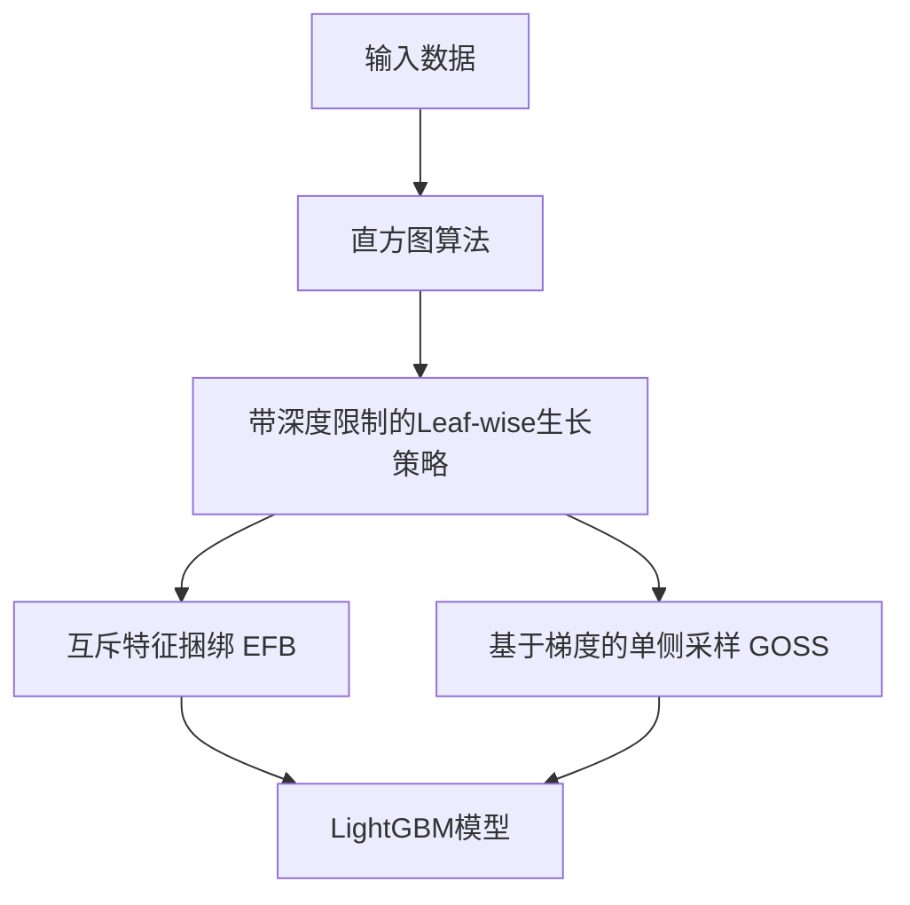

# LightGBM 原理与代码实战案例讲解

## 1. 背景介绍

### 1.1 机器学习算法概述

机器学习是一门让计算机具备自主学习能力的科学。在机器学习领域，决策树和梯度提升是两类最为经典和强大的算法。决策树以树形结构来对样本进行分类或回归预测。梯度提升则是一种集成学习方法，它通过迭代地训练一系列弱学习器（通常是决策树），并将它们的预测结果加权求和，从而得到最终的强学习器。

### 1.2 GBDT 算法的局限性

梯度提升决策树（Gradient Boosting Decision Tree，GBDT）是梯度提升中最常用的弱学习器。然而，传统的 GBDT 算法在处理大规模数据集时存在一些局限性：

1. 训练速度慢：GBDT 在每轮迭代中都需要遍历全部训练数据，当数据量很大时，训练速度会非常慢。
2. 内存占用高：GBDT 需要存储所有训练样本的特征值，内存消耗随数据量线性增长。
3. 缺乏支持类别特征：GBDT 只能处理数值型特征，对类别型特征支持不佳。

### 1.3 LightGBM 的提出

为了克服 GBDT 的局限性，微软亚洲研究院在2017年提出了 LightGBM 算法。LightGBM 在 GBDT 的基础上进行了大量优化，极大提升了训练速度和内存利用率，并支持了类别特征。目前，LightGBM 已经成为工业界和数据竞赛中使用最为广泛的 GBDT 工具之一。

## 2. 核心概念与联系

### 2.1 决策树

决策树由一系列分裂节点和叶子节点组成。每个分裂节点根据某个特征的取值将样本划分为左右两个子节点。叶子节点存储该节点的预测值。样本从根节点开始，根据特征取值递归地落入不同的子节点，直到到达叶子节点，该叶子节点的预测值即为该样本的预测结果。

### 2.2 梯度提升

梯度提升是一种迭代的集成学习算法。在每轮迭代中，梯度提升根据当前模型的预测误差，拟合一个新的弱学习器，并将其加入到现有模型中。通过多轮迭代，梯度提升不断减小训练误差，得到一个强大的集成模型。梯度提升中使用的弱学习器通常是决策树，即 GBDT 算法。

### 2.3 叶子节点分裂

在 GBDT 中，决策树的生成是通过递归地对叶子节点进行分裂实现的。选择最优分裂点的一般准则是最大化分裂后的信息增益或最小化分裂后的损失函数。常见的分裂准则有均方误差、交叉熵等。找到最优分裂点后，将叶子节点分裂为左右两个新的叶子节点。

### 2.4 直方图算法

寻找最优分裂点需要枚举每个特征的所有可能取值，当数据量大、特征多时，这个过程非常耗时。直方图算法通过将连续型特征值划分为多个离散的 bin，并统计每个 bin 内的梯度统计量，将寻找最优分裂点的时间复杂度从 O(#data) 降至 O(#bins)，大幅加速了训练过程。LightGBM 就是基于直方图算法实现的。

### 2.5 带深度限制的 Leaf-wise 生长策略

在生成决策树时，除了 Level-wise（按层生长）的策略外，还有 Leaf-wise（按最优叶子节点生长）的策略。Leaf-wise 策略每次从当前所有叶子中，找到分裂增益最大的一个叶子节点，然后分裂，如此递归。LightGBM 采用了带深度限制的 Leaf-wise 策略，在保证高效率的同时，防止过拟合。

### 2.6 互斥特征捆绑

实际数据中经常存在大量稀疏的类别特征，它们相互独立且具有互斥性。将这些互斥的特征捆绑到一起，可以大幅减少特征数量，加速训练过程。LightGBM 内置了对互斥特征捆绑的支持。

### 2.7 GOSS 和 EFB 采样

LightGBM 还提出了两种数据采样方法：Gradient-based One-Side Sampling (GOSS) 和 Exclusive Feature Bundling (EFB)。GOSS 通过保留梯度大的样本和随机采样梯度小的样本，在减少数据量的同时保证精度。EFB 将互斥的稀疏特征捆绑，进一步减少特征数量。

下图展示了 LightGBM 的核心概念与算法流程：



## 3. 核心算法原理具体操作步骤

### 3.1 直方图算法

1. 对每个特征的取值范围进行分桶，得到一系列离散的 bin
2. 遍历训练数据，统计每个 bin 内的一阶梯度和二阶梯度，并记录样本数量
3. 枚举每个 bin 作为分裂点，利用梯度统计量计算分裂增益，找到增益最大的分裂点

### 3.2 带深度限制的 Leaf-wise 生长策略

1. 初始化一个叶子节点，包含所有训练样本
2. 对每个叶子节点，枚举所有特征和分裂点，计算分裂增益
3. 选择分裂增益最大的叶子节点，进行分裂
4. 如果达到深度限制或其他终止条件，则停止，否则回到步骤2

### 3.3 互斥特征捆绑

1. 对每个类别特征，统计不同取值的出现频率
2. 将出现频率低于给定阈值的取值归并到一个特殊的取值中
3. 对每个样本，将所有互斥特征捆绑为一个新的组合特征

### 3.4 GOSS 采样

1. 对每个样本，计算其一阶梯度的绝对值
2. 根据梯度绝对值对样本排序
3. 选择梯度绝对值最大的 a% 样本作为 A 集合
4. 从其余样本中随机采样 b% 样本作为 B 集合
5. 将 A 和 B 集合作为新的训练集，对 B 集合的梯度进行放大

### 3.5 EFB 采样

1. 对每个特征，计算其非零值的数量
2. 选择非零值数量最多的特征作为主特征
3. 将其余特征与主特征捆绑，生成新的组合特征
4. 对组合特征的每种取值，计算其出现频率
5. 将出现频率低于给定阈值的取值归并到一个特殊的取值中

## 4. 数学模型和公式详细讲解举例说明

### 4.1 决策树的数学模型

假设有训练集 $D=\{(x_1,y_1),(x_2,y_2),...,(x_n,y_n)\}$，其中 $x_i$ 为第 $i$ 个样本的特征向量，$y_i$ 为其标签。决策树递归地将特征空间划分为一系列互不相交的区域 $R_1,R_2,...,R_m$，每个区域对应一个叶子节点，该节点的预测值为：

$$c_m=\frac{1}{|R_m|}\sum_{x_i\in R_m}y_i$$

其中 $|R_m|$ 表示落入区域 $R_m$ 的样本数量。

### 4.2 分裂增益的计算

假设某个叶子节点包含样本集合 $D$，根据特征 $j$ 和分裂点 $s$ 将其分裂为左右两个子节点，分别包含样本集合 $D_L$ 和 $D_R$。定义分裂增益为：

$$Gain(D,j,s)=\frac{1}{2}\left[\frac{(\sum_{x_i\in D_L}g_i)^2}{\sum_{x_i\in D_L}h_i+\lambda}+\frac{(\sum_{x_i\in D_R}g_i)^2}{\sum_{x_i\in D_R}h_i+\lambda}-\frac{(\sum_{x_i\in D}g_i)^2}{\sum_{x_i\in D}h_i+\lambda}\right]-\gamma$$

其中 $g_i$ 和 $h_i$ 分别表示样本 $x_i$ 的一阶和二阶梯度，$\lambda$ 和 $\gamma$ 为正则化参数。选择分裂增益最大的特征和分裂点进行分裂。

### 4.3 直方图算法的梯度统计

假设某个特征有 $k$ 个 bin，每个 bin 内的样本集合为 $D_{bin1},D_{bin2},...,D_{bink}$。直方图算法首先统计每个 bin 内的一阶梯度和二阶梯度之和：

$$S_{binj}=(\sum_{x_i\in D_{binj}}g_i,\sum_{x_i\in D_{binj}}h_i),j=1,2,...,k$$

然后枚举每个 bin 作为分裂点，左子节点的梯度统计量为 $(\sum_{j=1}^{s}S_{binj})$，右子节点的梯度统计量为 $(\sum_{j=s+1}^{k}S_{binj})$，代入分裂增益公式即可计算。

### 4.4 GOSS 采样的数学解释

假设 $A$ 集合中样本的一阶梯度之和为 $S_A$，$B$ 集合中样本的一阶梯度之和为 $S_B$，$B$ 集合的采样率为 $r$。GOSS 采样等价于对 $B$ 集合的梯度进行放大，放大系数为 $\frac{1-a}{br}$，即：

$$S_A+\frac{1-a}{br}S_B\approx S_A+S_B$$

这样可以在减少样本数量的同时，近似保持梯度的无偏估计。

## 5. 项目实践：代码实例和详细解释说明

下面以 Python 语言和 LightGBM 库为例，展示如何使用 LightGBM 进行训练和预测。

### 5.1 安装 LightGBM

使用 pip 安装 LightGBM：

```python
pip install lightgbm
```

### 5.2 准备数据

```python
import lightgbm as lgb
from sklearn.datasets import load_breast_cancer
from sklearn.model_selection import train_test_split

# 加载乳腺癌数据集
data = load_breast_cancer()
X, y = data.data, data.target

# 划分训练集和测试集
X_train, X_test, y_train, y_test = train_test_split(X, y, test_size=0.2, random_state=42)
```

### 5.3 训练模型

```python
# 将数据转换为 Dataset 对象
train_data = lgb.Dataset(X_train, label=y_train)
test_data = lgb.Dataset(X_test, label=y_test)

# 设置参数
params = {
    'boosting_type': 'gbdt',
    'objective': 'binary',
    'metric': 'auc',
    'num_leaves': 31,
    'learning_rate': 0.05,
    'feature_fraction': 0.9,
    'bagging_fraction': 0.8,
    'bagging_freq': 5,
    'verbose': 0
}

# 训练模型
model = lgb.train(params, train_data, num_boost_round=100, valid_sets=[test_data], early_stopping_rounds=10)
```

### 5.4 模型预测

```python
# 模型预测
y_pred = model.predict(X_test)

# 评估模型
from sklearn.metrics import accuracy_score, roc_auc_score

print('Accuracy:', accuracy_score(y_test, y_pred.round()))
print('AUC:', roc_auc_score(y_test, y_pred))
```

### 5.5 代码解释

- `lgb.Dataset` 用于将数据转换为 LightGBM 需要的数据格式。
- `params` 字典设置了 LightGBM 的各种参数，包括提升类型、目标函数、评估指标、叶子节点数量、学习率等。
- `lgb.train` 函数用于训练 LightGBM 模型，需要指定参