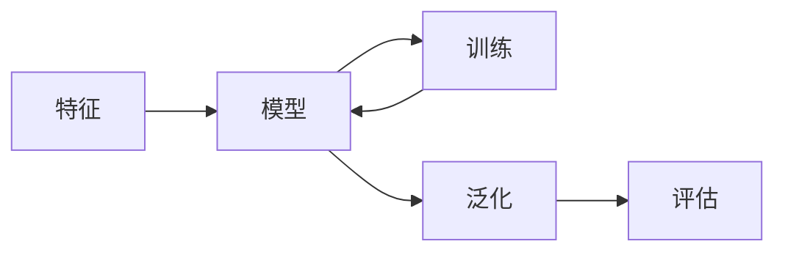

# Machine Learning 原理与代码实战案例讲解

## 1.背景介绍
### 1.1 机器学习的定义与发展历程
#### 1.1.1 机器学习的定义
机器学习(Machine Learning, ML)是人工智能(Artificial Intelligence, AI)的一个分支。它是一门专门研究计算机怎样模拟或实现人类学习行为,以获取新的知识或技能,重新组织已有的知识结构使之不断改善自身性能的学科。

#### 1.1.2 机器学习的发展历程
机器学习的概念最早出现在1959年,是由 Arthur Samuel 提出的。此后,机器学习经历了符号主义和连接主义两个主要阶段的发展。

20世纪80年代初到90年代中期,以知识为基础的符号主义占据了主导地位。研究人员试图通过逻辑推理等方法,赋予计算机以人类专家的知识和经验。代表性的系统有专家系统等。

20世纪80年代末期到90年代,随着大规模数据的出现和计算能力的提升,以神经网络为代表的连接主义开始崛起。这一时期的主要特点是通过训练数据来学习知识,代表性的算法有反向传播算法等。

进入21世纪以来,得益于互联网的迅猛发展和数据量的爆炸式增长,以及计算机硬件性能的飞速提升,机器学习进入了快速发展的新阶段。一些复杂的算法,如支持向量机、随机森林、深度学习等得以实现和应用,使得机器学习在图像识别、自然语言处理等领域取得了突破性的进展。

### 1.2 机器学习的主要分支
机器学习主要可以分为以下三大类:
1. 监督学习(Supervised Learning):通过已标注的训练样本来训练模型,使模型能够对未知数据做出预测。常见算法有决策树、支持向量机、神经网络等。
2. 无监督学习(Unsupervised Learning):通过无标注的数据样本,让模型自己去发现数据的内在规律和结构。常见算法有聚类、关联规则等。  
3. 强化学习(Reinforcement Learning):通过智能体(Agent)与环境的交互,根据反馈的奖励或惩罚信号来优化模型。代表性算法有Q-Learning、策略梯度等。

### 1.3 机器学习的应用场景
机器学习在各行各业有着广泛的应用,主要包括:
- 计算机视觉:图像分类、目标检测、人脸识别等
- 自然语言处理:文本分类、情感分析、机器翻译、语音识别等  
- 推荐系统:个性化推荐、广告投放等
- 异常检测:金融欺诈检测、设备故障预警等
- 医疗健康:疾病诊断、药物发现等
- 自动驾驶:道路标识识别、路径规划等

## 2.核心概念与联系
### 2.1 特征(Feature)
特征是样本的属性或性质的度量。在机器学习任务中,通常将样本表示成特征向量的形式。特征既可以是数值型的,也可以是类别型的。特征选择和特征提取是机器学习的重要步骤。

### 2.2 模型(Model) 
模型定义了从输入到输出的映射关系。机器学习的目标就是通过训练数据来学习得到一个性能良好的模型。模型可以有多种形式,如线性模型、树模型、神经网络模型等。

### 2.3 训练(Training)
训练是通过训练数据来学习模型参数的过程。监督学习中,训练的目标是让模型尽可能拟合训练数据。训练通常采用优化算法,如梯度下降法等。

### 2.4 泛化(Generalization)
泛化能力指模型在新的未知数据上的表现。机器学习追求的是模型的泛化能力而非记忆能力。过拟合(Overfitting)和欠拟合(Underfitting)是影响模型泛化能力的两个主要问题。

### 2.5 评估(Evaluation)  
评估是指对训练好的模型进行性能评估。常用的评估指标有准确率、精确率、召回率、F1值、AUC等。评估通常在留出的验证集或测试集上进行。

### 2.6 各概念间的联系
下面是各个核心概念间的联系图:



## 3.核心算法原理具体操作步骤
### 3.1 线性回归(Linear Regression)
线性回归是一种监督学习算法,用于拟合连续型变量。其基本思想是找到一条直线,使所有样本到直线的垂直距离平方和最小。

#### 3.1.1 算法步骤
1. 确定模型形式:$y = w^Tx+b$,其中$w$是权重向量,$b$是偏置项
2. 定义损失函数:$J(w,b) = \frac{1}{2m}\sum_{i=1}^m(h_w(x^{(i)})-y^{(i)})^2$
3. 采用梯度下降法对损失函数进行优化:
   - 计算损失函数对$w$和$b$的偏导数
   - 更新$w$和$b$的值: $w:=w-\alpha \frac{\partial J}{\partial w}, b:=b-\alpha \frac{\partial J}{\partial b}$
4. 不断迭代直至收敛

### 3.2 逻辑回归(Logistic Regression)
逻辑回归是一种常用的分类算法,尤其适用于二分类问题。虽然名字带"回归",但它实际上是一种分类方法。

#### 3.2.1 算法步骤
1. 确定模型形式:$h_w(x)=\sigma(w^Tx+b)$,其中$\sigma(z)=\frac{1}{1+e^{-z}}$为Sigmoid函数
2. 定义损失函数:$J(w,b)=-\frac{1}{m}\sum_{i=1}^m[y^{(i)}\log h_w(x^{(i)})+(1-y^{(i)})\log (1-h_w(x^{(i)}))]$
3. 采用梯度下降法对损失函数进行优化:
   - 计算损失函数对$w$和$b$的偏导数
   - 更新$w$和$b$的值: $w:=w-\alpha \frac{\partial J}{\partial w}, b:=b-\alpha \frac{\partial J}{\partial b}$
4. 不断迭代直至收敛
5. 对于新样本$x$,如果$h_w(x)>=0.5$则预测为正类,否则预测为负类

### 3.3 k近邻(k-Nearest Neighbor, k-NN)
k近邻是一种基本的分类与回归方法。它的基本思想是:如果一个样本在特征空间中的k个最相似(即特征空间中最邻近)的样本中的大多数属于某一个类别,则该样本也属于这个类别。

#### 3.3.1 算法步骤
1. 计算测试样本与每个训练样本的距离(如欧氏距离)
2. 选取距离最小的k个训练样本
3. 对于分类任务:采用"多数表决"的方法,即k个样本中出现次数最多的类别作为预测结果
   对于回归任务:取k个样本的平均值作为预测结果

## 4.数学模型和公式详细讲解举例说明
### 4.1 线性回归
#### 4.1.1 数学模型
线性回归的目标是学习一个线性模型以尽可能准确地预测实值输出标记。给定数据集$D=\{(x_1,y_1),(x_2,y_2),...,(x_m,y_m)\}$,其中$x_i \in \mathbb{R}^n$为第$i$个样本的特征向量,$y_i \in \mathbb{R}$为第$i$个样本的标记。线性回归试图学得一个线性模型:
$$h_w(x)=w^Tx+b, 使得h_w(x_i) \simeq y_i$$
其中,$w=(w_1;w_2;...;w_n)$为模型参数,$b$为偏置项。通过最小化损失函数来估计模型参数$w$和$b$:
$$J(w,b) = \frac{1}{2m}\sum_{i=1}^m(h_w(x^{(i)})-y^{(i)})^2$$

#### 4.1.2 举例说明
假设我们要根据房屋面积预测房价,已知数据集如下:

| 面积($m^2$) | 价格(万元) |
|------------|-----------|
| 90         | 250       |
| 80         | 220       | 
| 100        | 280       |
| 110        | 320       |

我们希望学习一个线性模型$y=wx+b$,使得模型能够根据面积$x$预测房价$y$。
首先初始化参数$w$和$b$,然后不断迭代直至收敛:
1. 假设初始$w=1, b=0$,则模型为$y=x$
2. 计算损失函数$J(w,b) = \frac{1}{2m}\sum_{i=1}^m(wx^{(i)}+b-y^{(i)})^2$
3. 计算$\frac{\partial J}{\partial w}$和$\frac{\partial J}{\partial b}$
4. 更新$w$和$b$: $w:=w-\alpha \frac{\partial J}{\partial w}, b:=b-\alpha \frac{\partial J}{\partial b}$
5. 重复2-4步直至收敛

假设最终学得的模型为$y=2.5x+10$,则对于面积为120$m^2$的房屋,预测价格为$2.5*120+10=310$万元。

### 4.2 逻辑回归
#### 4.2.1 数学模型 
逻辑回归是一种常用的二分类模型。给定数据集$D=\{(x_1,y_1),(x_2,y_2),...,(x_m,y_m)\}, y_i \in \{0,1\}$,逻辑回归通过Sigmoid函数将线性回归的输出转化为概率:
$$h_w(x)=\sigma(w^Tx+b), 其中\sigma(z)=\frac{1}{1+e^{-z}}$$
对于给定的$x$,逻辑回归模型估计$y=1$的条件概率为:
$$P(y=1|x;w)=h_w(x)$$
估计$y=0$的条件概率为:
$$P(y=0|x;w)=1-h_w(x)$$
逻辑回归的损失函数为:
$$J(w,b)=-\frac{1}{m}\sum_{i=1}^m[y^{(i)}\log h_w(x^{(i)})+(1-y^{(i)})\log (1-h_w(x^{(i)}))]$$

#### 4.2.2 举例说明
假设我们要根据肿瘤大小预测是否为恶性肿瘤,已知数据集如下:

| 肿瘤大小($cm^2$) | 是否恶性(1表示恶性,0表示良性) |
|-----------------|------------------------------|
| 1               | 0                            |
| 5               | 1                            |
| 3               | 0                            |
| 8               | 1                            |

首先初始化参数$w$和$b$,然后不断迭代直至收敛:  
1. 假设初始$w=0, b=0$
2. 计算损失函数$J(w,b)=-\frac{1}{m}\sum_{i=1}^m[y^{(i)}\log h_w(x^{(i)})+(1-y^{(i)})\log (1-h_w(x^{(i)}))]$
3. 计算$\frac{\partial J}{\partial w}$和$\frac{\partial J}{\partial b}$
4. 更新$w$和$b$: $w:=w-\alpha \frac{\partial J}{\partial w}, b:=b-\alpha \frac{\partial J}{\partial b}$
5. 重复2-4步直至收敛

假设最终学得的模型为$h_w(x)=\sigma(0.8x-3)$,则对于肿瘤大小为4$cm^2$的新样本,计算$h_w(4)=\sigma(0.8*4-3)=0.38<0.5$,因此预测该肿瘤为良性。

## 5.项目实践:代码实例和详细解释说明
下面我们以Python语言为例,给出线性回归和逻辑回归的代码实现。
### 5.1 线性回归代码实例
```python
import numpy as np

class LinearRegression:
    def __init__(self, learning_rate=0.01, n_iters=1000):
        self.lr = learning_