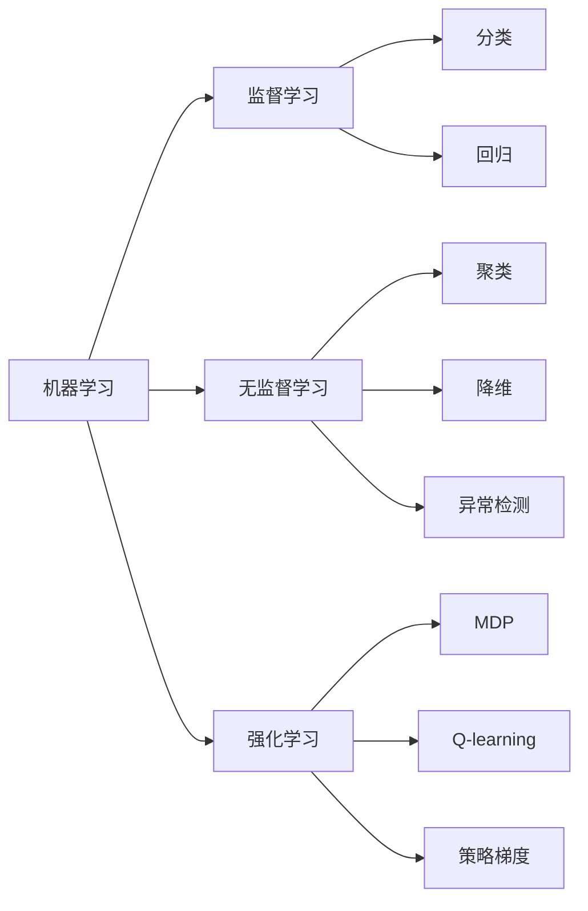

# Machine Learning原理与代码实例讲解

## 1. 背景介绍
### 1.1 机器学习的定义与内涵
### 1.2 机器学习的发展历程
#### 1.2.1 早期机器学习
#### 1.2.2 现代机器学习
#### 1.2.3 深度学习的崛起
### 1.3 机器学习的应用领域
#### 1.3.1 计算机视觉
#### 1.3.2 自然语言处理
#### 1.3.3 语音识别
#### 1.3.4 推荐系统
#### 1.3.5 自动驾驶

## 2. 核心概念与联系
### 2.1 监督学习
#### 2.1.1 分类任务
#### 2.1.2 回归任务
### 2.2 无监督学习  
#### 2.2.1 聚类
#### 2.2.2 降维
#### 2.2.3 异常检测
### 2.3 强化学习
#### 2.3.1 马尔可夫决策过程
#### 2.3.2 Q-learning
#### 2.3.3 策略梯度
### 2.4 核心概念之间的联系



## 3. 核心算法原理具体操作步骤
### 3.1 线性回归
#### 3.1.1 最小二乘法
#### 3.1.2 梯度下降法
#### 3.1.3 正则化
### 3.2 逻辑回归
#### 3.2.1 Sigmoid函数
#### 3.2.2 交叉熵损失
#### 3.2.3 多分类逻辑回归
### 3.3 支持向量机
#### 3.3.1 最大间隔分类器
#### 3.3.2 软间隔与松弛变量
#### 3.3.3 核函数
### 3.4 决策树
#### 3.4.1 信息增益
#### 3.4.2 基尼指数
#### 3.4.3 剪枝
### 3.5 随机森林
#### 3.5.1 Bagging
#### 3.5.2 特征随机化
#### 3.5.3 OOB误差
### 3.6 K-means聚类
#### 3.6.1 聚类中心初始化
#### 3.6.2 样本分配
#### 3.6.3 聚类中心更新
### 3.7 主成分分析
#### 3.7.1 协方差矩阵
#### 3.7.2 特征值分解
#### 3.7.3 主成分选择

## 4. 数学模型和公式详细讲解举例说明
### 4.1 线性回归
#### 4.1.1 模型定义
$$h_\theta(x)=\theta_0+\theta_1x_1+\theta_2x_2+...+\theta_nx_n$$
#### 4.1.2 损失函数 
$$J(\theta)=\frac{1}{2m}\sum_{i=1}^{m}(h_\theta(x^{(i)})-y^{(i)})^2$$
#### 4.1.3 梯度下降
$$\theta_j:=\theta_j-\alpha\frac{1}{m}\sum_{i=1}^{m}(h_\theta(x^{(i)})-y^{(i)})x_j^{(i)}$$
### 4.2 逻辑回归
#### 4.2.1 Sigmoid函数
$$g(z)=\frac{1}{1+e^{-z}}$$  
#### 4.2.2 预测函数
$$h_\theta(x)=g(\theta^Tx)=\frac{1}{1+e^{-\theta^Tx}}$$
#### 4.2.3 交叉熵损失
$$J(\theta)=-\frac{1}{m}\sum_{i=1}^m[y^{(i)}\log h_\theta(x^{(i)})+(1-y^{(i)})\log(1-h_\theta(x^{(i)}))]$$
### 4.3 支持向量机
#### 4.3.1 线性可分支持向量机
$$\begin{aligned} 
\min_{\mathbf{w},b} & \quad \frac{1}{2}\|\mathbf{w}\|^2 \\
s.t. & \quad y^{(i)}(\mathbf{w}^T\mathbf{x}^{(i)}+b) \geq 1, \quad i=1,\ldots,m
\end{aligned}$$
#### 4.3.2 软间隔支持向量机
$$\begin{aligned}
\min_{\mathbf{w},b,\xi} & \quad \frac{1}{2}\|\mathbf{w}\|^2+C\sum_{i=1}^m\xi_i \\
s.t. & \quad y^{(i)}(\mathbf{w}^T\mathbf{x}^{(i)}+b) \geq 1-\xi_i,\\
& \quad \xi_i \geq 0, \quad i=1,\ldots,m
\end{aligned}$$
#### 4.3.3 核函数
$$K(\mathbf{x},\mathbf{z})=\langle\phi(\mathbf{x}),\phi(\mathbf{z})\rangle$$
### 4.4 K-means聚类
#### 4.4.1 目标函数
$$J=\sum_{i=1}^k\sum_{\mathbf{x}\in C_i}\|\mathbf{x}-\mathbf{\mu}_i\|^2$$
其中$\mathbf{\mu}_i$是第$i$个聚类的中心。
#### 4.4.2 聚类中心更新
$$\mathbf{\mu}_i=\frac{1}{|C_i|}\sum_{\mathbf{x}\in C_i}\mathbf{x}$$
### 4.5 主成分分析  
#### 4.5.1 协方差矩阵
$$\mathbf{S}=\frac{1}{m}\sum_{i=1}^m(\mathbf{x}^{(i)}-\mathbf{\bar{x}})(\mathbf{x}^{(i)}-\mathbf{\bar{x}})^T$$
#### 4.5.2 特征值分解
$$\mathbf{S}\mathbf{v}_i=\lambda_i\mathbf{v}_i, \quad i=1,\ldots,n$$

## 5. 项目实践：代码实例和详细解释说明
### 5.1 线性回归
```python
import numpy as np

# 加载数据
X = np.load('X.npy')  
y = np.load('y.npy')

# 添加偏置项
X = np.c_[np.ones(X.shape[0]), X]  

# 初始化参数
theta = np.zeros(X.shape[1])

# 超参数
alpha = 0.01
num_iters = 1000

# 梯度下降
for i in range(num_iters):
    h = np.dot(X, theta)
    error = h - y
    gradient = np.dot(X.T, error) / y.size
    theta -= alpha * gradient

# 预测
X_test = np.array([[1, 1650, 3]])
y_pred = np.dot(X_test, theta)
print(f'预测房价: ${y_pred[0]:.2f}')
```
这段代码实现了一个简单的线性回归模型。首先加载训练数据，并添加偏置项。然后初始化参数，设置学习率和迭代次数等超参数。通过梯度下降算法更新参数，最小化均方误差损失函数。最后，使用训练好的模型对新样本进行预测。

### 5.2 逻辑回归
```python
import numpy as np

# 加载数据
X = np.load('X.npy')
y = np.load('y.npy')

# 添加偏置项  
X = np.c_[np.ones(X.shape[0]), X]

# 初始化参数
theta = np.zeros(X.shape[1])

# 超参数
alpha = 0.01
num_iters = 1000

# 逻辑回归函数
def sigmoid(z):
    return 1 / (1 + np.exp(-z))

# 梯度下降
for i in range(num_iters):
    h = sigmoid(np.dot(X, theta))
    error = h - y
    gradient = np.dot(X.T, error) / y.size
    theta -= alpha * gradient
    
# 预测
X_test = np.array([[1, 5.1, 3.5, 1.4, 0.2]])
y_pred = sigmoid(np.dot(X_test, theta))
print(f'预测概率: {y_pred[0]:.3f}')
if y_pred >= 0.5:
    print('预测类别: 1')
else:
    print('预测类别: 0')
```
这段代码实现了一个二分类逻辑回归模型。数据加载和预处理与线性回归类似。定义了sigmoid激活函数，用于将线性函数的输出映射到(0,1)范围内，得到概率值。通过梯度下降算法最小化交叉熵损失函数，更新参数。最后，对新样本进行预测，输出概率值和预测类别。

### 5.3 支持向量机
```python
from sklearn import svm
from sklearn.datasets import load_iris
from sklearn.model_selection import train_test_split
from sklearn.metrics import accuracy_score

# 加载数据
iris = load_iris()
X = iris.data
y = iris.target

# 划分训练集和测试集
X_train, X_test, y_train, y_test = train_test_split(X, y, test_size=0.2, random_state=42)

# 训练SVM模型
clf = svm.SVC(kernel='linear', C=1)
clf.fit(X_train, y_train)

# 预测
y_pred = clf.predict(X_test)

# 评估
accuracy = accuracy_score(y_test, y_pred)
print(f'准确率: {accuracy:.3f}')
```
这段代码使用scikit-learn库实现了一个线性支持向量机模型。首先加载iris数据集，并划分为训练集和测试集。然后创建一个SVM分类器对象，指定使用线性核函数和正则化参数C。通过fit方法训练模型，并在测试集上进行预测。最后，使用accuracy_score评估模型的准确率。

### 5.4 K-means聚类
```python
import numpy as np
import matplotlib.pyplot as plt

# 加载数据
X = np.load('X.npy')

# 超参数
K = 3
max_iters = 100

# 初始化聚类中心
centroids = X[np.random.choice(X.shape[0], K, replace=False)]

# K-means聚类
for i in range(max_iters):
    # 计算每个样本到聚类中心的距离
    distances = np.sqrt(((X - centroids[:, np.newaxis])**2).sum(axis=2))
    
    # 将每个样本分配到最近的聚类中心
    labels = np.argmin(distances, axis=0)
    
    # 更新聚类中心
    for j in range(K):
        centroids[j] = X[labels == j].mean(axis=0)

# 可视化结果
plt.scatter(X[:, 0], X[:, 1], c=labels)
plt.scatter(centroids[:, 0], centroids[:, 1], marker='x', s=200, linewidths=3, color='r')
plt.xlabel('X')
plt.ylabel('Y')
plt.title('K-means Clustering')
plt.show()
```
这段代码实现了K-means聚类算法。首先加载数据，并设置聚类数K和最大迭代次数。随机选择K个样本作为初始聚类中心。在每次迭代中，计算每个样本到聚类中心的欧氏距离，并将其分配到最近的聚类中心。然后更新每个聚类的中心为该聚类内所有样本的均值。迭代直到收敛或达到最大迭代次数。最后，使用matplotlib可视化聚类结果，不同颜色表示不同的聚类，红色x表示聚类中心。

## 6. 实际应用场景
### 6.1 计算机视觉
- 图像分类：使用卷积神经网络对图像进行分类，如识别手写数字、物体检测等。
- 人脸识别：基于深度学习的人脸检测和识别系统，广泛应用于安防、支付等领域。
- 语义分割：对图像进行像素级别的分类，实现背景和目标的分割，应用于无人驾驶、医学影像分析等。

### 6.2 自然语言处理
- 情感分析：判断文本的情感倾向，如正面、负面、中性，应用于舆情监测、客户反馈分析等。
- 命名实体识别：从文本中识别出人名、地名、机构名等命名实体，应用于信息抽取、知识图谱构建等。
- 机器翻译：利用神经网络实现不同语言之间的自动翻译，如谷歌翻译、百度翻译等。

### 6.3 推荐系统
- 协同过滤：根据用户的历史行为和其他相似用户的偏好，为用户推荐感兴趣的物品，如电商网站的商品推荐。
- 基于内容的推荐：根据物品的