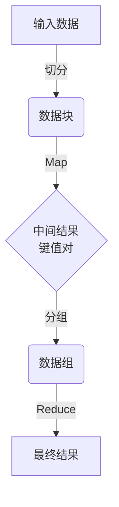
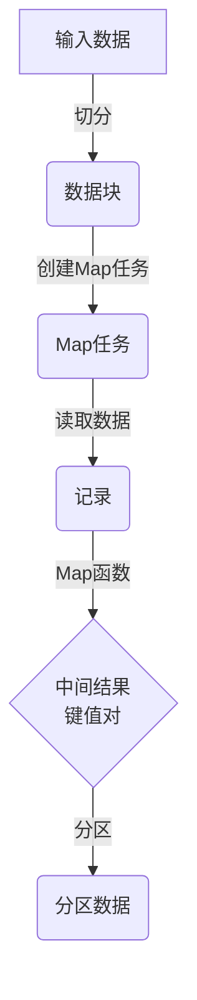
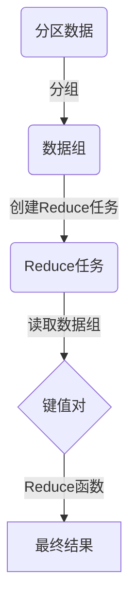

# MapReduce原理与代码实例讲解

## 1.背景介绍

### 1.1 大数据时代的到来

随着互联网、移动互联网、物联网的快速发展,海量的结构化和非结构化数据不断产生。传统的数据处理方式已经无法满足对大规模数据集的存储、管理和分析需求。大数据时代的到来,对数据处理能力提出了更高的要求,迫切需要一种新的计算模型来应对这一挑战。

### 1.2 谷歌文件系统与MapReduce

为了解决大规模数据处理问题,谷歌于2004年提出了谷歌文件系统(GFS)和MapReduce计算模型。GFS是一种分布式文件系统,能够跨多台机器存储海量数据;而MapReduce则是一种分布式计算模型,能够在大规模集群上并行处理海量数据。两者的结合,使得大数据的存储和计算成为可能。

### 1.3 MapReduce影响

MapReduce思想的提出,对大数据处理领域产生了深远影响。它成为分布式计算的事实标准,催生了一系列大数据处理系统,如Apache Hadoop、Spark等。MapReduce不仅解决了大数据计算的难题,也极大地推动了大数据技术的发展和应用。

## 2.核心概念与联系  

### 2.1 MapReduce计算模型

MapReduce是一种软件架构,用于在大规模集群上并行处理大量数据。它将计算过程分为两个阶段:Map阶段和Reduce阶段。

#### 2.1.1 Map阶段

Map阶段的主要工作是对输入数据进行过滤和转换处理。具体来说,Map阶段将输入数据切分为多个数据块,并为每个数据块创建一个Map任务。每个Map任务会并行处理对应的数据块,执行用户自定义的Map函数,生成键值对形式的中间结果。

#### 2.1.2 Reduce阶段  

Reduce阶段的主要工作是对Map阶段产生的中间结果进行汇总和处理。具体来说,系统会对Map阶段产生的中间结果按照键值进行分组,然后为每一组创建一个Reduce任务。每个Reduce任务会并行处理对应的数据组,执行用户自定义的Reduce函数,生成最终结果。

### 2.2 MapReduce数据流程

MapReduce作业的执行过程可以概括为以下几个步骤:

1. 输入数据被切分为多个数据块
2. 为每个数据块创建一个Map任务
3. 每个Map任务并行执行Map函数,生成键值对形式的中间结果
4. 对中间结果按照键值进行分组
5. 为每个数据组创建一个Reduce任务  
6. 每个Reduce任务并行执行Reduce函数,生成最终结果
7. 将最终结果输出

该流程可用下面的Mermaid流程图直观表示:



### 2.3 MapReduce核心优势

MapReduce的核心优势在于:

1. **自动并行化**: 通过将计算任务分解为多个Map和Reduce任务,MapReduce可以自动实现并行计算,充分利用集群资源。

2. **容错性**: MapReduce具有较强的容错能力。如果某个计算节点出现故障,它可以自动在其他节点上重新执行失败的任务,从而保证计算的完整性。

3. **可扩展性**: MapReduce可以通过增加计算节点来线性扩展计算能力,满足大规模数据处理需求。

4. **编程简单**: 用户只需要实现Map和Reduce函数,而不必关心并行计算、容错、数据分发等复杂细节,大大降低了编程难度。

## 3.核心算法原理具体操作步骤

### 3.1 Map阶段算法流程

Map阶段的算法流程如下:

1. 读取输入数据,将其切分为多个数据块
2. 为每个数据块创建一个Map任务
3. 每个Map任务读取对应的数据块
4. 对数据块中的每条记录,执行用户自定义的Map函数
5. Map函数输出键值对形式的中间结果
6. 将中间结果按键值对分区,生成分区数据

该流程可用下面的Mermaid流程图表示:



### 3.2 Reduce阶段算法流程

Reduce阶段的算法流程如下:

1. 对Map阶段产生的分区数据按键值进行分组
2. 为每个数据组创建一个Reduce任务  
3. 每个Reduce任务读取对应的数据组
4. 对数据组中的每个键值对,执行用户自定义的Reduce函数
5. Reduce函数输出最终结果

该流程可用下面的Mermaid流程图表示:



## 4.数学模型和公式详细讲解举例说明

在MapReduce中,Map和Reduce函数的设计是关键。它们决定了MapReduce作业的计算逻辑和结果。下面我们通过一个具体的例子,来详细讲解Map和Reduce函数的设计和实现。

### 4.1 问题描述

给定一个文本文件,统计文件中每个单词出现的次数。

### 4.2 Map函数设计

Map函数的输入是文本文件中的每一行,输出是单词及其出现次数。具体实现如下:

```python
def map_function(line):
    words = line.split()
    mapped_words = []
    for word in words:
        mapped_words.append((word, 1))
    return mapped_words
```

该Map函数首先将每一行文本按空格拆分为单词列表,然后遍历单词列表,将每个单词与计数值1组成键值对,添加到mapped_words列表中。最后返回mapped_words列表作为Map函数的输出。

### 4.3 Reduce函数设计

Reduce函数的输入是Map阶段产生的中间结果,即(单词,计数值)形式的键值对列表。Reduce函数需要对相同单词的计数值进行汇总,得到每个单词的总计数。具体实现如下:

```python
def reduce_function(word, counts):
    total_count = sum(counts)
    return (word, total_count)
```

该Reduce函数接收一个单词word和该单词对应的计数值列表counts。它通过对counts列表求和,得到该单词的总计数total_count,并将(word, total_count)作为输出。

### 4.4 数学模型

我们可以用数学模型来形式化描述MapReduce的计算过程。

设输入数据集为$D$,将其切分为$n$个数据块$D = \{d_1, d_2, \cdots, d_n\}$。对于每个数据块$d_i$,执行Map函数:

$$
\text{Map}(d_i) = \{(k_1, v_1), (k_2, v_2), \cdots, (k_m, v_m)\}
$$

其中$(k_j, v_j)$是Map函数输出的键值对。

将所有Map函数的输出合并,并按键值对分组,得到中间结果:

$$
\text{Shuffle}(\bigcup_{i=1}^n \text{Map}(d_i)) = \{(k_1, [v_{11}, v_{12}, \cdots]), (k_2, [v_{21}, v_{22}, \cdots]), \cdots\}
$$

对于每个键$k_i$及其对应的值列表$[v_{i1}, v_{i2}, \cdots]$,执行Reduce函数:

$$
\text{Reduce}(k_i, [v_{i1}, v_{i2}, \cdots]) = (k_i, v_i')
$$

其中$v_i'$是Reduce函数的输出值。

最终结果就是所有Reduce函数输出的并集:

$$
\text{Result} = \bigcup_i \text{Reduce}(k_i, [v_{i1}, v_{i2}, \cdots])
$$

通过这个数学模型,我们可以清晰地看到MapReduce的计算过程,以及Map和Reduce函数在其中扮演的角色。

## 5.项目实践:代码实例和详细解释说明

为了更好地理解MapReduce的原理和使用方法,我们将通过一个实际的Python代码示例来演示WordCount这一经典的MapReduce应用。

### 5.1 问题描述

给定一个文本文件,统计文件中每个单词出现的次数,并将结果输出到另一个文件中。

### 5.2 MapReduce代码实现

我们将使用Python编程语言,结合Hadoop StreamingAPI来实现这个WordCount应用。

#### 5.2.1 Map函数实现

```python
#!/usr/bin/env python

import sys

# Map函数,将每一行文本拆分为单词,并输出(单词,1)形式的键值对
for line in sys.stdin:
    line = line.strip()
    words = line.split()
    for word in words:
        print('%s\t%s' % (word, 1))
```

该Map函数从标准输入(sys.stdin)读取每一行文本,去除行首尾的空白字符,然后将该行拆分为单词列表。对于每个单词,输出(单词,1)形式的键值对到标准输出(sys.stdout)。

#### 5.2.2 Reduce函数实现

```python
#!/usr/bin/env python

from itertools import groupby
from operator import itemgetter
import sys

# Reduce函数,对相同单词的计数值进行汇总
def read_mapper_output(file, separator='\t'):
    for line in file:
        yield line.rstrip().split(separator, 1)

def main(separator='\t'):
    data = read_mapper_output(sys.stdin, separator=separator)
    for word, group in groupby(data, itemgetter(0)):
        try:
            total_count = sum(int(count) for current_word, count in group)
            print("%s%s%d" % (word, separator, total_count))
        except ValueError:
            pass

if __name__ == "__main__":
    main()
```

该Reduce函数首先定义了read_mapper_output函数,用于从标准输入读取Map函数的输出,并将其转换为(单词,计数值)形式的键值对列表。

主函数main使用itertools.groupby函数,按照单词对键值对列表进行分组。对于每个单词及其对应的计数值列表,求和得到该单词的总计数,并将(单词,总计数)输出到标准输出。

#### 5.2.3 运行WordCount应用

我们可以使用Hadoop Streaming来运行这个WordCount应用。假设输入文件为input.txt,输出文件为output.txt,运行命令如下:

```bash
hadoop jar /path/to/hadoop-streaming.jar \
    -input input.txt \
    -output output \
    -mapper 'python mapper.py' \
    -reducer 'python reducer.py'
```

该命令会启动一个MapReduce作业,使用mapper.py作为Map函数,reducer.py作为Reduce函数,处理input.txt文件,并将结果输出到output目录下。

### 5.3 代码解释

通过上面的代码实例,我们可以看到使用MapReduce进行数据处理的基本流程:

1. 实现Map函数,对输入数据进行预处理,生成(键,值)形式的中间结果
2. 实现Reduce函数,对Map函数的输出进行汇总或其他操作,生成最终结果
3. 将Map函数和Reduce函数提交到Hadoop集群,启动MapReduce作业
4. Hadoop自动将输入数据切分为多个数据块,并为每个数据块创建Map任务
5. Map任务并行执行Map函数,生成中间结果
6. Hadoop对中间结果进行洗牌和分组,为每个数据组创建Reduce任务
7. Reduce任务并行执行Reduce函数,生成最终结果
8. 将最终结果输出到指定目录

通过这个WordCount示例,我们可以清晰地看到MapReduce编程模型的优势:简单、高效、易于并行。用户只需要关注Map和Reduce函数的实现,而不必关心并行计算、容错、数据分发等复杂细节,极大地降低了编程难度。

## 6.实际应用场景

MapReduce作为一种通用的大数据处理框架,在实际应用中有着广泛的应用场景,包括但不限于:

### 6.1 