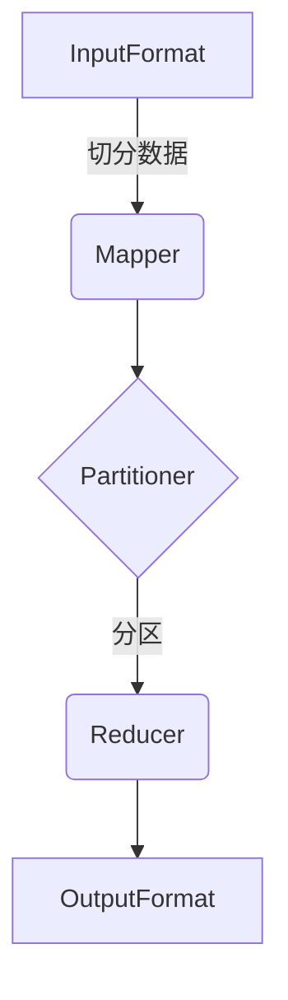

# MapReduce原理与代码实例讲解

## 1.背景介绍

### 1.1 大数据时代的到来

随着互联网、移动互联网、物联网等新兴技术的快速发展,数据量呈现出爆炸式增长。每天都有大量的结构化数据(如关系数据库中的数据)和非结构化数据(如网页数据、图像、视频等)被产生。这些海量的数据蕴含着巨大的商业价值,如何高效地存储、管理和分析这些大数据,成为当前企业和研究机构亟待解决的重大挑战。

### 1.2 大数据处理的难题

传统的数据处理系统无法满足大数据时代的需求,主要原因有:

1. **数据量太大**:单台服务器的存储和计算能力有限,无法承载大规模数据集。
2. **数据种类繁多**:结构化数据、半结构化数据和非结构化数据的处理方式不同,需要不同的技术来应对。
3. **实时性要求高**:对于某些应用场景,需要在较短时间内完成大数据的处理和分析。

### 1.3 大数据处理新范式

为了解决大数据带来的挑战,Google在2004年提出了MapReduce计算模型,用于在大规模计算集群上并行处理大数据。MapReduce思想源于函数式编程的`Map`和`Reduce`操作,将复杂的计算任务分解为简单的Map和Reduce两个阶段,使得海量数据能够在多台机器上并行计算。

MapReduce计算模型的核心思想是"把大的计算任务分解为小的计算任务,然后将小的计算任务分布到集群中的多台机器上并行执行,最后将所有机器上的结果合并成最终结果"。这种思路非常适合用于大数据处理,因为它天生具有高度的可扩展性和容错性。

## 2.核心概念与联系

### 2.1 MapReduce核心概念

MapReduce包含以下几个核心概念:

1. **InputFormat**:用于切分待处理的数据集,并将切分后的数据传递给Mapper。
2. **Mapper**:接收InputFormat传递的数据,并对数据进行处理,产生中间结果。
3. **Partitioner**:对Mapper输出的中间结果进行分区,决定将哪些数据发送到哪个Reducer。
4. **Reducer**:接收Partitioner分区后的数据,对数据进行聚合或其他操作,产生最终结果。
5. **OutputFormat**:将Reducer输出的结果写入到外部存储系统中。

### 2.2 MapReduce执行流程

MapReduce执行流程如下:



1. **InputFormat**将输入数据集切分为多个数据块,并将这些数据块传递给多个Mapper。
2. **Mapper**对输入数据进行处理,产生中间结果,中间结果以<key,value>对的形式输出。
3. **Partitioner**对Mapper输出的中间结果进行分区,将相同key的数据发送到同一个Reducer。
4. **Reducer**对Partitioner分区后的数据进行聚合或其他操作,产生最终结果。
5. **OutputFormat**将Reducer输出的结果写入到外部存储系统中,如HDFS。

### 2.3 MapReduce优势

MapReduce具有以下优势:

1. **高度可扩展**:通过增加机器数量,可以线性扩展MapReduce的计算能力。
2. **容错性强**:如果某个节点出现故障,MapReduce可以自动在其他节点上重新执行失败的任务。
3. **开发简单**:开发人员只需要编写Map和Reduce函数,不需要关注底层的并行计算细节。
4. **适用范围广**:MapReduce可以用于大数据的各种处理场景,如文本处理、数据挖掘、机器学习等。

## 3.核心算法原理具体操作步骤

### 3.1 Map阶段

Map阶段的主要操作步骤如下:

1. **读取输入数据**:MapReduce框架将输入数据切分为多个数据块,并将这些数据块分发给多个Mapper。
2. **执行Map函数**:每个Mapper会执行用户定义的Map函数,对输入数据进行处理,产生中间结果。Map函数的输入是一个<key,value>对,输出也是一个<key,value>对。
3. **分区和排序**:MapReduce框架会对Mapper输出的中间结果进行分区和排序,将相同key的数据发送到同一个Reducer。
4. **写入环形缓冲区**:排序后的中间结果会写入到一个环形缓冲区中。
5. **溢写磁盘**:当环形缓冲区达到一定阈值时,会将数据溢写到磁盘上,形成一个溢写文件。
6. **合并溢写文件**:在Map阶段结束时,会对所有溢写文件进行合并,形成最终的Map输出文件。

### 3.2 Reduce阶段

Reduce阶段的主要操作步骤如下:

1. **获取Map输出**:Reducer从MapReduce框架获取Map阶段输出的数据。
2. **合并和排序**:Reducer会对Map输出的数据进行合并和排序,将相同key的数据聚合在一起。
3. **执行Reduce函数**:Reducer会执行用户定义的Reduce函数,对聚合后的数据进行处理,产生最终结果。Reduce函数的输入是一个<key,value列表>对,输出也是一个<key,value>对。
4. **写入输出文件**:Reducer会将最终结果写入到输出文件中。

## 4.数学模型和公式详细讲解举例说明

在MapReduce中,常见的数学模型和公式主要包括:

1. **向量空间模型(VSM)**:用于文本挖掘、信息检索等场景。
2. **TF-IDF公式**:用于计算文本中词项的重要性权重。
3. **PageRank算法**:用于计算网页的重要性排名。
4. **K-Means聚类算法**:用于数据挖掘中的聚类分析。
5. **协同过滤算法**:用于推荐系统中的个性化推荐。

下面以TF-IDF公式为例,详细讲解其数学原理和应用场景。

### 4.1 TF-IDF公式介绍

TF-IDF(Term Frequency-Inverse Document Frequency)是一种用于信息检索与文本挖掘的经典算法,用于评估一个词对于一个文件集或一个语料库中的其中一个文件的重要程度。TF-IDF由两部分组成:

- **TF(Term Frequency,词频)**:某个词语在文件中出现的次数。
- **IDF(Inverse Document Frequency,逆向文件频率)**:某个词语在整个文件集中的分布情况。

TF-IDF公式如下:

$$\mathrm{tfidf}(t, d, D) = \mathrm{tf}(t, d) \times \mathrm{idf}(t, D)$$

其中:

- $t$表示词语
- $d$表示文件
- $D$表示文件集合
- $\mathrm{tf}(t, d)$表示词语$t$在文件$d$中的词频
- $\mathrm{idf}(t, D)$表示词语$t$在文件集合$D$中的逆向文件频率

### 4.2 TF计算公式

TF(Term Frequency)计算公式有多种,常见的有:

1. **词频(Term Frequency)**:

$$\mathrm{tf}(t, d) = \mathrm{count}(t, d)$$

其中$\mathrm{count}(t, d)$表示词语$t$在文件$d$中出现的次数。

2. **词频-归一化(Term Frequency-Normalized)**:

$$\mathrm{tf}(t, d) = \frac{\mathrm{count}(t, d)}{\max\limits_{t' \in d}\{\mathrm{count}(t', d)\}}$$

其中分母表示文件$d$中出现次数最多的词语的词频。

3. **词频-对数归一化(Term Frequency-Log Normalized)**:

$$\mathrm{tf}(t, d) = 1 + \log\mathrm{count}(t, d)$$

使用对数可以平滑词频,避免词频过大对结果的影响。

### 4.3 IDF计算公式

IDF(Inverse Document Frequency)计算公式为:

$$\mathrm{idf}(t, D) = \log\frac{|D|}{|\{d \in D : t \in d\}|}$$

其中:

- $|D|$表示文件集合$D$中文件的总数
- $|\{d \in D : t \in d\}|$表示文件集合$D$中包含词语$t$的文件数量

IDF的主要思想是:如果某个词语在文件集合中出现的频率越高,则它的重要性就越低。通过对文件频率取对数,可以平滑IDF的值。

### 4.4 TF-IDF应用场景

TF-IDF广泛应用于以下场景:

1. **文本分类**:可以将文本表示为TF-IDF向量,然后使用机器学习算法进行文本分类。
2. **信息检索**:在搜索引擎中,可以使用TF-IDF计算文档与查询的相关性得分。
3. **文本聚类**:可以基于TF-IDF向量计算文本之间的相似度,进行文本聚类。
4. **自然语言处理**:TF-IDF可以用于提取文本中的关键词、主题等。

### 4.5 TF-IDF在MapReduce中的实现

在MapReduce中实现TF-IDF的步骤如下:

1. **Map阶段**:
   - 输入为文本文件
   - Mapper计算每个文件中每个词语的词频,输出<词语,文件ID:词频>
2. **Reduce阶段**:
   - Reducer获取每个词语在所有文件中的词频
   - 计算每个词语的文件频率,并计算IDF值
   - 输出<文件ID,词语:TF-IDF值>

通过MapReduce并行计算,可以高效地对大规模文本数据集计算TF-IDF值。

## 5.项目实践:代码实例和详细解释说明

下面以一个简单的WordCount案例,展示如何使用MapReduce进行并行计算。

### 5.1 WordCount需求

WordCount是一个非常经典的大数据计算案例,其需求是:统计给定文本文件中每个单词出现的次数。

### 5.2 MapReduce设计

对于WordCount案例,我们可以设计如下的MapReduce作业:

1. **Map阶段**:
   - 输入为文本文件
   - Mapper对每个文件进行单词拆分,输出<单词,1>
2. **Reduce阶段**:
   - Reducer对每个单词收到的值进行求和,输出<单词,总数>

### 5.3 代码实例

下面是WordCount案例的Java代码实例(基于Apache Hadoop):

```java
// Mapper类
public static class WordCountMapper extends Mapper<LongWritable, Text, Text, IntWritable> {
    private final static IntWritable one = new IntWritable(1);
    private Text word = new Text();

    public void map(LongWritable key, Text value, Context context) throws IOException, InterruptedException {
        String line = value.toString();
        StringTokenizer tokenizer = new StringTokenizer(line);
        while (tokenizer.hasMoreTokens()) {
            word.set(tokenizer.nextToken());
            context.write(word, one);
        }
    }
}

// Reducer类
public static class WordCountReducer extends Reducer<Text, IntWritable, Text, IntWritable> {
    private IntWritable result = new IntWritable();

    public void reduce(Text key, Iterable<IntWritable> values, Context context) throws IOException, InterruptedException {
        int sum = 0;
        for (IntWritable val : values) {
            sum += val.get();
        }
        result.set(sum);
        context.write(key, result);
    }
}

// 主类
public static void main(String[] args) throws Exception {
    Configuration conf = new Configuration();
    Job job = Job.getInstance(conf, "word count");
    job.setJarByClass(WordCount.class);
    job.setMapperClass(WordCountMapper.class);
    job.setCombinerClass(WordCountReducer.class);
    job.setReducerClass(WordCountReducer.class);
    job.setOutputKeyClass(Text.class);
    job.setOutputValueClass(IntWritable.class);
    FileInputFormat.addInputPath(job, new Path(args[0]));
    FileOutputFormat.setOutputPath(job, new Path(args[1]));
    System.exit(job.waitForCompletion(true) ? 0 : 1);
}
```

### 5.4 代码解释

1. **Mapper**:
   - 继承自`Mapper<LongWritable, Text, Text, IntWritable>`
   - `map`方法接收一行文本作为输入,使用`