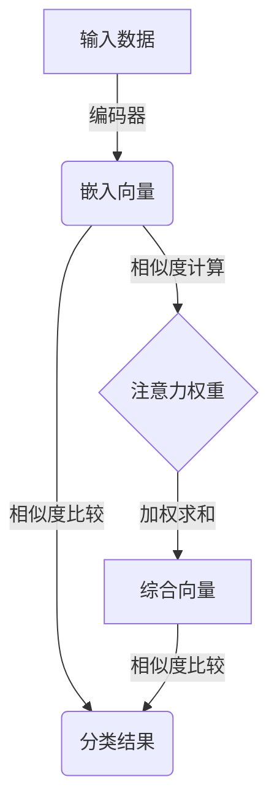

# MatchingNetworks：原理剖析与代码解读

## 1.背景介绍

在机器学习领域中,特别是少样本学习(Few-Shot Learning)任务中,MatchingNetworks算法是一种新颖且有效的方法。它通过学习一个可区分的嵌入空间和注意力机制,使得模型能够快速学习新的概念并进行分类。本文将深入探讨MatchingNetworks的原理、实现细节以及在实际应用中的表现。

## 2.核心概念与联系

### 2.1 少样本学习(Few-Shot Learning)

少样本学习是机器学习中一个具有挑战性的任务。它旨在使模型能够通过少量的示例数据快速学习新概念。这与传统机器学习方法形成鲜明对比,后者需要大量的标记数据进行训练。少样本学习更贴近人类学习的方式,具有广泛的应用前景。

### 2.2 MatchingNetworks

MatchingNetworks是一种用于解决少样本学习问题的元学习(Meta-Learning)方法。它的核心思想是学习一个可区分的嵌入空间,使得相似的样本在该空间中彼此靠近,而不同类别的样本则相距较远。通过这种方式,模型可以基于少量示例快速学习新的概念并进行分类。

### 2.3 注意力机制(Attention Mechanism)

注意力机制是MatchingNetworks中的关键组成部分。它允许模型在进行分类时,动态地为支持集(Support Set)中的每个示例分配不同的权重,从而提高模型的判断能力。这种机制使得模型能够自适应地关注最相关的示例,从而提高分类准确性。

## 3.核心算法原理具体操作步骤

MatchingNetworks算法的核心步骤如下:

1. **嵌入(Embedding)**:首先,将输入数据(如图像或文本)通过编码器(如CNN或RNN)映射到一个可区分的嵌入空间中。

2. **计算相似度(Similarity Computation)**:对于每个查询样本(Query Sample),计算其与支持集(Support Set)中每个示例的相似度。相似度可以通过余弦相似性或欧几里得距离等方式计算。

3. **注意力权重(Attention Weights)**:基于相似度,为支持集中的每个示例分配一个注意力权重。较相似的示例将获得更高的权重。

4. **加权求和(Weighted Summation)**:将支持集中每个示例的嵌入向量与其对应的注意力权重相乘,并对所有加权向量求和,得到一个综合向量(Prototypical Vector)。

5. **分类(Classification)**:将查询样本的嵌入向量与每个类别的综合向量进行比较(如通过余弦相似性或点积),并选择最相似的类别作为预测结果。

以上步骤对于每个查询样本都会重复执行。在训练过程中,模型会通过梯度下降等优化算法来调整嵌入空间和注意力权重,使得模型能够更好地区分不同类别。



## 4.数学模型和公式详细讲解举例说明

### 4.1 嵌入空间

MatchingNetworks算法的核心是学习一个可区分的嵌入空间。给定输入数据 $x$,通过编码器 $f_{\phi}$ 将其映射到嵌入空间中的一个向量 $f_{\phi}(x)$。编码器可以是卷积神经网络(CNN)、递归神经网络(RNN)或其他深度学习模型,具体取决于输入数据的类型。

$$f_{\phi}(x) = \text{Encoder}_{\phi}(x)$$

其中 $\phi$ 表示编码器的可训练参数。

### 4.2 相似度计算

对于每个查询样本 $x^{q}$,需要计算其与支持集 $S = \{(x^{s}_{i}, y^{s}_{i})\}_{i=1}^{N}$ 中每个示例的相似度。相似度可以通过余弦相似性或欧几里得距离等方式计算。

余弦相似性:

$$\text{sim}(x^{q}, x^{s}_{i}) = \frac{f_{\phi}(x^{q}) \cdot f_{\phi}(x^{s}_{i})}{||f_{\phi}(x^{q})|| \cdot ||f_{\phi}(x^{s}_{i})||}$$

欧几里得距离:

$$\text{dist}(x^{q}, x^{s}_{i}) = ||f_{\phi}(x^{q}) - f_{\phi}(x^{s}_{i})||_{2}$$

### 4.3 注意力权重

基于相似度,为支持集中的每个示例分配一个注意力权重 $\alpha_{i}$。较相似的示例将获得更高的权重。注意力权重可以通过 Softmax 函数计算:

$$\alpha_{i} = \frac{\exp(\text{sim}(x^{q}, x^{s}_{i}))}{\sum_{j=1}^{N}\exp(\text{sim}(x^{q}, x^{s}_{j}))}$$

### 4.4 加权求和

将支持集中每个示例的嵌入向量与其对应的注意力权重相乘,并对所有加权向量求和,得到一个综合向量(Prototypical Vector) $c_{k}$ 表示第 $k$ 类:

$$c_{k} = \sum_{i=1}^{N}\alpha_{i}f_{\phi}(x^{s}_{i})1(y^{s}_{i} = k)$$

其中 $1(\cdot)$ 是指示函数,当 $y^{s}_{i} = k$ 时取值为 1,否则为 0。

### 4.5 分类

将查询样本的嵌入向量 $f_{\phi}(x^{q})$ 与每个类别的综合向量 $c_{k}$ 进行比较,并选择最相似的类别作为预测结果:

$$\hat{y} = \arg\max_{k} \text{sim}(f_{\phi}(x^{q}), c_{k})$$

在训练过程中,模型会通过梯度下降等优化算法来调整嵌入空间和注意力权重,使得模型能够更好地区分不同类别。

## 5.项目实践:代码实例和详细解释说明

以下是使用PyTorch实现MatchingNetworks算法的示例代码,并对关键部分进行了详细注释解释。

```python
import torch
import torch.nn as nn
import torch.nn.functional as F

class MatchingNetwork(nn.Module):
    def __init__(self, encoder, n_way):
        super(MatchingNetwork, self).__init__()
        self.encoder = encoder
        self.n_way = n_way

    def set_forward_loss(self, sample):
        """
        计算MatchingNetworks的损失函数。
        Args:
            sample: 一个小批量的数据,包含支持集(support)和查询集(query)。
        Returns:
            损失值(scalar)
        """
        # 将支持集和查询集从样本中分离出来
        support, query = sample['support'], sample['query']

        # 计算支持集和查询集的嵌入向量
        support_embeddings = self.encoder(support['images'].cuda())
        query_embeddings = self.encoder(query['images'].cuda())

        # 计算查询集与支持集之间的相似度
        similarities = self.similarity(query_embeddings, support_embeddings, support['labels'].cuda())

        # 计算损失函数
        loss = self.loss(similarities, query['labels'].cuda())

        return loss

    def similarity(self, query_embeddings, support_embeddings, support_labels):
        """
        计算查询集与支持集之间的相似度。
        Args:
            query_embeddings: 查询集的嵌入向量,形状为(n_queries, embedding_dim)
            support_embeddings: 支持集的嵌入向量,形状为(n_support, embedding_dim)
            support_labels: 支持集的标签,形状为(n_support,)
        Returns:
            similarities: 查询集与支持集之间的相似度,形状为(n_queries, n_way)
        """
        n_queries, n_support = query_embeddings.shape[0], support_embeddings.shape[0]

        # 计算每个类别的原型向量(Prototypical Vector)
        prototypes = torch.stack([support_embeddings[torch.nonzero(support_labels == label)].mean(0)
                                  for label in range(self.n_way)])

        # 计算查询集与每个原型向量之间的相似度
        similarities = torch.matmul(query_embeddings, prototypes.t())

        return similarities

    def loss(self, similarities, query_labels):
        """
        计算交叉熵损失函数。
        Args:
            similarities: 查询集与支持集之间的相似度,形状为(n_queries, n_way)
            query_labels: 查询集的标签,形状为(n_queries,)
        Returns:
            loss: 交叉熵损失函数的值(scalar)
        """
        log_probs = F.log_softmax(similarities, dim=1)
        loss = -log_probs.gather(1, query_labels.unsqueeze(1)).squeeze().mean()

        return loss

    def forward(self, sample):
        """
        前向传播函数。
        Args:
            sample: 一个小批量的数据,包含支持集(support)和查询集(query)。
        Returns:
            accuracies: 分类准确率
        """
        loss = self.set_forward_loss(sample)

        # 计算分类准确率
        _, predicted_labels = torch.max(self.similarity(sample['query']['images'].cuda(),
                                                         sample['support']['images'].cuda(),
                                                         sample['support']['labels'].cuda()), -1)
        accuracies = (predicted_labels == sample['query']['labels'].cuda()).float().mean()

        return accuracies, loss
```

上述代码实现了MatchingNetworks算法的核心部分,包括嵌入、相似度计算、注意力权重计算、加权求和和分类等步骤。以下是对关键部分的解释:

1. `set_forward_loss`函数计算MatchingNetworks的损失函数。首先,它将支持集和查询集从样本中分离出来,并计算它们的嵌入向量。然后,调用`similarity`函数计算查询集与支持集之间的相似度,最后调用`loss`函数计算交叉熵损失。

2. `similarity`函数计算查询集与支持集之间的相似度。它首先计算每个类别的原型向量(Prototypical Vector),即该类别在支持集中所有示例的平均嵌入向量。然后,它计算查询集与每个原型向量之间的相似度,这里使用了余弦相似性。

3. `loss`函数计算交叉熵损失函数。它首先对相似度进行 log_softmax 操作,然后根据查询集的标签计算负对数似然损失。

4. `forward`函数是模型的前向传播函数。它调用`set_forward_loss`计算损失,并计算分类准确率。

在实际应用中,您需要先定义一个编码器(如CNN或RNN),然后将其与MatchingNetwork模块结合使用。此外,您还需要准备支持集和查询集的数据,并将它们输入到模型中进行训练和测试。

## 6.实际应用场景

MatchingNetworks算法在以下场景中具有广泛的应用前景:

1. **图像分类**:在图像分类任务中,MatchingNetworks可以通过少量的示例图像快速学习新的类别,从而应用于具有大量类别但缺乏足够训练数据的情况。

2. **自然语言处理**:在自然语言处理领域,MatchingNetworks可以应用于少样本文本分类、关系抽取等任务,帮助模型快速学习新的概念和关系。

3. **医疗诊断**:在医疗领域,MatchingNetworks可以用于少样本疾病诊断,通过少量已知病例快速学习新的疾病类型,提高诊断效率和准确性。

4. **机器人控制**:在机器人控制领域,MatchingNetworks可以应用于快速学习新的任务和环境,提高机器人的适应能力和灵活性。

5. **推荐系统**:在推荐系统中,MatchingNetworks可以用于个性化推荐,通过少量用户反馈快速学习用户偏好,提供更加精准的推荐结果。

总的来说,MatchingNetworks算法在需要快速学习新概念和适应新环境的场景中具有巨大潜力,可以显著提高机器学习系统的灵活性和效率。

## 7.工具和资源推荐

如果您希望进一步学习和实践MatchingNetworks算法,以下是一些推荐的工具和资源:

1. **PyTorch**:PyTorch是一个流行的深度学习框架,提供了灵活的张量计算和动态计算图,非常适合实现MatchingNetworks