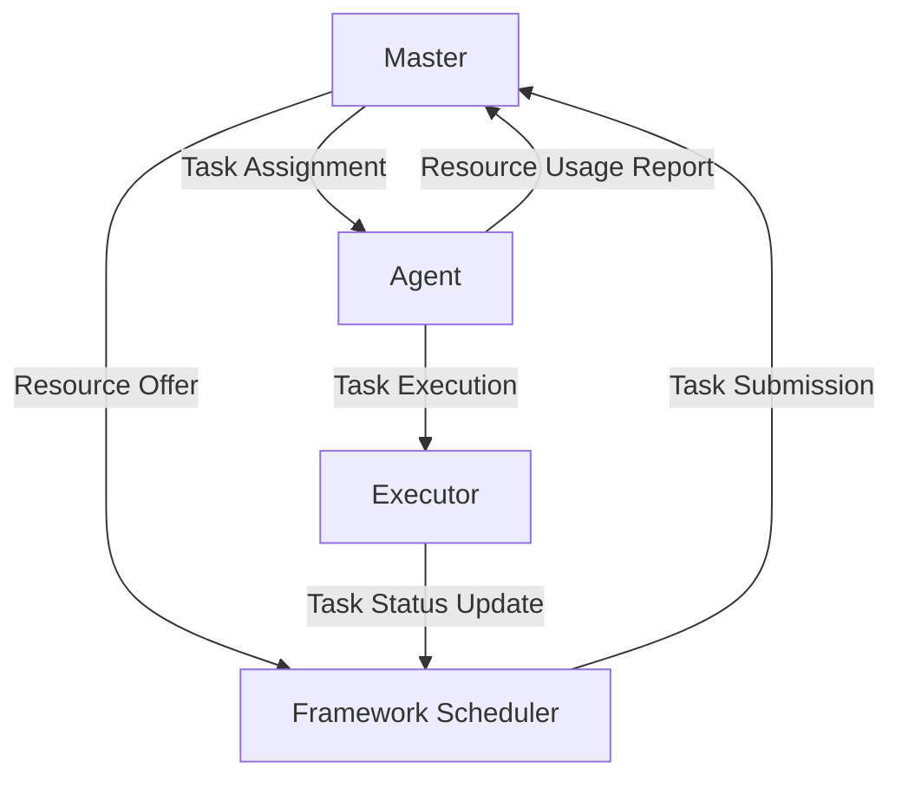

# Mesos原理与代码实例讲解

## 1. 背景介绍

### 1.1 Mesos的诞生背景

在大数据和云计算时代,企业面临着海量数据处理和复杂计算任务的挑战。传统的数据中心架构难以高效灵活地满足这些需求。Apache Mesos应运而生,它是一个开源的分布式资源管理框架,旨在简化集群环境中的资源分配和任务调度。

### 1.2 Mesos的定位与价值

Mesos位于操作系统之上,将整个数据中心抽象为一个巨大的资源池,使上层应用能够按需分配资源,实现资源的细粒度共享和动态调度。这大大提高了集群资源利用率,简化了应用部署和运维。Mesos支持多种上层计算框架,如Hadoop、Spark、Kafka等,使之成为大数据处理平台的理想基础设施。

### 1.3 Mesos的应用现状

目前众多互联网巨头如Twitter、eBay、Uber等都采用了Mesos来支撑其核心业务。Mesos在大规模集群资源管理领域取得了广泛应用,展现出其卓越的性能和可扩展性。理解Mesos的原理和架构,对于构建高效的现代化数据中心至关重要。

## 2. 核心概念与关联

### 2.1 Master和Agent

Mesos采用主从式架构,由Master和Agent两个核心组件构成。
- Master负责管理整个集群,接收Framework的资源需求,制定资源分配方案,并协调各个Agent上的任务调度。
- Agent运行在集群的各个节点上,负责接收Master的指令,执行具体的任务,并向Master汇报资源使用情况。

### 2.2 Framework和Task

Framework是运行在Mesos之上的上层应用,如Hadoop、Spark等。每个Framework包含两个主要组件:
- Scheduler负责向Mesos注册,并请求所需的资源。获得资源后,将Task发送给Mesos。  
- Executor在Agent上启动,负责执行Framework分配的Task,并向Scheduler汇报Task状态。

Task是Framework的最小执行单元,包含了运行所需的命令、资源需求等信息。Mesos Agent会为每个Task启动一个对应的Executor。

### 2.3 Offer和Allocation

Mesos采用双层调度机制,由Master负责资源Offer,Framework的Scheduler负责Task调度。
- Master根据Agent汇报的空闲资源,定期向Framework发送Offer,声明可用资源。
- Scheduler根据自身需求,决定是否接受Offer,并在接受时提交Task。
- Master将Task分配给相应的Agent,完成本轮资源分配。

这种资源Offer机制提供了极大的灵活性,Framework可以按需选择资源,实现差异化的调度策略。

### 2.4 核心概念关系图

下面使用Mermaid流程图展示Mesos核心概念之间的关系:



## 3. 核心调度算法原理与步骤

### 3.1 Dominant Resource Fairness (DRF)

Mesos采用DRF调度算法来保证多个Framework之间的公平性。DRF的核心思想是:
1. 确定每个Framework的Dominant Resource(主导资源),即Framework所需资源向量中占比最大的资源。
2. 将Dominant Resource作为Framework获得资源的衡量指标,在Framework之间按比例分配。
3. 在满足最小资源需求的前提下,尽可能平衡Framework的Dominant Resource占比。

### 3.2 DRF调度步骤

DRF调度过程可分为以下几个步骤:
1. 计算当前每个Framework获得的Dominant Resource占比r。
2. 将Framework按r从小到大排序,得到有序列表。
3. 从列表头部开始,逐个Framework分配资源,直到满足其最小需求。
4. 重复步骤3,直到所有Framework都满足最小需求,或者资源耗尽。
5. 将剩余资源按DRF比例分配给Framework,实现最大化资源利用。

通过DRF,Mesos在保证基本公平性的同时,也兼顾了资源利用率和Framework性能。

## 4. 数学模型与公式推导

### 4.1 DRF数学模型

假设有$n$个Framework,每个Framework有$m$种资源需求。定义如下符号:
- $D_i$:第$i$个Framework的Dominant Resource
- $r_i$:第$i$个Framework获得的Dominant Resource占比
- $R_j$:集群中第$j$种资源的总量
- $d_{ij}$:第$i$个Framework对第$j$种资源的需求量

则DRF的目标是最大化如下目标函数:

$$
\max \min_{i=1}^n \frac{r_i}{D_i}, \text{s.t.} \sum_{i=1}^n d_{ij} \leq R_j, \forall j=1,\ldots,m
$$

即在资源约束下,最大化所有Framework的Dominant Resource占比的最小值,以实现DRF的公平性。

### 4.2 DRF公式推导

根据DRF的定义,第$i$个Framework的Dominant Resource占比$r_i$可表示为:

$$
r_i = \max_{j=1}^m \frac{d_{ij}}{R_j}
$$

将$r_i$代入目标函数,可得:

$$
\max \min_{i=1}^n \frac{\max_{j=1}^m \frac{d_{ij}}{R_j}}{D_i}
$$

通过求解上述优化问题,可得到DRF下的最优资源分配方案。

在实际实现中,Mesos采用了近似算法,通过不断迭代更新$r_i$,逐步逼近最优解,以平衡计算复杂度和调度效果。

## 5. 项目实践:代码实例与解析

下面以一个简单的Mesos Framework为例,展示如何使用Mesos的API实现Task调度。

### 5.1 创建Scheduler

首先,我们需要创建一个自定义的Scheduler,继承自`mesos.interface.Scheduler`:

```python
from mesos.interface import Scheduler

class MyScheduler(Scheduler):

    def registered(self, driver, framework_id, master_info):
        print("Registered with Mesos, framework ID:", framework_id.value)

    def resourceOffers(self, driver, offers):
        for offer in offers:
            # 处理资源Offer
            pass

    def statusUpdate(self, driver, update):
        # 处理Task状态更新
        pass
```

在`registered`方法中,我们获得了Framework的唯一标识。`resourceOffers`方法会在有新的资源Offer时被调用,我们在此处理Offer并决定是否接受。`statusUpdate`方法用于处理Task状态变化。

### 5.2 处理资源Offer

在`resourceOffers`方法中,我们根据Framework的需求,决定是否接受Offer,并创建相应的Task:

```python
def resourceOffers(self, driver, offers):
    for offer in offers:
        if self.need_more_tasks():
            task = self.create_task(offer)
            driver.launchTasks(offer.id, [task])
        else:
            driver.declineOffer(offer.id)
```

如果Framework还需要更多Task,则根据Offer创建Task,并通过`driver.launchTasks`提交给Mesos。否则,拒绝此Offer。

### 5.3 创建Task

`create_task`方法根据Offer创建一个新的Task:

```python
def create_task(self, offer):
    task_id = str(uuid.uuid4())
    task = mesos_pb2.TaskInfo()
    task.task_id.value = task_id
    task.slave_id.value = offer.slave_id.value
    task.name = "Task {}".format(task_id)

    cpus = task.resources.add()
    cpus.name = "cpus"
    cpus.type = mesos_pb2.Value.SCALAR
    cpus.scalar.value = TASK_CPUS

    mem = task.resources.add()
    mem.name = "mem"
    mem.type = mesos_pb2.Value.SCALAR
    mem.scalar.value = TASK_MEM

    return task
```

我们为Task指定了所需的CPU和内存资源,Mesos将确保在满足这些需求的Agent上启动Task。

### 5.4 处理Task状态更新

在`statusUpdate`方法中,我们处理Task的状态变化:

```python
def statusUpdate(self, driver, update):
    task_id = update.task_id.value
    state = update.state

    if state == mesos_pb2.TASK_RUNNING:
        print("Task {} is running".format(task_id))
    elif state == mesos_pb2.TASK_FINISHED:
        print("Task {} finished".format(task_id))
        self.task_finished(task_id)
    else:
        print("Task {} failed with state {}".format(task_id, state))
```

根据Task的状态,我们可以采取相应的操作,如更新Task计数,启动新Task等。

以上就是一个简单Mesos Framework的核心代码。通过Scheduler与Mesos交互,我们可以灵活地管理集群资源,实现高效的Task调度。

## 6. 实际应用场景

Mesos在实际生产环境中有广泛的应用,下面列举几个典型场景。

### 6.1 大数据处理平台

Mesos可以作为Hadoop、Spark等大数据处理框架的资源管理基础设施。通过Mesos,多个大数据框架可以共享集群资源,按需分配,提高资源利用率。如Spark On Mesos就允许Spark直接运行在Mesos管理的集群上,无需额外的资源管理器。

### 6.2 微服务编排与部署

Mesos与容器编排工具如Marathon、Kubernetes集成,可用于微服务架构下的服务编排与部署。Mesos提供了细粒度的资源分配和任务隔离,保证了不同服务之间的互不干扰。同时,Mesos的动态资源分配也使得服务能够弹性伸缩,适应流量的变化。

### 6.3 批处理与流处理混合场景

一些企业的数据处理场景需要同时运行批处理作业(如Hadoop MapReduce)和流处理作业(如Storm、Flink)。通过Mesos,可以在同一集群中混合部署这两类作业,提高资源利用效率。Mesos的资源隔离和优先级机制可确保关键的流处理作业获得足够的资源。

### 6.4 机器学习平台

Mesos也被用于构建机器学习平台,如基于Mesos的TensorFlow分布式训练平台。Mesos为机器学习作业提供了灵活的资源分配和任务调度,可根据训练进度动态调整资源。同时,Mesos也方便了不同机器学习框架的集成与共享。

## 7. 工具与资源推荐

### 7.1 Mesos官方文档

Mesos官网提供了详尽的文档,包括入门指南、架构解析、API参考等。通过学习官方文档,可以全面了解Mesos的原理和使用方法。

官方文档链接:http://mesos.apache.org/documentation/latest/

### 7.2 Mesos Github仓库

Mesos的源码托管在Github上,用户可以查看Mesos的实现细节,了解内部机制。同时,Mesos也提供了多个示例Framework,帮助用户快速上手Framework开发。

Github仓库链接:https://github.com/apache/mesos

### 7.3 Marathon

Marathon是一个基于Mesos的容器编排平台,提供了简单易用的REST API和Web UI,用于管理长期运行的服务。使用Marathon,用户可以快速部署和管理基于Mesos的微服务应用。

Marathon官网:https://mesosphere.github.io/marathon/

### 7.4 Mesos社区

Mesos有活跃的开源社区,用户可以通过邮件列表、Slack等渠道与社区成员交流,获取帮助和最新动态。

Mesos社区链接:http://mesos.apache.org/community/

## 8. 总结与展望

### 8.1 Mesos的优势

Mesos凭借其出色的性能、可扩展性和灵活性,已成为新一代数据中心的核心基础设施。Mesos的两级调度机制和细粒度资源分配,使得多个上层计算框架可以高效共享集群资源。同时,Mesos也提供了丰富的API和插件机制,方便用户定制扩展。

### 8.2 Mesos的发展趋势

未来,Mesos将继续在以下方面发展和完善:
- 增强容器集成:与Docker、Kubernetes等容器技术深度集成,提供原生的容器编排能力。
- 支持更多计算框架:拓展对新兴计算框架如Flink、TensorFlow等的支持,满足多样化的计算需求。
- 改进调度算法:优化DRF等调度算法,在保证公平性的同时,进