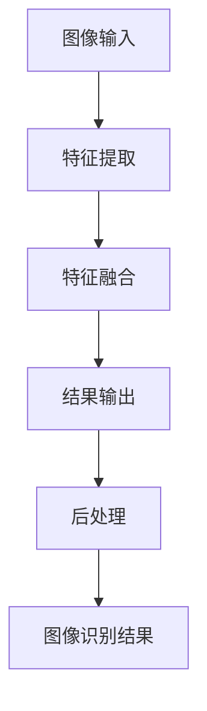

# Midjourney在图像识别中的应用实例

## 1. 背景介绍
### 1.1 图像识别的发展历程
#### 1.1.1 早期的图像识别技术
#### 1.1.2 深度学习时代的图像识别
#### 1.1.3 图像识别的应用领域

### 1.2 Midjourney的诞生
#### 1.2.1 Midjourney的起源与发展
#### 1.2.2 Midjourney的特点与优势
#### 1.2.3 Midjourney在图像识别领域的地位

## 2. 核心概念与联系
### 2.1 图像识别的基本概念
#### 2.1.1 图像分类
#### 2.1.2 目标检测
#### 2.1.3 语义分割

### 2.2 Midjourney的核心技术
#### 2.2.1 Transformer架构
#### 2.2.2 自监督学习
#### 2.2.3 多模态融合

### 2.3 Midjourney与图像识别的联系
#### 2.3.1 Midjourney在图像分类中的应用
#### 2.3.2 Midjourney在目标检测中的应用 
#### 2.3.3 Midjourney在语义分割中的应用

## 3. 核心算法原理具体操作步骤
### 3.1 Midjourney的训练过程
#### 3.1.1 数据准备与预处理
#### 3.1.2 模型架构设计
#### 3.1.3 损失函数与优化策略

### 3.2 Midjourney的推理过程
#### 3.2.1 特征提取
#### 3.2.2 特征融合
#### 3.2.3 结果输出与后处理

### 3.3 Midjourney的微调与迁移学习
#### 3.3.1 微调的必要性
#### 3.3.2 微调的具体步骤
#### 3.3.3 迁移学习的应用场景

## 4. 数学模型和公式详细讲解举例说明
### 4.1 Transformer的数学原理
#### 4.1.1 自注意力机制
#### 4.1.2 多头注意力
#### 4.1.3 位置编码

### 4.2 自监督学习的数学原理 
#### 4.2.1 对比学习
#### 4.2.2 掩码语言模型
#### 4.2.3 生成式对抗网络

### 4.3 多模态融合的数学原理
#### 4.3.1 早期融合
#### 4.3.2 晚期融合
#### 4.3.3 中间融合

## 5. 项目实践：代码实例和详细解释说明
### 5.1 基于Midjourney的图像分类实例
#### 5.1.1 数据集准备
#### 5.1.2 模型训练
#### 5.1.3 模型评估与优化

### 5.2 基于Midjourney的目标检测实例
#### 5.2.1 数据集准备
#### 5.2.2 模型训练
#### 5.2.3 模型评估与优化

### 5.3 基于Midjourney的语义分割实例
#### 5.3.1 数据集准备  
#### 5.3.2 模型训练
#### 5.3.3 模型评估与优化

## 6. 实际应用场景
### 6.1 智慧城市
#### 6.1.1 交通监控
#### 6.1.2 安防监控
#### 6.1.3 环境监测

### 6.2 医疗健康
#### 6.2.1 医学影像分析
#### 6.2.2 辅助诊断
#### 6.2.3 药物研发

### 6.3 工业制造
#### 6.3.1 工业视觉检测
#### 6.3.2 缺陷检测
#### 6.3.3 质量控制

## 7. 工具和资源推荐
### 7.1 开源框架
#### 7.1.1 PyTorch
#### 7.1.2 TensorFlow
#### 7.1.3 Keras

### 7.2 预训练模型
#### 7.2.1 Midjourney系列模型
#### 7.2.2 CLIP系列模型
#### 7.2.3 DALL-E系列模型

### 7.3 数据集资源
#### 7.3.1 ImageNet
#### 7.3.2 COCO
#### 7.3.3 Pascal VOC

## 8. 总结：未来发展趋势与挑战
### 8.1 图像识别的发展趋势
#### 8.1.1 多模态融合
#### 8.1.2 小样本学习
#### 8.1.3 可解释性与可信性

### 8.2 Midjourney的未来发展
#### 8.2.1 模型架构的优化
#### 8.2.2 训练策略的改进
#### 8.2.3 应用场景的拓展

### 8.3 图像识别领域面临的挑战
#### 8.3.1 数据质量与标注成本
#### 8.3.2 模型的鲁棒性与泛化能力
#### 8.3.3 隐私与安全问题

## 9. 附录：常见问题与解答
### 9.1 Midjourney与其他图像识别模型的区别
### 9.2 如何选择合适的Midjourney模型进行图像识别任务
### 9.3 Midjourney在图像识别领域的局限性
### 9.4 如何提高Midjourney在特定场景下的图像识别性能
### 9.5 Midjourney在图像识别领域的未来研究方向

Midjourney是近年来在图像识别领域崭露头角的一个强大工具。它采用了Transformer架构,通过自监督学习和多模态融合等技术,在图像分类、目标检测和语义分割等任务上取得了出色的表现。

Midjourney的核心在于其独特的训练过程。首先,它会对大量的图像数据进行预处理,然后设计出合适的模型架构,并使用精心设计的损失函数和优化策略对模型进行训练。在推理阶段,Midjourney会提取图像的特征,并将这些特征进行融合,最终输出图像识别的结果。

为了更好地理解Midjourney的工作原理,我们需要深入探讨其背后的数学模型和公式。Transformer的自注意力机制和多头注意力是其中的关键,它们能够有效地捕捉图像中的全局依赖关系。此外,自监督学习中的对比学习、掩码语言模型和生成式对抗网络等技术也为Midjourney的训练提供了有力支持。多模态融合则允许Midjourney同时处理图像和文本等不同类型的数据,提高了模型的泛化能力。

在实际项目中应用Midjourney时,我们需要准备好合适的数据集,并根据具体的任务选择适当的模型架构和训练策略。通过不断的实验和优化,我们可以得到性能优异的图像识别模型。Midjourney在智慧城市、医疗健康、工业制造等领域都有广泛的应用前景。

未来,图像识别技术将向着多模态融合、小样本学习、可解释性与可信性等方向发展。而Midjourney也将通过模型架构的优化、训练策略的改进和应用场景的拓展等措施,不断提升其在图像识别领域的表现。同时,我们也要警惕图像识别所面临的数据质量、模型鲁棒性和隐私安全等挑战,为这一领域的健康发展贡献自己的力量。

作者：禅与计算机程序设计艺术 / Zen and the Art of Computer Programming