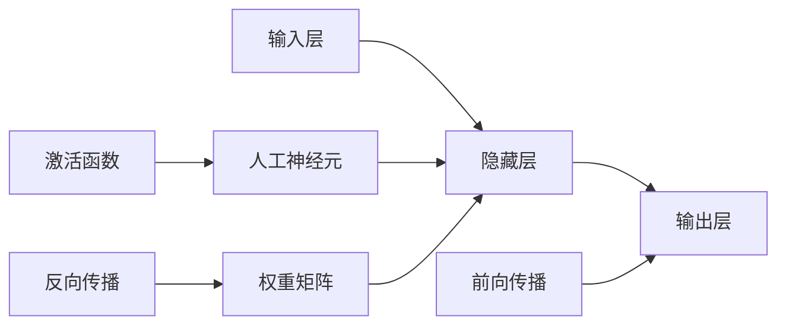

# Neural Networks 原理与代码实战案例讲解

## 1. 背景介绍
### 1.1 人工智能与机器学习
人工智能(Artificial Intelligence, AI)是计算机科学的一个分支,旨在创造能够模拟人类智能的机器。机器学习(Machine Learning, ML)则是实现人工智能的一种方法,通过算法和统计模型,使计算机能够在没有明确编程的情况下学习和改进。

### 1.2 深度学习的崛起
深度学习(Deep Learning, DL)是机器学习的一个子集,它模仿人脑的结构和功能,使用多层神经网络(Neural Networks)来学习和表示数据。近年来,随着计算能力的提升和大数据的普及,深度学习取得了突破性进展,在计算机视觉、语音识别、自然语言处理等领域达到甚至超越人类的水平。

### 1.3 神经网络的重要性
神经网络是深度学习的核心,它以类似人脑神经元连接的方式,通过调整网络中的权重和偏置,不断学习和优化,从而对输入数据进行特征提取、模式识别和决策预测。掌握神经网络的原理和实现,是进入深度学习领域的基础和关键。

## 2. 核心概念与联系
### 2.1 人工神经元
人工神经元(Artificial Neuron)是神经网络的基本单元,类似于生物神经元,接收一组输入信号,通过加权求和和激活函数处理后输出结果。一个典型的人工神经元由输入、权重、偏置、求和器和激活函数组成。

### 2.2 激活函数
激活函数(Activation Function)用于引入非线性变换,使神经网络能够逼近任意复杂的函数。常见的激活函数包括Sigmoid、Tanh、ReLU、Leaky ReLU等。选择合适的激活函数对网络性能有重要影响。

### 2.3 网络结构
神经网络由输入层、隐藏层和输出层组成。每层包含多个神经元,层与层之间通过权重矩阵全连接。网络的深度(即隐藏层数)和宽度(即每层神经元数)决定了模型的表达能力和学习难度。

### 2.4 前向传播与反向传播
前向传播(Forward Propagation)是将输入数据经过网络逐层计算,得到输出结果的过程。反向传播(Back Propagation)则是计算损失函数对各参数的梯度,并用梯度下降法更新权重和偏置,实现参数学习优化的过程。

下图展示了神经网络核心概念之间的关系:

## 3. 核心算法原理具体操作步骤
### 3.1 网络初始化
1. 确定网络结构,包括输入、隐藏和输出层的神经元个数
2. 随机初始化各层权重矩阵和偏置向量,一般使用较小的随机值
3. 选择合适的激活函数和损失函数

### 3.2 前向传播
1. 输入数据经过输入层,与第一个隐藏层的权重矩阵相乘,加上偏置
2. 对上一步结果应用激活函数,得到该隐藏层的输出
3. 重复步骤1-2,逐层前向传播,直到输出层,得到网络的预测输出

### 3.3 损失计算
1. 将网络预测输出与真实标签进行比较
2. 使用预定义的损失函数(如均方误差、交叉熵)计算预测值与真实值的差异
3. 损失函数的结果反映了网络在当前参数下的性能

### 3.4 反向传播
1. 计算损失函数对输出层每个神经元的偏导数
2. 利用链式法则,逐层反向传播梯度,计算损失函数对隐藏层和输入层神经元的偏导数
3. 根据偏导数和学习率,使用梯度下降法更新各层权重和偏置

### 3.5 迭代优化
1. 重复步骤3.2-3.4,对训练数据进行多轮迭代(Epoch)
2. 每轮迭代后评估模型在验证集上的性能,根据需要调整超参数
3. 达到预设的迭代次数或性能指标后,停止训练,得到最终模型

## 4. 数学模型和公式详细讲解举例说明
### 4.1 前向传播公式
对于一个L层的神经网络,前向传播过程可表示为:

$$
\begin{aligned}
\mathbf{z}^{[1]} &= \mathbf{W}^{[1]}\mathbf{x} + \mathbf{b}^{[1]} \\
\mathbf{a}^{[1]} &= g^{[1]}(\mathbf{z}^{[1]}) \\
\mathbf{z}^{[2]} &= \mathbf{W}^{[2]}\mathbf{a}^{[1]} + \mathbf{b}^{[2]} \\
\mathbf{a}^{[2]} &= g^{[2]}(\mathbf{z}^{[2]}) \\
&\vdots \\
\mathbf{z}^{[L]} &= \mathbf{W}^{[L]}\mathbf{a}^{[L-1]} + \mathbf{b}^{[L]} \\
\hat{\mathbf{y}} &= g^{[L]}(\mathbf{z}^{[L]})
\end{aligned}
$$

其中,$\mathbf{x}$为输入向量,$\mathbf{W}^{[l]}$和$\mathbf{b}^{[l]}$分别为第$l$层的权重矩阵和偏置向量,$g^{[l]}$为第$l$层的激活函数,$\hat{\mathbf{y}}$为网络的预测输出。

举例说明,假设有一个3层网络,输入维度为4,隐藏层维度为3,输出维度为2。给定输入$\mathbf{x} = [1, 2, 3, 4]^T$,权重矩阵和偏置向量如下:

$$
\mathbf{W}^{[1]} = 
\begin{bmatrix}
1 & 2 & 3 & 4\\
5 & 6 & 7 & 8\\
9 & 10 & 11 & 12
\end{bmatrix},
\mathbf{b}^{[1]} = 
\begin{bmatrix}
1\\
2\\ 
3
\end{bmatrix}
$$

$$
\mathbf{W}^{[2]} =
\begin{bmatrix}
13 & 14 & 15\\
16 & 17 & 18
\end{bmatrix},
\mathbf{b}^{[2]} = 
\begin{bmatrix}
4\\
5
\end{bmatrix}
$$

激活函数选择ReLU,即$g(z) = max(0, z)$。则前向传播过程为:

$$
\mathbf{z}^{[1]} = 
\begin{bmatrix}
1 & 2 & 3 & 4\\
5 & 6 & 7 & 8\\
9 & 10 & 11 & 12
\end{bmatrix}
\begin{bmatrix}
1\\
2\\
3\\
4
\end{bmatrix} + 
\begin{bmatrix}
1\\
2\\
3
\end{bmatrix} =
\begin{bmatrix}
31\\
70\\
109
\end{bmatrix}
$$

$$
\mathbf{a}^{[1]} = 
\begin{bmatrix}
31\\
70\\
109
\end{bmatrix}
$$

$$
\mathbf{z}^{[2]} = 
\begin{bmatrix}
13 & 14 & 15\\
16 & 17 & 18
\end{bmatrix}
\begin{bmatrix}
31\\
70\\
109
\end{bmatrix} + 
\begin{bmatrix}
4\\
5
\end{bmatrix} =
\begin{bmatrix}
2428\\
2975
\end{bmatrix}
$$

$$
\hat{\mathbf{y}} = 
\begin{bmatrix}
2428\\
2975
\end{bmatrix}
$$

### 4.2 反向传播公式
反向传播旨在计算损失函数$J$对每一层权重和偏置的偏导数$\frac{\partial J}{\partial \mathbf{W}^{[l]}}$和$\frac{\partial J}{\partial \mathbf{b}^{[l]}}$,公式如下:

$$
\begin{aligned}
\frac{\partial J}{\partial \mathbf{z}^{[L]}} &= \frac{\partial J}{\partial \hat{\mathbf{y}}} \odot g'^{[L]}(\mathbf{z}^{[L]}) \\
\frac{\partial J}{\partial \mathbf{W}^{[L]}} &= \frac{\partial J}{\partial \mathbf{z}^{[L]}} \mathbf{a}^{[L-1]T} \\
\frac{\partial J}{\partial \mathbf{b}^{[L]}} &= \frac{\partial J}{\partial \mathbf{z}^{[L]}} \\
\frac{\partial J}{\partial \mathbf{a}^{[L-1]}} &= \mathbf{W}^{[L]T} \frac{\partial J}{\partial \mathbf{z}^{[L]}}
\end{aligned}
$$

其中,$\odot$表示Hadamard乘积(即逐元素相乘),$g'^{[l]}$为第$l$层激活函数的导数。

对于第$l$层($l<L$),有:

$$
\begin{aligned}
\frac{\partial J}{\partial \mathbf{z}^{[l]}} &= \frac{\partial J}{\partial \mathbf{a}^{[l]}} \odot g'^{[l]}(\mathbf{z}^{[l]}) \\
\frac{\partial J}{\partial \mathbf{W}^{[l]}} &= \frac{\partial J}{\partial \mathbf{z}^{[l]}} \mathbf{a}^{[l-1]T} \\
\frac{\partial J}{\partial \mathbf{b}^{[l]}} &= \frac{\partial J}{\partial \mathbf{z}^{[l]}} \\
\frac{\partial J}{\partial \mathbf{a}^{[l-1]}} &= \