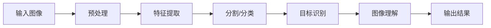

# OpenCV 原理与代码实战案例讲解

## 1. 背景介绍
### 1.1 OpenCV的起源与发展
OpenCV(Open Source Computer Vision Library)是一个开源的计算机视觉库,由Intel公司发起并参与开发,以BSD许可证授权发行,可以在商业和研究领域中免费使用。OpenCV诞生于1999年,经过20多年的发展,已经成为计算机视觉领域事实上的标准库。

### 1.2 OpenCV的应用领域
OpenCV在图像处理、模式识别、机器人视觉、智能监控等众多领域有广泛应用,是计算机视觉研究和应用的必备工具。一些知名项目如谷歌无人驾驶汽车、微软Kinect体感游戏机等都大量使用了OpenCV库。

### 1.3 OpenCV的优势
- 开源免费,代码质量高,文档齐全
- 跨平台,支持Windows、Linux、Mac OS、Android、iOS等
- 高效优化,充分利用多核CPU和GPU加速
- 功能丰富,包含500多个计算机视觉算法
- 社区活跃,资源丰富

## 2. 核心概念与联系
### 2.1 图像表示
- 像素:图像的基本组成单位,每个像素由一个或多个数值表示其颜色/灰度
- 颜色空间:描述像素颜色编码的数学模型,常见的有RGB、HSV、Lab等
- 位深度:像素取值范围,如8bit、16bit等

### 2.2 图像的数字化
将连续的模拟图像通过采样和量化转换为离散的数字图像。
- 采样:将图像分割成像素矩阵
- 量化:将像素的颜色/灰度值映射到有限的离散值

### 2.3 图像处理的基本步骤


## 3. 核心算法原理具体操作步骤
### 3.1 图像滤波
#### 3.1.1 均值滤波
用像素邻域内像素的平均值替代原像素值,去除高频噪声。
1. 设置滤波窗口大小(奇数)
2. 以像素为中心,提取邻域内所有像素
3. 计算邻域内所有像素的平均值
4. 用平均值替换中心像素值
5. 滑动窗口,重复2-4直到处理完所有像素

#### 3.1.2 高斯滤波
用高斯加权平均值替代原像素值,平滑图像并保留更多边缘信息。
1. 根据窗口大小和标准差生成高斯核
2. 以像素为中心,提取邻域内所有像素
3. 像素值乘以对应高斯核系数再求和
4. 用加权和替换中心像素值 
5. 滑动窗口,重复2-4直到处理完所有像素

#### 3.1.3 中值滤波
用像素邻域内像素的中值替代原像素值,去除椒盐噪声。
1. 设置滤波窗口大小(奇数)
2. 以像素为中心,提取邻域内所有像素
3. 对邻域内像素值排序
4. 选择排序后的中间值
5. 用中值替换中心像素值
6. 滑动窗口,重复2-5直到处理完所有像素

### 3.2 边缘检测
#### 3.2.1 Sobel算子
基于一阶导数,分别检测水平和垂直方向边缘。
1. 分别构造水平和垂直方向的Sobel算子
$$
G_x = \begin{bmatrix} 
-1 & 0 & +1 \\
-2 & 0 & +2 \\
-1 & 0 & +1
\end{bmatrix} \quad
G_y = \begin{bmatrix}
-1 & -2 & -1 \\
0 & 0 & 0 \\
+1 & +2 & +1
\end{bmatrix}
$$
2. 图像分别与两个算子卷积,得到水平和垂直梯度图像
3. 根据梯度幅值和方向计算边缘强度和方向
$$
G = \sqrt{G_x^2 + G_y^2} \quad
\theta = \arctan(\frac{G_y}{G_x})
$$
4. 对边缘图像进行阈值处理,得到二值边缘图像

#### 3.2.2 Canny算子
结合高斯滤波、非极大值抑制、双阈值检测和连通域分析,是最优边缘检测算法。
1. 高斯滤波平滑图像,抑制噪声
2. 计算梯度幅值和方向(类似Sobel)
3. 非极大值抑制,保留局部梯度最大的像素
4. 双阈值检测,划分强边缘和弱边缘
5. 连通域分析,连接断裂的边缘,抑制孤立的弱边缘,得到最终边缘

### 3.3 特征点检测
#### 3.3.1 Harris角点
基于局部窗口内像素灰度变化,检测图像中的角点。
1. 计算图像在水平和垂直方向的梯度 $I_x,I_y$
2. 计算每个像素的Harris响应值
$$
M = \begin{bmatrix}
\sum I_x^2 & \sum I_xI_y \\
\sum I_xI_y & \sum I_y^2
\end{bmatrix} \quad
R = det(M) - k(trace(M))^2
$$
其中 $k$ 为常数,一般取0.04-0.06
3. 对响应值图像进行非极大值抑制,得到局部极大值点即为角点

#### 3.3.2 SIFT特征
尺度不变特征变换(Scale-Invariant Feature Transform),提取图像的局部特征,对尺度、旋转等变化保持不变性。
1. 尺度空间极值检测:在多个尺度下用高斯差分金字塔(DoG)检测极值点
2. 关键点定位:去除低对比度和边缘响应点,精确定位关键点
3. 方向赋值:基于关键点邻域梯度直方图统计主方向
4. 关键点描述子:在关键点尺度和主方向下,统计邻域梯度直方图,生成128维特征向量

## 4. 数学模型和公式详细讲解举例说明
### 4.1 高斯滤波
高斯滤波是一种常用的图像平滑方法,用高斯核对图像卷积,去除高频噪声。二维高斯函数:
$$
G(x,y) = \frac{1}{2\pi\sigma^2}e^{-\frac{x^2+y^2}{2\sigma^2}}
$$
其中$(x,y)$为像素坐标,$\sigma$为标准差,控制高斯核的宽度。

例如,对于3x3的高斯核,取$\sigma=1$,可得:
$$
K = \frac{1}{16}\begin{bmatrix}
1 & 2 & 1 \\
2 & 4 & 2 \\
1 & 2 & 1
\end{bmatrix}
$$
对图像 $I$ 与高斯核 $K$ 卷积:
$$
I'(x,y) = \sum_{i=-1}^1\sum_{j=-1}^1 I(x+i,y+j)K(i,j)
$$
可得平滑后的图像 $I'$。

### 4.2 Canny边缘检测
Canny边缘检测是一种多阶段优化的边缘检测算法,具体步骤:
1. 高斯滤波:用高斯核平滑图像,抑制噪声
2. 计算梯度:用Sobel等算子计算像素水平和垂直梯度$G_x,G_y$,并计算梯度幅值和方向
$$
G(x,y) = \sqrt{G_x^2(x,y) + G_y^2(x,y)} \\
\theta(x,y) = \arctan(\frac{G_y(x,y)}{G_x(x,y)})
$$
3. 非极大值抑制:在梯度方向上比较相邻像素,保留局部梯度最大值,抑制非边缘像素
4. 双阈值检测:设置高低两个阈值$T_H$和$T_L$,大于$T_H$为强边缘,小于$T_L$舍弃,介于两者之间若与强边缘连通则保留
5. 连通域分析:跟踪边缘连通域,抑制孤立的弱边缘段,得到最终边缘

例如,对于梯度幅值阈值可取:
$$
T_H = \overline{G} + k\sigma_G \\
T_L = \overline{G} - k\sigma_G
$$
其中$\overline{G}$和$\sigma_G$分别为梯度幅值均值和标准差,$k$为常数,可调节以平衡检测率和误检率。

## 5. 项目实践：代码实例和详细解释说明
下面以Python和OpenCV实现几个核心算法为例。
### 5.1 图像滤波
```python
import cv2
import numpy as np

# 读取图像
img = cv2.imread('lena.jpg', 0)

# 均值滤波
img_mean = cv2.blur(img, (5,5))

# 高斯滤波 
img_gaussian = cv2.GaussianBlur(img, (5,5), 0)

# 中值滤波
img_median = cv2.medianBlur(img, 5)

# 显示结果
cv2.imshow('Original', img)
cv2.imshow('Mean Filter', img_mean) 
cv2.imshow('Gaussian Filter', img_gaussian)
cv2.imshow('Median Filter', img_median)
cv2.waitKey(0)
cv2.destroyAllWindows()
```
说明:
- `cv2.blur()`实现均值滤波,参数为图像和核大小
- `cv2.GaussianBlur()`实现高斯滤波,参数为图像、核大小和标准差(0表示根据核大小自动计算)
- `cv2.medianBlur()`实现中值滤波,参数为图像和核大小

### 5.2 边缘检测
```python
import cv2
import numpy as np

# 读取图像
img = cv2.imread('lena.jpg', 0)

# Sobel边缘检测
img_sobel_x = cv2.Sobel(img, cv2.CV_64F, 1, 0, ksize=3)
img_sobel_y = cv2.Sobel(img, cv2.CV_64F, 0, 1, ksize=3)
img_sobel = cv2.addWeighted(img_sobel_x, 0.5, img_sobel_y, 0.5, 0)

# Canny边缘检测
img_canny = cv2.Canny(img, 100, 200)

# 显示结果
cv2.imshow('Original', img)
cv2.imshow('Sobel Edge', img_sobel)
cv2.imshow('Canny Edge', img_canny)
cv2.waitKey(0)
cv2.destroyAllWindows()
```
说明:
- `cv2.Sobel()`实现Sobel边缘检测,参数为图像、数据类型、x和y方向阶数、核大小
- `cv2.addWeighted()`用于融合x和y方向的边缘图像
- `cv2.Canny()`实现Canny边缘检测,参数为图像和高低阈值

### 5.3 特征点检测
```python
import cv2
import numpy as np 

# 读取图像
img = cv2.imread('building.jpg') 
gray = cv2.cvtColor(img, cv2.COLOR_BGR2GRAY)

# Harris角点检测
harris = cv2.cornerHarris(gray, 2, 3, 0.04)
img[harris>0.01*harris.max()] = [0,0,255]

# SIFT特征提取
sift = cv2.SIFT_create()
keypoints, descriptor = sift.detectAndCompute(gray, None)
img_sift = cv2.drawKeypoints(img, keypoints, None)

# 显示结果  
cv2.imshow('Original', img)
cv2.imshow('Harris Corner', img)  
cv2.imshow('SIFT Feature', img_sift)
cv2.waitKey(0)
cv2.destroyAllWindows()
```
说明:
- `cv2.cornerHarris()`实现Harris角点检测,参数为图像、邻域大小、Sobel算子孔径和响应函数系数
- `cv2.SIFT_create()`创建SIFT对象
- `sift.detectAndCompute()`检测关键点并计算描述子
- `cv2.drawKeypoints()`在图像上绘制关键点

## 6. 实际应用场景
OpenCV在很多领域有广泛应用,举几个典型例子:
- 人脸识别:用Haar特征或HOG特征+级联分类器检测人脸,再用特征脸(PCA)或局部二值模式(LBP)识