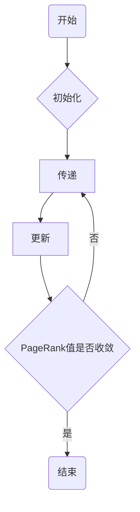

## 1.背景介绍
PageRank是Google的创始人拉里·佩奇和谢尔盖·布林在斯坦福大学时发明的一种网页排名算法。这个算法是Google搜索引擎背后的核心技术之一，也是Google能在众多搜索引擎中脱颖而出的重要原因。PageRank算法的基本思想是通过网页之间的超链接来确定网页的重要性。即一个网页的重要性可以由指向它的其他网页的重要性来决定。

## 2.核心概念与联系
PageRank的核心概念是“链接投票”：一个网页链接到另一个网页，就相当于前者对后者投了一票。投票的权重由投票网页的重要性决定，重要性高的网页的投票权重大。

## 3.核心算法原理具体操作步骤
PageRank算法的基本步骤如下：

1. 初始化：给网络中的每个页面一个初始的等价的PageRank值。
2. 传递：每个页面将其PageRank值平均分配给它的出链页面。
3. 更新：每个页面更新其PageRank值，为所有入链页面传递过来的值之和。
4. 迭代：反复执行传递和更新步骤，直到每个页面的PageRank值收敛为一个稳定值。



## 4.数学模型和公式详细讲解举例说明
PageRank的数学模型可以用马尔可夫链来描述。每个网页被视为马尔可夫链的一个状态，从一个网页跳转到另一个网页的概率即为状态转移概率。

假设网络中有N个网页，标记为P1, P2, ..., PN。Pi页面的PageRank值记为PR(Pi)，Pi页面的出链数记为L(Pi)。则PageRank的计算公式如下：

$$ PR(Pi) = (1-d) + d * \sum_{Pj \in M(Pi)} \frac{PR(Pj)}{L(Pj)} $$

其中，d是阻尼因子，通常设置为0.85；M(Pi)是所有链接到Pi页面的集合。

## 5.项目实践：代码实例和详细解释说明
下面以Python代码为例，实现PageRank算法。

```python
import numpy as np

def pagerank(M, num_iterations=100, d=0.85):
    N = M.shape[1]
    v = np.random.rand(N, 1)
    v = v / np.linalg.norm(v, 1)
    M_hat = (d * M + (1 - d) / N)
    for i in range(num_iterations):
        v = M_hat @ v
    return v
```

这段代码中，M是网页链接矩阵，v是初始的PageRank值向量，M_hat是计算PageRank值的转移矩阵。代码中使用了@操作符进行矩阵乘法。

## 6.实际应用场景
PageRank算法最初是用于网页排名的，但其实它可以应用于任何需要对对象进行重要性排序的场景。例如，社交网络中的影响力排序，论文引用网络中的影响力排序，商品推荐等。

## 7.工具和资源推荐
实现PageRank算法主要需要理解矩阵运算和马尔可夫链理论，推荐以下资源进行学习：

1. Gilbert Strang的线性代数课程：这是一门非常经典的线性代数课程，对理解PageRank中的矩阵运算非常有帮助。
2. 统计学习方法：这本书中有关于马尔可夫链的章节，可以帮助理解PageRank的数学模型。

## 8.总结：未来发展趋势与挑战
PageRank是一个经典的排序算法，但是它也有一些局限性。例如，它不能处理新出现的页面，因为新页面没有任何入链，其PageRank值会很低。此外，PageRank值的计算需要全网的数据，这在大规模的网络中是不现实的。

未来，我们需要更加智能和实时的排序算法，这可能需要结合机器学习等技术来实现。

## 9.附录：常见问题与解答
Q: PageRank值的计算需要多久？
A: 这取决于网络的大小和计算资源。对于大规模的网络，可能需要几天甚至更长时间。

Q: PageRank算法能否被操纵？
A: 理论上是可以的，通过增加假的链接可以提高一个页面的PageRank值。但是，搜索引擎通常会采取一些措施来防止这种操纵。

作者：禅与计算机程序设计艺术 / Zen and the Art of Computer Programming