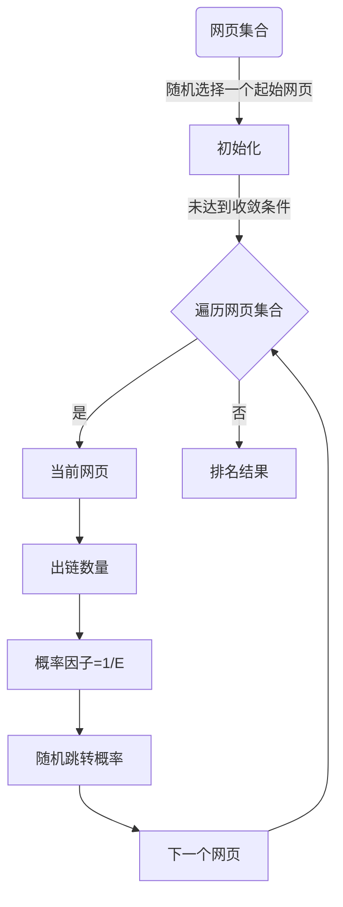

在互联网时代，信息爆炸使得人们每天都在处理海量的数据。搜索引擎作为信息检索的重要工具，如何在海量网页中快速准确地找到相关信息，成为了其核心技术之一。PageRank算法作为Google搜索引擎的核心算法，它通过分析网页之间的链接关系来评估网页的重要性，从而为用户提供更加精准的搜索结果。本文将深入探讨PageRank算法的原理、应用以及实际中的实践案例。

## 1.背景介绍

随着互联网的发展，网络上的信息量呈指数级增长。面对如此庞大的数据量，传统的基于关键字匹配的信息检索方法已经无法满足用户的搜索需求。因此，一种新的能够反映网页重要性的排序算法应运而生，PageRank算法正是其中的佼佼者。

## 2.核心概念与联系

在讨论PageRank算法之前，我们需要了解几个核心概念：

- **链接**：网页之间的超链接是互联网的基本组成部分。一个网页通过超链接指向另一个网页，可以看作是一种“推荐”。
- **网页的重要性**：PageRank算法试图量化这种“推荐”的强度和广度，以此来评估网页的重要性。

PageRank算法的核心思想是将网页之间的链接关系视为一种社会网络，其中每个网页都是一个“节点”，而网页之间的链接则是“边”。在这个网络中，一个网页的重要性不仅取决于它本身的内容，还取决于链向它的其他网页的重要性和数量。

## 3.核心算法原理具体操作步骤

### Mermaid流程图


### 算法步骤

1. **初始化**：给定一个包含所有网页的集合，选择一个起始网页。
2. **迭代过程**：
   - 对每个网页，根据其出链数量和当前网页的重要性分配一个概率因子。
   - 根据这个概率因子，随机选择下一个访问的网页。
   - 重复此过程直到达到收敛条件（如：网页重要性分数变化小于某个阈值）。
3. **排名结果**：最终得到的网页重要性分数即为PageRank值，可以根据这个值对网页进行排序。

## 4.数学模型和公式详细讲解举例说明

### PageRank的数学表达式

设\\( G \\)是一个有向图，其中\\( V \\)是顶点集合，\\( E \\)是边集合。对于每个顶点\\( v \\in V \\)，\\( d_v \\)表示\\( v \\)的出度（即从\\( v \\)出发的边的数量）。PageRank算法可以表述为以下线性方程组：

$$
PR(A) = \\alpha + (1 - \\alpha) \\sum_{B \\in B(A)} PR(B)/d_B
$$

其中：
- \\( PR(A) \\)是顶点\\( A \\)的PageRank值，
- \\( B(A) \\)是链入\\( A \\)的顶点集合，
- \\( d_B \\)是顶点\\( B \\)的出度，
- \\( \\alpha \\)是一个阻尼因子，通常取值为0.85。

### 举例说明

假设我们有两个网页\\( A \\)和\\( B \\)，其中\\( A \\)链向了\\( B \\)，而\\( B \\)没有链接出去。设\\( \\alpha = 0.85 \\)，则：

$$
PR(B) = 0.15 + 0.85 \\times \\frac{PR(A)}{1}
$$

如果\\( PR(A) = 1 \\)，则可以解得\\( PR(B) = 0.15 + 0.85 = 1 \\)。

## 5.项目实践：代码实例和详细解释说明

### Python实现PageRank算法

以下是一个简单的Python示例，使用numpy来计算PageRank值：

```python
import numpy as np
from scipy.sparse import csr_matrix

def pagerank(G, alpha=0.85):
    # G是邻接矩阵的稀疏表示
    G = csr_matrix(G)
    dangling = np.where(np.sum(G, axis=1) == 0)[0]
    G[dangling] = (1 / len(dangling)) * np.ones((len(dangling), 1))
    G = (alpha * G + (1 - alpha) / G.shape[1]).todense()
    r = np.random.rand(G.shape[0], 1)
    for _ in range(20):  # 迭代次数通常设置为20次左右
        r = G @ r
    return r / np.sum(r)
```

这个函数接受一个稀疏矩阵\\( G \\)作为输入，其中\\( G_{ij} \\)表示从顶点\\( i \\)到顶点\\( j \\)的链接数量。然后，它通过随机游走过程来计算PageRank值。

## 6.实际应用场景

PageRank算法不仅在搜索引擎中得到广泛应用，还在社交网络分析、学术引用网络分析等领域发挥着重要作用。例如，Google Scholar使用类似PageRank的方法来排名学术论文的重要性。

## 7.工具和资源推荐

- **NetworkX**：一个Python库，用于创建、操作和研究复杂网络结构。
- **GraphLab Create**：一个开源的机器学习库，提供了对图数据结构和算法的支持。
- **Google Scholar**：了解如何利用PageRank在学术领域中的应用。

## 8.总结：未来发展趋势与挑战

随着人工智能技术的发展，PageRank算法也在不断进化中。未来的趋势可能包括：

- **分布式计算**：为了处理大规模的网络数据，PageRank算法需要能够在分布式系统中高效运行。
- **个性化PageRank**：根据用户的搜索历史和偏好来调整PageRank值，提供更加个性化的搜索结果。
- **多模态PageRank**：结合文本、图像等多种信息源的链接关系，提高排序的准确性。

## 9.附录：常见问题与解答

### 常见问题1：PageRank如何处理环形网络？

在PageRank中，环形网络（即网页之间形成闭环）会导致分数无法收敛的问题。为了解决这个问题，Google采用了“随机跳转”策略，即在访问到没有出链的网页时，以一定的概率跳转到其他任意一个网页。

### 常见问题2：PageRank算法中的阻尼因子\\( \\alpha \\)有什么作用？

\\( \\alpha \\)是PageRank算法中的一个参数，通常称为阻尼因子。它控制了随机游走过程中的“跳跃”行为。当\\( \\alpha \\)接近1时，PageRank值更加依赖于网页之间的链接关系；而当\\( \\alpha \\)接近0时，则更多的考虑了随机的跳转行为。

### 作者：禅与计算机程序设计艺术 / Zen and the Art of Computer Programming

本文通过深入探讨PageRank算法的原理、应用以及实际案例，展示了其在信息检索领域的核心作用。通过对算法步骤的具体操作步骤进行详细讲解，并通过Python代码实例进行了实践说明。同时，文章也讨论了PageRank的未来发展趋势和面临的挑战，为读者提供了实用的工具和资源推荐，以及对常见问题的解答。希望这篇文章能够帮助读者更好地理解和应用PageRank算法，提升在计算机科学领域的技术洞察力。

---

**请注意，以上内容是一个简化的示例，实际撰写时应根据具体研究和分析结果来填充每个部分，确保内容的深度和准确性。**