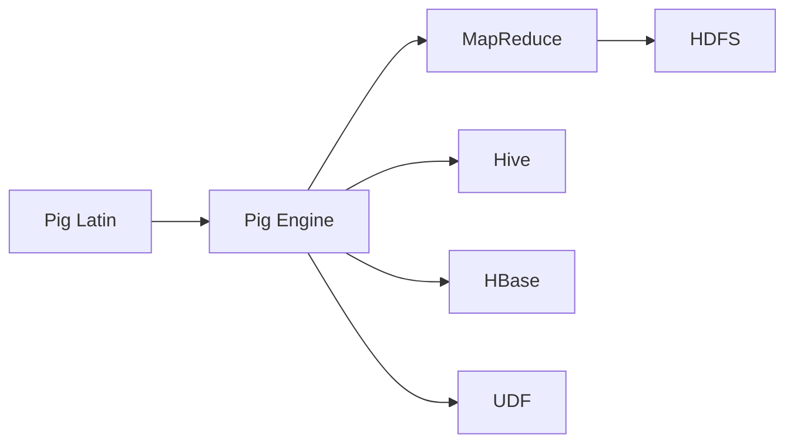

# Pig原理与代码实例讲解

## 1.背景介绍

### 1.1 大数据处理的挑战
在当今大数据时代,企业和组织面临着海量数据的处理和分析挑战。传统的数据处理方式已经无法满足快速增长的数据量和复杂的计算需求。

### 1.2 Hadoop生态系统
Hadoop作为一个开源的分布式计算平台,为大规模数据处理提供了可靠的解决方案。Hadoop生态系统包含多个组件,如HDFS、MapReduce、Hive等,用于存储、处理和分析大数据。

### 1.3 Pig的诞生
Pig是Hadoop生态系统中一个重要的组件,它提供了一种高层次的数据流语言Pig Latin,使得开发人员能够更方便地编写复杂的MapReduce任务,大大简化了大数据处理的开发过程。

## 2.核心概念与联系

### 2.1 Pig Latin语言
Pig Latin是Pig的核心,它是一种类似SQL的高级数据流语言。Pig Latin提供了丰富的数据转换操作,如LOAD、FILTER、GROUP、JOIN等,开发人员可以使用这些操作来描述数据处理流程。

### 2.2 Pig引擎
Pig引擎负责将Pig Latin脚本转换为一系列MapReduce任务,并在Hadoop集群上执行这些任务。Pig引擎会对脚本进行解析、优化,生成最终的MapReduce执行计划。

### 2.3 与Hadoop的关系
Pig基于Hadoop平台构建,充分利用了Hadoop的分布式计算能力。Pig脚本最终会被转换为MapReduce任务在Hadoop集群上运行,处理结果也会存储在HDFS上。

### 2.4 Pig与其他Hadoop组件的关系
Pig可以与Hadoop生态系统中的其他组件协同工作。例如,Pig可以读取Hive表中的数据,也可以将处理结果写入HBase。Pig还支持UDF(用户自定义函数),允许开发人员扩展Pig的功能。

下面是Pig核心概念与Hadoop生态系统的关系图:


## 3.核心算法原理具体操作步骤

### 3.1 数据加载
Pig使用LOAD操作从HDFS或其他数据源加载数据。LOAD操作支持多种数据格式,如文本文件、SequenceFile、Avro等。

```sql
-- 从HDFS加载文本文件
data = LOAD '/path/to/input' USING PigStorage(',') AS (col1:int, col2:chararray, col3:double);
```

### 3.2 数据过滤
FILTER操作用于根据指定条件过滤数据,只保留满足条件的记录。

```sql
-- 过滤出col1大于10的记录
filtered_data = FILTER data BY col1 > 10;
```

### 3.3 数据分组
GROUP操作根据指定的字段对数据进行分组,生成一个包含分组字段和对应数据的数据包。

```sql
-- 按照col2分组
grouped_data = GROUP data BY col2;
```

### 3.4 数据聚合
使用FOREACH和聚合函数(如COUNT、SUM、AVG等)对分组后的数据进行聚合计算。

```sql
-- 计算每个分组的记录数
agg_data = FOREACH grouped_data GENERATE group AS col2, COUNT(data) AS count;
```

### 3.5 数据连接
JOIN操作用于将两个或多个数据集按照指定字段进行连接,生成一个包含连接字段和对应数据的新数据集。

```sql
-- 将data1和data2按照col1进行内连接
joined_data = JOIN data1 BY col1, data2 BY col1;
```

### 3.6 数据排序
ORDER BY操作对数据集按照指定字段进行排序。

```sql
-- 按照col1升序排序
sorted_data = ORDER data BY col1 ASC;
```

### 3.7 数据存储 
STORE操作将处理后的数据存储到HDFS或其他存储系统中。

```sql
-- 将结果存储到HDFS
STORE result INTO '/path/to/output' USING PigStorage(',