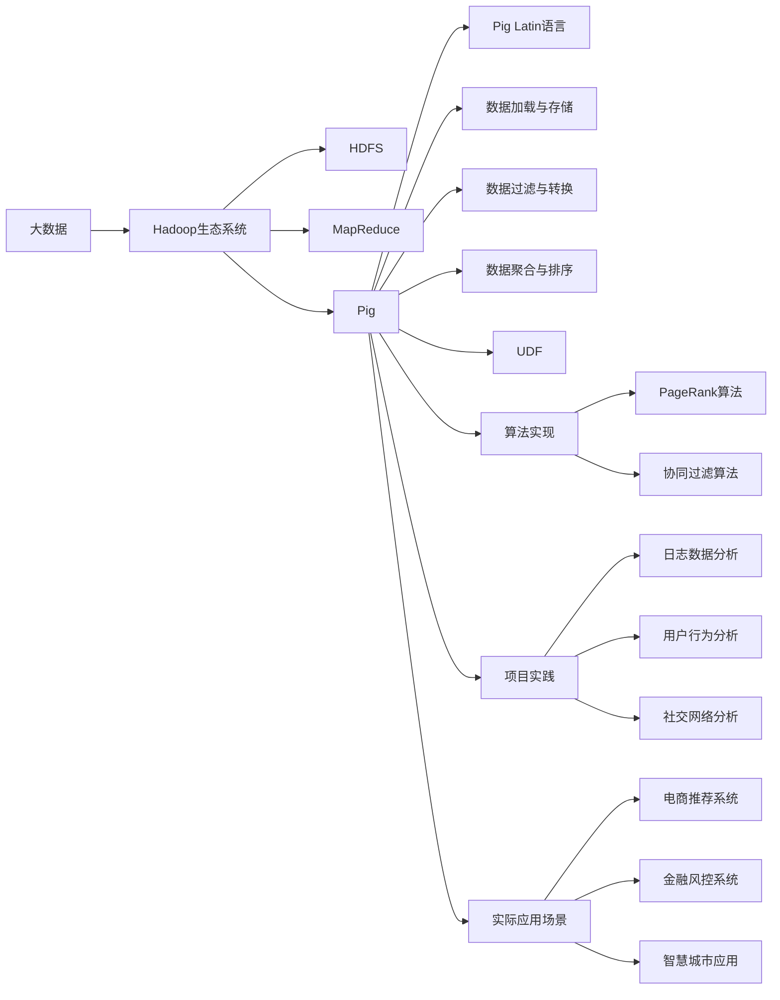

# Pig未来发展趋势：大数据时代的Pig

## 1. 背景介绍
### 1.1 大数据时代的挑战
#### 1.1.1 数据量呈爆炸式增长
#### 1.1.2 数据类型日益多样化
#### 1.1.3 数据处理需求不断提升

### 1.2 Hadoop生态系统
#### 1.2.1 Hadoop的发展历程
#### 1.2.2 Hadoop生态系统概览
#### 1.2.3 Pig在Hadoop生态系统中的地位

### 1.3 Pig的诞生与发展
#### 1.3.1 Pig的起源
#### 1.3.2 Pig的发展历程
#### 1.3.3 Pig的主要特点与优势

## 2. 核心概念与联系
### 2.1 Pig Latin语言
#### 2.1.1 Pig Latin语言简介
#### 2.1.2 Pig Latin语言的数据类型
#### 2.1.3 Pig Latin语言的基本操作

### 2.2 Pig的数据模型
#### 2.2.1 Pig的数据模型概述
#### 2.2.2 Bag、Tuple和Field
#### 2.2.3 Schema的定义与使用

### 2.3 Pig的执行模式
#### 2.3.1 本地模式与MapReduce模式
#### 2.3.2 Tez执行引擎
#### 2.3.3 Spark执行引擎

## 3. 核心算法原理与具体操作步骤
### 3.1 数据加载与存储
#### 3.1.1 从HDFS加载数据
#### 3.1.2 从HBase加载数据
#### 3.1.3 数据存储到HDFS与HBase

### 3.2 数据过滤与转换
#### 3.2.1 FILTER操作
#### 3.2.2 FOREACH操作
#### 3.2.3 GROUP操作
#### 3.2.4 JOIN操作

### 3.3 数据聚合与排序
#### 3.3.1 COUNT操作
#### 3.3.2 SUM操作
#### 3.3.3 AVG操作
#### 3.3.4 ORDER BY操作

### 3.4 用户自定义函数（UDF）
#### 3.4.1 UDF简介
#### 3.4.2 定义与注册UDF
#### 3.4.3 UDF的使用示例

## 4. 数学模型和公式详细讲解举例说明
### 4.1 PageRank算法
#### 4.1.1 PageRank算法原理
#### 4.1.2 PageRank算法数学模型
#### 4.1.3 基于Pig的PageRank算法实现

### 4.2 协同过滤算法
#### 4.2.1 协同过滤算法原理
#### 4.2.2 基于用户的协同过滤
#### 4.2.3 基于物品的协同过滤
#### 4.2.4 基于Pig的协同过滤算法实现

## 5. 项目实践：代码实例和详细解释说明
### 5.1 日志数据分析
#### 5.1.1 日志数据处理流程
#### 5.1.2 日志数据加载与清洗
#### 5.1.3 用户访问统计分析
#### 5.1.4 热门页面统计分析

### 5.2 用户行为分析
#### 5.2.1 用户行为数据处理流程
#### 5.2.2 用户行为数据加载与预处理
#### 5.2.3 用户行为模式挖掘
#### 5.2.4 用户画像构建

### 5.3 社交网络分析
#### 5.3.1 社交网络数据处理流程
#### 5.3.2 社交网络数据加载与转换
#### 5.3.3 社区发现算法实现
#### 5.3.4 影响力分析与传播预测

## 6. 实际应用场景
### 6.1 电商推荐系统
#### 6.1.1 电商推荐系统架构
#### 6.1.2 用户行为数据采集与处理
#### 6.1.3 商品相似度计算
#### 6.1.4 个性化推荐结果生成

### 6.2 金融风控系统
#### 6.2.1 金融风控系统架构
#### 6.2.2 交易数据采集与处理
#### 6.2.3 用户风险画像构建
#### 6.2.4 风险评估与预警

### 6.3 智慧城市应用
#### 6.3.1 智慧城市数据处理平台
#### 6.3.2 交通流量预测分析
#### 6.3.3 环境监测数据分析
#### 6.3.4 公共安全事件检测与预警

## 7. 工具和资源推荐
### 7.1 Pig开发工具
#### 7.1.1 Grunt Shell
#### 7.1.2 Pig View
#### 7.1.3 Ambari Pig View

### 7.2 Pig学习资源
#### 7.2.1 官方文档
#### 7.2.2 在线教程
#### 7.2.3 书籍推荐
#### 7.2.4 社区与论坛

## 8. 总结：未来发展趋势与挑战
### 8.1 Pig的发展趋势
#### 8.1.1 与新兴大数据技术的集成
#### 8.1.2 Pig Latin语言的增强
#### 8.1.3 性能优化与扩展性改进

### 8.2 Pig面临的挑战
#### 8.2.1 实时流处理的支持
#### 8.2.2 机器学习和深度学习的集成
#### 8.2.3 交互式查询的改进
#### 8.2.4 数据治理与安全

## 9. 附录：常见问题与解答
### 9.1 Pig与Hive的比较
### 9.2 Pig的性能调优技巧
### 9.3 Pig的常见错误与解决方法
### 9.4 Pig的版本选择与升级注意事项

Pig作为Hadoop生态系统中的重要组成部分，在大数据处理领域扮演着关键角色。Pig Latin作为Pig的核心，提供了一种高级的数据流语言，极大地简化了海量数据的分析与处理。通过Pig Latin强大的数据操作能力，开发者可以轻松实现数据加载、过滤、转换、聚合和排序等常见操作，并支持用户自定义函数（UDF）的扩展。

Pig不仅支持经典的数据挖掘算法，如PageRank和协同过滤，还能够与实际应用场景紧密结合，为电商推荐、金融风控和智慧城市等领域提供高效的大数据解决方案。随着Pig的不断发展与完善，它将与新兴大数据技术深度集成，在性能优化、扩展性改进等方面取得更大突破，同时也面临着实时流处理、机器学习集成等挑战。

未来，Pig必将在大数据时代扮演更加重要的角色，为海量数据的高效处理和价值挖掘提供强大的支撑。通过不断创新与发展，Pig将助力企业和组织从大数据中获取更多洞察，驱动业务增长与决策优化，推动大数据技术的普及与应用。

作者：禅与计算机程序设计艺术 / Zen and the Art of Computer Programming