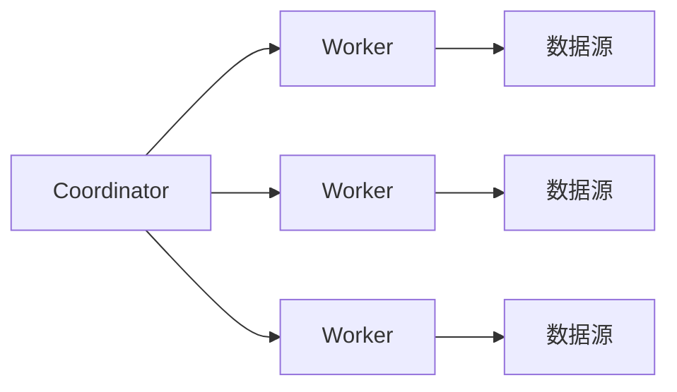
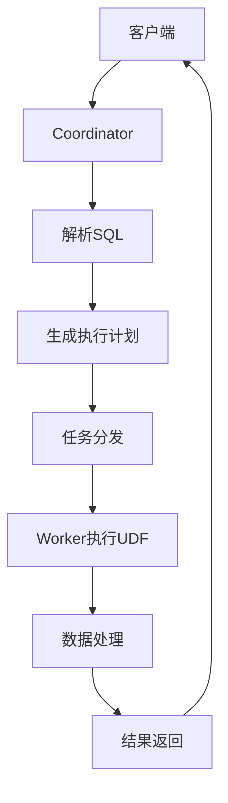

# PrestoUDF故障排除与恢复：快速解决问题

## 1.背景介绍

Presto是一种开源的大数据分析引擎,由Facebook开发和维护。它旨在快速高效地查询来自不同数据源的大型分布式数据集。Presto支持使用SQL语言进行查询,并支持用户定义函数(UDF)的扩展功能。

UDF(User Defined Function)允许用户使用Java编写自定义函数,以满足特定的业务需求。然而,在使用UDF时,可能会遇到各种故障和错误,导致查询失败或性能下降。及时发现和解决这些问题对于保证Presto集群的稳定运行至关重要。

## 2.核心概念与联系

### 2.1 Presto架构

Presto采用主从架构,由以下几个核心组件组成:



- **Coordinator**:接收客户端的查询请求,负责解析和优化查询计划,并将任务分发给Worker执行。
- **Worker**:执行Coordinator分发的任务,从数据源读取数据并进行计算。
- **数据源**:Presto可以连接多种数据源,如Hive、MySQL、Kafka等。

### 2.2 UDF执行流程

UDF在Presto中的执行流程如下:



1. 客户端向Coordinator发送SQL查询请求,其中包含UDF调用。
2. Coordinator解析SQL,识别UDF调用。
3. Coordinator生成查询执行计划,将UDF调用作为一个Task分发给Worker执行。
4. Worker加载UDF类,并执行UDF方法进行数据处理。
5. 处理后的数据返回给Coordinator,最终结果返回给客户端。

## 3.核心算法原理具体操作步骤  

### 3.1 UDF开发

要在Presto中使用UDF,需要先开发Java类实现自定义函数逻辑。UDF类必须实现`org.apache.presto.spi.function.ScalarFunction`接口,并使用`@ScalarFunction`注解声明函数签名。

以下是一个简单的UDF示例,实现字符串连接功能:

```java
@ScalarFunction("concat")
@Description("Concatenates given strings")
public class ConcatFunction {

    @TypeParameter("x")
    @TypeParameter("y")
    @SqlType("varchar(x,y)")
    public static Slice concat(
            @OperatorDependency(operator = OperatorType.CONCAT, argumentTypes = {"varchar(x)", "varchar(y)"}) MethodHandle methodHandle,
            @SqlType("varchar(x)") Slice left,
            @SqlType("varchar(y)") Slice right)
    {
        return SliceUtils.concat(left, right);
    }
}
```

### 3.2 UDF打包和部署

开发完UDF后,需要将其打包为JAR文件,并将JAR文件复制到Presto的插件目录中。Presto会自动加载该目录下的所有JAR文件。

假设我们将上面的`ConcatFunction`打包为`concat-function.jar`,则可以使用以下命令将其部署到Presto集群:

```bash
scp concat-function.jar presto-coordinator:/usr/lib/presto/plugin/
```

部署完成后,重启Presto集群使插件生效。

### 3.3 UDF使用

部署完成后,即可在SQL查询中调用自定义函数:

```sql
SELECT concat('Hello', ' World');
```

## 4.数学模型和公式详细讲解举例说明

在处理一些复杂的数据分析任务时,我们可能需要使用数学模型和公式。以下是一个使用UDF实现线性回归的示例:

给定一组数据点$(x_i, y_i)$,我们希望找到一条最佳拟合直线$y = mx + b$,使得所有数据点到直线的距离之和最小。这可以通过最小二乘法求解:

$$
\begin{align*}
\min_{m, b} \sum_{i=1}^{n} (y_i - mx_i - b)^2
\end{align*}
$$

对$m$和$b$求偏导数并令其等于0,可得到以下两个方程:

$$
\begin{align*}
\sum_{i=1}^{n} (y_i - mx_i - b)(-x_i) &= 0\\
\sum_{i=1}^{n} (y_i - mx_i - b) &= 0
\end{align*}
$$

联立这两个方程,可以解出$m$和$b$的值。

以下是一个实现线性回归的UDF示例:

```java
@ScalarFunction("linear_regression")
@Description("Performs linear regression on a set of points")
public class LinearRegressionFunction {

    @TypeParameter("x")
    @TypeParameter("y")
    @SqlType("row(double, double)")
    public static Pair<Double, Double> linearRegression(
            @OperatorDependency(operator = OperatorType.ADD, argumentTypes = {"array(x)", "array(y)"}) MethodHandle methodHandle,
            @SqlType("array(x)") Block xValues,
            @SqlType("array(y)") Block yValues)
    {
        // 计算 m 和 b 的值
        double sumX = 0, sumY = 0, sumXY = 0, sumXX = 0;
        int n = xValues.getPositionCount();
        for (int i = 0; i < n; i++) {
            double x = xValues.getDouble(i);
            double y = yValues.getDouble(i);
            sumX += x;
            sumY += y;
            sumXY += x * y;
            sumXX += x * x;
        }

        double m = (n * sumXY - sumX * sumY) / (n * sumXX - sumX * sumX);
        double b = (sumY - m * sumX) / n;

        return new ImmutablePair<>(m, b);
    }
}
```

在这个例子中,我们定义了一个`linear_regression`函数,接受两个数组参数`xValues`和`yValues`,分别表示数据点的$x$和$y$坐标。函数返回一个包含$m$和$b$值的行,表示最佳拟合直线的斜率和截距。

使用该UDF,我们可以在SQL中进行线性回归分析:

```sql
SELECT linear_regression(array[1, 2, 3, 4, 5], array[2, 3, 4, 5, 6]);
```

## 5.项目实践:代码实例和详细解释说明

为了更好地理解UDF的使用,我们将通过一个实际项目案例来演示。假设我们需要开发一个UDF,用于计算两个地理坐标点之间的距离。

### 5.1 开发UDF

首先,我们需要定义UDF的函数签名和实现逻辑:

```java
@ScalarFunction("geo_distance")
@Description("Calculates the distance between two geographic coordinates")
public class GeoDistanceFunction {

    private static final double EARTH_RADIUS = 6371.0; // 地球半径(km)

    @TypeParameter("x")
    @TypeParameter("y")
    @SqlType("double")
    public static double geoDistance(
            @SqlType("varchar(x)") Slice lat1,
            @SqlType("varchar(x)") Slice lon1,
            @SqlType("varchar(y)") Slice lat2,
            @SqlType("varchar(y)") Slice lon2)
    {
        double lat1Rad = Math.toRadians(parseCoordinate(lat1));
        double lon1Rad = Math.toRadians(parseCoordinate(lon1));
        double lat2Rad = Math.toRadians(parseCoordinate(lat2));
        double lon2Rad = Math.toRadians(parseCoordinate(lon2));

        double dLat = lat2Rad - lat1Rad;
        double dLon = lon2Rad - lon1Rad;

        double a = Math.pow(Math.sin(dLat / 2), 2) +
                   Math.cos(lat1Rad) * Math.cos(lat2Rad) *
                   Math.pow(Math.sin(dLon / 2), 2);

        double c = 2 * Math.atan2(Math.sqrt(a), Math.sqrt(1 - a));

        return EARTH_RADIUS * c;
    }

    private static double parseCoordinate(Slice value) {
        return Double.parseDouble(value.toStringUtf8());
    }
}
```

这个UDF实现了著名的"大圆航线"公式,用于计算两个地理坐标点之间的距离。它接受四个参数:起点纬度、起点经度、终点纬度和终点经度,并返回两点之间的距离(单位为千米)。

### 5.2 打包和部署

接下来,我们需要将UDF打包为JAR文件,并将其部署到Presto集群中。假设我们将上述代码打包为`geo-functions.jar`,则可以使用以下命令将其部署到Presto集群:

```bash
scp geo-functions.jar presto-coordinator:/usr/lib/presto/plugin/
```

部署完成后,重启Presto集群使插件生效。

### 5.3 使用UDF

现在,我们就可以在SQL查询中调用`geo_distance`函数了:

```sql
SELECT geo_distance('39.9042', '116.4074', '34.0522', '-118.2437') AS distance;
```

这个查询计算了北京(39.9042, 116.4074)和洛杉矶(34.0522, -118.2437)之间的距离,结果约为9600千米。

## 6.实际应用场景

UDF在实际应用中有着广泛的用途,可以满足各种定制化的数据处理需求。以下是一些常见的应用场景:

1. **数据清洗和转换**: 使用UDF可以实现各种数据清洗和转换操作,如字符串处理、日期格式转换、数据规范化等。

2. **复杂计算和建模**: 对于一些复杂的数学计算或统计建模任务,可以使用UDF来实现,如上文中的线性回归示例。

3. **地理空间分析**: 在处理地理空间数据时,可以使用UDF计算距离、面积、几何运算等。

4. **机器学习和人工智能**: UDF可以用于实现各种机器学习算法,如分类、聚类、推荐系统等。

5. **安全和加密**: 可以使用UDF实现各种安全和加密功能,如哈希计算、加密解密等。

6. **自定义业务逻辑**: 对于一些特定的业务需求,可以使用UDF来实现自定义的业务逻辑。

总的来说,UDF为Presto提供了强大的扩展能力,使其能够满足各种定制化的数据处理需求。

## 7.工具和资源推荐

在开发和使用Presto UDF时,以下工具和资源可能会对您有所帮助:

1. **Presto官方文档**: Presto官方文档(https://prestodb.io/docs/current/)提供了详细的概念介绍、安装指南、SQL语法参考等内容,是学习和使用Presto的重要资源。

2. **Presto GitHub仓库**: Presto的源代码托管在GitHub上(https://github.com/prestodb/presto),您可以查看源代码、提交issue或Pull Request。

3. **Presto UDF示例**: Presto官方提供了一些UDF示例代码(https://github.com/prestodb/presto/tree/master/presto-docs/src/main/sphinx/dev/functions.rst),可供参考和学习。

4. **IntelliJ IDEA**: IntelliJ IDEA是一款优秀的Java IDE,可以用于开发和调试Presto UDF。

5. **Maven**: Maven是一款流行的Java项目构建和依赖管理工具,可以方便地管理Presto UDF项目。

6. **Presto用户社区**: Presto拥有一个活跃的用户社区,您可以在Presto用户邮件列表(https://prestodb.io/community.html)上提问、讨论和分享经验。

7. **Presto相关书籍和教程**:网上有许多优秀的Presto相关书籍和教程,如《Presto: The Definitive Guide》、《Learning Presto SQL for Big Data Analytics》等,可以帮助您更好地学习和使用Presto。

利用这些工具和资源,您可以更高效地开发和使用Presto UDF,解决实际问题。

## 8.总结:未来发展趋势与挑战

Presto作为一款高性能的大数据分析引擎,在未来仍将拥有广阔的发展前景。随着大数据技术的不断演进,Presto也将面临一些新的挑战和机遇。

### 8.1 未来发展趋势

1. **云原生支持**: 随着云计算的普及,Presto将需要更好地支持云原生架构,如Kubernetes集成、自动扩缩容等功能。

2. **机器学习和人工智能集成**: 将机器学习和人工智能算法集成到Presto中,可以实现更智能的数据分析和决策支持。

3. **流式处理支持**: 除了批处理,