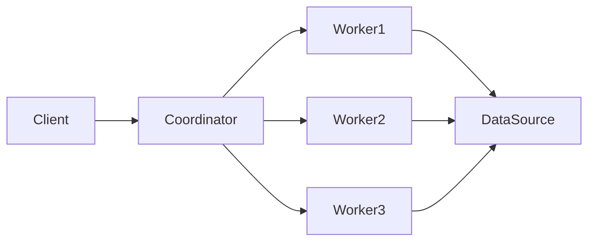

# Presto原理与代码实例讲解

## 1. 背景介绍
### 1.1 Presto的诞生背景
### 1.2 Presto的定位与特点
### 1.3 Presto在大数据领域的地位

## 2. 核心概念与联系
### 2.1 Presto的整体架构
#### 2.1.1 Coordinator
#### 2.1.2 Worker
#### 2.1.3 Connector  
### 2.2 Presto的查询处理流程
#### 2.2.1 查询解析
#### 2.2.2 查询优化 
#### 2.2.3 查询执行
### 2.3 Presto的数据模型
#### 2.3.1 Table
#### 2.3.2 Column
#### 2.3.3 Row
### 2.4 Presto与Hive、Spark SQL的比较

## 3. 核心算法原理具体操作步骤
### 3.1 查询计划生成算法
#### 3.1.1 逻辑计划生成
#### 3.1.2 物理计划生成
#### 3.1.3 代价估算
### 3.2 查询执行算法 
#### 3.2.1 Pipeline执行模型
#### 3.2.2 Driver与Operator
#### 3.2.3 数据交换与Shuffle
### 3.3 内存管理与溢出控制算法
#### 3.3.1 内存预算管理
#### 3.3.2 动态内存管理
#### 3.3.3 溢出到磁盘

## 4. 数学模型和公式详细讲解举例说明
### 4.1 代价估算模型
### 4.2 数据分布模型
### 4.3 Join基数估算模型
### 4.4 内存使用模型

## 5. 项目实践：代码实例和详细解释说明
### 5.1 编写Presto Connector
#### 5.1.1 定义Schema和Table
#### 5.1.2 实现Split生成逻辑
#### 5.1.3 实现数据读取逻辑
### 5.2 编写Presto UDF
#### 5.2.1 Scalar函数
#### 5.2.2 Aggregation函数
#### 5.2.3 Window函数
### 5.3 Presto查询优化实例
#### 5.3.1 大表Join小表
#### 5.3.2 分区裁剪
#### 5.3.3 谓词下推

## 6. 实际应用场景
### 6.1 Presto在数据仓库中的应用
### 6.2 Presto在数据分析中的应用
### 6.3 Presto在数据湖中的应用
### 6.4 Presto在Ad-hoc查询中的应用

## 7. 工具和资源推荐
### 7.1 Presto官方文档
### 7.2 Presto源码
### 7.3 Presto可视化工具
### 7.4 Presto性能调优工具

## 8. 总结：未来发展趋势与挑战
### 8.1 Presto的发展现状
### 8.2 Presto面临的机遇与挑战
### 8.3 Presto的未来发展方向

## 9. 附录：常见问题与解答
### 9.1 Presto与Hive读取同一张表数据不一致？
### 9.2 Presto查询速度慢的原因分析？ 
### 9.3 Presto的最佳实践有哪些？
### 9.4 如何对Presto进行性能调优？

Presto是Facebook开发的一个开源的分布式SQL查询引擎，主要用于交互式查询和海量数据分析。它能够连接多个数据源，如Hive、MySQL、Kafka等，提供统一的SQL查询接口，让用户以标准的SQL语法查询和分析不同数据源的数据。

Presto的诞生背景可以追溯到2012年。当时Facebook数据仓库中的数据量已达PB级别，Hive等传统的大数据查询引擎已经无法满足Facebook工程师对海量数据进行交互式查询分析的需求。为了解决这一问题，Facebook决定自主研发一款全新的大数据查询引擎，这就是Presto。

与传统的大数据查询引擎相比，Presto有几个鲜明的特点：

1. 低延迟：Presto针对交互式分析查询进行了优化，查询延迟可以控制在秒级，远低于Hive等批处理引擎。

2. 可扩展：Presto采用了类似于MPP数据库的架构设计，可以通过添加Worker节点的方式实现近乎线性的扩展。

3. 多数据源支持：Presto通过Connector机制可以访问多种外部数据源，包括Hive、RDBMS、Kafka、HDFS、S3等。

4. 标准SQL支持：Presto几乎完整实现了ANSI SQL 2003语法标准，用户可以使用标准SQL进行查询分析。

正是凭借这些独特的优势，Presto迅速成为了大数据领域炙手可热的明星项目。除了Facebook内部大规模使用外，Netflix、Airbnb、Pinterest等互联网公司也纷纷采用Presto来加速数据分析。在2019年发布的DB-Engines数据库流行度排行榜中，Presto赢得了"年度数据库"的称号。

接下来我们深入Presto的内部，看看它是如何实现如此优异的性能的。

Presto采用了典型的Master-Slave架构，由一个Coordinator节点和多个Worker节点组成。Coordinator负责接收客户端的查询请求，生成查询计划，协调和调度查询在多个Worker上并行执行。每个Worker负责实际执行查询计划中的任务，读取数据源中的数据并计算结果。所有Worker执行完毕后，由Coordinator收集结果并返回给客户端。



Presto将一个查询划分为多个Stage，每个Stage代表查询计划树中的一个子树。Stage之间通过Exchange节点连接，负责在不同的Worker之间交换数据。Stage内部是一个Pipeline，由一系列连接在一起的Operator组成。每个Operator代表计划树中的一个节点，负责执行某项具体的计算任务，如筛选、投影、聚合等。

当一个查询提交到Presto后，会经历解析、绑定、优化、执行等阶段：

1. 解析阶段：将SQL文本解析成抽象语法树AST。
2. 绑定阶段：将AST转换为语义分析后的查询计划树。此时的计划树是逻辑计划，节点是SQL中的逻辑算子。
3. 优化阶段：对逻辑计划进行等价变换、谓词下推、列裁剪等优化。还会对Join顺序、聚合策略等做优化决策。
4. 执行阶段：将优化后的逻辑计划转换成可以在分布式环境执行的物理计划，下发到Worker执行。

在执行阶段，Presto采用了Pipeline执行模型，可以实现流水线式的数据处理，减少不必要的中间结果存储，进而获得低延迟。一个Pipeline由多个Operator串联而成，每个Operator从上游获取数据，计算后输出给下游。相邻的Operator可以在同一个线程内顺序执行，也可以在不同的线程并行执行。

Join、Aggregation等Operator如果中间数据太多，可能会引起内存溢出。Presto采用了"一次一页"的模型来解决这个问题。即Operator一次处理一个固定大小的Page，当输出结果超过预设的内存阈值时，会将Page写入磁盘的溢出文件。等到所有输入数据都被消费后，再对溢出文件中的数据做merge处理。

为了提高内存利用率，Presto还实现了动态内存管理机制。即根据查询的并发度、数据分布特征等，动态调整每个查询的内存预算，在保证查询正常执行的前提下，最大化地利用集群内存资源。

除了内置的Hive Connector外，Presto还提供了SPI让用户可以编写自定义的Connector，连接到任意的外部数据源。编写一个Connector需要实现以下几个核心接口：

1. ConnectorFactory：创建Connector实例。
2. Connector：提供元数据、数据分片、数据读取等功能。需要实现getMetadata、getSplitManager、getPageSourceProvider等方法。
3. ConnectorMetadata：定义数据源的Schema、Table等元数据信息。
4. ConnectorSplitManager：负责将一个Table划分成多个Split。每个Split代表要读取的一部分数据。
5. ConnectorPageSource：负责从指定的Split中读取数据，组装成Presto的Page返回。

除了编写Connector，Presto还支持用户自定义函数UDF。Presto的UDF分为三类：Scalar Function、Aggregation Function和Window Function。其中Scalar UDF直接对输入的字段值做转换，Aggregation UDF用于做聚合计算，Window UDF用于做窗口计算。

举个Scalar UDF的例子，下面的代码定义了一个名为is_adult的UDF，用于判断一个人是否成年：

```java
public class IsAdultFunction extends SqlScalarFunction {
    public IsAdultFunction() {
        super("is_adult", StandardTypes.BOOLEAN, ImmutableList.of(StandardTypes.BIGINT));
    }

    @Override
    public OperatorType getOperatorType() {
        return OperatorType.CAST;
    }

    @Override
    public ScalarFunctionImplementation specialize(BoundVariables boundVariables, int arity, Metadata metadata) {
        return new ScalarFunctionImplementation(
                false,
                ImmutableList.of(valueTypeArguments(BIGINT)),
                MethodHandles.lookup().findStatic(IsAdultFunction.class, "isAdult", methodType(boolean.class, long.class)));
    }

    public static boolean isAdult(long age) {
        return age >= 18;
    }
}
```

定义好UDF后，部署到Presto的plugin目录下，就可以在SQL中使用了：

```sql
SELECT name, age, is_adult(age) FROM users;
```

Presto还提供了一些查询优化的最佳实践，如：

1. 大表Join小表时，确保大表在左侧。
2. 充分利用分区裁剪。如果数据有按时间或地区分区，查询时加上分区过滤条件，可以大大减少需要扫描的数据量。
3. 尽量将过滤条件下推到数据源。Presto的谓词下推能力有限，需要用户在SQL中显式地将过滤条件写在子查询中。

4. 选择合适的Join策略。尽量让大表做流式读，小表做Broadcast Join。

5. 避免不必要的列读取。查询时只选择需要的列，减少IO。

6. 避免频繁的小查询。Presto适合大查询，不适合高并发的点查。

7. 打开动态分区裁剪。对于Join查询，如果Join Key上有过滤条件，打开动态分区裁剪可以显著提升性能。

8. 关闭优化器的某些规则。如果优化器生成的执行计划不够理想，可以通过Session Property关闭掉某些优化规则。

总的来说，Presto是一个设计优雅、功能强大的大数据查询引擎。不过在实际应用中，还是需要根据数据特征和业务场景，对Presto进行适当的调优。比如选择合适的Worker数量和内存大小，设置恰当的查询并发度，以及对业务查询做SQL改写等。

展望未来，随着数据量的不断增长，对交互式查询和实时分析的需求会越来越强烈。Presto在这方面已经积累了丰富的优化经验，相信通过与社区的共同努力，Presto会变得越来越成熟和完善。

当然，Presto也面临着不少的挑战。比如对于实时数据流的分析支持还比较薄弱，对机器学习等高级分析的集成也有待加强。而且Presto作为一个中间层查询引擎，会给数据湖架构带来一定的复杂性。

总的来说，Presto经过多年的发展，已经在大数据交互式分析领域取得了令人瞩目的成绩。相信在不久的将来，Presto会成为大数据分析领域的标准工具和事实上的行业标准。

作者：禅与计算机程序设计艺术 / Zen and the Art of Computer Programming