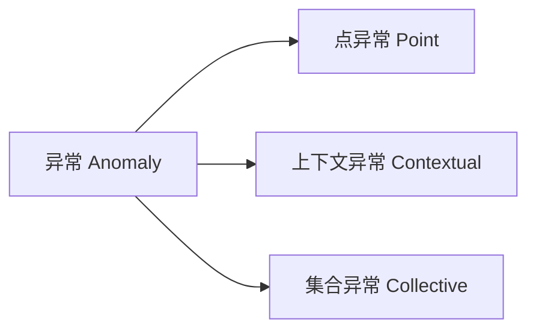
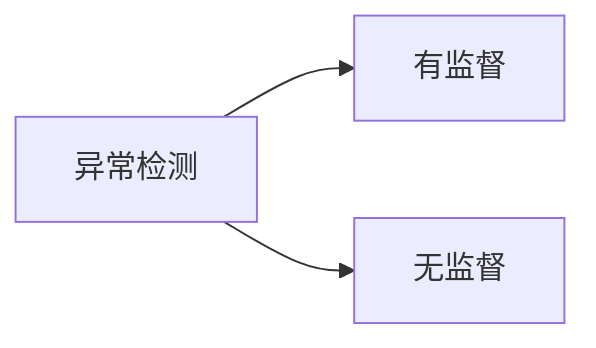
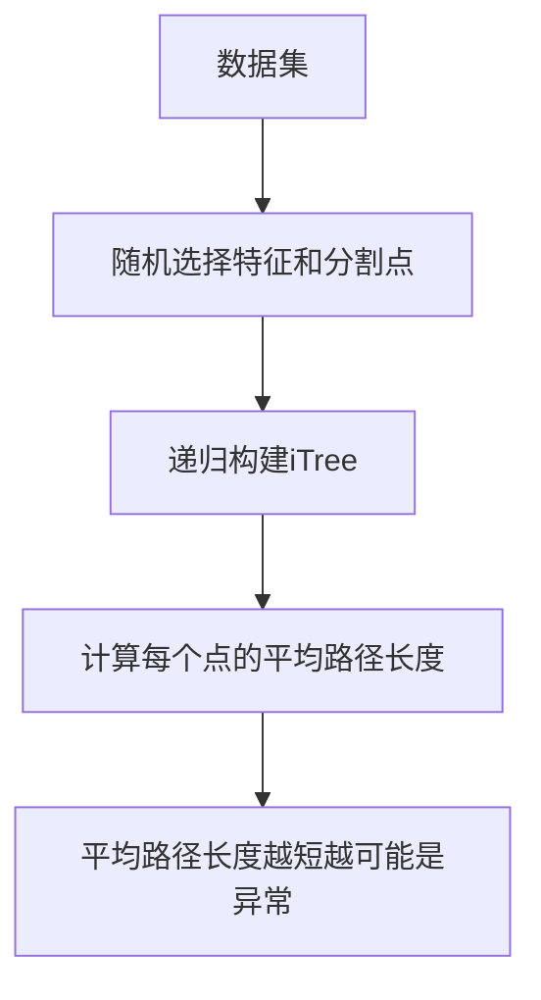

# Python机器学习实战：机器学习中的异常检测技术

## 1. 背景介绍

在当今数据驱动的世界中,异常检测在各个领域扮演着至关重要的角色。从金融欺诈检测到工业设备故障诊断,从网络安全入侵识别到医疗诊断异常发现,异常检测技术为我们提供了及时发现和处理异常情况的能力。

异常检测(Anomaly Detection),又称为离群点检测(Outlier Detection),是指识别数据集中与大多数数据点显著不同的少数数据点的过程。这些异常点通常表示数据中的异常、错误、欺诈或其他不寻常的行为。

### 1.1 异常检测的重要性

异常检测在实际应用中具有重要意义:

- 金融领域:异常检测可用于识别信用卡欺诈、洗钱等非法活动,保护客户资产安全。
- 工业领域:通过对设备运行数据进行异常检测,可及时发现设备故障,避免严重事故发生。
- 网络安全:异常检测技术可识别网络入侵、DDoS攻击等安全威胁,保障网络系统安全。  
- 医疗健康:异常检测可用于疾病诊断,通过分析患者各项指标数据,及早发现疾病征兆。

### 1.2 异常检测的挑战

尽管异常检测具有广泛的应用前景,但在实践中仍面临诸多挑战:

- 异常定义模糊:对于什么是"异常",不同场景下有不同定义,缺乏统一标准。
- 异常样本稀缺:异常情况在数据集中所占比例通常很小,样本不平衡问题突出。  
- 异常类型多样:异常情况千变万化,很难穷尽所有可能的异常类型。
- 噪声干扰严重:真实数据往往夹杂大量噪声,增加了异常检测的难度。

### 1.3 Python在异常检测中的优势  

Python凭借其简洁的语法、丰富的库生态,已成为机器学习领域事实上的标准语言。在异常检测任务中,Python生态圈提供了功能强大的工具库,极大地提高了开发效率。

- Scikit-learn:提供了多种异常检测算法的高效实现,API简洁易用。
- PyOD:专门用于异常检测的Python库,集成了20余种经典和前沿的异常检测算法。
- Tensorflow、PyTorch:深度学习框架,可用于构建复杂的异常检测模型。
- Pandas、Numpy:数据处理和科学计算基础库,是数据分析的利器。

## 2. 核心概念与联系

在深入探讨异常检测算法之前,我们有必要厘清几个核心概念,理解它们之间的联系。

### 2.1 异常 Anomaly

异常是指数据集中明显偏离大多数其他数据点的个别数据实例。根据异常出现的原因,可将其分为以下三类:

- 点异常(Point Anomaly):单个数据实例本身异常,与数据集中其他点显著不同。如机器振动数据中的瞬时峰值。  
- 上下文异常(Contextual Anomaly):数据实例在特定上下文中表现异常,而在其他上下文中可能是正常的。如夏季出现异常低温。
- 集合异常(Collective Anomaly):单个数据实例可能正常,但一组实例集合起来表现出异常性。如异常的股票交易行为序列。

### 2.2 异常检测 Anomaly Detection

异常检测是识别出数据集中异常数据点的过程。从问题定义的角度,可分为以下两类:

- 有监督异常检测:训练数据中同时包含正常样本和已标记的异常样本,异常检测问题转化为一个分类问题。
- 无监督异常检测:训练数据中只有正常样本,没有标记的异常样本。需要通过学习正常样本的特征,构建正常行为的Profile,再用它来识别未知的异常。

### 2.3 孤立森林 Isolation Forest

孤立森林(Isolation Forest,简称iForest)是一种基于树集成的无监督异常检测算法。它的核心思想是:异常点更容易被孤立出来,因为它们与大多数数据点有很大不同。

iForest通过随机选择特征和分割点,递归地构建多棵孤立树(iTree)。对于每个数据点,在iTree中能被孤立的平均路径长度越短,越有可能是异常点。这种算法思路巧妙地利用了异常点容易被孤立的特性。

### 2.4 局部异常因子 Local Outlier Factor

局部异常因子(Local Outlier Factor,简称LOF)是一种基于密度的无监督异常检测算法。它的核心思想是:异常点所在区域的密度显著低于其邻域的密度。

LOF算法计算每个数据点的局部可达密度(Local Reachability Density),即其k近邻点的平均可达距离的倒数。然后,用该点与其k近邻点的局部可达密度比值作为该点的异常因子。异常因子越大,越有可能是异常点。

## 3. 核心算法原理具体操作步骤

接下来,我们以孤立森林(iForest)和局部异常因子(LOF)为例,详细讲解其核心算法原理和具体操作步骤。

### 3.1 孤立森林 Isolation Forest

#### 3.1.1 算法原理

孤立森林的基本假设是:异常点更容易被孤立出来,因为它们与大多数数据点有很大不同。算法通过随机选择特征和分割点,递归地构建多棵孤立树(iTree)。对于每个数据点,在iTree中能被孤立的平均路径长度(Average Path Length)越短,越有可能是异常点。

iForest的异常因子定义为数据点x的平均路径长度E(h(x))与数据集平均路径长度c的比值:
$$s(x,n)=2^{-\frac{E(h(x))}{c(n)}}$$

其中,c(n)是数据集大小为n时的平均路径长度的理论值:
$$c(n)=2H(n-1)-(2(n-1)/n)$$
H(i)是调和数,可近似为ln(i)+0.5772156649。

#### 3.1.2 算法步骤

1. 从原始数据集中随机采样生成T个子采样集
2. 对每个子采样集,递归构建一棵iTree:
   - 如果当前节点样本数小于最小样本数,则停止递归,将该节点标记为叶子节点
   - 随机选择一个特征维度,以及在该维度上的一个分割点
   - 根据分割点将数据划分为左右子节点,递归构建左右子树
3. 对每个数据点x,在每棵iTree中遍历,计算其到达叶子节点的路径长度h(x)
4. 计算每个数据点在T棵iTree上的平均路径长度E(h(x))
5. 根据公式计算每个数据点的异常因子s(x,n),异常因子越接近1越可能是异常点

### 3.2 局部异常因子 Local Outlier Factor

#### 3.2.1 算法原理

LOF算法的核心思想是:异常点所在区域的密度显著低于其邻域的密度。它通过计算每个数据点与其k近邻点的局部可达密度比值,得到该点的异常因子。

对于数据点p,定义其k距离d_k(p)为p到其第k近邻点的距离。p的k距离邻域N_k(p)为与p的距离不大于d_k(p)的所有点的集合。

数据点p到q的可达距离定义为:
$$reach-dist_k(p,q)=max\{d_k(q),dist(p,q)\}$$
其中dist(p,q)为p到q的欧氏距离。

数据点p的局部可达密度定义为:
$$lrd_k(p)=1/(\frac{\sum_{q\in N_k(p)}reach-dist_k(p,q)}{|N_k(p)|})$$

数据点p的局部异常因子定义为:
$$LOF_k(p)=\frac{\sum_{q\in N_k(p)}\frac{lrd_k(q)}{lrd_k(p)}}{|N_k(p)|}$$

#### 3.2.2 算法步骤

1. 对每个数据点p,计算其到其他所有点的欧氏距离dist(p,q) 
2. 对每个数据点p,计算其第k近邻距离d_k(p)
3. 对每个数据点p,找出其k距离邻域N_k(p)
4. 对每个数据点p,计算其到k距离邻域内每个点q的可达距离reach-dist_k(p,q)
5. 对每个数据点p,计算其局部可达密度lrd_k(p)
6. 对每个数据点p,计算其局部异常因子LOF_k(p)
7. 根据LOF值大小判断异常点,LOF值越大,越有可能是异常点

## 4. 数学模型和公式详细讲解举例说明

为了加深对异常检测算法的理解,这里我们对孤立森林和LOF算法涉及的数学模型和公式进行详细讲解,并给出具体的计算示例。

### 4.1 孤立森林的数学模型与公式

#### 4.1.1 平均路径长度的理论值c(n)

在孤立森林算法中,平均路径长度的理论值c(n)用于归一化每个数据点的平均路径长度,以得到其异常因子。c(n)的计算公式为:
$$c(n)=2H(n-1)-(2(n-1)/n)$$
其中,H(i)是调和数,表示前i个自然数倒数的和,可近似为ln(i)+0.5772156649。

举例说明:假设数据集大小n=10,则
$$\begin{aligned}
c(10) &= 2H(9)-\frac{2(9)}{10}\\
&\approx 2(ln(9)+0.5772)-\frac{18}{10}\\
&\approx 2(2.1972+0.5772)-1.8\\
&\approx 3.7488
\end{aligned}$$

#### 4.1.2 异常因子s(x,n)

孤立森林定义每个数据点x的异常因子为:
$$s(x,n)=2^{-\frac{E(h(x))}{c(n)}}$$
其中,E(h(x))为x在所有iTree上的平均路径长度,c(n)为数据集大小为n时的平均路径长度理论值。

异常因子取值范围为(0,1],越接近1表示x越可能是异常点。直观地理解,如果一个点的平均路径长度E(h(x))远小于理论值c(n),则其异常因子会很接近1。

举例说明:假设数据集大小n=10,点x的平均路径长度E(h(x))=2.5,则x的异常因子为:
$$\begin{aligned}
s(x,10) &= 2^{-\frac{E(h(x))}{c(10)}}\\
&\approx 2^{-\frac{2.5}{3.7488}}\\
&\approx 0.63
\end{aligned}$$
可见x的异常程度较高。

### 4.2 LOF的数学模型与公式

#### 4.2.1 k距离d_k(p)与k距离邻域N_k(p)

LOF算法中,每个数据点p的k距离d_k(p)定义为p到其第k近邻点的距离。p的k距离邻域N_k(p)定义为与p的距离不大于d_k(p)的所有点的集合。即:
$$N_k(p)=\{q\in D | dist(p,q)\leq d_k(p)\}$$
其中D为整个数据集,dist(p,q)为p到q的欧氏距离。

举例说明:假设p的5个最近邻