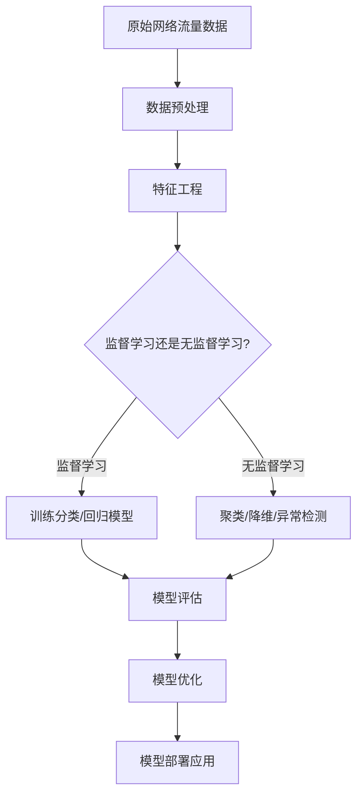

# Python机器学习实战：采用机器学习技术对网络流量进行分析

## 1.背景介绍

### 1.1 网络流量分析的重要性

在当今互联网时代,网络流量数据的快速增长已成为一个不争的事实。随着物联网、5G等新兴技术的发展,网络设备和连接数量不断增加,网络流量也呈现出爆炸式增长趋势。网络流量数据蕴含着大量有价值的信息,对其进行深入分析和挖掘,可以为网络运营商、安全机构和企业带来诸多好处。

### 1.2 网络流量分析面临的挑战

然而,由于网络流量数据量巨大、多变且复杂,传统的流量分析方法已难以满足现有需求。手工分析和基于规则的方法效率低下,且难以发现数据中隐藏的深层次模式和规律。因此,迫切需要借助先进的机器学习技术,来自动化地从海量网络流量数据中提取有价值的信息。

### 1.3 机器学习在网络流量分析中的应用前景

机器学习能够自动构建分析模型,从而高效地对网络流量数据进行处理和分析。通过机器学习算法,我们可以实现多种应用场景,如网络流量分类、异常检测、安全威胁识别、流量预测等。机器学习在网络流量分析领域具有广阔的应用前景。

## 2.核心概念与联系

在机器学习分析网络流量数据之前,我们需要了解以下几个关键概念:

### 2.1 网络流量数据

网络流量数据是指在网络中传输的数据包的统计信息,通常包括源IP、目的IP、源端口、目的端口、协议类型、数据包长度等特征。它是进行网络流量分析的基础数据源。

### 2.2 特征工程

特征工程是将原始网络流量数据转换为机器学习算法可以处理的特征向量的过程。良好的特征工程对于提高模型性能至关重要。常用的特征工程技术包括数据清洗、特征选择、特征提取等。

### 2.3 监督学习

监督学习是机器学习中一种常见的任务类型,其目标是基于已标记的训练数据构建模型,并对新的未标记数据进行预测或分类。在网络流量分析中,监督学习可用于流量分类、入侵检测等任务。

### 2.4 无监督学习 

无监督学习则不需要已标记的训练数据,其目标是从未标记的数据中发现潜在的模式和规律。在网络流量分析中,无监督学习可用于异常检测、流量聚类等任务。

### 2.5 深度学习

深度学习是机器学习的一个新兴热点领域,它通过构建深层神经网络模型来自动从数据中学习特征表示。近年来,深度学习在计算机视觉、自然语言处理等领域取得了巨大成功,在网络流量分析领域也展现出了优异的性能。

上述概念相互关联、环环相扣,共同构建了机器学习分析网络流量数据的理论基础和技术路线。

## 3.核心算法原理具体操作步骤

机器学习在网络流量分析中的应用通常遵循以下步骤:



### 3.1 数据预处理

对原始网络流量数据进行清洗、标准化、缺失值处理等预处理操作,以确保数据质量。

### 3.2 特征工程

根据分析目标,从原始数据中提取出对任务有意义的特征,并进行特征选择、特征提取等操作,构建特征向量。

### 3.3 模型训练

- 监督学习任务:基于标记的训练数据,使用算法如决策树、支持向量机、神经网络等训练分类或回归模型。
- 无监督学习任务:使用聚类、降维、异常检测等算法从未标记数据中发现潜在模式。

### 3.4 模型评估

使用测试数据对训练好的模型进行评估,计算性能指标如准确率、召回率、F1分数等。

### 3.5 模型优化

根据评估结果,通过调整算法参数、特征选择或模型集成等方式来优化模型性能。

### 3.6 模型部署

将优化后的模型部署到实际的网络环境中,对流量数据进行在线分析和预测。

该流程是一个循环迭代的过程,需要根据具体应用场景和数据特点进行调整和优化。接下来我们将详细介绍其中的数学模型和项目实践。

## 4.数学模型和公式详细讲解举例说明

机器学习算法通常基于数学模型和公式,让我们来看几个在网络流量分析中常用的模型。

### 4.1 决策树

决策树是一种常用的监督学习算法,可用于流量分类等任务。它通过构建决策树模型来对样本数据进行预测。

决策树的训练过程可以使用信息增益或基尼系数作为选择特征的标准,公式如下:

$$Gain(D,a) = Ent(D) - \sum_{v=1}^{V}\frac{|D^v|}{|D|}Ent(D^v)$$

$$Gini(D) = 1 - \sum_{i=1}^{m}p_i^2$$

其中 $D$ 表示数据集, $a$ 表示特征, $D^v$ 表示根据特征 $a$ 的取值 $v$ 分割得到的子集, $p_i$ 表示第 $i$ 类样本的概率。

在预测时,将测试样本根据决策树的路径进行分类。

### 4.2 支持向量机

支持向量机(SVM)是一种有监督学习模型,可用于流量异常检测等任务。它的基本思想是在高维空间中构建一个超平面,将不同类别的样本分隔开,同时使得两类样本到超平面的距离最大化。

对于线性可分的情况,SVM的目标函数为:

$$\underset{w,b}{min}\frac{1}{2}||w||^2$$
$$s.t. \quad y_i(w^Tx_i+b)\geq 1,i=1,2,...,n$$

其中 $w$ 为超平面的法向量, $b$ 为偏置, $x_i$ 为训练样本, $y_i$ 为样本标签。

对于非线性情况,可以引入核函数 $K(x_i,x_j)$ 将样本映射到高维特征空间。常用的核函数有线性核、多项式核、高斯核等。

### 4.3 K-Means聚类

K-Means是一种常用的无监督学习算法,可用于对网络流量进行聚类分析。它的目标是将 $n$ 个样本数据划分为 $k$ 个簇,使得簇内样本尽量紧密,簇间样本尽量疏松。

K-Means算法的目标函数为:

$$J = \sum_{i=1}^{k}\sum_{x\in C_i}||x-\mu_i||^2$$

其中 $k$ 为簇的个数, $C_i$ 为第 $i$ 个簇, $\mu_i$ 为第 $i$ 个簇的质心。算法通过迭代优化目标函数,最终得到 $k$ 个簇的划分。

上述仅为网络流量分析中几种常用模型的数学表达,在实际应用中还有诸如随机森林、神经网络等更加复杂的模型,感兴趣的读者可以进一步探索。

## 5.项目实践：代码实例和详细解释说明

为了更好地理解机器学习在网络流量分析中的应用,我们将通过一个实际项目案例来进行讲解。该项目的目标是基于网络流量数据,构建一个入侵检测系统(IDS)。

我们将使用Python中的机器学习库scikit-learn和流行的深度学习框架TensorFlow来实现该项目。完整代码可在GitHub上获取: https://github.com/zen-ml/network-traffic-ids

### 5.1 数据集介绍

我们使用的是来自于加拿大通信安全机构(CCCS)的网络入侵检测数据集CICIDS2017,该数据集包含了大量真实网络流量数据,其中包括良性数据和多种类型的网络攻击数据。

数据集中的每条流量记录包含78个特征,如源IP、目的IP、协议类型、数据包长度等。我们的目标是基于这些特征构建机器学习模型,对流量数据进行二元分类(良性或攻击)。

### 5.2 数据预处理

在进行模型训练之前,我们首先需要对原始数据进行预处理,包括数据清洗、标准化、编码等步骤。以下是使用Python的数据预处理代码示例:

```python
import pandas as pd
from sklearn.preprocessing import LabelEncoder, StandardScaler

# 加载数据集
data = pd.read_csv('cicids2017.csv')

# 删除缺失值记录
data = data.dropna()

# 对类别特征进行编码
label_encoder = LabelEncoder()
data['proto'] = label_encoder.fit_transform(data['proto'])

# 对数值特征进行标准化
numeric_cols = ['dur', 'sbytes', 'dbytes', ...]
scaler = StandardScaler()
data[numeric_cols] = scaler.fit_transform(data[numeric_cols])

# 将特征和标签分开
X = data.drop('label', axis=1)
y = data['label']
```

### 5.3 特征工程

接下来,我们需要从预处理后的数据中选择出对于入侵检测任务有意义的特征,并构建特征向量。这里我们使用基于树模型的特征重要性选择方法:

```python
from sklearn.ensemble import ExtraTreesClassifier

# 使用ExtraTrees估计特征重要性
model = ExtraTreesClassifier()
model.fit(X, y)
importances = model.feature_importances_

# 选择重要特征
indices = np.argsort(importances)[::-1]
num_features = 20
selected_features = indices[:num_features]
X_new = X.iloc[:, selected_features]
```

上述代码使用ExtraTreesClassifier模型估计每个特征对于分类任务的重要性,然后选择重要性最高的20个特征构建新的特征矩阵X_new。

### 5.4 模型训练与评估

有了特征向量后,我们就可以进行模型的训练和评估了。这里我们分别尝试使用传统的机器学习模型和深度学习模型。

#### 5.4.1 传统机器学习模型

我们使用随机森林作为传统机器学习模型,并使用10折交叉验证的方式评估模型性能:

```python
from sklearn.ensemble import RandomForestClassifier
from sklearn.model_selection import cross_val_score
from sklearn.metrics import accuracy_score, precision_score, recall_score, f1_score

# 定义随机森林模型
rf = RandomForestClassifier(n_estimators=100)

# 10折交叉验证
scores = cross_val_score(rf, X_new, y, cv=10, scoring='accuracy')
print('Random Forest Accuracy: %.3f +/- %.3f' % (np.mean(scores), np.std(scores)))

# 在测试集上评估
y_pred = rf.predict(X_test)
print('Accuracy: %.3f' % accuracy_score(y_test, y_pred))
print('Precision: %.3f' % precision_score(y_test, y_pred))
print('Recall: %.3f' % recall_score(y_test, y_pred))
print('F1-score: %.3f' % f1_score(y_test, y_pred))
```

#### 5.4.2 深度学习模型

我们使用TensorFlow构建一个多层感知机(MLP)模型,并使用早停法来防止过拟合:

```python
import tensorflow as tf

# 定义输入特征
X = tf.placeholder(tf.float32, [None, num_features])
y = tf.placeholder(tf.int32, [None])

# 定义MLP模型
W1 = tf.get_variable('W1', [num_features, 128], initializer=tf.contrib.layers.xavier_initializer())
b1 = tf.get_variable('b1', [128], initializer=tf.zeros_initializer())
h1 = tf.nn.relu(tf.matmul(X, W1) + b1)

W2 = tf.get_variable('W2', [128, 2], initializer=tf.contrib.layers.xavier_initializer())
b2