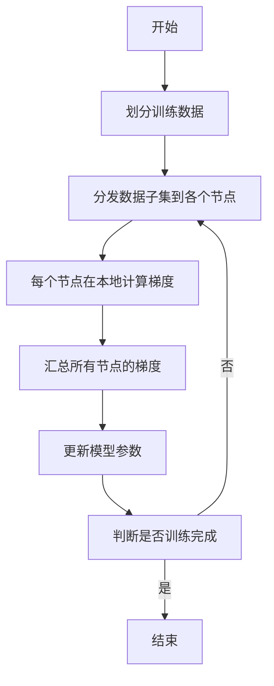
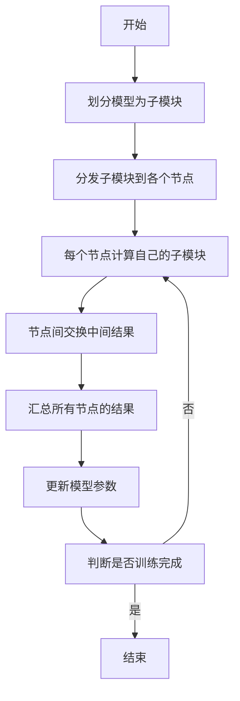
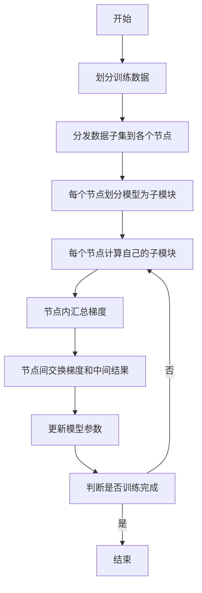
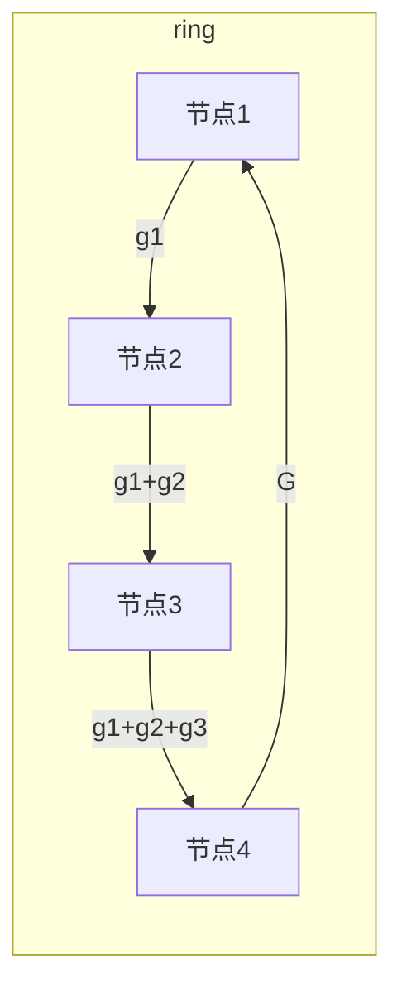
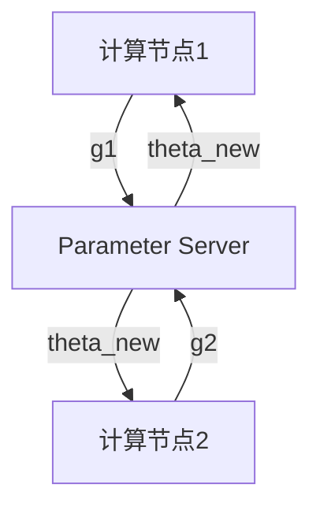

# Python深度学习实践：分布式训练大型模型的策略

## 1.背景介绍

随着深度学习模型变得越来越大和复杂，训练这些大型模型已经成为一个巨大的挑战。传统的单机训练方式已经无法满足计算资源的需求,因此分布式训练已经成为训练大型模型的必由之路。分布式训练可以通过将训练任务分散到多个计算节点上来加速训练过程,从而显著缩短训练时间。

在深度学习领域,PyTorch和TensorFlow等框架都提供了分布式训练的支持,使得在多个GPU或多台机器上并行训练模型成为可能。然而,实现高效的分布式训练并非一蹴而就,需要考虑诸多因素,如数据并行、模型并行、通信策略、负载均衡等。本文将探讨在Python生态系统中训练大型深度学习模型的分布式策略,包括数据并行、模型并行、混合并行等,并提供实践指南和最佳实践。

## 2.核心概念与联系

### 2.1 数据并行

数据并行是分布式训练中最常见的策略。在这种方法中,训练数据被划分为多个子集,每个计算节点处理一个子集。每个节点在本地计算梯度,然后将梯度值汇总到一个中央节点,该节点负责更新模型参数。这种方法的优点是实现相对简单,并且可以很好地扩展到大量计算节点。

但是,数据并行也存在一些挑战。首先,需要确保数据划分的均匀性,以避免计算负载不均衡。其次,梯度汇总过程可能会成为性能瓶颈,特别是在节点数量较多的情况下。为了解决这些问题,需要采用高效的通信策略和负载均衡技术。

### 2.2 模型并行

对于一些超大型模型,单个GPU的内存可能无法容纳整个模型。在这种情况下,可以采用模型并行的策略,将模型分割为多个子模块,每个子模块分配给一个计算节点。每个节点计算自己负责的子模块的前向和反向传播,并与其他节点交换必要的中间结果。

模型并行的实现比数据并行更加复杂,因为需要精心设计模型的划分方式,并确保不同节点之间的通信高效。此外,还需要考虑如何在不同节点之间平衡计算负载。但是,模型并行为训练超大型模型提供了可能,这在单机训练中是无法实现的。

### 2.3 混合并行

在实践中,数据并行和模型并行通常会结合使用,形成混合并行策略。这种策略可以充分利用多个GPU和多台机器的计算资源,实现最大程度的并行化。

例如,可以首先在每个机器上使用数据并行,将训练数据划分为多个子集,每个GPU处理一个子集。然后,在机器级别上采用模型并行,将模型划分为多个子模块,每台机器负责一个或多个子模块。这种混合并行策略可以最大限度地利用所有可用的计算资源,从而实现最佳的训练性能。

## 3.核心算法原理具体操作步骤

### 3.1 数据并行算法流程

数据并行的核心算法流程如下:

1. **划分训练数据**:将整个训练数据集划分为多个子集,子集的数量等于计算节点的数量。
2. **分发数据子集**:将每个数据子集分发到对应的计算节点。
3. **本地计算梯度**:每个节点使用本地数据子集计算模型参数的梯度。
4. **汇总梯度**:将所有节点计算得到的梯度值汇总到一个中央节点。
5. **更新模型参数**:中央节点使用汇总的梯度值更新模型参数。
6. **判断是否训练完成**:检查是否达到停止条件,如果没有,则返回步骤3,继续下一轮迭代。

在实现数据并行时,需要注意以下几个关键点:

- **数据划分**:确保数据划分的均匀性,避免计算负载不均衡。
- **通信策略**:采用高效的通信策略,如环形通信(ring all-reduce)或树形通信(tree all-reduce),以减少梯度汇总的开销。
- **负载均衡**:动态调整数据划分策略,以实现更好的负载均衡。

### 3.2 模型并行算法流程

模型并行的核心算法流程如下:

1. **划分模型**:将整个模型划分为多个子模块,子模块的数量等于计算节点的数量。
2. **分发子模块**:将每个子模块分发到对应的计算节点。
3. **计算子模块**:每个节点计算自己负责的子模块的前向和反向传播。
4. **交换中间结果**:节点之间交换必要的中间结果,以便计算其他子模块所需的输入。
5. **汇总结果**:将所有节点计算得到的结果汇总到一个中央节点。
6. **更新模型参数**:中央节点使用汇总的结果更新模型参数。
7. **判断是否训练完成**:检查是否达到停止条件,如果没有,则返回步骤3,继续下一轮迭代。

在实现模型并行时,需要注意以下几个关键点:

- **模型划分**:合理划分模型,确保计算负载均衡,并最小化节点间通信。
- **通信策略**:采用高效的通信策略,如环形通信或树形通信,以减少中间结果交换的开销。
- **内存优化**:采用内存优化技术,如重计算(re-computation)和激活重计算(activation re-computation),以减少内存占用。

### 3.3 混合并行算法流程

混合并行算法流程结合了数据并行和模型并行的特点,可以充分利用多个GPU和多台机器的计算资源。具体流程如下:

1. **划分训练数据**:将整个训练数据集划分为多个子集,子集的数量等于计算节点的数量。
2. **分发数据子集**:将每个数据子集分发到对应的计算节点。
3. **划分模型**:每个节点将模型划分为多个子模块,子模块的数量等于该节点上的GPU数量。
4. **计算子模块**:每个GPU计算自己负责的子模块的前向和反向传播。
5. **节点内汇总梯度**:每个节点内部汇总所有GPU计算得到的梯度。
6. **节点间交换**:节点之间交换梯度和必要的中间结果。
7. **更新模型参数**:使用汇总的梯度值更新模型参数。
8. **判断是否训练完成**:检查是否达到停止条件,如果没有,则返回步骤4,继续下一轮迭代。

在实现混合并行时,需要注意以下几个关键点:

- **数据划分**:确保数据划分的均匀性,避免计算负载不均衡。
- **模型划分**:合理划分模型,确保计算负载均衡,并最小化节点间通信。
- **通信策略**:采用高效的通信策略,如环形通信或树形通信,以减少梯度汇总和中间结果交换的开销。
- **内存优化**:采用内存优化技术,如重计算和激活重计算,以减少内存占用。

## 4.数学模型和公式详细讲解举例说明

在分布式训练中,我们需要考虑如何有效地汇总多个节点计算得到的梯度值。常见的梯度汇总算法包括All-Reduce和Parameter Server等。

### 4.1 All-Reduce算法

All-Reduce算法是一种常用的梯度汇总算法,它可以将所有节点的梯度值汇总到每个节点上。具体步骤如下:

1. 每个节点计算自己的梯度值$g_i$。
2. 所有节点执行All-Reduce操作,将各自的梯度值$g_i$相加,得到总梯度$G=\sum_{i=1}^{n}g_i$。
3. 每个节点都获得总梯度$G$。

All-Reduce算法的数学表达式如下:

$$G = \sum_{i=1}^{n}g_i$$

其中,$n$是节点数量,$g_i$是第$i$个节点计算得到的梯度值,$G$是所有节点梯度值的总和。

All-Reduce算法可以使用环形通信(ring all-reduce)或树形通信(tree all-reduce)等策略来实现。以环形通信为例,算法流程如下:

1. 节点1将自己的梯度值$g_1$发送给节点2。
2. 节点2将$g_1$和自己的梯度值$g_2$相加,得到$g_1+g_2$,然后发送给节点3。
3. 节点3将$g_1+g_2$和自己的梯度值$g_3$相加,得到$g_1+g_2+g_3$,然后发送给节点4。
4. 节点4将$g_1+g_2+g_3$和自己的梯度值$g_4$相加,得到总梯度$G=g_1+g_2+g_3+g_4$,然后发送给节点1。
5. 所有节点都获得了总梯度$G$。

环形通信算法的优点是通信开销较小,但缺点是容错性较差,如果某个节点发生故障,整个环路就会中断。树形通信算法则具有更好的容错性,但通信开销略高。

### 4.2 Parameter Server

Parameter Server是另一种常见的梯度汇总算法,它将模型参数存储在一个中央服务器(Parameter Server)上,每个计算节点只需要向Parameter Server推送自己计算得到的梯度值,由Parameter Server负责汇总梯度并更新模型参数。

Parameter Server算法的数学表达式如下:

$$\theta_{t+1} = \theta_t - \eta \sum_{i=1}^{n}g_i$$

其中,$\theta_t$是当前的模型参数,$\eta$是学习率,$g_i$是第$i$个节点计算得到的梯度值,$\theta_{t+1}$是更新后的模型参数。

Parameter Server算法的流程如下:

1. 每个计算节点计算自己的梯度值$g_i$,并将其推送到Parameter Server。
2. Parameter Server收集所有节点的梯度值,并执行$\theta_{t+1} = \theta_t - \eta \sum_{i=1}^{n}g_i$来更新模型参数。
3. Parameter Server将更新后的模型参数$\theta_{t+1}$发送回所有计算节点。

Parameter Server算法的优点是实现相对简单,但缺点是Parameter Server可能会成为性能瓶颈,特别是在节点数量较多的情