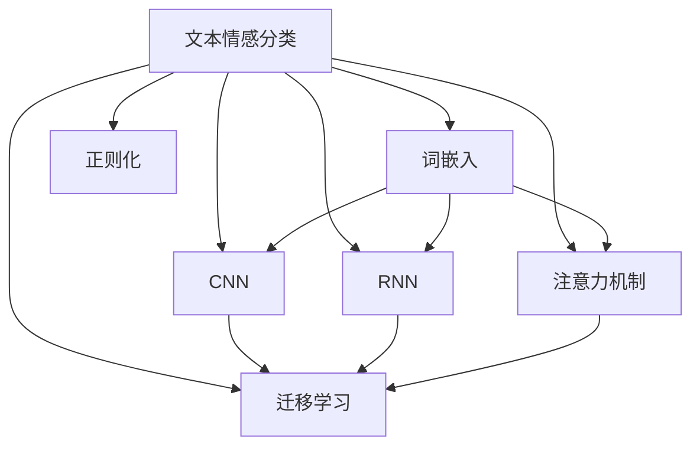

# Python深度学习实践：文本情感分类的深度学习方法

## 1. 背景介绍

随着社交媒体、在线评论和用户反馈的激增,对文本数据进行情感分析变得越来越重要。情感分析可以帮助企业更好地了解客户的需求和体验,从而改进产品和服务。此外,情感分析还可以应用于社会研究、政治分析和其他领域。

传统的基于规则和词典的方法存在一些局限性,无法很好地捕捉语义和上下文信息。近年来,随着深度学习技术的发展,基于神经网络的文本情感分类方法取得了显著进展,能够更好地捕捉文本的语义和上下文信息,提高分类准确性。

## 2. 核心概念与联系

文本情感分类是一种自然语言处理(NLP)任务,旨在自动确定给定文本(如评论、推文等)所表达的情感极性,通常分为正面、负面和中性三类。深度学习在该任务中发挥着重要作用。

以下是一些核心概念:

1. **词嵌入(Word Embeddings)**: 将词语映射到连续的向量空间,使语义相似的词语在向量空间中彼此靠近。常用的词嵌入模型包括Word2Vec、GloVe等。

2. **卷积神经网络(CNN)**: 能够自动学习文本的局部特征模式,对捕捉短语和n-gram信息很有效。

3. **循环神经网络(RNN)**: 能够捕捉序列数据中的长期依赖关系,对于处理变长文本很有用。常用的RNN变体包括LSTM和GRU。

4. **注意力机制(Attention Mechanism)**: 允许模型动态地关注输入序列中的不同部分,提高了模型的表现力。

5. **迁移学习(Transfer Learning)**: 利用在大型语料库上预训练的语言模型(如BERT、GPT等)作为初始化,再在下游任务上微调,可以显著提高性能。

6. **正则化(Regularization)**: 防止过拟合,提高模型的泛化能力。常用的正则化技术包括Dropout、L1/L2正则化等。

这些概念相互关联,构建了现代文本情感分类模型的基础。



## 3. 核心算法原理具体操作步骤

以下是一个基于LSTM和注意力机制的文本情感分类模型的核心算法原理和具体操作步骤:

1. **数据预处理**:
   - 文本清理: 去除HTML标签、URLs、表情符号等无用信息。
   - 分词: 将文本分割成单词序列。
   - 构建词表: 统计词频,构建词表(vocabulary)。

2. **词嵌入**:
   - 使用预训练的词嵌入模型(如Word2Vec或GloVe)将每个单词映射为向量表示。
   - 或者直接使用预训练的上下文词嵌入(如BERT、ELMo等)。

3. **构建LSTM模型**:
   - 将词嵌入序列输入到LSTM层。
   - LSTM能够捕捉序列数据中的长期依赖关系。

4. **注意力机制**:
   - 计算每个时间步的注意力权重,表示该时间步对整个序列的重要程度。
   - 将注意力权重与LSTM隐状态相结合,得到加权的上下文向量表示。

5. **输出层与分类**:
   - 将加权的上下文向量输入到全连接层。
   - 使用Softmax激活函数输出每个类别的概率分数。
   - 选择概率最大的类别作为预测结果。

6. **模型训练**:
   - 定义损失函数(如交叉熵损失)。
   - 使用优化算法(如Adam)最小化损失函数。
   - 可采用正则化技术(如Dropout)防止过拟合。

7. **模型评估**:
   - 在测试集上评估模型性能,计算指标如准确率、F1分数等。
   - 可视化注意力权重,解释模型关注的重点部分。

这种基于LSTM和注意力机制的模型能够有效地捕捉文本的语义和上下文信息,提高情感分类的准确性。

## 4. 数学模型和公式详细讲解举例说明

### 4.1 LSTM(Long Short-Term Memory)

LSTM是一种特殊的RNN,旨在解决传统RNN存在的梯度消失和梯度爆炸问题。LSTM通过引入门控机制和记忆细胞状态,能够更好地捕捉长期依赖关系。

LSTM的核心公式如下:

$$
\begin{aligned}
f_t &= \sigma(W_f \cdot [h_{t-1}, x_t] + b_f) & & \text{(forget gate)} \\
i_t &= \sigma(W_i \cdot [h_{t-1}, x_t] + b_i) & & \text{(input gate)} \\
\tilde{C}_t &= \tanh(W_C \cdot [h_{t-1}, x_t] + b_C) & & \text{(candidate state)} \\
C_t &= f_t \odot C_{t-1} + i_t \odot \tilde{C}_t & & \text{(cell state)} \\
o_t &= \sigma(W_o \cdot [h_{t-1}, x_t] + b_o) & & \text{(output gate)} \\
h_t &= o_t \odot \tanh(C_t) & & \text{(hidden state)}
\end{aligned}
$$

其中:

- $f_t$是遗忘门,控制从上一时间步传递过来的信息的遗忘程度。
- $i_t$是输入门,控制当前时间步的输入信息对记忆细胞的影响程度。
- $\tilde{C}_t$是候选记忆细胞状态。
- $C_t$是当前时间步的记忆细胞状态,由上一时间步的记忆细胞状态和当前时间步的输入信息综合而成。
- $o_t$是输出门,控制当前时间步的记忆细胞状态对隐状态的影响程度。
- $h_t$是当前时间步的隐状态,由记忆细胞状态和输出门共同决定。

通过门控机制和记忆细胞状态,LSTM能够更好地捕捉长期依赖关系,解决了传统RNN存在的梯度消失和梯度爆炸问题。

### 4.2 注意力机制(Attention Mechanism)

注意力机制允许模型动态地关注输入序列中的不同部分,提高了模型的表现力。在文本情感分类任务中,注意力机制可以帮助模型关注文本中与情感相关的关键词和短语。

注意力机制的核心公式如下:

$$
\begin{aligned}
u_t &= \tanh(W_w h_t + b_w) \\
\alpha_t &= \frac{\exp(u_t^T u_w)}{\sum_{t'} \exp(u_{t'}^T u_w)} \\
v &= \sum_{t} \alpha_t h_t
\end{aligned}
$$

其中:

- $h_t$是LSTM在时间步$t$的隐状态。
- $u_t$是注意力机制的中间状态,通过一个单层前馈神经网络计算得到。
- $\alpha_t$是时间步$t$的注意力权重,表示该时间步对整个序列的重要程度。
- $u_w$是可学习的注意力向量,用于计算注意力权重。
- $v$是加权的上下文向量表示,由所有时间步的隐状态和对应的注意力权重综合而成。

通过注意力机制,模型可以动态地关注输入序列中与情感相关的关键部分,从而提高情感分类的准确性。

### 4.3 示例说明

假设我们有一个评论文本:"虽然这部电影的剧情有些俗套,但是演员的演技非常出色,整体来说还是一部值得一看的好电影。"我们希望对其进行情感分类,判断是正面评论还是负面评论。

1. **数据预处理**:
   - 文本清理: 去除无用信息。
   - 分词: "虽然/这部/电影/的/剧情/有些/俗套/,/但是/演员/的/演技/非常/出色/,/整体/来说/还是/一部/值得/一看/的/好/电影/。"

2. **词嵌入**:
   - 将每个单词映射为向量表示,例如"虽然"映射为$[0.2, -0.1, 0.4, ...]$。

3. **LSTM计算**:
   - 将词嵌入序列输入到LSTM层,计算每个时间步的隐状态$h_t$。

4. **注意力权重计算**:
   - 对于每个时间步$t$,计算注意力权重$\alpha_t$。
   - 例如,对于"出色"这个词,注意力权重可能较高,因为它与正面情感相关。

5. **加权上下文向量**:
   - 根据注意力权重,计算加权的上下文向量表示$v$。

6. **分类输出**:
   - 将加权的上下文向量$v$输入到全连接层,得到正面和负面两个类别的概率分数。
   - 选择概率最大的类别作为预测结果,例如正面评论的概率为0.8,负面评论的概率为0.2,则预测为正面评论。

通过注意力机制,模型能够关注到"出色"这个关键词,并正确地将该评论分类为正面评论。

## 5. 项目实践:代码实例和详细解释说明

以下是一个使用PyTorch实现的基于LSTM和注意力机制的文本情感分类模型的代码示例:

```python
import torch
import torch.nn as nn

class AttentionLSTM(nn.Module):
    def __init__(self, vocab_size, embedding_dim, hidden_dim, output_dim, n_layers, dropout):
        super().__init__()
        self.embedding = nn.Embedding(vocab_size, embedding_dim)
        self.lstm = nn.LSTM(embedding_dim, hidden_dim, n_layers, dropout=dropout, batch_first=True, bidirectional=True)
        self.attention = Attention(hidden_dim * 2)
        self.fc = nn.Linear(hidden_dim * 2, output_dim)
        self.dropout = nn.Dropout(dropout)

    def forward(self, text, text_lengths):
        embedded = self.embedding(text)
        packed_embedded = nn.utils.rnn.pack_padded_sequence(embedded, text_lengths, batch_first=True, enforce_sorted=False)
        packed_outputs, (hidden, cell) = self.lstm(packed_embedded)
        outputs, output_lengths = nn.utils.rnn.pad_packed_sequence(packed_outputs, batch_first=True)
        attention_output, attention_weights = self.attention(outputs, output_lengths)
        fc_input = self.dropout(attention_output)
        logits = self.fc(fc_input)
        return logits, attention_weights

class Attention(nn.Module):
    def __init__(self, hidden_dim):
        super().__init__()
        self.weight = nn.Parameter(torch.Tensor(hidden_dim, hidden_dim))
        self.bias = nn.Parameter(torch.Tensor(hidden_dim))
        self.reset_parameters()

    def reset_parameters(self):
        nn.init.xavier_uniform_(self.weight)
        nn.init.zeros_(self.bias)

    def forward(self, inputs, lengths):
        batch_size, max_len, hidden_dim = inputs.size()
        inputs = inputs.permute(1, 0, 2)  # (max_len, batch_size, hidden_dim)

        attn_weights = torch.bmm(inputs, self.weight.unsqueeze(0).repeat(max_len, 1, 1))  # (max_len, batch_size, hidden_dim)
        attn_weights = attn_weights + self.bias.unsqueeze(0).unsqueeze(1)  # (max_len, batch_size, hidden_dim)
        attn_weights = torch.tanh(attn_weights)  # (max_len, batch_size, hidden_dim)
        attn_weights = torch.sum(attn_weights, dim=2)  # (max_len, batch_size)

        for i, length in enumerate(lengths):
            attn_weights[:, i][length:] = float('-inf')

        attn_weights = torch.softmax(attn_weights, dim=0)  # (max_len, batch_size)
        attn_weights = attn_weights.permute(1, 0)  # (batch_size, max_len)

        outputs = torch.bmm(attn_weights.unsqueeze(1), inputs.permute(1, 0, 2))  # (batch_size, 1, hidden_dim)
        outputs = outputs.squeeze(1)  # (batch_size, hidden_dim)

        return outputs, attn_weights
```

代码解释:

1. `AttentionLSTM`类继承自`nn.Module