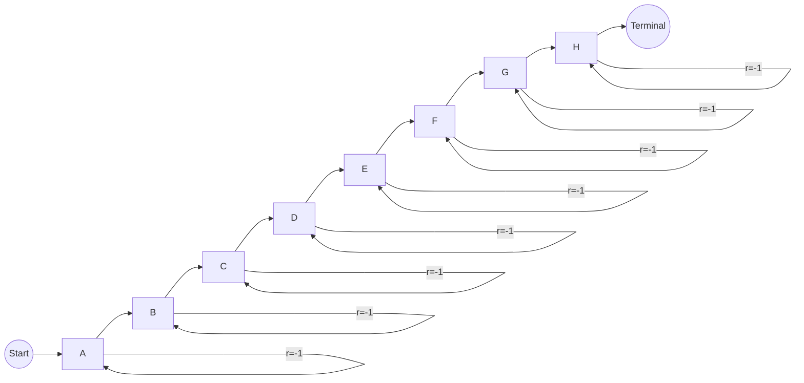

# Q-Learning 原理与代码实例讲解

## 1.背景介绍

### 1.1 强化学习概述

强化学习(Reinforcement Learning)是机器学习的一个重要分支,它关注智能体(Agent)如何在与环境(Environment)的交互过程中,通过试错来学习采取最优策略(Policy),以最大化累积奖励(Reward)。与监督学习(Supervised Learning)和无监督学习(Unsupervised Learning)不同,强化学习没有提供完整的输入-输出样本对,只有通过与环境交互获得的奖励信号作为学习的反馈。

### 1.2 Q-Learning 简介

Q-Learning 是强化学习中最著名和最成功的算法之一,它属于无模型(Model-free)的价值迭代(Value Iteration)算法。Q-Learning 通过不断更新状态-行为对(State-Action Pair)的价值函数(Value Function),逐步逼近最优策略,从而解决马尔可夫决策过程(Markov Decision Process, MDP)问题。

## 2.核心概念与联系

### 2.1 马尔可夫决策过程(MDP)

马尔可夫决策过程是强化学习问题的数学模型。一个 MDP 由以下几个要素组成:

- 状态集合(State Space) $\mathcal{S}$
- 行为集合(Action Space) $\mathcal{A}$
- 转移概率(Transition Probability) $\mathcal{P}_{ss'}^a = \Pr(S_{t+1}=s' | S_t=s, A_t=a)$
- 奖励函数(Reward Function) $\mathcal{R}_s^a = \mathbb{E}[R_{t+1} | S_t=s, A_t=a]$
- 折扣因子(Discount Factor) $\gamma \in [0, 1)$

其中,智能体在每个时间步 $t$ 处于状态 $S_t \in \mathcal{S}$,选择行为 $A_t \in \mathcal{A}(S_t)$,然后转移到下一个状态 $S_{t+1}$,并获得奖励 $R_{t+1}$。目标是找到一个最优策略 $\pi^*$,使得期望的累积折扣奖励最大化:

$$\pi^* = \arg\max_\pi \mathbb{E}_\pi \left[ \sum_{t=0}^\infty \gamma^t R_{t+1} \right]$$

### 2.2 价值函数(Value Function)

在强化学习中,我们通常使用价值函数来评估一个状态或状态-行为对的期望累积奖励。对于任意策略 $\pi$,状态价值函数(State-Value Function) $V^\pi(s)$ 和行为价值函数(Action-Value Function) $Q^\pi(s, a)$ 定义如下:

$$V^\pi(s) = \mathbb{E}_\pi \left[ \sum_{t=0}^\infty \gamma^t R_{t+1} | S_0 = s \right]$$

$$Q^\pi(s, a) = \mathbb{E}_\pi \left[ \sum_{t=0}^\infty \gamma^t R_{t+1} | S_0 = s, A_0 = a \right]$$

这两个价值函数之间存在着紧密的联系,称为贝尔曼方程(Bellman Equation):

$$V^\pi(s) = \sum_{a \in \mathcal{A}} \pi(a|s) Q^\pi(s, a)$$

$$Q^\pi(s, a) = \mathcal{R}_s^a + \gamma \sum_{s' \in \mathcal{S}} \mathcal{P}_{ss'}^a V^\pi(s')$$

### 2.3 Q-Learning 算法

Q-Learning 算法的目标是直接学习最优行为价值函数 $Q^*(s, a)$,而不需要先学习策略 $\pi$。它通过不断更新 $Q(s, a)$ 来逼近 $Q^*(s, a)$,更新规则如下:

$$Q(S_t, A_t) \leftarrow Q(S_t, A_t) + \alpha \left[ R_{t+1} + \gamma \max_{a'} Q(S_{t+1}, a') - Q(S_t, A_t) \right]$$

其中,$ \alpha $ 是学习率,控制着新观测到的信息对 $Q$ 值的影响程度。

Q-Learning 算法的伪代码如下:

```python
初始化 Q(s, a) 为任意值
for each episode:
    初始化状态 S
    while S 不是终止状态:
        从 S 中选择行为 A
        执行行为 A,观测奖励 R 和新状态 S'
        Q(S, A) = Q(S, A) + α[R + γ max_a Q(S', a) - Q(S, A)]
        S = S'
```

Q-Learning 算法的关键特点是:

- 无模型(Model-free): 不需要事先知道环境的转移概率和奖励函数
- 离策略(Off-Policy): 学习的策略与行为策略无关
- 收敛性: 在适当的条件下,Q-Learning 算法能够收敛到最优行为价值函数 $Q^*$

## 3.核心算法原理具体操作步骤

### 3.1 Q-Learning 算法流程

Q-Learning 算法的核心流程可以概括为以下几个步骤:

1. **初始化**: 将所有状态-行为对 $(s, a)$ 的 $Q(s, a)$ 值初始化为任意值,通常为 0。
2. **选择行为**: 在当前状态 $s$ 下,根据某种策略(如 $\epsilon$-贪婪策略)选择一个行为 $a$。
3. **执行行为**: 执行选择的行为 $a$,观测到新状态 $s'$ 和即时奖励 $r$。
4. **更新 Q 值**: 根据贝尔曼最优方程,更新 $Q(s, a)$ 的估计值:

$$Q(s, a) \leftarrow Q(s, a) + \alpha \left[ r + \gamma \max_{a'} Q(s', a') - Q(s, a) \right]$$

5. **状态转移**: 将新状态 $s'$ 设置为当前状态 $s$,进入下一个决策周期。
6. **终止检查**: 如果达到终止状态,则当前回合结束,进入下一个回合;否则,返回步骤 2。

该算法通过不断迭代,逐步更新 $Q$ 值的估计,直到收敛到最优行为价值函数 $Q^*$。

### 3.2 探索与利用权衡

在 Q-Learning 算法中,探索(Exploration)与利用(Exploitation)之间的权衡是一个重要问题。探索是指在未知的状态下尝试新的行为,以获取更多信息;而利用是指在已知的状态下选择当前最优的行为,以获取最大化的即时奖励。

一种常用的权衡策略是 $\epsilon$-贪婪策略($\epsilon$-greedy policy):

- 以概率 $\epsilon$ 选择随机行为(探索)
- 以概率 $1 - \epsilon$ 选择当前最优行为(利用)

其中,$\epsilon$ 是一个超参数,控制着探索与利用的比例。通常在训练早期,我们会设置较大的 $\epsilon$ 值以鼓励探索;而在训练后期,则减小 $\epsilon$ 值以提高利用程度。

### 3.3 Q-Learning 算法收敛性

Q-Learning 算法的收敛性是建立在以下条件之上的:

1. **马尔可夫决策过程**: 环境满足马尔可夫性质,即状态转移只依赖于当前状态和行为,与历史无关。
2. **有限马尔可夫决策过程**: 状态和行为空间都是有限的。
3. **正位相关(Positive Correlation)**: 策略是正位相关的,即在任何状态下,对于所有可能的行为,至少有一个行为被选择的概率是正的。
4. **探索条件**: 每个状态-行为对被访问的次数无限多次。

在满足上述条件的情况下,Q-Learning 算法能够确保 $Q$ 值收敛到最优行为价值函数 $Q^*$。然而,在实践中,由于状态空间通常是连续的或者非常大,因此我们往往需要采用函数逼近(如神经网络)来估计 $Q$ 值,这时收敛性的理论保证就不再成立。不过,经验上 Q-Learning 算法在很多实际问题中都表现出了良好的性能。

## 4.数学模型和公式详细讲解举例说明

### 4.1 贝尔曼方程(Bellman Equation)

贝尔曼方程是强化学习中的一个核心概念,它描述了状态价值函数和行为价值函数之间的关系。对于任意策略 $\pi$,贝尔曼方程如下所示:

$$\begin{aligned}
V^\pi(s) &= \mathbb{E}_\pi \left[ R_{t+1} + \gamma V^\pi(S_{t+1}) | S_t = s \right] \\
         &= \sum_{a \in \mathcal{A}} \pi(a|s) \sum_{s' \in \mathcal{S}} \mathcal{P}_{ss'}^a \left[ \mathcal{R}_s^a + \gamma V^\pi(s') \right]
\end{aligned}$$

$$\begin{aligned}
Q^\pi(s, a) &= \mathbb{E}_\pi \left[ R_{t+1} + \gamma Q^\pi(S_{t+1}, A_{t+1}) | S_t = s, A_t = a \right] \\
            &= \sum_{s' \in \mathcal{S}} \mathcal{P}_{ss'}^a \left[ \mathcal{R}_s^a + \gamma \sum_{a' \in \mathcal{A}} \pi(a'|s') Q^\pi(s', a') \right]
\end{aligned}$$

其中,$ V^\pi(s) $ 表示在策略 $\pi$ 下,从状态 $s$ 开始的期望累积折扣奖励;$ Q^\pi(s, a) $ 表示在策略 $\pi$ 下,从状态 $s$ 开始,执行行为 $a$ 后的期望累积折扣奖励。

这两个方程揭示了价值函数与即时奖励、转移概率和折扣因子之间的递归关系,是强化学习算法的基础。

**举例说明**:

考虑一个简单的网格世界(Gridworld)环境,如下图所示:



其中,智能体的目标是从起点 S 到达终点 T,每一步都会获得 -1 的奖励。假设折扣因子 $\gamma = 1$,策略 $\pi$ 是均匀随机选择所有可行行为,则在状态 A 处的状态价值函数和行为价值函数分别为:

$$\begin{aligned}
V^\pi(A) &= \frac{1}{2} \left[ (-1 + V^\pi(A)) + (-1 + V^\pi(B)) \right] \\
         &= -1 + \frac{1}{2} (V^\pi(A) + V^\pi(B))
\end{aligned}$$

$$\begin{aligned}
Q^\pi(A, \text{right}) &= -1 + V^\pi(B) \\
Q^\pi(A, \text{left})  &= -1 + V^\pi(A)
\end{aligned}$$

通过求解这些方程,我们可以得到每个状态的价值函数,从而指导智能体的决策。

### 4.2 Q-Learning 更新规则

Q-Learning 算法的核心就是更新 $Q$ 值的规则,该规则源自于贝尔曼最优方程:

$$Q^*(s, a) = \mathcal{R}_s^a + \gamma \sum_{s' \in \mathcal{S}} \mathcal{P}_{ss'}^a \max_{a'} Q^*(s', a')$$

由于我们无法直接获得环境的转移概率 $\mathcal{P}_{ss'}^a$,因此 Q-Learning 算法采用了一种基于采样的方式来估计 $Q^*$ 值,更新规则如下:

$$Q(S_t, A_t) \leftarrow Q(S_t, A_t) + \alpha \left[ R_{t+1} + \gamma \max_{a'} Q(S_{t+1}, a') - Q(S_t, A_t) \right]$$

其中,$ \alpha $ 是学习率,控制着新观测到的信息对 $Q$ 值的影响程度。

这个更新规则的直观解释是:我们用采样得到的实际回报 $ R_{t+1} + \gamma \max_{a'} Q(S_{t+1}, a') $ 来更新之前对 $Q(S_t, A_t