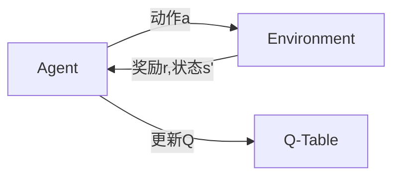

# Q-Learning的研究前沿

## 1. 背景介绍
### 1.1 强化学习概述
强化学习(Reinforcement Learning, RL)是机器学习的一个重要分支,它研究如何基于环境而行动,以取得最大化的预期利益。不同于监督学习需要准备标注数据,强化学习是一种无师自通的学习方式,通过智能体(Agent)与环境(Environment)的交互过程来学习最优策略。

### 1.2 Q-Learning的起源与发展
Q-Learning算法由Watkins在1989年提出,是一种值函数型(Value-based)、模型无关(Model-free)的异策略时序差分学习算法。该算法能够通过不断与环境交互,同时结合贝尔曼方程(Bellman Equation)来更新动作价值函数(Action-Value Function),最终学习到最优策略。近年来,随着深度学习的兴起,Q-Learning也被引入到深度强化学习(Deep RL)领域,衍生出了DQN、Double DQN、Dueling DQN等众多变体,极大地拓展了Q-Learning的应用范围。

## 2. 核心概念与联系
### 2.1 MDP与Q-Learning
马尔可夫决策过程(Markov Decision Process, MDP)为理解Q-Learning奠定了理论基础。MDP由状态集合S、动作集合A、状态转移概率P、奖励函数R以及折扣因子γ构成。Q-Learning算法则基于MDP框架,通过不断估计和更新状态-动作值函数Q(s,a)来逼近最优Q*函数,最终得到最优策略。

### 2.2 探索与利用
探索(Exploration)和利用(Exploitation)是强化学习面临的核心矛盾。探索是指agent尝试新的动作以发现潜在的高回报,而利用则是执行当前已知的最佳动作以获得稳定回报。Q-Learning在学习过程中需要权衡二者,常见的平衡策略有ϵ-greedy、Boltzmann探索等。

### 2.3 值函数与策略
值函数(Value Function)和策略(Policy)是强化学习的两个核心概念。值函数评估状态或状态-动作对的期望回报,常见的有状态值函数V(s)和动作值函数Q(s,a)。策略则定义了在每个状态下应该采取的动作概率分布。Q-Learning旨在学习最优Q函数,然后通过 greedy 策略即可导出最优策略。

## 3. 核心算法原理具体操作步骤
Q-Learning的核心思想是通过不断更新Q表来逼近最优动作值函数Q*。以下是其具体的学习过程:
1. 随机初始化Q(s,a)值,对于终止状态 Q(terminal, ·) = 0
2. 重复以下步骤,直到收敛:
   1. 使用某种探索策略(如ϵ-greedy),根据当前状态 s 选择一个动作 a 并执行  
   2. 环境返回奖励 r 和下一个状态 s'
   3. 根据下面的Q-Learning更新公式来更新 Q(s,a):
      $$Q(s,a) \leftarrow Q(s,a)+\alpha[r+\gamma \max _{a^{\prime}} Q\left(s^{\prime}, a^{\prime}\right)-Q(s,a)]$$
      其中,α为学习率,γ为折扣因子
   4. 令 s←s'
3. 最终学到的Q函数即为最优动作值函数Q*,通过greedy策略 π(s)=argmax_a⁡Q(s,a) 即可得到最优策略

## 4. 数学模型和公式详细讲解举例说明
Q-Learning的核心在于价值迭代和贝尔曼最优方程。对于最优动作值函数Q*,它满足如下贝尔曼最优方程:

$$Q^{*}(s, a)=\mathbb{E}\left[R_{t+1}+\gamma \max _{a^{\prime}} Q^{*}\left(S_{t+1}, a^{\prime}\right) \mid S_{t}=s, A_{t}=a\right]$$

该方程表明,在状态s下采取动作a,然后在后续状态下都采取最优动作所获得的期望回报,等于即时奖励和下一状态最优Q值的折扣和。Q-Learning正是通过不断拟合该方程,来逼近最优Q*函数。

举例说明,假设有如下MDP:
- 状态空间S={s1,s2,s3} 
- 动作空间A={a1,a2}
- 奖励函数R(s1,a1)=1, R(s2,a2)=2, 其余为0
- 折扣因子γ=0.9

在状态s1下选择动作a1,根据Q-Learning更新公式:
$$
\begin{aligned}
Q\left(s_{1}, a_{1}\right) & \leftarrow Q\left(s_{1}, a_{1}\right)+\alpha\left[r+\gamma \max _{a^{\prime}} Q\left(s^{\prime}, a^{\prime}\right)-Q\left(s_{1}, a_{1}\right)\right] \\
&=Q\left(s_{1}, a_{1}\right)+\alpha\left[1+0.9 \max _{a^{\prime}} Q\left(s_{2}, a^{\prime}\right)-Q\left(s_{1}, a_{1}\right)\right]
\end{aligned}
$$

通过不断迭代更新,最终Q值会收敛到最优值。

## 5. 项目实践：代码实例和详细解释说明
下面是一个简单的Q-Learning算法在 CliffWalking 环境中的Python实现:

```python
import numpy as np
import gym

# 超参数
num_episodes = 500  # 训练轮数 
learning_rate = 0.1 # 学习率
gamma = 0.9         # 折扣因子
epsilon = 0.1       # epsilon-greedy 探索概率

# 创建 CliffWalking 环境
env = gym.make("CliffWalking-v0")  

# 初始化Q表
Q = np.zeros((env.observation_space.n, env.action_space.n)) 

# 训练
for i in range(num_episodes):
    state = env.reset()  # 重置环境,返回初始状态
    done = False
    
    while not done:
        # 使用 epsilon-greedy 策略选择动作
        if np.random.uniform(0, 1) < epsilon:  
            action = env.action_space.sample()  # 随机探索
        else:
            action = np.argmax(Q[state, :])    # 选择Q值最大的动作
        
        next_state, reward, done, _ = env.step(action)  # 执行动作
        
        # 更新 Q 值
        Q[state, action] += learning_rate * (reward + gamma * np.max(Q[next_state, :]) - Q[state, action])
        
        state = next_state  # 更新状态
        
# 策略评估        
state = env.reset()
done = False
while not done:
    action = np.argmax(Q[state, :])  # 选择最优动作
    next_state, reward, done, _ = env.step(action)
    state = next_state

env.close()
```

代码说明:
1. 首先设置相关超参数,包括训练轮数、学习率、折扣因子和探索概率等
2. 创建 CliffWalking 环境,并初始化Q表
3. 开始训练,每轮训练重置环境得到初始状态
4. 在每个状态下,根据 epsilon-greedy 策略选择动作,要么随机探索,要么选择当前Q值最大的动作 
5. 执行选定的动作,环境返回下一个状态、奖励等信息
6. 根据Q-Learning更新公式来更新Q表
7. 重复步骤4-6,直到当前episode结束
8. 训练结束后,使用学到的Q表来评估策略,即在每个状态下选择Q值最大的动作,直到到达终止状态

## 6. 实际应用场景
Q-Learning 在诸多领域都有广泛应用,例如:
- 游戏智能体:通过Q-Learning训练游戏AI,使其学会在不同游戏状态下选择最优动作,如 Atari 系列游戏、围棋等。
- 推荐系统:将推荐问题建模为MDP,通过Q-Learning动态调整推荐策略,从而提升用户满意度和平台收益。
- 智能交通:利用Q-Learning优化交通信号灯控制,减少道路拥堵和行人等待时间。
- 机器人控制:通过Q-Learning训练机器人在复杂环境中执行任务,如避障、抓取等。
- 电商定价:利用Q-Learning动态调整商品价格,在获取收益和吸引用户之间寻求平衡。

总之,Q-Learning 提供了一种通用的智能决策框架,在众多领域展现了巨大的应用前景。

## 7. 工具和资源推荐
- OpenAI Gym:强化学习环境模拟器,提供了多种标准环境方便算法测试。
- PyTorch:深度学习框架,可以方便地实现各种DRL算法。
- TensorFlow:Google开源的深度学习框架,同样支持RL算法。
- Stable Baselines:基于PyTorch和TensorFlow的强化学习工具包,提供了多种SOTA算法实现。
- RLlib:Ray分布式计算框架的RL库,方便实现分布式训练。
- 相关书籍:《Reinforcement Learning: An Introduction》,《Deep Reinforcement Learning Hands-On》等。

## 8. 总结：未来发展趋势与挑战
近年来,Q-Learning及其深度学习扩展版本在众多领域取得了令人瞩目的成就。未来,Q-Learning有望在更大规模、更复杂的决策任务中得到应用。同时,Q-Learning与其他领域技术的融合也是大势所趋,如将Q-Learning与迁移学习、元学习、多智能体学习等结合,有望进一步提升其泛化能力和学习效率。此外,Q-Learning的可解释性、稳定性、采样效率等问题也有待进一步研究。总之,尽管还面临诸多挑战,但Q-Learning必将在未来智能系统研发中扮演越来越重要的角色。

## 9. 附录：常见问题与解答
Q1:Q-Learning能否处理连续状态和动作空间?
A1:传统Q-Learning只能处理离散状态和动作空间。对于连续情况,通常需要引入值函数近似,如DQN使用神经网络来拟合Q函数。此外,DDPG等算法通过引入确定性策略,也可以较好地处理连续动作空间。

Q2:Q-Learning收敛的理论保证是什么?
A2:在适当的假设条件下(如所有状态-动作对无限次访问),Q-Learning可以收敛到最优动作值函数Q*。但在实际应用中,往往很难满足这些理想条件,因此Q-Learning的收敛性仍面临挑战。

Q3:Q-Learning如何平衡探索和利用?
A3:Q-Learning通过ϵ-greedy等探索策略来权衡探索和利用。此外,一些改进方法如Upper Confidence Bound(UCB)、Thompson采样等,可以更高效地指导探索过程。

Q4:Q-Learning能否处理部分可观察环境?
A4:部分可观察马尔可夫决策过程(POMDP)更符合现实世界的挑战。传统Q-Learning假设环境是完全可观察的,无法直接处理POMDP。常见的解决思路是引入历史状态信息,将POMDP转化为MDP,如使用递归神经网络(RNN)来总结历史轨迹。

Q5:Q-Learning的局限性有哪些?
A5:Q-Learning的主要局限包括:
- 难以处理高维、连续状态和动作空间
- 样本利用效率低,难以处理稀疏奖励
- 对探索策略敏感,容易陷入次优
- 难以迁移学习和泛化
- 收敛性和稳定性难以保证

针对这些局限,研究者提出了多种改进方案,如DQN、PER、DDQN等,但挑战仍然存在。未来,进一步提升Q-Learning的性能和适用性,仍是RL领域的重要研究方向。

作者：禅与计算机程序设计艺术 / Zen and the Art of Computer Programming

