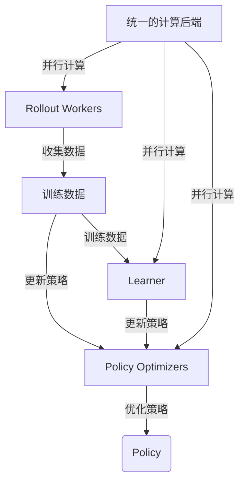

# RayRLlib：可扩展的分布式强化学习

## 1.背景介绍

随着人工智能技术的不断发展,强化学习(Reinforcement Learning,RL)作为一种重要的机器学习范式,在诸多领域得到了广泛应用。强化学习旨在训练一个智能体(Agent)通过与环境(Environment)的交互来学习最优策略,以获取最大的累积奖励。然而,传统的强化学习算法往往面临着训练效率低下、数据利用率低等问题,难以应对复杂的现实场景。

为了解决这些挑战,分布式强化学习(Distributed Reinforcement Learning)应运而生。分布式强化学习通过将训练过程分散到多个计算节点上,可以显著提高训练效率和数据利用率。其中,RayRLlib作为一个高度可扩展的分布式强化学习库,备受研究人员和工程师的青睐。

RayRLlib是Ray项目的一个组件,Ray是一个分布式计算框架,旨在简化分布式应用程序的构建和扩展。RayRLlib利用Ray的分布式计算能力,提供了一套完整的分布式强化学习解决方案,支持多种流行的强化学习算法,如DQN、A3C、PPO等。

## 2.核心概念与联系

### 2.1 强化学习基本概念

在介绍RayRLlib之前,我们先回顾一下强化学习的基本概念:

- **环境(Environment)**:智能体所处的环境,定义了状态空间、动作空间和奖励函数。
- **状态(State)**:描述环境的当前状态。
- **动作(Action)**:智能体在当前状态下可以采取的行为。
- **奖励(Reward)**:智能体采取行动后,环境给予的反馈信号,用于指导智能体学习。
- **策略(Policy)**:智能体在不同状态下采取行动的策略,是强化学习算法需要学习的目标。

强化学习算法的目标是通过与环境的交互,学习一个最优策略,使得智能体在环境中获得最大的累积奖励。

### 2.2 RayRLlib核心组件

RayRLlib由以下几个核心组件组成:

- **Policy Optimizers**:实现了各种强化学习算法,如DQN、A3C、PPO等,用于优化策略。
- **Rollout Workers**:与环境交互,收集训练数据。
- **Learner**:使用收集的数据更新策略。
- **统一的计算后端**:利用Ray的分布式计算能力,实现高效的并行计算。

这些组件通过紧密协作,实现了高效的分布式强化学习训练过程。



## 3.核心算法原理具体操作步骤

RayRLlib的核心算法原理可以概括为以下几个步骤:

1. **初始化**:初始化策略、环境和其他必要组件。
2. **数据收集**:Rollout Workers与环境交互,收集状态、动作、奖励等数据。
3. **数据缓冲**:收集的数据被缓冲在内存或磁盘中。
4. **策略优化**:Learner从缓冲区取出数据,使用Policy Optimizers优化策略。
5. **策略更新**:优化后的策略被广播到Rollout Workers。
6. **重复2-5步骤**:重复上述过程,直到策略收敛或达到预设条件。

这个过程在多个计算节点上并行执行,从而实现高效的分布式强化学习训练。

### 3.1 数据并行

RayRLlib采用了数据并行的方式来实现分布式训练。多个Rollout Workers同时与环境交互,收集训练数据,然后将这些数据汇总到一个中央缓冲区。Learner从中央缓冲区取出数据,进行策略优化。优化后的策略被广播到所有Rollout Workers。

这种方式可以最大化利用计算资源,提高数据收集效率和策略优化效率。同时,由于Rollout Workers之间是相互独立的,可以很好地支持异构环境和异构动作空间。

### 3.2 异步优化

除了数据并行,RayRLlib还支持异步优化。在异步优化模式下,Learner不需要等待所有Rollout Workers完成数据收集,只要缓冲区中有足够的数据,就可以立即开始策略优化。这种方式可以进一步提高训练效率,缩短策略更新周期。

然而,异步优化也存在一些潜在问题,如数据延迟、策略滞后等,需要通过合理的设计来缓解这些问题。

## 4.数学模型和公式详细讲解举例说明

强化学习算法通常基于马尔可夫决策过程(Markov Decision Process,MDP)的数学模型。MDP可以用一个元组 $(S, A, P, R, \gamma)$ 来表示,其中:

- $S$ 是状态空间
- $A$ 是动作空间
- $P(s'|s,a)$ 是状态转移概率,表示在状态 $s$ 下执行动作 $a$ 后,转移到状态 $s'$ 的概率
- $R(s,a)$ 是奖励函数,表示在状态 $s$ 下执行动作 $a$ 后获得的即时奖励
- $\gamma \in [0,1)$ 是折现因子,用于平衡即时奖励和长期奖励

强化学习算法的目标是找到一个最优策略 $\pi^*(a|s)$,使得在该策略下,智能体可以获得最大的期望累积奖励:

$$
J(\pi) = \mathbb{E}_\pi \left[ \sum_{t=0}^\infty \gamma^t R(s_t, a_t) \right]
$$

其中 $\pi(a|s)$ 表示在状态 $s$ 下选择动作 $a$ 的概率。

不同的强化学习算法采用不同的方法来近似求解最优策略。以下是一些常见算法的简要介绍:

### 4.1 Q-Learning

Q-Learning是一种基于值函数(Value Function)的强化学习算法。它定义了一个状态-动作值函数 $Q(s,a)$,表示在状态 $s$ 下执行动作 $a$ 后,可以获得的期望累积奖励。最优策略可以通过选择具有最大 $Q$ 值的动作来获得:

$$
\pi^*(s) = \arg\max_a Q(s,a)
$$

Q-Learning通过不断更新 $Q$ 值,逐步逼近最优策略。更新规则如下:

$$
Q(s_t, a_t) \leftarrow Q(s_t, a_t) + \alpha \left[ r_t + \gamma \max_{a'} Q(s_{t+1}, a') - Q(s_t, a_t) \right]
$$

其中 $\alpha$ 是学习率,控制更新步长。

### 4.2 策略梯度算法

策略梯度(Policy Gradient)算法直接对策略进行参数化,并通过梯度上升的方式优化策略参数,使期望累积奖励最大化。

对于参数化策略 $\pi_\theta(a|s)$,其目标函数为:

$$
J(\theta) = \mathbb{E}_{\pi_\theta} \left[ \sum_{t=0}^\infty \gamma^t R(s_t, a_t) \right]
$$

通过策略梯度定理,可以得到目标函数的梯度:

$$
\nabla_\theta J(\theta) = \mathbb{E}_{\pi_\theta} \left[ \sum_{t=0}^\infty \nabla_\theta \log \pi_\theta(a_t|s_t) Q^{\pi_\theta}(s_t, a_t) \right]
$$

其中 $Q^{\pi_\theta}(s_t, a_t)$ 是在策略 $\pi_\theta$ 下,状态 $s_t$ 执行动作 $a_t$ 后的期望累积奖励。

通过梯度上升,可以不断优化策略参数 $\theta$,使期望累积奖励最大化。

### 4.3 Actor-Critic算法

Actor-Critic算法是一种结合了值函数和策略梯度的方法。它将智能体分为两个部分:Actor(策略网络)和Critic(值函数网络)。

- Actor负责根据当前状态输出动作概率分布,即策略 $\pi_\theta(a|s)$
- Critic负责评估当前状态的值函数 $V_\omega(s)$,用于估计期望累积奖励

Actor通过最大化期望累积奖励来优化策略参数 $\theta$,而Critic则通过最小化值函数的均方误差来优化值函数参数 $\omega$。

Actor和Critic相互协作,共同优化策略和值函数,从而提高了强化学习的性能和稳定性。

## 5.项目实践:代码实例和详细解释说明

下面是一个使用RayRLlib训练Cartpole环境的示例代码:

```python
import ray
from ray import tune
from ray.rllib.agents.ppo import PPOTrainer

# 初始化Ray
ray.init()

# 配置训练参数
config = {
    "env": "CartPole-v0",
    "num_workers": 4,  # 并行Rollout Workers数量
    "framework": "torch",
    "evaluation_interval": 10,  # 每10个训练迭代进行一次评估
}

# 创建PPO训练器
trainer = PPOTrainer(config=config)

# 开始训练
for _ in range(100):
    result = trainer.train()
    print(f"Iteration: {result['iterations_trained']}, "
          f"Episode Reward Mean: {result['episode_reward_mean']}")

# 保存训练好的策略
trainer.save("cartpole_policy")

# 关闭Ray
ray.shutdown()
```

这段代码使用RayRLlib中的PPO算法训练一个Cartpole环境。我们来详细解释一下:

1. 首先导入必要的模块,包括Ray和RayRLlib。
2. 使用`ray.init()`初始化Ray。
3. 配置训练参数,包括环境名称、并行Rollout Workers数量、使用的深度学习框架等。
4. 创建PPO训练器`PPOTrainer`。
5. 进入训练循环,每次调用`trainer.train()`进行一次策略优化迭代。
6. 打印当前迭代次数和平均奖励。
7. 训练结束后,保存训练好的策略。
8. 最后关闭Ray。

在这个示例中,我们使用了4个并行的Rollout Workers来收集训练数据,并使用PyTorch作为深度学习框架。每10个训练迭代,会进行一次评估,打印当前的平均奖励。

除了PPO算法,RayRLlib还支持多种其他强化学习算法,如DQN、A3C等。只需要将`PPOTrainer`替换为相应的算法训练器即可。

## 6.实际应用场景

强化学习在诸多领域有着广泛的应用,RayRLlib作为一个高效的分布式强化学习库,也被广泛应用于以下场景:

### 6.1 机器人控制

在机器人控制领域,强化学习可以训练机器人执行各种复杂的任务,如机械臂操作、无人机导航等。RayRLlib可以高效地训练这些任务的策略,并部署到实际的机器人系统中。

### 6.2 游戏AI

强化学习在游戏AI领域有着广泛的应用。RayRLlib可以用于训练各种游戏AI,如棋类游戏、射击游戏、策略游戏等。通过分布式训练,可以大幅提高训练效率,获得更强大的游戏AI。

### 6.3 自动驾驶

自动驾驶是强化学习的一个重要应用场景。RayRLlib可以用于训练自动驾驶策略,通过模拟环境和实际道路测试,不断优化策略,提高自动驾驶系统的性能和安全性。

### 6.4 推荐系统

在推荐系统领域,强化学习可以用于学习个性化的推荐策略,根据用户的历史行为和偏好,推荐最合适的内容。RayRLlib可以高效地训练这种推荐策略,提高推荐系统的准确性和用户体验。

### 6.5 金融交易

在金融交易领域,强化学习可以用于学习最优的交易策略,根据市场数据和历史交易记录,决定买入、卖出等操作。RayRLlib