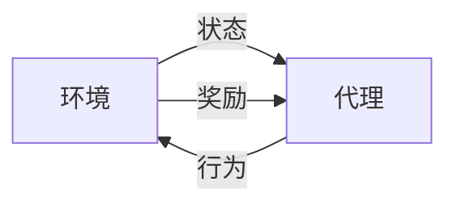
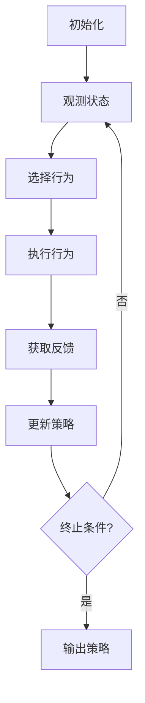

# Reinforcement Learning 原理与代码实战案例讲解

## 1. 背景介绍

强化学习(Reinforcement Learning, RL)是机器学习领域中一种重要的范式,它关注如何基于环境反馈来学习采取最优行为策略。与监督学习和无监督学习不同,强化学习的目标是通过与环境的交互来最大化长期累积奖励。

强化学习的概念源于心理学中的操作条件反射理论,后来被应用于人工智能和控制理论领域。近年来,随着深度学习技术的发展,强化学习取得了突破性进展,在游戏、机器人控制、自动驾驶等领域展现出巨大潜力。

## 2. 核心概念与联系

强化学习系统由四个核心要素组成:

1. **环境(Environment)**: 代理与之交互的外部世界。环境会根据代理的行为给出相应的反馈。

2. **代理(Agent)**: 在环境中执行行为的决策实体,目标是通过与环境交互来学习最优策略。

3. **状态(State)**: 环境的当前状态,包含足够的信息来描述当前情况。

4. **奖励(Reward)**: 环境对代理行为的评价反馈,代理的目标是最大化长期累积奖励。

这四个要素之间的关系如下所示:



强化学习算法的目标是学习一个**策略(Policy)**,即在给定状态下选择行为的映射函数。理想情况下,这个策略能够最大化代理在环境中获得的长期累积奖励。

## 3. 核心算法原理具体操作步骤

强化学习算法通常遵循以下步骤:

1. **初始化**: 初始化代理的策略,通常是一个随机或者基于先验知识的策略。

2. **观测状态**: 代理观测当前环境状态。

3. **选择行为**: 根据当前策略,代理选择一个行为执行。

4. **执行行为**: 代理在环境中执行选择的行为。

5. **获取反馈**: 环境根据代理的行为,返回新的状态和奖励值。

6. **更新策略**: 根据获得的反馈,代理更新策略,使其更有利于获取更高的长期累积奖励。

7. **重复步骤2-6**: 直到达到终止条件(如最大迭代次数或目标奖励)。

这个过程可以用下面的流程图来表示:



根据策略更新方式的不同,强化学习算法可分为**值函数(Value Function)**方法和**策略梯度(Policy Gradient)**方法两大类。

## 4. 数学模型和公式详细讲解举例说明

### 4.1 马尔可夫决策过程(Markov Decision Process, MDP)

强化学习问题通常被建模为**马尔可夫决策过程(MDP)**,它是一种离散时间的随机控制过程。一个MDP可以用一个五元组 $(S, A, P, R, \gamma)$ 来表示:

- $S$ 是有限的状态集合
- $A$ 是有限的行为集合
- $P(s'|s, a)$ 是状态转移概率,表示在状态 $s$ 执行行为 $a$ 后,转移到状态 $s'$ 的概率
- $R(s, a, s')$ 是奖励函数,表示在状态 $s$ 执行行为 $a$ 后,转移到状态 $s'$ 所获得的奖励
- $\gamma \in [0, 1)$ 是折扣因子,用于权衡未来奖励的重要性

在MDP中,代理的目标是学习一个策略 $\pi: S \rightarrow A$,使得在该策略下的长期累积奖励最大化。长期累积奖励可以用**状态值函数(State-Value Function)** $V^\pi(s)$ 或**行为值函数(Action-Value Function)** $Q^\pi(s, a)$ 来表示:

$$
\begin{aligned}
V^\pi(s) &= \mathbb{E}_\pi \left[ \sum_{t=0}^\infty \gamma^t R_{t+1} \mid S_0=s \right] \\
Q^\pi(s, a) &= \mathbb{E}_\pi \left[ \sum_{t=0}^\infty \gamma^t R_{t+1} \mid S_0=s, A_0=a \right]
\end{aligned}
$$

其中 $R_t$ 是第 $t$ 个时间步的奖励。状态值函数 $V^\pi(s)$ 表示在策略 $\pi$ 下,从状态 $s$ 开始,期望获得的长期累积奖励。行为值函数 $Q^\pi(s, a)$ 表示在策略 $\pi$ 下,从状态 $s$ 开始,执行行为 $a$,期望获得的长期累积奖励。

### 4.2 贝尔曼方程(Bellman Equations)

贝尔曼方程是强化学习中一个非常重要的概念,它为状态值函数和行为值函数提供了递归定义。

对于状态值函数 $V^\pi(s)$,贝尔曼方程为:

$$
V^\pi(s) = \sum_{a \in A} \pi(a|s) \sum_{s' \in S} P(s'|s, a) \left[ R(s, a, s') + \gamma V^\pi(s') \right]
$$

对于行为值函数 $Q^\pi(s, a)$,贝尔曼方程为:

$$
Q^\pi(s, a) = \sum_{s' \in S} P(s'|s, a) \left[ R(s, a, s') + \gamma \sum_{a' \in A} \pi(a'|s') Q^\pi(s', a') \right]
$$

这些方程揭示了状态值函数和行为值函数与即时奖励和未来奖励之间的关系。它们为强化学习算法提供了理论基础,并且是许多算法的核心部分。

### 4.3 策略迭代(Policy Iteration)和值迭代(Value Iteration)

**策略迭代(Policy Iteration)** 和 **值迭代(Value Iteration)** 是两种常见的强化学习算法,用于求解MDP中的最优策略。

**策略迭代** 算法包括两个步骤:

1. **策略评估(Policy Evaluation)**: 对于给定的策略 $\pi$,计算其状态值函数 $V^\pi$。这可以通过解贝尔曼方程来实现。

2. **策略改进(Policy Improvement)**: 根据计算出的状态值函数 $V^\pi$,构造一个新的改进策略 $\pi'$,使得 $V^{\pi'}(s) \geq V^\pi(s)$ 对所有状态 $s$ 成立。

这两个步骤交替进行,直到策略收敛到最优策略 $\pi^*$。

**值迭代** 算法则直接计算最优状态值函数 $V^*$,而不是先计算一个策略的状态值函数。它通过不断更新状态值函数的估计值,直到收敛到最优状态值函数 $V^*$。然后根据 $V^*$ 构造最优策略 $\pi^*$。

这两种算法都能够找到MDP的最优策略,但它们在计算效率和收敛速度上有所不同。在实际应用中,需要根据具体问题的特点选择合适的算法。

## 5. 项目实践: 代码实例和详细解释说明

为了更好地理解强化学习的原理和实现,我们将通过一个简单的示例来演示如何使用Python和OpenAI Gym库实现一个强化学习代理。

在这个示例中,我们将训练一个代理在经典的"冰湖环境(FrozenLake)"中学习导航。代理的目标是从起点安全地到达终点,同时避免掉入冰湖中。

### 5.1 导入所需库

```python
import gym
import numpy as np
```

我们将使用 OpenAI Gym 库来创建和交互环境,NumPy 库用于数值计算。

### 5.2 创建环境和代理

```python
# 创建环境
env = gym.make('FrozenLake-v1')

# 初始化 Q-table
Q = np.zeros([env.observation_space.n, env.action_space.n])
```

我们首先创建一个 `FrozenLake-v1` 环境,然后初始化一个 Q-table,用于存储每个状态-行为对的 Q 值。Q-table 的大小由环境的状态空间和行为空间决定。

### 5.3 定义超参数和函数

```python
# 超参数
alpha = 0.1  # 学习率
gamma = 0.9  # 折扣因子
epsilon = 0.1  # 探索率

# 选择行为
def choose_action(state, epsilon):
    if np.random.uniform() < epsilon:
        return env.action_space.sample()  # 探索
    else:
        return np.argmax(Q[state])  # 利用

# 更新 Q-table
def update_Q(state, action, reward, next_state):
    Q[state, action] += alpha * (reward + gamma * np.max(Q[next_state]) - Q[state, action])
```

我们定义了一些超参数,包括学习率 `alpha`、折扣因子 `gamma` 和探索率 `epsilon`。

`choose_action` 函数根据当前状态和探索率,选择一个行为执行。如果随机数小于探索率,则随机选择一个行为(探索);否则,选择 Q 值最大的行为(利用)。

`update_Q` 函数根据贝尔曼方程,更新 Q-table 中对应的 Q 值。

### 5.4 训练代理

```python
# 训练
for episode in range(10000):
    state = env.reset()
    done = False
    while not done:
        action = choose_action(state, epsilon)
        next_state, reward, done, _ = env.step(action)
        update_Q(state, action, reward, next_state)
        state = next_state
```

我们进行 10000 个训练回合,在每个回合中:

1. 重置环境,获取初始状态。
2. 在当前状态下,根据 `choose_action` 函数选择一个行为执行。
3. 执行选择的行为,获取新的状态、奖励和是否结束的标志。
4. 根据获得的反馈,使用 `update_Q` 函数更新 Q-table。
5. 将新的状态设置为当前状态,进入下一个时间步。

经过足够的训练后,Q-table 将收敛到最优策略。

### 5.5 测试代理

```python
# 测试
state = env.reset()
done = False
while not done:
    action = np.argmax(Q[state])
    next_state, reward, done, _ = env.step(action)
    env.render()
    state = next_state
```

在测试阶段,我们重置环境,然后在每个时间步选择 Q 值最大的行为执行。同时,我们使用 `env.render()` 函数来可视化代理在环境中的行为。

通过这个示例,我们可以看到如何使用 Q-learning 算法训练一个强化学习代理,并在简单的环境中测试其性能。在实际应用中,我们可以将这种方法扩展到更复杂的环境和任务。

## 6. 实际应用场景

强化学习已经在许多领域展现出巨大的潜力和应用前景,包括但不限于:

1. **游戏AI**: 强化学习在棋类游戏、视频游戏等领域取得了卓越的成就,如 DeepMind 的 AlphaGo 和 AlphaZero。

2. **机器人控制**: 强化学习可以用于训练机器人在复杂环境中执行各种任务,如机械臂控制、无人机导航等。

3. **自动驾驶**: 强化学习可以帮助自动驾驶系统学习安全高效的驾驶策略。

4. **自然语言处理**: 强化学习可以应用于对话系统、机器翻译等任务。

5. **推荐系统**: 强化学习可以用于个性化推荐,根据用户的反馈动态调整推荐策略。

6. **金融交易**: 强化学习可以应用于自动化交易系统,学习最优的交易策略。

7. **工业控制**: 强化学习可以优化工业流程控制,提高生产效率和产品质量。

8. **医疗健康**: 强化学习可以用于药物开发、治疗方案优化等领域。

总的来说,强化学习为解决序列决策问