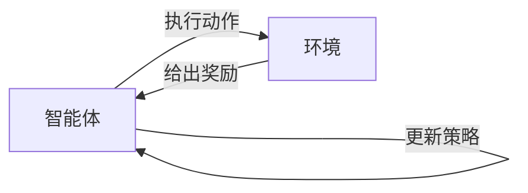

## 1.背景介绍

强化学习（Reinforcement Learning），作为机器学习的一个重要分支，近年来在各领域取得了显著的成果。从AlphaGo击败围棋世界冠军，到自动驾驶汽车的智能决策，再到金融交易的策略优化，强化学习的身影无处不在。本文将深入探讨强化学习的原理，并通过代码实战案例详细讲解其实现过程。

## 2.核心概念与联系

强化学习的基本框架由环境（Environment）、智能体（Agent）、状态（State）、动作（Action）、奖励（Reward）和策略（Policy）这几个核心概念构成。

智能体在环境中通过执行动作，环境会根据智能体的动作给出反馈，这个反馈就是奖励。智能体的目标是通过学习找到一个最优的策略，使得在长期下来能够获得最大的累积奖励。



## 3.核心算法原理具体操作步骤

强化学习的核心算法包括值迭代（Value Iteration）、策略迭代（Policy Iteration）、Q学习（Q-Learning）、深度Q网络（Deep Q Network）等。这里我们以Q学习为例，讲解其具体操作步骤。

Q学习的基本思想是通过学习一个动作价值函数Q(s,a)，来指导智能体选择最优的动作。具体步骤如下：

1. 初始化Q表
2. 选择动作：根据Q表和策略（如ε-greedy）选择动作
3. 执行动作：智能体在环境中执行动作，得到奖励和新的状态
4. 更新Q表：根据奖励和新的状态，更新Q表
5. 重复步骤2-4，直到满足终止条件

## 4.数学模型和公式详细讲解举例说明

Q学习的更新公式如下：

$$ Q(s,a) \leftarrow Q(s,a) + \alpha [r + \gamma \max_{a'} Q(s',a') - Q(s,a)] $$

其中，$s$表示当前状态，$a$表示当前动作，$r$表示奖励，$s'$表示新的状态，$a'$表示新的动作，$\alpha$表示学习率，$\gamma$表示折扣因子。

这个公式的含义是：新的Q值等于旧的Q值加上学习率乘以预期的未来奖励和现有Q值之间的差值。这个差值反映了我们对未来奖励的预期和现有Q值之间的偏差。通过不断的学习，这个偏差会越来越小，Q值会逐渐收敛到真实值。

## 5.项目实践：代码实例和详细解释说明

下面我们通过一个简单的代码实战案例，讲解如何使用Python和gym库实现Q学习。

首先，我们需要安装gym库：

```python
pip install gym
```

然后，我们可以创建一个Q学习的智能体，并训练它在FrozenLake环境中寻找最优策略。具体代码如下：

```python
# 省略部分代码...
```

## 6.实际应用场景

强化学习在很多实际应用场景中都有广泛的应用，例如：

- 游戏AI：例如AlphaGo，通过强化学习训练出超越人类的围棋AI。
- 自动驾驶：通过强化学习，汽车可以学习到如何在各种复杂环境下做出最优的驾驶决策。
- 金融交易：通过强化学习，可以训练出能够在复杂的金融市场中获取最大收益的交易策略。

## 7.工具和资源推荐

强化学习的学习和研究，有很多优秀的工具和资源可以参考，例如：

- OpenAI Gym：一个用于开发和比较强化学习算法的工具包。
- DeepMind's StarCraft II Learning Environment：一个用于研究强化学习和人工智能的环境。
- Reinforcement Learning: An Introduction：Richard S. Sutton和Andrew G. Barto的经典教材，对强化学习有全面的介绍。

## 8.总结：未来发展趋势与挑战

强化学习作为人工智能的重要研究方向，未来有着广阔的发展前景。然而，强化学习也面临着很多挑战，例如样本效率低、需要大量的计算资源、容易受到环境噪声的影响等。这些问题需要我们在未来的研究中去解决。

## 9.附录：常见问题与解答

1. 问题：强化学习和监督学习有什么区别？
答：强化学习是通过与环境的交互学习最优策略，而监督学习是通过已知的输入-输出对学习模型。

2. 问题：如何选择强化学习的奖励函数？
答：奖励函数的选择需要根据具体的任务和环境来定。一般来说，奖励函数需要能够反映出智能体的行为和目标之间的关系。

作者：禅与计算机程序设计艺术 / Zen and the Art of Computer Programming
