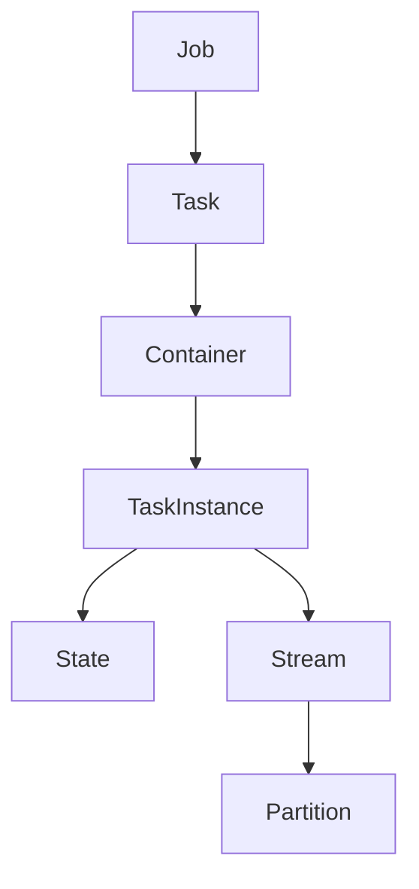

# Samza Task原理与代码实例讲解

## 1. 背景介绍

Apache Samza 是一个分布式流处理系统,由LinkedIn公司开发并开源。它旨在提供一种简单、无缝的方式来处理来自各种数据源(如Kafka、亚马逊Kinesis等)的实时数据流。Samza 的核心概念之一是 Task,它是 Samza 作业中的基本执行单元。

在现代数据密集型应用程序中,实时处理数据流变得越来越重要。无论是社交网络上的用户活动、物联网设备产生的传感器数据,还是金融交易等,都需要快速、可靠地处理大量持续到来的数据。Samza 通过 Task 提供了一种可扩展和容错的方式来实现这一目标。

### 1.1 Samza 的优势

Samza 的主要优势包括:

- **容错性和状态一致性**: Samza 通过将状态存储在 Kafka 等分布式日志系统中,实现了容错性和状态的一致性。
- **无缝集成 Kafka**: Samza 与 Kafka 深度集成,可以无缝利用 Kafka 的可靠性和可伸缩性。
- **容易扩展**: Samza 作业可以通过添加更多任务实例来轻松扩展。
- **流处理 API**: Samza 提供了一个流处理 API,使开发人员可以专注于编写业务逻辑,而不必担心底层细节。

### 1.2 Task 在 Samza 中的作用

在 Samza 中,Task 扮演着核心角色。每个 Samza 作业由一个或多个 Task 组成,每个 Task 负责处理输入流的一部分。Task 可以并行运行,从而实现水平扩展。此外,Task 还负责维护其处理过程中的状态,确保在发生故障时可以从上次的检查点恢复。

## 2. 核心概念与联系

在深入探讨 Samza Task 的原理之前,让我们先了解一些核心概念及它们之间的关系。

### 2.1 作业 (Job)

作业是 Samza 中的最顶层抽象,代表了一个完整的流处理应用程序。一个作业由一个或多个 Task 组成,每个 Task 负责处理输入流的一部分。

### 2.2 Task

Task 是 Samza 作业中的基本执行单元。每个 Task 都会被分配一个或多个 Partition,并负责处理这些 Partition 中的消息。Task 可以并行运行,从而实现水平扩展。

### 2.3 容器 (Container)

容器是 Samza 中的资源隔离单元。每个容器可以运行一个或多个 Task,并管理这些 Task 的生命周期。容器还负责与底层执行环境(如 YARN)进行交互,以获取资源和调度 Task。

### 2.4 流 (Stream)

流是 Samza 中的核心数据模型。它代表了一个无界的、持续的消息序列,可以来自各种数据源,如 Kafka 主题、Kinesis 流等。每个流都被划分为多个 Partition,以实现并行处理。

### 2.5 状态 (State)

许多流处理应用程序需要维护状态,例如计算窗口聚合或连接多个流。在 Samza 中,每个 Task 都有自己的本地状态存储,用于存储其处理过程中的状态。状态存储在底层的分布式存储系统(如 Kafka 或 RocksDB)中,以确保容错性和一致性。

### 2.6 核心概念关系图

下面的 Mermaid 流程图展示了这些核心概念之间的关系:



## 3. 核心算法原理具体操作步骤

现在,让我们深入探讨 Samza Task 的核心算法原理和具体操作步骤。

### 3.1 Task 生命周期

每个 Task 在运行时都会经历以下生命周期:

1. **初始化 (init)**: 在这个阶段,Task 会初始化其状态存储和其他资源。如果 Task 是从一个检查点恢复的,它会从检查点中恢复其状态。

2. **处理消息 (process)**: 这是 Task 的主要执行阶段。Task 会从分配给它的 Partition 中读取消息,并对这些消息执行用户定义的处理逻辑。处理过程中产生的任何状态更新都会被持久化到状态存储中。

3. **检查点 (checkpoint)**: 为了确保容错性,Task 会定期将其状态持久化到检查点中。如果 Task 发生故障,它可以从最近的检查点恢复,而不会丢失已处理的状态。

4. **关闭 (close)**: 当 Task 被终止时,它会执行必要的清理操作,例如刷新状态存储和释放资源。

这个生命周期是由 Samza 的作业协调器管理的,它负责启动、监控和恢复 Task。

### 3.2 消息处理流程

下面是 Samza Task 处理消息的具体步骤:

1. **获取消息**: Task 从分配给它的 Partition 中获取一批新消息。

2. **反序列化消息**: Task 使用用户提供的反序列化器将消息从字节数组转换为对象。

3. **应用处理逻辑**: Task 对每个消息执行用户定义的处理逻辑。这可能涉及更新内部状态、执行计算或发送新消息到输出流。

4. **持久化状态更新**: 如果处理逻辑导致了状态的更新,Task 会将这些更新持久化到其状态存储中。

5. **发送输出消息**: 如果处理逻辑产生了新的输出消息,Task 会将这些消息发送到相应的输出流中。

6. **提交偏移量**: 一旦所有消息都被成功处理,Task 会将其在输入 Partition 中的偏移量提交到 Kafka 或其他流系统中。这确保了在发生故障时,Task 可以从上次提交的偏移量恢复,而不会丢失或重复处理任何消息。

这个过程会持续重复,直到 Task 被终止或发生故障。

### 3.3 并行处理和重分区

为了实现水平扩展,Samza 允许将一个作业划分为多个 Task,每个 Task 处理输入流的一部分。具体来说,每个输入流都被划分为多个 Partition,每个 Task 被分配一个或多个 Partition。

当需要扩展作业时,Samza 可以通过添加更多 Task 实例来实现。新的 Task 实例会被分配一部分 Partition,从而分担原有 Task 的工作负载。这种动态重分区机制使 Samza 能够无缝扩展,而不会中断正在运行的作业。

### 3.4 容错性和状态一致性

Samza 通过将状态存储在分布式日志系统(如 Kafka)中,实现了容错性和状态一致性。具体来说:

1. **检查点**: Task 会定期将其状态持久化到检查点中。检查点存储在分布式日志系统中,因此它们是持久的和容错的。

2. **恢复**: 如果 Task 发生故障,它可以从最近的检查点恢复其状态,并从上次提交的偏移量继续处理消息。这确保了处理过程中不会丢失或重复任何消息。

3. **重播**: 如果发生了更严重的故障(例如整个集群崩溃),Samza 可以从输入流中重播所有消息,并使用检查点中的状态来重建 Task 的状态。这种"重播能力"确保了即使在极端情况下,处理过程也不会丢失任何数据。

通过这些机制,Samza 确保了 Task 的状态始终保持一致,并且可以从故障中恢复,从而实现了端到端的容错性。

## 4. 数学模型和公式详细讲解举例说明

虽然 Samza 主要关注流处理的实现细节,但在某些情况下,数学模型和公式也可以帮助我们更好地理解和优化系统。

### 4.1 流分区和负载均衡

假设我们有一个输入流被划分为 $N$ 个 Partition,并且有 $M$ 个 Task 实例来处理这个流。我们希望将 Partition 均匀地分配给 Task,以实现最佳的负载均衡。

令 $P_i$ 表示第 $i$ 个 Partition,而 $T_j$ 表示第 $j$ 个 Task。我们可以使用以下公式来确定每个 Task 应该处理哪些 Partition:

$$
T_j \text{ processes } P_i \text{ if } i \bmod M = j
$$

这个公式确保了每个 Partition 都被分配给一个 Task,并且 Partition 在 Task 之间均匀分布。

例如,如果我们有 4 个 Partition 和 3 个 Task,那么分配情况如下:

- $T_0$ 处理 $P_0$ 和 $P_3$
- $T_1$ 处理 $P_1$
- $T_2$ 处理 $P_2$

### 4.2 窗口聚合

许多流处理应用程序需要对流中的数据进行窗口聚合,例如计算每分钟的点击量或每小时的销售额。在 Samza 中,我们可以使用一种称为"增量聚合"的技术来高效地计算这些聚合。

假设我们要计算一个长度为 $W$ 的滑动窗口内的聚合值。令 $x_t$ 表示时间 $t$ 的输入值,而 $y_t$ 表示窗口聚合的输出值。我们可以使用以下递归公式来计算 $y_t$:

$$
y_t = y_{t-1} + x_t - x_{t-W}
$$

这个公式利用了前一个输出值 $y_{t-1}$ 和当前输入值 $x_t$,同时减去了 $W$ 个时间步长之前的输入值 $x_{t-W}$,从而实现了增量计算。

例如,如果我们要计算一个长度为 3 的滑动窗口内的和,并且输入序列是 $\{1, 2, 3, 4, 5\}$,那么输出序列将是:

$$
\begin{align*}
y_1 &= 1 \\
y_2 &= 1 + 2 - 0 = 3 \\
y_3 &= 3 + 3 - 1 = 5 \\
y_4 &= 5 + 4 - 2 = 7 \\
y_5 &= 7 + 5 - 3 = 9
\end{align*}
$$

这种增量计算方式可以大大减少计算量,提高聚合操作的效率。

## 5. 项目实践: 代码实例和详细解释说明

为了更好地理解 Samza Task 的工作原理,让我们通过一个实际的代码示例来探索它的使用方式。在这个示例中,我们将构建一个简单的流处理作业,它从 Kafka 主题中读取消息,对消息进行转换,然后将转换后的消息写回另一个 Kafka 主题。

### 5.1 项目设置

首先,我们需要设置项目依赖项和构建配置。这个示例使用 Maven 作为构建工具,并且依赖于 Samza 和 Kafka 客户端库。

```xml
<!-- pom.xml -->
<dependencies>
  <dependency>
    <groupId>org.apache.samza</groupId>
    <artifactId>samza-api</artifactId>
    <version>1.7.0</version>
  </dependency>
  <dependency>
    <groupId>org.apache.samza</groupId>
    <artifactId>samza-kafka_2.13</artifactId>
    <version>1.7.0</version>
  </dependency>
  <dependency>
    <groupId>org.apache.kafka</groupId>
    <artifactId>kafka-clients</artifactId>
    <version>2.8.1</version>
  </dependency>
</dependencies>
```

### 5.2 定义流处理任务

接下来,我们定义一个 `StreamTask` 类,它实现了 Samza 的 `StreamTask` 接口。这个类将处理输入消息并产生输出消息。

```java
import org.apache.samza.system.IncomingMessageEnvelope;
import org.apache.samza.system.OutgoingMessageEnvelope;
import org.apache.samza.system.SystemStreamPartition;
import org.apache.samza.task.InitableTask;
import org.apache.samza.task.MessageSource;
import org.apache.samza.task.StreamTask;
import org.apache.samza.task.StreamTaskFactory;

public class UppercaseTask implements StreamTask,