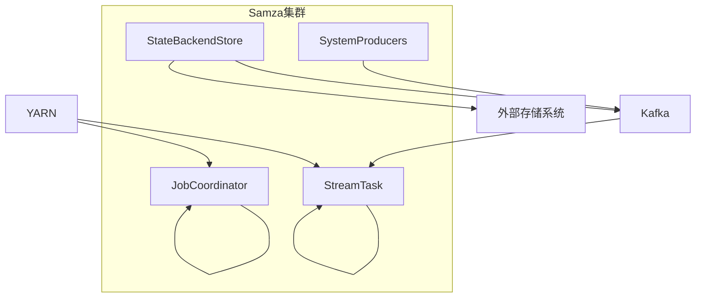

# Samza原理与代码实例讲解

## 1. 背景介绍

### 1.1 大数据流处理的需求

在当今快节奏的数字世界中,数据正以前所未有的速度被生成和传输。从社交媒体上的用户互动到物联网设备产生的传感器数据,再到金融交易和网络流量日志,海量的数据源源不断地产生着无尽的数据流。有效地处理和分析这些数据流对于企业和组织来说至关重要,因为它们可以从中获取宝贵的见解,做出更明智的决策,并提供更好的用户体验。

传统的批处理系统无法满足对实时数据处理的需求。相比之下,流处理系统能够以低延迟、高吞吐量和容错的方式处理连续的数据流。流处理系统可以实时捕获、转换和分析数据,从而支持诸如实时监控、欺诈检测、物联网数据处理等应用场景。

### 1.2 Apache Samza 简介

Apache Samza 是一个分布式的、无束缚(无共享状态)的流处理系统,最初由 LinkedIn 公司开发并开源。它建立在 Apache Kafka 和 Apache Yarn 之上,结合了日志数据持久化、流处理和资源管理等功能。Samza 旨在提供一个简单、高效且可扩展的平台,用于构建无状态的实时数据流应用程序。

Samza 的主要特点包括:

- **无状态**: Samza 采用无状态设计,所有状态都存储在外部系统(如 Kafka、数据库等),这使得系统更加简单和容错。
- **容错性**: Samza 依赖于底层系统(如 Kafka 和 YARN)提供容错能力,能够从故障中自动恢复。
- **扩展性**: Samza 可以在 YARN 上动态扩展和缩减,以满足不断变化的资源需求。
- **低延迟**: Samza 旨在提供毫秒级的低延迟数据处理。
- **简单性**: Samza 提供了一个简单的 API,使开发人员可以专注于编写业务逻辑,而不必关注底层细节。

## 2. 核心概念与联系

### 2.1 Samza 架构概览

Samza 的架构由以下几个核心组件组成:

- **JobCoordinator**: 负责协调和管理 Samza 作业的生命周期,包括启动、停止、重新平衡等操作。
- **StreamTask**: 实际执行流处理逻辑的工作单元。每个 StreamTask 都会消费一个或多个 Kafka 分区的数据,并将处理结果发送到下游系统。
- **StateBackendStore**: 用于存储和管理 StreamTask 的状态数据,支持多种后端存储系统,如 Kafka、RocksDB 等。
- **SystemProducers**: 将 StreamTask 处理后的数据发送到下游系统,如 Kafka 主题或其他存储系统。

### 2.2 Samza 和 Kafka 的关系

Samza 与 Kafka 有着密切的关系,Kafka 作为数据源为 Samza 提供输入数据流。Samza 作业会消费一个或多个 Kafka 主题中的数据,并对数据进行处理。处理后的数据可以写回到 Kafka 主题中,也可以发送到其他系统。

Kafka 不仅提供了数据持久化和复制的能力,还提供了容错和重新平衡的机制。当 Samza 作业出现故障时,它可以从 Kafka 中重新读取数据,并从上次处理的位置继续执行。此外,Kafka 还可以作为 Samza 的状态存储后端,将 StreamTask 的状态数据持久化到 Kafka 主题中。

### 2.3 Samza 和 YARN 的关系

Apache YARN(Yet Another Resource Negotiator)是 Hadoop 的资源管理和调度框架。Samza 利用 YARN 来管理和调度作业,实现资源隔离、容错和弹性扩展等功能。

在 Samza 中,JobCoordinator 会与 YARN 资源管理器(ResourceManager)交互,申请和管理计算资源。每个 StreamTask 都运行在一个 YARN 容器(Container)中,由 YARN 的 NodeManager 进行管理和监控。当资源需求发生变化时,Samza 可以动态地向 YARN 申请或释放资源,实现无缝扩展和缩减。

## 3. 核心算法原理具体操作步骤

### 3.1 Samza 作业生命周期

Samza 作业的生命周期包括以下几个主要阶段:

1. **启动**:
   - JobCoordinator 向 YARN 申请资源,并启动 StreamTask 容器。
   - StreamTask 实例化并开始消费 Kafka 主题中的数据。

2. **运行**:
   - StreamTask 持续消费和处理数据流。
   - 处理后的数据被发送到下游系统或写回 Kafka。
   - StreamTask 的状态数据被持久化到状态后端存储。

3. **重新平衡**:
   - 当 Kafka 分区发生重新分配或 StreamTask 实例数量发生变化时,会触发重新平衡过程。
   - JobCoordinator 协调重新平衡,将分区重新分配给 StreamTask。
   - StreamTask 从新分配的分区位置开始消费数据,并恢复状态。

4. **停止**:
   - 当作业被手动停止或出现严重故障时,JobCoordinator 会停止所有 StreamTask 并释放资源。

### 3.2 数据处理流程

Samza 中的数据处理流程如下:

1. **消费数据**:
   - StreamTask 从分配给它的 Kafka 分区中消费数据流。
   - 消费的数据被封装成 `IncomingMessageEnvelope` 对象。

2. **反序列化**:
   - `IncomingMessageEnvelope` 对象被传递给用户定义的 `SystemConsumer`,进行反序列化操作。
   - 反序列化后的数据被封装成 `MessageAndMetadata<KEY, VALUE>` 对象。

3. **处理数据**:
   - `MessageAndMetadata` 对象被传递给用户定义的 `StreamTask` 实现类。
   - 用户在 `StreamTask` 中编写业务逻辑,对数据进行处理。

4. **发送数据**:
   - 处理后的数据被封装成 `OutgoingMessageEnvelope` 对象。
   - `OutgoingMessageEnvelope` 对象被传递给用户定义的 `SystemProducer`,进行序列化操作。
   - 序列化后的数据被发送到下游系统,如 Kafka 主题或其他存储系统。

5. **状态管理**:
   - StreamTask 可以使用 Samza 提供的 `StateBackendStore` 接口,将状态数据持久化到外部存储系统中。
   - 在重新平衡或故障恢复时,StreamTask 可以从状态后端存储中恢复状态数据。

### 3.3 容错和重新平衡

Samza 依赖于 Kafka 和 YARN 提供容错和重新平衡的能力:

1. **容错**:
   - 如果 StreamTask 实例出现故障,YARN 会自动重启该实例。
   - 重启后的 StreamTask 实例可以从 Kafka 中获取上次处理的位置,并从该位置继续消费数据。
   - 状态数据可以从状态后端存储中恢复,确保处理的连续性。

2. **重新平衡**:
   - 当 Kafka 分区发生重新分配或 StreamTask 实例数量发生变化时,会触发重新平衡过程。
   - JobCoordinator 会协调重新平衡,将分区重新分配给 StreamTask 实例。
   - StreamTask 实例会从新分配的分区位置开始消费数据,并从状态后端存储中恢复状态数据。

通过上述机制,Samza 能够提供高可用性和无缝扩展能力,确保数据处理的连续性和正确性。

## 4. 数学模型和公式详细讲解举例说明

在流处理系统中,常常需要对数据进行聚合和统计操作。这些操作通常涉及到一些数学模型和公式。以下是一些常见的数学模型和公式,以及它们在 Samza 中的应用场景。

### 4.1 滑动窗口

滑动窗口是一种常见的数据聚合技术,用于对最近一段时间内的数据进行聚合和统计。滑动窗口可以分为时间窗口和计数窗口两种类型。

**时间窗口**

时间窗口是指在固定的时间范围内对数据进行聚合。常见的时间窗口包括:

- 滚动时间窗口(Tumbling Window)
- 滑动时间窗口(Sliding Window)
- 会话窗口(Session Window)

滚动时间窗口和滑动时间窗口的公式如下:

$$
\begin{aligned}
\text{滚动时间窗口}&: \quad \text{Window}(t, w) = [t_i, t_i + w) \\
\text{滑动时间窗口}&: \quad \text{Window}(t, w, p) = [t_i, t_i + w), [t_i + p, t_i + p + w), \ldots
\end{aligned}
$$

其中:

- $t$ 表示窗口的起始时间
- $w$ 表示窗口的长度
- $p$ 表示滑动时间窗口的步长

**计数窗口**

计数窗口是指在固定的事件数量范围内对数据进行聚合。常见的计数窗口包括:

- 滚动计数窗口(Tumbling Count Window)
- 滑动计数窗口(Sliding Count Window)

滚动计数窗口和滑动计数窗口的公式如下:

$$
\begin{aligned}
\text{滚动计数窗口}&: \quad \text{Window}(n) = [i \times n, (i + 1) \times n) \\
\text{滑动计数窗口}&: \quad \text{Window}(n, s) = [i \times s, i \times s + n), [(i + 1) \times s, (i + 1) \times s + n), \ldots
\end{aligned}
$$

其中:

- $n$ 表示窗口的大小(事件数量)
- $s$ 表示滑动计数窗口的步长(事件数量)

在 Samza 中,可以使用 `WindowPane` 和 `WindowPaneGetter` 接口来实现滑动窗口操作。开发人员可以根据具体的业务需求,选择合适的窗口类型和参数。

### 4.2 指数加权移动平均线(EWMA)

指数加权移动平均线(Exponentially Weighted Moving Average, EWMA)是一种常用的平滑技术,用于计算一个序列的加权平均值。EWMA 对最新的观测值赋予较高的权重,对较旧的观测值赋予较低的权重,从而能够更好地反映序列的最新趋势。

EWMA 的公式如下:

$$
\text{EWMA}_t = \alpha \times y_t + (1 - \alpha) \times \text{EWMA}_{t-1}
$$

其中:

- $\text{EWMA}_t$ 表示时间 $t$ 时的 EWMA 值
- $y_t$ 表示时间 $t$ 时的观测值
- $\alpha$ 是平滑系数,取值范围为 $(0, 1)$
- $\text{EWMA}_{t-1}$ 表示时间 $t-1$ 时的 EWMA 值

平滑系数 $\alpha$ 决定了 EWMA 对最新观测值和历史值的权重分配。$\alpha$ 值越大,EWMA 对最新观测值的权重就越高,对历史值的权重就越低,反之亦然。

在 Samza 中,EWMA 可以用于计算各种指标的移动平均值,如请求延迟、吞吐量等。通过选择合适的平滑系数,可以更好地反映这些指标的实时变化趋势。

### 4.3 分位数估计

在流处理系统中,常常需要估计数据流中某个指标的分位数(如延迟的 99 百分位数)。分位数估计可以帮助我们了解数据的分布情况,并设置合理的服务级别目标(SLO)。

常见的分位数估计算法包括:

- **直方图算法**:将数据划分为多个桶,每个桶记录落入该区间的数据个数。通过桶的边界和计数,可以