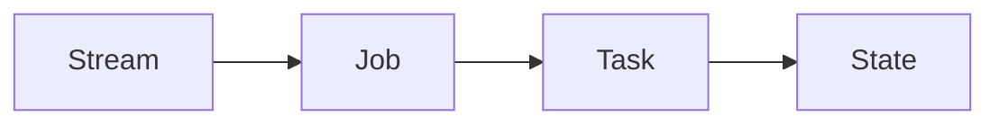

# Samza在企业级应用中的最佳实践

作者：禅与计算机程序设计艺术 / Zen and the Art of Computer Programming

## 1. 背景介绍

### 1.1 大数据处理的挑战
在当今大数据时代,企业面临着海量数据的采集、存储、处理和分析等一系列挑战。传统的批处理模式已经无法满足实时性要求,流式数据处理成为大数据领域的新宠。然而,构建高可用、高性能、易扩展的流式大数据处理系统并非易事。

### 1.2 流式计算框架的发展
为了应对流式大数据处理的挑战,业界涌现出多种流式计算框架,如Storm、Spark Streaming、Flink等。其中,由LinkedIn开源的分布式流式处理框架Samza以其简洁的API设计、高吞吐低延迟、灵活的部署模式等优势脱颖而出,成为企业级流式大数据处理的利器之一。

### 1.3 Samza的应用现状
目前,Samza已经在LinkedIn、Uber、Netflix等知名互联网公司的生产环境中大规模应用,支撑着诸如实时数据分析、异常检测、个性化推荐等关键业务。本文将深入探讨Samza在企业级应用中的最佳实践,帮助开发者更好地掌握和运用这一优秀的流式计算框架。

## 2. 核心概念与联系

### 2.1 Samza的核心概念

#### 2.1.1 流(Stream)
在Samza中,所有的输入数据都被抽象为流。流由一系列连续的消息(Message)组成,每个消息都有一个特定的键(Key)。

#### 2.1.2 作业(Job)
一个Samza作业定义了对输入流进行处理的计算逻辑,由一个或多个任务(Task)组成。每个任务负责处理流的一个分区(Partition)。

#### 2.1.3 任务(Task) 
任务是Samza作业的基本执行单元,运行在Yarn容器中。每个任务持续消费一个流分区,并对接收到的消息执行计算逻辑。

#### 2.1.4 状态(State)
Samza提供了一个基于键值对的状态存储,允许任务在处理消息时读写状态数据。状态存储支持本地和远程两种模式。

### 2.2 核心概念之间的关系

下面通过一个Mermaid流程图来展示Samza的核心概念之间的关系:



从图中可以看出:
- 作业(Job)订阅一个或多个输入流(Stream)
- 作业由多个任务(Task)组成,每个任务处理流的一个分区
- 任务在处理消息时可以访问状态存储(State)

## 3. 核心算法原理具体操作步骤

### 3.1 基于Samza的流式Join算法

在实际应用中,我们经常需要对来自不同流的消息执行Join操作。Samza提供了一种高效的流式Join算法,具体步骤如下:

1. 为每个输入流分配一个任务,任务订阅流的一个分区。

2. 每个任务维护一个本地状态存储,用于缓存接收到的消息。

3. 当任务收到一个消息时,根据Join键将其写入状态存储。

4. 任务定期扫描状态存储,找出可以进行Join的消息对,并将Join结果发送到下游。

5. 为了防止状态存储无限增长,需要对陈旧的消息进行清理。可以为每个消息设置一个超时时间,当消息在状态存储中驻留超过该时间后就将其删除。

### 3.2 基于窗口的聚合算法

另一个常见的流式计算场景是对一段时间内的消息进行聚合操作,如计算一分钟内的消息数量。Samza提供了基于时间窗口和会话窗口的聚合算法支持。

以时间窗口为例,具体步骤如下:

1. 任务在本地状态存储中为每个聚合键(如用户ID)维护一个独立的窗口。

2. 当收到一条消息时,根据其时间戳找到对应的窗口,并将其添加到窗口中。 

3. 当一个窗口结束时,任务对该窗口内的所有消息执行聚合操作,并输出聚合结果。

4. 窗口结束后,任务将窗口从状态存储中移除,以释放内存。

## 4. 数学模型和公式详细讲解举例说明

在Samza中,流式Join和窗口聚合都依赖于状态存储。下面我们通过数学建模来分析状态存储的空间复杂度。

### 4.1 流式Join的状态存储建模

假设有两个输入流$S_1$和$S_2$,它们的到达速率分别为$\lambda_1$和$\lambda_2$。Join的时间窗口长度为$T$。

对于流$S_i (i=1,2)$,在时间窗口$T$内到达的消息数量服从泊松分布:

$$
N_i \sim \mathrm{Poisson}(\lambda_i T)
$$

其中,泊松分布的概率质量函数为:

$$
P(N_i=k)=\frac{(\lambda_i T)^k e^{-\lambda_i T}}{k!}, k=0,1,2,\dots
$$

因此,在最坏情况下,每个任务需要在状态存储中保存$O((\lambda_1+\lambda_2)T)$条消息。

### 4.2 窗口聚合的状态存储建模

假设聚合窗口的长度为$W$,滑动步长为$S$。那么,在任意时刻,每个任务需要维护$\lceil W/S \rceil$个窗口。

假设消息的到达速率为$\lambda$,则在一个窗口期内到达的消息数量的期望为:

$$
E[N]=\lambda W
$$

因此,每个任务的状态存储空间复杂度为$O(\lceil W/S \rceil \cdot \lambda W)$。

通过以上建模分析,我们可以得出以下结论:

1. 流式Join的状态存储开销与Join时间窗口长度成正比,与输入流的速率成正比。

2. 窗口聚合的状态存储开销与窗口数量和窗口长度成正比,也与输入流的速率成正比。

3. 为了控制状态存储的开销,我们需要合理设置Join窗口和聚合窗口的长度,并对陈旧数据进行清理。

## 5. 项目实践：代码实例和详细解释说明

下面通过一个具体的Samza应用案例,演示如何使用Samza API实现一个基于时间窗口的单词计数程序。

### 5.1 输入数据准备

假设我们有一个名为"word-stream"的输入流,里面的每条消息都是一个单词。我们的目标是统计每个单词在一分钟内出现的次数。

### 5.2 Samza任务实现

```java
public class WordCountTask implements StreamTask, InitableTask, WindowableTask {

  private static final Logger LOG = LoggerFactory.getLogger(WordCountTask.class);
  
  // 定义一分钟的窗口长度
  private static final Duration WINDOW_DURATION = Duration.ofMinutes(1);
  
  private KeyValueStore<String, Integer> store;
  
  @Override
  public void init(Config config, TaskContext context) {
    // 初始化状态存储
    this.store = (KeyValueStore<String, Integer>) context.getStore("word-count-store");
  }

  @Override
  public void process(IncomingMessageEnvelope envelope, MessageCollector collector, TaskCoordinator coordinator) {
    // 从输入消息中提取单词
    String word = (String) envelope.getMessage();
    
    // 获取当前单词的计数,如果不存在则初始化为0
    Integer count = store.get(word);
    if (count == null) {
      count = 0;
    }
    
    // 将单词计数加1并写回状态存储
    count++;
    store.put(word, count);
  }

  @Override
  public void window(MessageCollector collector, TaskCoordinator coordinator) {
    // 定期(如每分钟)输出窗口内的单词计数
    for (Map.Entry<String, Integer> entry : store.all()) {
      String word = entry.getKey();
      Integer count = entry.getValue();
      collector.send(new OutgoingMessageEnvelope(new SystemStream("kafka", "word-count-output"), word, count));
      LOG.info("Window result - word: {}, count: {}", word, count);
    }
    // 清空状态存储,为下一个窗口做准备
    store.flush();
  }

  @Override
  public Duration getWindowDuration() {
    return WINDOW_DURATION;
  }

}
```

### 5.3 代码说明

1. WordCountTask实现了Samza提供的三个接口:
   - StreamTask: 定义了如何处理输入消息的process方法
   - InitableTask: 定义了任务初始化逻辑的init方法
   - WindowableTask: 定义了窗口触发逻辑的window方法和窗口长度的getWindowDuration方法

2. 在init方法中,我们初始化了一个本地的KeyValueStore,用于存储单词计数。

3. 在process方法中,我们从输入消息中提取单词,并更新单词在状态存储中的计数。

4. 在window方法中,我们遍历状态存储中的所有单词及其计数,并将它们发送到下游的Kafka输出流中。

5. 最后,我们清空状态存储,为下一个窗口做准备。

通过以上的代码实现,我们就完成了一个基于时间窗口的单词计数程序。Samza会自动触发窗口计算,并管理任务的状态存储。

## 6. 实际应用场景

Samza在企业级应用中有广泛的应用场景,下面列举几个典型案例:

### 6.1 实时日志处理

互联网公司通常会收集大量的用户行为日志,如页面访问、点击、搜索等。利用Samza,我们可以实时处理这些日志,实现以下功能:

- 统计热门页面、热门搜索词等
- 检测异常行为,如恶意刷单、爬虫等
- 生成实时报表,如每分钟的PV、UV等

### 6.2 实时数据管道

在微服务架构下,不同的服务通过消息队列传输数据。Samza可以充当实时数据管道的角色,实现以下功能:

- 数据格式转换,如将JSON转换为Avro
- 数据丰富,如关联维度数据
- 数据过滤,如过滤掉无效数据
- 数据分发,如将数据路由到不同的下游系统

### 6.3 实时特征工程

在机器学习场景下,我们经常需要实时计算各种特征,如用户的行为特征、画像特征等。利用Samza,我们可以:

- 实时聚合用户的行为数据,如计算过去一小时的点击次数
- 实时关联用户的静态画像,如年龄、性别等
- 实时编码分类特征,如将城市编码为one-hot向量

通过Samza,我们能够实现端到端的实时特征工程流水线,为机器学习模型提供新鲜的特征数据。

## 7. 工具和资源推荐

### 7.1 Samza官方文档

Samza的官方文档是学习和使用Samza的权威资料,包括以下内容:

- Quickstart指南
- API参考
- 部署指南
- 配置参考
- 性能调优指南

链接: http://samza.apache.org/learn/documentation/latest/

### 7.2 Samza Github仓库

Samza的源代码托管在Github上,我们可以从中学习Samza的实现原理,并为Samza的发展做贡献。

链接: https://github.com/apache/samza

### 7.3 Samza邮件列表

加入Samza的邮件列表,可以与Samza的开发者和用户交流,了解Samza的最新动态和实践经验。

- 用户邮件列表: user@samza.apache.org
- 开发者邮件列表: dev@samza.apache.org

## 8. 总结：未来发展趋势与挑战

### 8.1 与其他流计算引擎的融合

Samza与Flink、Spark Streaming等流计算引擎各有特色。未来Samza可能会与这些引擎进一步融合,实现互补。例如:

- 支持Flink的状态管理和窗口API
- 支持Spark Streaming的micro-batch处理模型
- 统一SQL API,提供更声明式的编程体验

### 8.2 无服务器化

目前Samza依赖于Yarn进行资源管理和任务调度。随着无服务器计算的兴起,