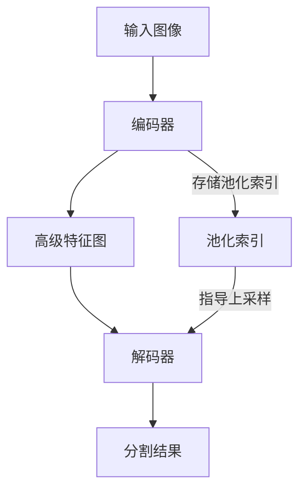
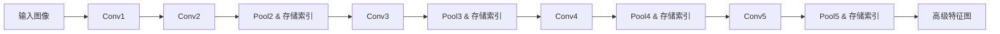
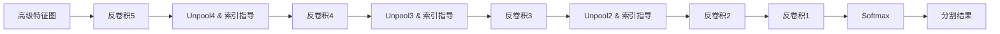

# SegNet原理与代码实例讲解

## 1.背景介绍

图像语义分割是计算机视觉领域的一项重要任务,旨在将图像中的每个像素分类到预定义的类别中。它在自动驾驶、医学图像分析、遥感图像解译等领域有广泛应用。近年来,深度学习方法尤其是卷积神经网络(CNN)在图像语义分割任务上取得了显著进展。

SegNet是由剑桥大学计算机视觉与模式识别组提出的一种用于像素级图像分割的全卷积网络架构。它是第一个采用Encoder-Decoder架构进行端到端学习的语义分割网络。SegNet能够同时兼顾分割精度和推理速度,是一种实用高效的语义分割模型。

### 1.1 语义分割任务定义
语义分割是对图像中的每个像素进行分类,预测其所属的类别标签。形式化地,对于输入图像$I\in\mathbb{R}^{H\times W\times 3}$,语义分割任务就是学习一个映射函数$f$:

$$f:I\rightarrow M, M\in\{1,2,...,K\}^{H\times W}$$

其中$H,W$分别表示图像的高度和宽度,$K$表示预定义的类别数。$M$就是生成的分割掩膜,表示每个像素的类别标签。

### 1.2 卷积神经网络用于语义分割
卷积神经网络(CNN)由于其强大的特征学习能力,已成为图像语义分割的主流方法。将CNN应用于语义分割主要有两种范式:

1. 基于图像块的分类方法:将图像分割为固定大小的图像块,然后用CNN对每个图像块进行分类。该方法实现简单,但是存在块间标签不一致等问题。

2. 全卷积网络(FCN):通过卷积层和池化层逐步缩小特征图尺寸,然后通过反卷积或插值上采样恢复到原始分辨率,可以实现端到端、像素到像素的密集预测。FCN是当前语义分割的主流框架。

SegNet就是一种代表性的全卷积语义分割网络。下面将详细介绍SegNet的网络结构、原理和代码实现。

## 2.核心概念与联系

在详细讲解SegNet之前,首先介绍几个核心概念:编码器(Encoder)、解码器(Decoder)、池化索引(pooling indices)。理解这些概念对于掌握SegNet的工作原理至关重要。

### 2.1 编码器(Encoder)
编码器由卷积层和池化层组成,负责提取图像的多尺度特征。卷积层用于提取局部特征,池化层用于减小特征图尺寸、增大感受野。编码器将输入图像转化为高级语义特征图。SegNet使用VGG16的13个卷积层作为编码器。

### 2.2 解码器(Decoder) 
解码器是编码器的镜像,由反卷积层和非线性层组成。解码器将编码器生成的特征图还原到原始分辨率,同时进行像素级分类。SegNet的解码器使用与编码器对应的反卷积层,并使用存储的池化索引进行非线性上采样。

### 2.3 池化索引(pooling indices)
池化索引是SegNet的一大创新点。对于编码器中的每个最大池化层,SegNet会存储每个最大值的位置,形成池化索引。在解码过程中,这些池化索引用于非线性上采样,指导反卷积层恢复空间信息。

下图展示了编码器、解码器、池化索引在SegNet中的作用与联系:

编码器提取特征和空间信息,解码器利用池化索引恢复空间信息并生成分割结果。SegNet巧妙地利用池化索引,在不增加参数量的情况下,实现了高效的特征提取和分割图还原。

## 3.核心算法原理与操作步骤

SegNet的核心是Encoder-Decoder架构和池化索引传递机制。下面详细介绍SegNet的算法原理和操作步骤。

### 3.1 编码器(Encoder)
1. 输入图像经过预处理,调整到固定尺寸如224x224。

2. 使用VGG16的13个卷积层提取特征:
   - 前两个卷积块(conv1, conv2)不使用池化层,保留更多空间信息
   - 后三个卷积块(conv3, conv4, conv5)使用步长为2的最大池化
   - 卷积核大小为3x3,激活函数为ReLU

3. 生成高级语义特征图,尺寸为输入图像的1/32。同时存储池化索引,记录最大值位置。

### 3.2 解码器(Decoder)
1. 解码器是编码器的镜像,包含与编码器对应的反卷积层。

2. 对最后一个编码器输出的特征图,使用存储的池化索引进行非线性上采样。

3. 上采样后的特征图送入反卷积层,生成与编码器对应尺寸的特征图。

4. 重复步骤2-3,直到恢复到原始图像分辨率。

5. 最后使用一个1x1卷积层,将通道数映射为类别数K,然后使用softmax激活,得到每个像素的类别概率。

### 3.3 训练过程
1. 使用图像-标签对作为训练数据,图像通过SegNet生成预测分割图。

2. 预测分割图与Ground Truth标签图计算损失,一般使用交叉熵损失函数。

3. 损失函数关于网络参数求梯度,使用随机梯度下降等优化算法更新参数。

4. 重复步骤1-3,直到模型收敛或达到预设的迭代次数。

SegNet的创新在于,通过存储池化索引、非线性上采样,既减少了编码器的参数量,又保留了更多的空间信息。这使得SegNet能够在准确率和推理速度之间取得很好的平衡。

## 4.数学模型和公式详细讲解举例说明

这部分我们详细讲解SegNet中使用的几个关键数学模型和公式,并给出具体的例子帮助理解。

### 4.1 卷积操作
卷积是卷积神经网络的核心操作,可以提取局部特征。二维卷积的数学定义为:

$$(f*g)(i,j)=\sum_m \sum_n f(m,n)g(i-m,j-n)$$

其中$f$为输入特征图,$g$为卷积核,$*$表示卷积操作。

举例说明,假设我们有一个3x3的输入特征图和一个2x2的卷积核:

输入特征图:
$$\begin{bmatrix}
1 & 2 & 3\\
4 & 5 & 6\\
7 & 8 & 9
\end{bmatrix}$$

卷积核:
$$\begin{bmatrix}
1 & 0\\
0 & 1
\end{bmatrix}$$

则卷积结果为:
$$\begin{bmatrix}
1*1+2*0+4*0+5*1 & 2*1+3*0+5*0+6*1\\
4*1+5*0+7*0+8*1 & 5*1+6*0+8*0+9*1
\end{bmatrix}=
\begin{bmatrix}
6 & 8\\
12 & 14
\end{bmatrix}$$

SegNet的编码器中大量使用了卷积操作来提取图像特征。

### 4.2 最大池化与池化索引
最大池化是一种常用的下采样操作,可以减小特征图尺寸、增大感受野。设输入特征图为$X\in\mathbb{R}^{H\times W\times C}$,池化窗口大小为$k\times k$,步长为$s$,则最大池化操作为:

$$Y_{i,j,c}=\max_{0\leq m,n<k}X_{si+m,sj+n,c}$$

其中$Y$为输出特征图。

SegNet在最大池化的同时会记录最大值的位置索引,形成池化索引$M$:

$$M_{i,j,c}=\arg\max_{0\leq m,n<k}X_{si+m,sj+n,c}$$

举例说明,假设我们有一个4x4的输入特征图,使用2x2最大池化,步长为2:

输入特征图:
$$\begin{bmatrix}
1 & 2 & 3 & 4\\
5 & 6 & 7 & 8\\
9 & 10 & 11 & 12\\
13 & 14 & 15 & 16
\end{bmatrix}$$

则最大池化结果为:
$$\begin{bmatrix}
6 & 8\\
14 & 16
\end{bmatrix}$$

对应的池化索引为:
$$\begin{bmatrix}
(1,1) & (1,3)\\
(3,1) & (3,3)
\end{bmatrix}$$

SegNet巧妙地利用池化索引在解码器中恢复空间信息,减少了编码器的参数量。

### 4.3 反卷积操作
反卷积又称为转置卷积,是卷积操作的逆过程,可以用于上采样。设输入特征图为$X\in\mathbb{R}^{H\times W\times C}$,反卷积核为$K\in\mathbb{R}^{k\times k\times C\times D}$,步长为$s$,则反卷积操作为:

$$Y_{i,j,d}=\sum_{c=1}^C\sum_{m=1}^k\sum_{n=1}^k X_{\lfloor\frac{i+m-1}{s}\rfloor,\lfloor\frac{j+n-1}{s}\rfloor,c}K_{m,n,c,d}$$

其中$Y\in\mathbb{R}^{sH\times sW\times D}$为输出特征图。

举例说明,假设我们有一个2x2的输入特征图,使用2x2的反卷积核,步长为2:

输入特征图:
$$\begin{bmatrix}
1 & 2\\
3 & 4
\end{bmatrix}$$

反卷积核:
$$\begin{bmatrix}
1 & 0\\
0 & 1
\end{bmatrix}$$

则反卷积结果为:
$$\begin{bmatrix}
1 & 0 & 2 & 0\\
0 & 0 & 0 & 0\\
3 & 0 & 4 & 0\\
0 & 0 & 0 & 0
\end{bmatrix}$$

可以看到,反卷积操作将输入特征图的尺寸扩大了2倍。SegNet的解码器使用反卷积层逐步恢复特征图的空间分辨率。

### 4.4 softmax函数
softmax函数常用于多分类任务,将输入向量归一化为概率分布。设输入向量为$\mathbf{z}=[z_1,z_2,...,z_K]\in\mathbb{R}^K$,则softmax函数定义为:

$$\text{softmax}(z_i)=\frac{e^{z_i}}{\sum_{j=1}^K e^{z_j}}$$

举例说明,假设我们有一个输入向量$\mathbf{z}=[1,2,3]$,则softmax函数输出为:

$$\text{softmax}(\mathbf{z})=[\frac{e^1}{e^1+e^2+e^3},\frac{e^2}{e^1+e^2+e^3},\frac{e^3}{e^1+e^2+e^3}]=[0.09,0.24,0.67]$$

SegNet的最后一层使用softmax函数