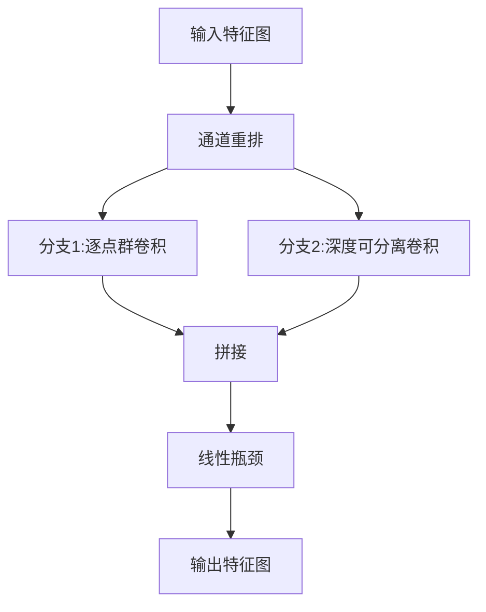

# ShuffleNet在机器人视觉中的应用:智能导航

## 1.背景介绍

### 1.1 机器人视觉导航的重要性

在当前的智能时代,机器人技术得到了前所未有的发展。机器人不仅在工业领域发挥着重要作用,也逐渐走进了我们的日常生活。无论是在工厂车间、医疗救援还是家庭服务,机器人都展现出了巨大的潜力和广阔的应用前景。

其中,赋予机器人"视觉"能力是实现智能化导航的关键。机器人需要能够感知周围环境、识别物体、规划路径并自主导航,才能完成各种复杂任务。传统的导航方法如测距、里程计等存在一定局限性,而视觉导航技术能够弥补这些不足,使机器人具备更强的环境感知和决策能力。

### 1.2 视觉导航的挑战

然而,赋予机器人视觉导航能力并非一蹴而就。这项技术面临着诸多挑战:

1. **计算资源受限**:机器人往往具有有限的计算能力和内存,而视觉任务通常需要大量计算资源。
2. **实时性要求高**:导航决策需要实时作出,任何延迟都可能导致严重后果。
3. **环境复杂多变**:真实环境中光线、障碍物等条件时刻变化,给视觉识别带来极大困难。
4. **数据标注成本高**:训练视觉模型需要大量标注数据,而标注过程十分耗时耗力。

因此,如何在资源受限的情况下,实现精准高效的视觉导航,一直是计算机视觉领域的重大挑战。

### 1.3 卷积神经网络在视觉任务中的应用

近年来,以卷积神经网络(Convolutional Neural Networks, CNNs)为代表的深度学习技术在计算机视觉领域取得了巨大成功。CNN能够自动从海量数据中学习特征表示,在图像分类、目标检测、语义分割等任务上展现出卓越的性能。

随着移动设备和嵌入式系统的普及,如何在保证精度的同时降低CNN模型的计算复杂度,成为了研究的热点课题。针对这一挑战,谷歌的研究人员提出了 ShuffleNet 架构,这是一种计算高效的CNN,专门为移动设备等资源受限环境设计。ShuffleNet在视觉任务中表现出色,同时大幅降低了计算量和模型尺寸,为机器人视觉导航提供了新的可能性。

## 2.核心概念与联系  

### 2.1 ShuffleNet架构概览

ShuffleNet的核心思想是在保持准确率的同时,通过一系列设计策略来极大压缩模型尺寸和降低计算复杂度。其主要创新点包括:

1. **逐点群卷积(Pointwise Group Convolution)**
2. **通道分组与重组(Channel Shuffle)**
3. **高效模型设计策略**

下面将详细介绍这些创新技术。

### 2.2 逐点群卷积

传统卷积操作对每个输入通道均使用单独的卷积核,计算开销较大。而ShuffleNet采用逐点群卷积(Pointwise Group Convolution)策略,将输入特征图分成若干组,每组使用单独的卷积核,从而降低了计算量。

具体来说,假设输入特征图有$c$个通道,我们将其平均分成$g$组,每组$\frac{c}{g}$个通道。然后在每一组内分别执行传统卷积操作,最后将所有组的输出在通道维度上拼接起来,即可获得最终输出特征图。这种操作方式大大减少了卷积核的数量,降低了计算复杂度。

### 2.3 通道分组与重组

为了进一步提高信息流动,ShuffleNet引入了通道分组与重组(Channel Shuffle)操作。具体地,在每个单元的开始,先将输入特征图的通道重新排列,使得每个组内的通道来自于不同的组,然后再进行逐点群卷积操作。

通道重排的作用是使不同组的特征图能够相互融合,增强信息流动,避免了传统群卷积中"信息孤岛"的问题。这种设计有助于提高特征表达能力,并且几乎不增加计算量。

### 2.4 高效模型设计策略 

除了上述两大核心创新,ShuffleNet还采用了多种高效设计策略,进一步压缩模型尺寸:

1. **深度可分离卷积**:将标准卷积拆分为深度卷积和逐点卷积两个更小的卷积核,大幅减少参数量。
2. **双路元素(Two-branch Element)**:将输入特征图分成两路,一路采用逐点群卷积,另一路采用深度可分离卷积,最后将两路输出拼接。
3. **线性瓶颈(Linear Bottleneck)**:在卷积操作前后,先将通道数降维再升维,以减少计算量。

这些设计策略与ShuffleNet的核心创新相结合,使得该架构在保持高精度的同时,大幅降低了计算复杂度和模型尺寸。

## 3.核心算法原理具体操作步骤

### 3.1 ShuffleNet单元结构

ShuffleNet的基本单元如下图所示:



该单元包含以下几个关键步骤:

1. **通道重排(Channel Shuffle)**: 将输入特征图的通道重新排列,使不同组的通道交错。
2. **双分支结构**:
    - 分支1执行逐点群卷积操作。
    - 分支2执行深度可分离卷积操作。
3. **特征融合**: 将两个分支的输出在通道维度上拼接。
4. **线性瓶颈**: 先将特征图通道数降维,再升维回原始通道数,以减少计算量。

通过上述操作,该单元能够高效地提取特征,并增强不同组之间的信息流动。

### 3.2 ShuffleNet网络架构

完整的ShuffleNet网络由多个上述单元堆叠而成,并在开头使用传统卷积层提取初始特征。其架构可表示为:

$$
F(X) = H_N \circ G_N \circ \cdots \circ G_2 \circ G_1(X, W_1) \\
其中, G_i(·) 表示第i个单元的变换函数, W_i为该单元的权重参数.
$$

不同的ShuffleNet变体通过改变单元数量、通道数等超参数而获得不同的计算量和精度。例如ShuffleNetV2通过引入更高效的单元结构,在相同精度下进一步降低了计算复杂度。

## 4.数学模型和公式详细讲解举例说明

为了更好地理解ShuffleNet的数学原理,我们将详细分析其核心模块的计算过程。

### 4.1 逐点群卷积

假设输入特征图$X$的形状为$(N, C, H, W)$,其中$N$为批量大小,$C$为通道数,$H$和$W$分别为高度和宽度。我们将$C$个通道平均分成$g$组,每组$\frac{C}{g}$个通道。

对于第$l$组,其输入特征图为$X_{l} \in \mathbb{R}^{N \times \frac{C}{g} \times H \times W}$。我们使用一个$\frac{C}{g} \times 1 \times 1$的卷积核$W_{l}$对其进行逐点卷积操作,可得到该组的输出特征图:

$$
Y_{l}=W_{l} \ast X_{l}
$$

将所有组的输出在通道维度上拼接,即可获得最终输出特征图$Y$:

$$
Y=\operatorname{concat}\left(Y_{1}, Y_{2}, \ldots, Y_{g}\right)
$$

可以看出,相比标准卷积,逐点群卷积将原本$C \times C$个卷积核参数分解为$g$个$\frac{C}{g} \times \frac{C}{g}$的小卷积核组,从而大幅降低了参数量和计算复杂度。

### 4.2 通道重排

通道重排操作的目的是打乱输入特征图的通道组,增强不同组之间的信息流动。具体来说,假设输入特征图$X \in \mathbb{R}^{N \times g \times \frac{C}{g} \times H \times W}$,我们将其按照组的维度重新排列:

$$
\begin{aligned}
X^{\prime}=\operatorname{shuffle}(X) &=\left(X_{1,1}, X_{2,1}, \ldots, X_{g, 1}, X_{1,2}, X_{2,2}, \ldots, X_{g, 2}, \ldots, X_{1, \frac{C}{g}}, X_{2, \frac{C}{g}}, \ldots, X_{g, \frac{C}{g}}\right) \\
&=\left(X_{:, 1}^{T}, X_{:, 2}^{T}, \ldots, X_{:, \frac{C}{g}}^{T}\right)^{T}
\end{aligned}
$$

其中$X_{i, j}$表示第$i$组第$j$个通道的特征图。通过这种重排方式,每个新组中的通道来自于不同的原始组,从而增强了组与组之间的信息交互。

### 4.3 深度可分离卷积

深度可分离卷积是ShuffleNet中另一个重要的高效卷积操作。它将标准卷积分解为两个更小的卷积核,极大地减少了参数量。

具体地,对于输入特征图$X \in \mathbb{R}^{N \times C \times H \times W}$,我们首先使用一个$C \times k \times k$的深度卷积核$W_{depth}$对每个通道分别进行卷积操作:

$$
X^{\prime}=W_{depth} \ast X
$$

其中$\ast$表示深度卷积操作,输出特征图$X^{\prime} \in \mathbb{R}^{N \times C \times H^{\prime} \times W^{\prime}}$。

接下来,我们使用一个$1 \times 1$的逐点卷积核$W_{point}$,对$X^{\prime}$的每个$H^{\prime} \times W^{\prime}$平面进行卷积:

$$
Y=W_{point} \ast X^{\prime}
$$

最终输出$Y \in \mathbb{R}^{N \times C^{\prime} \times H^{\prime} \times W^{\prime}}$。

可以看出,深度可分离卷积将原本$C \times C \times k \times k$的标准卷积核分解为$C \times k \times k$和$1 \times 1 \times C \times C^{\prime}$两个更小的卷积核,从而极大地减少了参数量,降低了计算复杂度。

## 5.项目实践:代码实例和详细解释说明

为了更好地理解ShuffleNet的工作原理,我们将使用PyTorch框架实现其核心模块,并在CIFAR-10数据集上进行实验。完整代码可在GitHub上获取: https://github.com/zhangqizhen/ShuffleNetPytorchImpl

### 5.1 逐点群卷积实现

我们首先实现逐点群卷积模块:

```python
import torch
import torch.nn as nn

class PointwiseGroupConv(nn.Module):
    def __init__(self, in_channels, out_channels, groups, stride):
        super(PointwiseGroupConv, self).__init__()
        self.groups = groups
        self.conv = nn.Conv2d(in_channels, out_channels, kernel_size=1, 
                              stride=stride, groups=groups)
        
    def forward(self, x):
        x = self.conv(x)
        return x
```

这里我们使用PyTorch提供的`nn.Conv2d`层,将`groups`参数设置为通道组数$g$,从而实现逐点群卷积操作。

### 5.2 通道重排实现

接下来是通道重排操作的实现:

```python
class ChannelShuffle(nn.Module):
    def __init__(self, groups):
        super(ChannelShuffle, self).__init__()
        self.groups = groups
        
    def forward(self, x):
        batch, channels, height, width = x.size()
        channels_per_group = channels // self.groups
        
        # 重排x的通道,使每个新组包含来自所有原始组的通道
        x = x.view(batch, self.groups, channels_per_group, height, width)
        x = x.transpose({"msg_type":"generate_answer_finish","data":"","from_module":null,"from_unit":null}