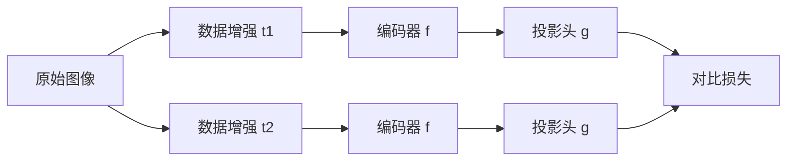

# SimCLR原理与代码实例讲解

## 1. 背景介绍
### 1.1 无监督学习的重要性
### 1.2 对比学习的兴起
### 1.3 SimCLR的提出与影响

## 2. 核心概念与联系
### 2.1 对比学习
#### 2.1.1 正样本与负样本
#### 2.1.2 对比损失函数
### 2.2 数据增强
#### 2.2.1 图像变换
#### 2.2.2 数据增强在SimCLR中的作用
### 2.3 编码器网络
#### 2.3.1 卷积神经网络
#### 2.3.2 非线性映射
### 2.4 对比预测任务
#### 2.4.1 最大化正样本相似度
#### 2.4.2 最小化负样本相似度

## 3. 核心算法原理具体操作步骤
### 3.1 数据准备
#### 3.1.1 数据集选择
#### 3.1.2 数据预处理
### 3.2 数据增强
#### 3.2.1 随机裁剪
#### 3.2.2 颜色变换
#### 3.2.3 高斯模糊
### 3.3 编码器网络
#### 3.3.1 ResNet架构
#### 3.3.2 投影头
### 3.4 对比损失计算
#### 3.4.1 正负样本对构建
#### 3.4.2 NT-Xent损失函数
### 3.5 模型训练
#### 3.5.1 优化器选择
#### 3.5.2 学习率调度
#### 3.5.3 训练过程监控

## 4. 数学模型和公式详细讲解举例说明 
### 4.1 对比损失函数推导
#### 4.1.1 softmax函数
#### 4.1.2 交叉熵损失
### 4.2 梯度计算与反向传播
#### 4.2.1 链式法则
#### 4.2.2 梯度下降优化
### 4.3 数值稳定性问题
#### 4.3.1 指数移位技巧
#### 4.3.2 梯度裁剪

## 5. 项目实践：代码实例和详细解释说明
### 5.1 基于PyTorch的SimCLR实现
#### 5.1.1 数据加载与预处理
#### 5.1.2 数据增强模块
#### 5.1.3 编码器网络构建
#### 5.1.4 对比损失函数实现
#### 5.1.5 训练循环与优化
### 5.2 超参数调优
#### 5.2.1 批次大小
#### 5.2.2 学习率
#### 5.2.3 温度系数
### 5.3 线性评估
#### 5.3.1 固定编码器权重
#### 5.3.2 训练线性分类器
#### 5.3.3 评估指标计算

## 6. 实际应用场景
### 6.1 图像分类
### 6.2 物体检测
### 6.3 语义分割
### 6.4 医学影像分析
### 6.5 遥感图像解译

## 7. 工具和资源推荐
### 7.1 深度学习框架
#### 7.1.1 PyTorch
#### 7.1.2 TensorFlow
### 7.2 预训练模型库
#### 7.2.1 TorchVision
#### 7.2.2 Keras Applications  
### 7.3 开源实现
#### 7.3.1 官方实现
#### 7.3.2 第三方复现
### 7.4 数据集资源
#### 7.4.1 ImageNet
#### 7.4.2 CIFAR
#### 7.4.3 STL-10

## 8. 总结：未来发展趋势与挑战
### 8.1 无监督学习的广阔前景
### 8.2 对比学习的优势与局限
### 8.3 SimCLR的改进方向
#### 8.3.1 更强的数据增强策略
#### 8.3.2 更深的编码器网络
#### 8.3.3 更高效的训练方法
### 8.4 多模态对比学习
### 8.5 半监督学习与迁移学习

## 9. 附录：常见问题与解答
### 9.1 如何选择合适的数据增强方法？
### 9.2 编码器网络的结构对性能有何影响？
### 9.3 对比损失函数的超参数如何设置？ 
### 9.4 SimCLR能否用于小样本学习？
### 9.5 SimCLR在实际应用中需要注意哪些问题？



以上是SimCLR算法的核心流程图。SimCLR通过对原始图像进行两种不同的数据增强变换，得到两个不同的视角。然后，将增强后的图像分别输入到编码器网络 $f$ 中，得到图像的表示向量。接着，通过投影头 $g$ 将表示向量映射到一个低维空间。最后，基于这两个低维向量计算对比损失，通过最小化对比损失来训练整个网络，使得相同图像的不同视角在特征空间中更加接近，不同图像的视角在特征空间中更加远离。

数学上，对于一个批次的数据 $\{x_i\}_{i=1}^N$，SimCLR的目标是最小化以下对比损失函数：

$$
\mathcal{L} = \sum_{i=1}^N \mathcal{L}_i
= -\sum_{i=1}^N \log \frac{\exp(\text{sim}(\boldsymbol{z}_i, \boldsymbol{z}_{i'}) / \tau)}{\sum_{k=1}^{2N} \mathbf{1}_{[k \neq i]} \exp(\text{sim}(\boldsymbol{z}_i, \boldsymbol{z}_k) / \tau)}
$$

其中，$\boldsymbol{z}_i = g(f(t(x_i)))$ 表示对第 $i$ 个样本 $x_i$ 进行数据增强 $t$ 后，通过编码器 $f$ 和投影头 $g$ 得到的低维向量表示。$\text{sim}(\boldsymbol{u}, \boldsymbol{v}) = \frac{\boldsymbol{u}^T \boldsymbol{v}}{\|\boldsymbol{u}\| \|\boldsymbol{v}\|}$ 表示两个向量 $\boldsymbol{u}$ 和 $\boldsymbol{v}$ 之间的余弦相似度。$\tau$ 是一个温度超参数，用于控制分布的平滑程度。$\mathbf{1}_{[k \neq i]} \in \{0, 1\}$ 是一个指示函数，当 $k \neq i$ 时取值为1，否则为0。

直观地理解，对比损失函数的目标是增大正样本对（即同一图像的两个增强视角）的相似度，同时降低负样本对（即不同图像的视角）的相似度。通过最小化该损失函数，可以学习到一个鲁棒的视觉表示，捕捉到图像的高层语义信息。

下面是一个基于PyTorch的SimCLR代码示例：

```python
import torch
import torch.nn as nn
import torchvision.transforms as transforms
from torchvision.models import resnet50

# 数据增强
transform = transforms.Compose([
    transforms.RandomResizedCrop(224),
    transforms.RandomHorizontalFlip(),
    transforms.ColorJitter(0.8, 0.8, 0.8, 0.2),
    transforms.RandomGrayscale(p=0.2),
    transforms.GaussianBlur(kernel_size=23, sigma=(0.1, 2.0)),
    transforms.ToTensor(),
    transforms.Normalize(mean=[0.485, 0.456, 0.406], std=[0.229, 0.224, 0.225])
])

# 编码器网络
encoder = resnet50(pretrained=False, num_classes=128)

# 投影头
projector = nn.Sequential(
    nn.Linear(2048, 512),
    nn.ReLU(),
    nn.Linear(512, 128)
)

# 对比损失函数
criterion = nn.CrossEntropyLoss()

# 优化器
optimizer = torch.optim.Adam(list(encoder.parameters()) + list(projector.parameters()), lr=0.001)

# 训练循环
for images, _ in data_loader:
    # 数据增强
    images_aug1 = transform(images)
    images_aug2 = transform(images)
    
    # 编码器前向传播
    features1 = encoder(images_aug1)
    features2 = encoder(images_aug2)
    
    # 投影头前向传播
    projections1 = projector(features1)
    projections2 = projector(features2)
    
    # 正负样本对构建
    batch_size = images.shape[0]
    labels = torch.cat([torch.arange(batch_size) for i in range(2)], dim=0)
    masks = torch.eye(batch_size, dtype=torch.float32)
    labels = (labels.unsqueeze(0) == labels.unsqueeze(1)).float()
    labels = labels.to(device)
    masks = masks.to(device)
    
    # 对比损失计算
    logits_aa = torch.matmul(projections1, projections1.T) / temperature
    logits_bb = torch.matmul(projections2, projections2.T) / temperature
    logits_ab = torch.matmul(projections1, projections2.T) / temperature
    logits_ba = torch.matmul(projections2, projections1.T) / temperature
    
    logits_a = torch.cat([logits_ab, logits_aa], dim=1)
    logits_b = torch.cat([logits_ba, logits_bb], dim=1)
    
    loss_a = criterion(logits_a, labels)
    loss_b = criterion(logits_b, labels)
    loss = loss_a + loss_b
    
    # 反向传播与优化
    optimizer.zero_grad()
    loss.backward()
    optimizer.step()
```

以上代码实现了SimCLR的核心部分，包括数据增强、编码器网络、投影头、对比损失函数以及训练循环。通过不断迭代优化，可以学习到一个鲁棒的视觉表示模型。

需要注意的是，SimCLR对批次大小比较敏感，通常需要使用较大的批次（如4096）来获得更好的性能。此外，温度超参数 $\tau$ 的选择也会影响最终的表示质量，需要根据具体任务进行调整。

总的来说，SimCLR是一种简单而有效的无监督学习方法，通过对比学习的思想，在没有标注信息的情况下学习到了具有判别性的视觉表示。它为无监督学习的发展提供了新的思路，并在多个下游任务上取得了优异的性能。未来，如何进一步提高对比学习的效率和泛化能力，如何将对比学习拓展到更多模态和领域，仍然是值得探索的重要方向。

作者：禅与计算机程序设计艺术 / Zen and the Art of Computer Programming