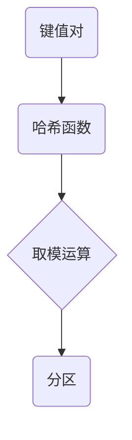
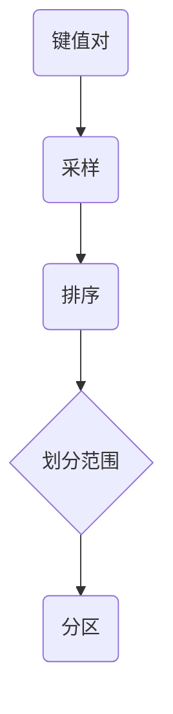

## 1.背景介绍

Apache Spark是一个强大的大数据处理框架，它具有高效、易用、通用和可扩展等特性，被广泛应用于大数据处理的各个领域。在Spark的运行过程中，Partitioner是一个非常重要的角色，它决定了数据在集群中的分布方式，进而影响了数据处理的效率。因此，理解Spark Partitioner的原理，以及如何在实际项目中使用Partitioner，对于提高Spark的运行效率具有重要的意义。

## 2.核心概念与联系

Spark Partitioner是Spark中的一个重要概念，它决定了数据在集群中的分布方式。在Spark中，数据被划分为多个分区，每个分区包含一部分数据，并且可以在集群中的不同节点上并行处理。Partitioner的任务就是决定数据应该如何分配到这些分区中。

在Spark中，有两种类型的Partitioner：HashPartitioner和RangePartitioner。HashPartitioner根据数据的哈希值将数据分配到不同的分区，而RangePartitioner则根据数据的范围将数据分配到不同的分区。这两种Partitioner都有各自的适用场景，选择合适的Partitioner可以显著提高Spark的运行效率。

## 3.核心算法原理具体操作步骤

### 3.1 HashPartitioner

HashPartitioner是Spark默认的Partitioner。它的工作原理是将每个键值对的键通过一个哈希函数转换为一个整数，然后用这个整数对分区数进行取模运算，得到的结果就是这个键值对应该分配到的分区。



### 3.2 RangePartitioner

RangePartitioner的工作原理是首先对数据进行采样，得到一个分布范围的估计，然后根据这个估计将数据分配到不同的分区。具体来说，RangePartitioner会将数据的键值对的键排序，然后将排序后的键划分为多个连续的范围，每个范围对应一个分区。



## 4.数学模型和公式详细讲解举例说明

### 4.1 HashPartitioner的数学模型

在HashPartitioner中，我们使用哈希函数将键转换为一个整数，然后用这个整数对分区数进行取模运算。这个过程可以用以下的数学公式表示：

$$
\text{partition} = \text{hash}(key) \mod n
$$

其中，$\text{hash}(key)$表示键的哈希值，$n$表示分区数，$\text{partition}$表示分配到的分区。

### 4.2 RangePartitioner的数学模型

在RangePartitioner中，我们首先对数据进行采样，得到一个分布范围的估计，然后根据这个估计将数据分配到不同的分区。这个过程可以用以下的数学公式表示：

$$
\text{partition} = \text{findRange}(key, \text{ranges})
$$

其中，$\text{findRange}(key, \text{ranges})$表示在分布范围中找到键对应的范围，$\text{ranges}$表示分布范围的估计，$\text{partition}$表示分配到的分区。

## 5.项目实践：代码实例和详细解释说明

接下来，我们将通过一个具体的代码实例来说明如何在Spark项目中使用Partitioner。

首先，我们创建一个RDD，然后使用HashPartitioner对其进行分区。

```scala
val rdd = sc.parallelize(Array((1, "apple"), (2, "banana"), (3, "cherry"), (4, "durian")), 4)
val partitionedRDD = rdd.partitionBy(new HashPartitioner(2))
partitionedRDD.partitions.foreach(partition => println(partition.index))
```

在这个例子中，我们首先创建了一个包含四个键值对的RDD，然后使用HashPartitioner将其分为两个分区。最后，我们打印出每个分区的索引，可以看到数据被正确地分配到了两个分区。

同样，我们也可以使用RangePartitioner对RDD进行分区。

```scala
val rdd = sc.parallelize(Array((1, "apple"), (2, "banana"), (3, "cherry"), (4, "durian")), 4)
val partitionedRDD = rdd.partitionBy(new RangePartitioner(2, rdd))
partitionedRDD.partitions.foreach(partition => println(partition.index))
```

在这个例子中，我们首先创建了一个包含四个键值对的RDD，然后使用RangePartitioner将其分为两个分区。最后，我们打印出每个分区的索引，可以看到数据被正确地分配到了两个分区。

## 6.实际应用场景

Spark Partitioner在大数据处理的许多场景中都有应用，例如：

- 在数据倾斜的场景中，我们可以通过自定义Partitioner，将倾斜的数据分配到多个分区，从而减轻数据倾斜的影响。
- 在需要进行大量键值对操作的场景中，我们可以通过合理的Partitioner，确保相同的键被分配到同一个分区，从而提高操作的效率。

## 7.工具和资源推荐

- Apache Spark官方文档：这是学习Spark的最好资源，其中包含了详细的API文档和教程。
- Learning Spark: This book provides a comprehensive introduction to Spark and its usage.

## 8.总结：未来发展趋势与挑战

随着大数据处理的需求不断增加，Spark Partitioner的重要性也在不断提高。未来，我们期待看到更多的Partitioner类型，以满足更复杂的数据分布需求。同时，如何设计一个既能保证数据分布均匀，又能保证处理效率的Partitioner，将是一个重要的挑战。

## 9.附录：常见问题与解答

Q: Spark中默认的Partitioner是什么？
A: Spark中默认的Partitioner是HashPartitioner。

Q: 如何在Spark中自定义Partitioner？
A: 在Spark中，我们可以通过继承Partitioner类，然后重写`numPartitions`和`getPartition`两个方法来自定义Partitioner。

Q: Partitioner对Spark的运行效率有什么影响？
A: Partitioner决定了数据在集群中的分布方式，如果数据分布不均，可能会导致某些节点的负载过高，从而降低Spark的运行效率。因此，选择合适的Partitioner，可以显著提高Spark的运行效率。

作者：禅与计算机程序设计艺术 / Zen and the Art of Computer Programming