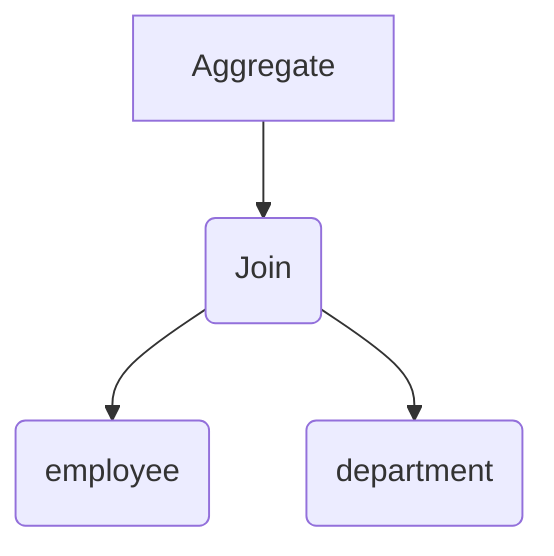

# Spark SQL结构化数据处理原理与代码实例讲解

## 1.背景介绍
### 1.1 大数据处理的挑战
随着互联网、物联网等技术的快速发展,数据呈现爆炸式增长。如何高效处理海量结构化、半结构化数据成为一大挑战。传统的关系型数据库难以应对TB、PB级别的大数据,迫切需要新的大数据处理技术。

### 1.2 Spark生态系统
Apache Spark作为新一代大数据处理引擎,凭借其快速、通用、易用等特点,在大数据领域得到广泛应用。Spark基于内存计算,处理速度比Hadoop MapReduce快100倍。Spark生态系统包括Spark Core、Spark SQL、Spark Streaming、MLlib、GraphX等组件,可以高效处理多种数据和应用场景。

### 1.3 Spark SQL的诞生
Spark SQL是Spark生态中专门用于结构化数据处理的组件。它将关系型数据处理引入Spark,支持使用SQL或者DataFrame/Dataset API对结构化数据进行查询分析。Spark SQL结合了关系型数据库和Spark的优势,大大简化了大数据处理的编程模型。

## 2.核心概念与联系
### 2.1 DataFrame与Dataset
DataFrame是Spark SQL的核心概念之一,本质上是一个分布式的Row对象集合,类似于关系型数据库中的二维表格。DataFrame支持嵌套的复杂数据类型,如Struct、Array、Map等。每个DataFrame都有固定的Schema,描述了每列数据的名称和类型。

Dataset是Spark 1.6引入的新的数据抽象,是DataFrame的一个扩展。Dataset支持强类型,可以在编译期检查类型错误。Dataset的API与DataFrame一致,多了类型安全和面向对象编程的特性。DataFrame其实是Dataset[Row]的别名。

### 2.2 SQL与DSL
Spark SQL支持两种编程方式:SQL和DSL(Domain Specific Language)。

用户可以使用标准的SQL语法对DataFrame进行查询,如select、where、group by、join等。这种方式简单直观,适合有SQL编程经验的用户。Spark SQL的语法与Hive类似,支持UDF、UDAF等高级特性。

DSL是指用户可以直接使用DataFrame/Dataset API以函数式编程的风格进行查询。例如df.select(), df.filter(), df.groupBy()等。DSL方式更灵活,可以实现复杂的数据转换逻辑。

### 2.3 Catalyst优化器
Catalyst是Spark SQL的核心,是一个可扩展的查询优化框架。它将用户的SQL或DSL查询转换成逻辑执行计划,并对执行计划进行优化,最终生成可以在Spark上高效运行的物理执行计划。

Catalyst的优化过程包括:
- 解析SQL/DSL生成未绑定的逻辑计划
- 绑定数据源元数据生成绑定的逻辑计划  
- 应用各种基于规则的优化,如谓词下推、列剪枝、常量折叠等
- 生成物理执行计划,选择最优的Join策略、聚合策略等

Catalyst支持自定义优化规则和物理执行策略,使得Spark SQL可以智能处理各种数据源和查询模式。

### 2.4 DataFrame/Dataset与RDD 
DataFrame/Dataset是基于Spark SQL的高级API,而RDD(Resilient Distributed Dataset)是Spark的低级API。它们的关系如下:

- DataFrame/Dataset是以RDD为基础构建的,对用户封装了Schema信息和优化后的执行计划。
- 用户可以通过df.rdd获取DataFrame底层的RDD,然后用RDD API进行低级的转换操作。  
- 用户也可以用createDataFrame从RDD创建DataFrame,指定Schema。
- DataFrame/Dataset支持Encoder进行序列化,效率比Java序列化高。

下面是DataFrame/Dataset与RDD转换的示意图:

```mermaid
graph LR
A[RDD] -->|createDataFrame| B(DataFrame)
B --> |rdd| A
B --> |as[T]| C(Dataset)
C --> |toDF| B
```

## 3.核心算法原理具体操作步骤
Spark SQL的核心算法主要体现在Catalyst优化器中,下面以一个简单的SQL查询为例,说明Catalyst的优化步骤。

假设我们有一个员工表employee和一个部门表department,需要查询每个部门的平均薪资,SQL如下:

```sql
SELECT d.name, AVG(e.salary) AS avg_salary
FROM employee e JOIN department d ON e.dept_id = d.id
GROUP BY d.name
```

### 3.1 解析SQL生成逻辑计划
Catalyst首先使用Antlr解析SQL,生成一个未绑定的逻辑计划。逻辑计划是一个树形结构,每个节点代表一个操作,比如Join、Aggregate等。下图是上述SQL的初始逻辑计划:



### 3.2 绑定元数据
接下来Catalyst会把SQL中的表名、列名绑定到具体的数据源的Schema上,生成绑定后的逻辑计划。例如employee表有id、name、salary、dept_id等列,department表有id、name等列。绑定后的逻辑计划如下:

```mermaid 
graph TD
A[Aggregate: groupBy=[[name#12]], aggExpr=[[AVG(salary#9) AS avg_salary]]] --> B(Join: dept_id#10 = id#11)
B --> C(SubqueryAlias employee)
C --> E[Project: id#7, name#8, salary#9, dept_id#10]
E --> F[Relation[employee]]
B --> D(SubqueryAlias department)  
D --> G[Project: id#11, name#12]
G --> H[Relation[department]]
```

### 3.3 应用优化规则
在绑定后的逻辑计划上,Catalyst会应用一系列基于规则的优化,对查询进行等价变换,提高执行效率。常见的优化规则有:

- 谓词下推:把过滤条件尽量下推到离数据源最近的地方,减少数据传输。
- 列剪枝:去掉查询不需要的列,只读取必要的列。
- 常量折叠:预先计算常量表达式的值。

在我们的例子中,优化后的逻辑计划如下:

```mermaid
graph TD
A[Aggregate: groupBy=[[name#12]], aggExpr=[[AVG(salary#9) AS avg_salary]]] --> B(Join: dept_id#10 = id#11)
B --> C(SubqueryAlias employee)
C --> E[Project: salary#9, dept_id#10]
E --> F[Relation[employee]]
B --> D(SubqueryAlias department)
D --> G[Project: id#11, name#12]
G --> H[Relation[department]]  
```
可以看到经过列剪枝后,employee表只读取了salary和dept_id两列。

### 3.4 生成物理计划 
优化后的逻辑计划还是比较高层的,Catalyst接下来会把它转换成物理执行计划。主要是选择具体的物理算子,比如Shuffle Hash Join、Sort Merge Join、Hash Aggregate等。还要确定RDD的分区方式、数据本地性等。

例如我们的查询可能生成如下物理计划:
```
== Physical Plan ==
*(3) HashAggregate(keys=[name#12], functions=[avg(salary#9)])
+- Exchange hashpartitioning(name#12, 200)
   +- *(2) HashAggregate(keys=[name#12], functions=[partial_avg(salary#9)])
      +- *(2) Project [salary#9, name#12]
         +- *(2) BroadcastHashJoin [dept_id#10], [id#11], Inner, BuildRight
            :- *(2) Project [salary#9, dept_id#10]
            :  +- *(2) Filter isnotnull(dept_id#10)
            :     +- *(2) FileScan parquet employee[salary#9,dept_id#10]
            +- BroadcastExchange HashedRelationBroadcastMode(List(cast(input[0, int, false] as bigint)))
               +- *(1) Project [id#11, name#12]
                  +- *(1) Filter isnotnull(id#11)
                     +- *(1) FileScan parquet department[id#11,name#12]
```

这里选择了BroadcastHashJoin和HashAggregate。employee表按dept_id哈希分区,department表进行Broadcast。在每个分区内部先做HashAggregate得到部分聚合结果,再Shuffle到同一个分区做最终的HashAggregate。

Spark SQL在选择Join类型时,会综合考虑两个表的大小、分区方式、Join键的分布等因素,尽量减少Shuffle。

## 4.数学模型和公式详细讲解举例说明
Spark SQL的核心是Catalyst优化器,它在逻辑计划和物理计划间建立了鲜明的边界,使得优化过程可以建模成一个状态空间搜索问题。

我们可以把逻辑执行计划看做状态空间中的一个初始状态S0,目标是找到一个最优的终止状态St,使得St对应的物理执行计划的代价Cost(St)最小。

状态空间搜索可以表示为一个三元组(S, O, F):
- S表示所有可能的逻辑执行计划(状态)的集合
- O表示在当前状态下可以应用的优化规则(状态转移操作)的集合
- F是一个评估函数,用来评估执行计划的代价

优化过程就是在状态空间中搜索一条从初始状态S0到最优终止状态St的路径,使得路径上每个状态转移操作O都能让评估函数F的值减小,直到达到全局最优。

形式化表示为:
$$
St = arg min_{S_i} Cost(S_i) \\
s.t. S_{i+1} = O_i(S_i), i=0,1,...,t-1 \\
O_i \in O
$$

举个例子,假设我们有个查询Q,它的初始逻辑执行计划如下:
```
Project[a+1 AS x, b+1 AS y]
  Filter[a<10]
    Join[Inner, a=c]
      Project[a, b]
        TableScan[A]
      Filter[c>0]  
        TableScan[B]
```

可以应用的优化规则包括:
- O1:谓词下推,将Filter[a<10]下推到TableScan[A]之前
- O2:常量折叠,将a+1和b+1预先计算 
- O3:列剪枝,去掉Project[a, b]中多余的列b

假设我们有如下的代价评估函数,考虑CPU、内存、网络IO等因素:
$$
Cost(S) = \alpha * CPU\_cost(S) + \beta * Memory\_cost(S) + \gamma * Network\_cost(S)
$$

假设优化规则O1、O2、O3应用后的Cost分别为100、120、80,那么最优路径为:
$$
S0 \stackrel{O1}\longrightarrow S1 \stackrel{O3}\longrightarrow S2
$$

最终得到优化后的逻辑计划为:
```
Project[a+1 AS x, b+1 AS y]
  Join[Inner, a=c]
    Filter[a<10]
      Project[a]  
        TableScan[A]
    Filter[c>0]
      TableScan[B]  
```

当然实际的Catalyst优化器考虑的因素要复杂得多,优化规则和Cost模型也在不断迭代。但核心思想就是建模成一个状态空间搜索问题,利用动态规划、剪枝等技术高效地找到最优计划。

## 5.项目实践：代码实例和详细解释说明
下面我们用Spark SQL实现一个实际的数据分析需求:分析电商网站的用户购买行为,得到每个品类的购买人数、订单数和总金额。

### 5.1 准备数据
我们有两个数据集:用户表(user)和订单表(order)。

user表结构如下:

|user_id|gender|age|
|-------|------|---|
|1      |male  |18 |  
|2      |female|25 | 
|3      |male  |30 |

order表结构如下:

|order_id|user_id|product_name|category_id|price|
|--------|-------|------------|-----------|-----|
|1       |1      |iphone      |1          |5000 |
|2       |1      |mac         |2          |8000 |
|3       |2      |book        |3          |50   |

### 5.2 创建DataFrame
首先我们要把user和order两个表加载成DataFrame:

```scala
val spark = SparkSession.builder().appName("purchaseAnalysis").getOrCreate()

//从json文件创建DataFrame 
val userDF = spark.read.json("user.json")
val orderDF = spark.read.json("order.json") 

//也可以直接从RDD创建,指定Schema
val userSchema = StructType(Array(
  StructField("user_id", IntegerType),
  StructField("gender", StringType), 
  StructField("age", IntegerType)
))
val userRDD = sc.textFile("user.txt").map(_.split(",")).map(u => Row(u(0).toInt, u(1), u(2).toInt))
val userDF = spark.createDataFrame(userRDD, userSchema)
```

### 5.3 数据