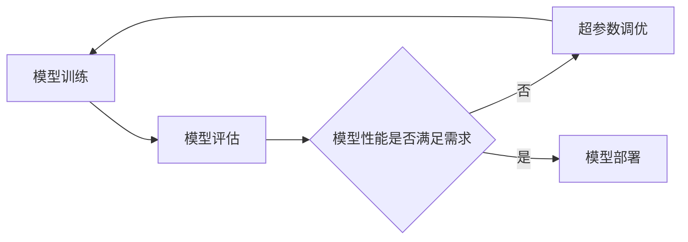

# SparkMLlib模型评估与选择：构建最佳模型

## 1. 背景介绍

在机器学习和数据科学领域,模型评估与选择是一个至关重要的环节。它决定了我们最终训练出的模型质量和性能,进而影响到实际应用中模型的表现。Apache Spark作为一个快速通用的大规模数据处理引擎,其MLlib机器学习库提供了丰富的模型评估与选择的功能。本文将深入探讨如何利用SparkMLlib进行模型评估,选择出最佳模型,并给出详细的代码实例。

### 1.1 模型评估的重要性

模型评估旨在衡量训练出的模型在未知数据上的表现,它可以帮助我们:

- 评判模型是否过拟合或欠拟合
- 比较不同模型的性能,选出最优模型  
- 调整模型超参数,优化模型性能
- 估计模型在实际应用中的效果

没有模型评估,我们就无法判断模型是否学到了数据的内在规律,是否具备良好的泛化能力。

### 1.2 SparkMLlib的优势

SparkMLlib作为Spark生态的机器学习库,有如下优势:

- 基于Spark的分布式计算能力,可以处理海量数据
- 提供了包括分类、回归、聚类、协同过滤等常见的机器学习算法
- 支持多种模型评估指标,且计算高效
- 可以无缝整合到Spark的数据处理流程中
- 具备可扩展性,可以方便地开发自定义的机器学习算法

因此,掌握SparkMLlib的模型评估与选择方法,对于开发高质量的机器学习应用至关重要。

## 2. 核心概念与联系

在介绍SparkMLlib的模型评估方法之前,我们先来了解一些核心概念。

### 2.1 模型评估指标

模型评估指标用于量化模型的预测效果,不同的任务类型有不同的评估指标:

- 分类问题常用的指标有:准确率(Accuracy)、精确率(Precision)、召回率(Recall)、F1值、ROC曲线下面积(AUC)等。
- 回归问题常用的指标有:均方误差(MSE)、均方根误差(RMSE)、平均绝对误差(MAE)、R平方(R-Squared)等。
- 聚类问题常用的指标有:轮廓系数(Silhouette Score)、Calinski-Harabasz指数等。
- 推荐系统常用的指标有:平均准确率(MeanAveragePrecision)、正序率(NormalizedDiscountedCumulativeGain)等。

### 2.2 交叉验证

交叉验证是一种常用的模型评估与选择方法,它的基本思想是:将数据集划分为k个子集,每次取其中k-1个子集作为训练集,剩下1个作为验证集,这样可以获得k组评估指标,最后取平均值作为模型的整体评估指标。交叉验证可以有效利用有限的数据,减少模型选择过程中的方差。

### 2.3 超参数调优

大多数机器学习算法都有一些超参数需要设定,比如树的深度、正则化系数等。这些超参数会影响最终模型的性能,因此需要进行调优。常见的调优方法有:

- 网格搜索(GridSearch):穷举所有参数组合,对每种组合训练模型并评估
- 随机搜索(RandomizedSearch):随机采样参数组合进行评估
- 贝叶斯优化(BayesianOptimization):建立超参数与评估指标的概率模型,智能搜索最优参数

SparkMLlib支持多种超参数调优方法,可以帮助我们自动寻找最佳模型。

### 2.4 概念之间的联系

模型评估指标、交叉验证、超参数调优这三个概念之间有着紧密的联系,它们协同工作,最终目标是得到性能最优的机器学习模型:



整个流程是一个循环迭代的过程:我们先在训练集上训练模型,然后用交叉验证的方式在验证集上评估模型性能,根据评估指标来判断模型是否达到要求,如果不满足就进行超参数调优,重新训练模型并评估,直到得到最优模型为止。

## 3. 核心算法原理具体操作步骤

下面我们详细介绍SparkMLlib中几种常用的模型评估方法。

### 3.1 二分类模型评估

对于二分类问题,SparkMLlib提供了`BinaryClassificationEvaluator`评估器,可以计算如下指标:

- `areaUnderROC`:ROC曲线下面积,取值范围[0.5,1],越大越好
- `areaUnderPR`:PR(Precision-Recall)曲线下面积,取值范围[0,1],越大越好

使用方法如下:

```scala
import org.apache.spark.ml.evaluation.BinaryClassificationEvaluator

val evaluator = new BinaryClassificationEvaluator()
  .setLabelCol("label")
  .setRawPredictionCol("rawPrediction")
  .setMetricName("areaUnderROC")

val accuracy = evaluator.evaluate(predictions)
```

其中`predictions`是一个`DataFrame`,包含了`label`(真实标签)和`rawPrediction`(原始预测值)两列。

### 3.2 多分类模型评估

对于多分类问题,SparkMLlib提供了`MulticlassClassificationEvaluator`评估器,可以计算如下指标:

- `accuracy`:准确率
- `weightedPrecision`:加权精确率
- `weightedRecall`:加权召回率
- `weightedFMeasure`:加权F1值
- `weightedTruePositiveRate`:加权真正例率
- `weightedFalsePositiveRate`:加权假正例率

使用方法如下:

```scala
import org.apache.spark.ml.evaluation.MulticlassClassificationEvaluator

val evaluator = new MulticlassClassificationEvaluator()
  .setLabelCol("label")
  .setPredictionCol("prediction")
  .setMetricName("accuracy")

val accuracy = evaluator.evaluate(predictions)
```

### 3.3 回归模型评估

对于回归问题,SparkMLlib提供了`RegressionEvaluator`评估器,可以计算如下指标:

- `mse`:均方误差
- `rmse`:均方根误差
- `r2`:R平方
- `mae`:平均绝对误差

使用方法如下:

```scala
import org.apache.spark.ml.evaluation.RegressionEvaluator

val evaluator = new RegressionEvaluator()
  .setLabelCol("label")
  .setPredictionCol("prediction")
  .setMetricName("rmse")

val rmse = evaluator.evaluate(predictions)
```

### 3.4 聚类模型评估

对于聚类问题,SparkMLlib提供了`ClusteringEvaluator`评估器,可以计算轮廓系数(Silhouette Score)。轮廓系数衡量了聚类的紧凑性和分离性,取值范围[-1,1],越大越好。

使用方法如下:

```scala
import org.apache.spark.ml.evaluation.ClusteringEvaluator

val evaluator = new ClusteringEvaluator()

val silhouette = evaluator.evaluate(predictions)
```

### 3.5 交叉验证

为了使用交叉验证来评估和选择模型,SparkMLlib提供了`CrossValidator`类,它将估计器(Estimator)、评估器(Evaluator)和参数网格(ParamGrid)封装在一起,自动执行交叉验证并选出最佳模型。

使用方法如下:

```scala
import org.apache.spark.ml.tuning.{CrossValidator, ParamGridBuilder}

val cv = new CrossValidator()
  .setEstimator(pipeline)
  .setEvaluator(evaluator)
  .setEstimatorParamMaps(paramGrid)
  .setNumFolds(3)

val cvModel = cv.fit(trainingData)
val bestModel = cvModel.bestModel
```

其中`pipeline`是一个`Pipeline`对象,代表了完整的建模流程;`evaluator`是评估器;`paramGrid`是一个`ParamMap`数组,包含了所有待评估的参数组合;`numFolds`是交叉验证的折数。

## 4. 数学模型和公式详细讲解举例说明

在本节中,我们将详细讲解几个常用评估指标背后的数学原理。

### 4.1 二分类评估指标

对于二分类问题,假设我们的预测标签只有`0`(反例)和`1`(正例)两种,那么所有样本可以划分为四种情况:

- 真正例(TP):预测为正例,实际也是正例
- 假正例(FP):预测为正例,实际是反例
- 真反例(TN):预测为反例,实际也是反例
- 假反例(FN):预测为反例,实际是正例

基于这四个量,我们可以定义如下评估指标:

- 准确率(Accuracy):$\frac{TP+TN}{TP+FP+TN+FN}$,表示预测正确的样本占总样本的比例
- 精确率(Precision):$\frac{TP}{TP+FP}$,表示预测为正例的样本中实际为正例的比例
- 召回率(Recall):$\frac{TP}{TP+FN}$,表示实际为正例的样本中预测也为正例的比例
- F1值:$\frac{2*Precision*Recall}{Precision+Recall}$,精确率和召回率的调和平均

ROC曲线和PR曲线则分别反映了不同阈值下的召回率、假正例率和精确率的变化趋势。

### 4.2 均方误差与R平方

对于回归问题,假设真实标签为$y_i$,预测值为$\hat{y}_i$,样本数为$n$,那么均方误差(MSE)定义为:

$$MSE=\frac{1}{n}\sum_{i=1}^n(y_i-\hat{y}_i)^2$$

它衡量了预测值与真实值之间的平均平方误差。

R平方(R-Squared)定义为:

$$R^2=1-\frac{\sum_{i=1}^n(y_i-\hat{y}_i)^2}{\sum_{i=1}^n(y_i-\bar{y})^2}$$

其中$\bar{y}$是真实标签的均值。R平方衡量了模型预测的优劣程度,取值范围为$(-\infty,1]$,越接近1表示模型拟合得越好。当预测值与真实值完全一致时,R平方等于1;当预测值等于真实标签的均值时,R平方等于0;如果预测值比均值还差,R平方可能为负。

### 4.3 轮廓系数

轮廓系数(Silhouette Score)用于评估聚类结果的质量。对于样本$i$,假设它被划分到了簇$C_i$中,定义$a(i)$为样本$i$到$C_i$中其他样本的平均距离,$b(i)$为样本$i$到其他簇中所有样本的最小平均距离,那么样本$i$的轮廓系数为:

$$s(i)=\frac{b(i)-a(i)}{max\{a(i),b(i)\}}$$

如果将所有样本的轮廓系数取平均,就得到了整个聚类结果的轮廓系数。

轮廓系数的取值范围为$[-1,1]$。当$s(i)$接近1时,表示样本$i$被划分到了一个合适的簇中;当$s(i)$接近-1时,表示样本$i$更应该被划分到其他的簇中;当$s(i)$接近0时,表示样本$i$在两个簇的边界上。因此,轮廓系数越大,聚类效果越好。

## 5. 项目实践：代码实例和详细解释说明

下面我们通过一个完整的案例来演示如何使用SparkMLlib进行模型评估与选择。

### 5.1 数据准备

我们使用Spark自带的鸢尾花数据集进行分类任务。数据集包含了三种鸢尾花(Setosa,Versicolor,Virginica)各50个样本,每个样本有四个特征:花萼长度、花萼宽度、花瓣长度、花瓣宽度。

```scala
import org.apache.spark.ml.feature.{IndexToString, StringIndexer, VectorAssembler}

val data = spark.read.format("libsvm").load("data/mllib/iris.libsvm")

val labelIndexer = new StringIndexer()
  .setInputCol("label")
  .setOutputCol("indexedLabel")
  .fit(data)

val featureIndexer = new VectorAssembler()
  .setInputCols(Array("features"))
  .setOutputCol("indexedFeatures")

val labelConverter = new IndexToString()
  .setInput