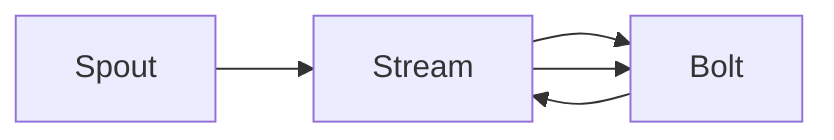
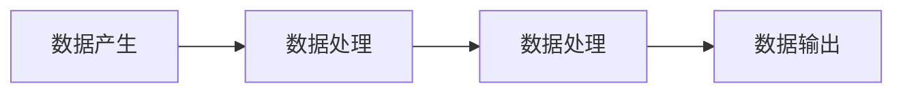

## 1.背景介绍

Storm是一个开源的分布式实时计算系统，用于处理大数据的实时分析。Storm Trident是Storm的一个高级抽象，它提供了一种处理流数据的更简单、更强大的方式。本文将深入探讨Storm Trident的原理，并通过代码实例进行详细讲解。

## 2.核心概念与联系

### 2.1 Storm Trident的核心概念

Storm Trident主要由以下几个核心概念组成：

- **Stream**：数据流，是一系列的元组（Tuples）。
- **Spout**：数据源，产生数据流。
- **Bolt**：数据处理单元，对数据流进行处理。
- **Topology**：处理逻辑的拓扑结构，由Spout和Bolt组成。

### 2.2 Storm Trident的核心联系

在Storm Trident中，Spout和Bolt通过Stream连接，形成一个处理数据的拓扑结构。Spout产生的数据流经过Bolt进行处理，处理结果可能会被传输到其他Bolt进行进一步处理，也可能会直接输出。

## 3.核心算法原理具体操作步骤

Storm Trident的核心算法原理主要包括以下几个步骤：

1. **数据产生**：Spout产生数据流。
2. **数据处理**：Bolt接收数据流，进行处理。
3. **数据传输**：处理结果通过Stream传输到其他Bolt或输出。

## 4.数学模型和公式详细讲解举例说明

Storm Trident的核心算法可以用一种数学模型来描述，这种模型称为流图（Stream Graph）。在流图中，节点代表Spout和Bolt，边代表Stream。流图可以用邻接矩阵来表示，其中，矩阵的每一行和每一列分别代表一个节点，矩阵的元素表示节点之间的连接关系。

假设有一个流图，它包含一个Spout和两个Bolt，Spout到Bolt1的Stream记为S1，Bolt1到Bolt2的Stream记为S2