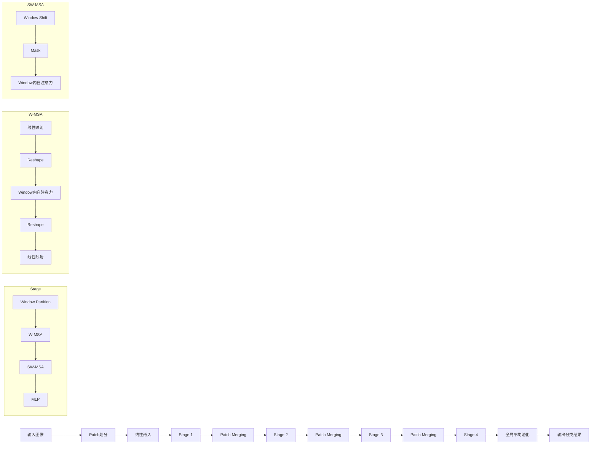

# Swin Transformer原理与代码实例讲解

## 1. 背景介绍

### 1.1 视觉任务的挑战
近年来,计算机视觉领域取得了巨大的进步,从图像分类、目标检测到语义分割等任务,深度学习模型的性能不断刷新记录。然而,视觉任务仍然面临着诸多挑战:

- 图像的高分辨率和复杂性
- 物体尺度和视角的多样性  
- 场景理解需要全局和局部特征的融合
- 高效处理大规模数据集的需求

### 1.2 Transformer在视觉领域的应用
Transformer最初是应用于自然语言处理领域的模型,其自注意力机制和并行计算的特点使其在多个NLP任务上取得了显著的效果提升。最近,研究者们开始将Transformer引入到计算机视觉领域,如ViT(Vision Transformer)直接将图像分块后输入Transformer编码器,在ImageNet分类任务上达到了与CNN相媲美的精度。

这些工作证明了Transformer在视觉领域的潜力,但如何设计更高效、更适合视觉任务的Transformer架构,仍是一个值得探索的问题。

### 1.3 Swin Transformer的提出
微软亚洲研究院提出了Swin Transformer,一种用于计算机视觉的新型Transformer架构。它借鉴了CNN中的层次化设计和局部感受野的思想,通过移动窗口(Shifted window)的自注意力计算,在线性计算复杂度下建模局部和全局的依赖关系,并支持可变的分辨率输入。

Swin Transformer在图像分类、目标检测和语义分割等任务上都取得了SOTA的结果,展现了其广泛的适用性和优越的性能。下面我们将深入分析Swin Transformer的核心原理。

## 2. 核心概念与联系

### 2.1 自注意力机制
自注意力机制是Transformer的核心,它通过计算 query、key、value 三个矩阵的相似度,实现了任意两个位置之间的信息交互和聚合。对于图像数据,可以将每个像素看作一个token,自注意力则建模了像素之间的全局依赖。

### 2.2 多头自注意力
多头自注意力通过引入多个独立的注意力函数,增强了模型对不同子空间特征的表达能力。Swin Transformer沿用了多头自注意力的设计。

### 2.3 层次化特征
CNN的成功很大程度上归功于其层次化的特征提取方式,即逐步将局部特征聚合为语义更高层次的特征。Swin Transformer通过多个Stage的设计,在不同尺度上计算自注意力,形成层次化的特征图。

### 2.4 移动窗口机制
传统的Transformer在计算自注意力时是全局的,计算量较大。Swin Transformer采用了移动窗口的策略,将特征图划分为不重叠的窗口,并在窗口内计算自注意力,大大减少了计算量。同时通过移动窗口的方式,在不同层之间引入跨窗口的连接,捕获全局信息。

下图展示了Swin Transformer的核心概念之间的联系:



## 3. 核心算法原理具体操作步骤

### 3.1 图像分块与线性嵌入
1. 将输入图像 $\mathbf{x} \in \mathbb{R}^{H \times W \times 3}$ 划分为 $\frac{H}{4} \times \frac{W}{4}$ 个不重叠的 $4\times 4$ 的patch。
2. 对每个patch做flatten,得到 $\mathbf{x}_p \in \mathbb{R}^{N \times (4^2 \cdot 3)}$,其中 $N=\frac{HW}{4^2}$ 为patch的数量。
3. 使用线性映射将patch嵌入到 $C$ 维度的特征空间,得到 $\mathbf{x}_0 \in \mathbb{R}^{N \times C}$。

### 3.2 Stage层次化特征提取
每个Stage包含一个Patch Merging层和多个Swin Transformer Block。

#### 3.2.1 Patch Merging
1. 将相邻的2x2个patch在通道维度上拼接,得到 $\mathbf{x}_{l-1} \in \mathbb{R}^{\frac{N}{4} \times 4C}$。
2. 使用线性层将特征降维到 $2C$,得到 $\mathbf{x}_l \in \mathbb{R}^{\frac{N}{4} \times 2C}$。
3. Patch Merging后,特征图的分辨率减半,通道数加倍。

#### 3.2.2 Swin Transformer Block
Swin Transformer Block包含了W-MSA、SW-MSA和MLP三个模块。

**W-MSA:**
1. 将特征图 $\mathbf{x}_l \in \mathbb{R}^{H_l \times W_l \times C_l}$ 划分为 $\frac{H_l}{M} \times \frac{W_l}{M}$ 个 $M \times M$ 的窗口。
2. 对每个窗口内的patch做自注意力计算,得到 $\mathbf{z}_l^W \in \mathbb{R}^{H_l \times W_l \times C_l}$。

$$
\mathbf{z}_l^W = \text{W-MSA}(\text{LN}(\mathbf{x}_l)) + \mathbf{x}_l
$$

**SW-MSA:**  
1. 将窗口向右下方移动 $(\lfloor \frac{M}{2} \rfloor, \lfloor \frac{M}{2} \rfloor)$,形成新的窗口划分。
2. 对每个新窗口内的patch做自注意力计算,需要对移动后分割的patch做mask以保证窗口内的计算。
3. 得到 $\mathbf{z}_l^{SW} \in \mathbb{R}^{H_l \times W_l \times C_l}$。

$$
\mathbf{z}_l^{SW} = \text{SW-MSA}(\text{LN}(\mathbf{z}_l^W)) + \mathbf{z}_l^W
$$

**MLP:**
1. 使用两层MLP对特征做非线性变换,得到 $\mathbf{x}_{l+1} \in \mathbb{R}^{H_l \times W_l \times C_l}$。

$$
\mathbf{x}_{l+1} = \text{MLP}(\text{LN}(\mathbf{z}_l^{SW})) + \mathbf{z}_l^{SW}
$$

### 3.3 分类输出
1. 在最后一个Stage的输出上做全局平均池化,得到图像的特征表示 $\mathbf{y} \in \mathbb{R}^C$。
2. 将 $\mathbf{y}$ 输入线性分类器,得到各类别的logits输出 $\hat{\mathbf{y}} \in \mathbb{R}^K$,其中 $K$ 为类别数。

## 4. 数学模型和公式详细讲解举例说明

### 4.1 自注意力计算
自注意力的计算可以表示为:

$$
\text{Attention}(Q, K, V) = \text{Softmax}(\frac{QK^T}{\sqrt{d}})V
$$

其中 $Q,K,V \in \mathbb{R}^{N \times d}$ 分别为查询矩阵、键矩阵和值矩阵,$d$ 为特征维度。

以W-MSA为例,假设窗口大小为 $M \times M$,窗口内的patch数为 $N_w=M^2$。则 $Q,K,V$ 的计算为:

$$
Q = \mathbf{x}_lW_Q, \quad K = \mathbf{x}_lW_K, \quad V = \mathbf{x}_lW_V
$$

其中 $\mathbf{x}_l \in \mathbb{R}^{N_w \times C_l}$ 为窗口内的特征,$W_Q,W_K,W_V \in \mathbb{R}^{C_l \times d}$ 为线性投影矩阵。

将 $Q,K,V$ 代入注意力公式,得到:

$$
\text{W-MSA}(\mathbf{x}_l) = \text{Softmax}(\frac{(\mathbf{x}_lW_Q)(\mathbf{x}_lW_K)^T}{\sqrt{d}})(\mathbf{x}_lW_V)
$$

### 4.2 移动窗口自注意力

移动窗口自注意力SW-MSA在W-MSA的基础上引入了mask矩阵 $\mathbf{M} \in \mathbb{R}^{N_w \times N_w}$,用于屏蔽移动后被分割的patch之间的注意力计算:

$$
\text{SW-MSA}(\mathbf{x}_l) = \text{Softmax}(\frac{(\mathbf{x}_lW_Q)(\mathbf{x}_lW_K)^T+\mathbf{M}}{\sqrt{d}})(\mathbf{x}_lW_V)
$$

其中 $\mathbf{M}_{ij}=\begin{cases} 0, & \text{如果 patch } i,j \text{ 在同一个窗口内} \\ -\infty, & \text{否则} \end{cases}$。

### 4.3 多头自注意力
多头自注意力通过 $h$ 个并行的注意力头增强特征表示能力:

$$
\text{MultiHead}(Q,K,V) = \text{Concat}(\text{head}_1, \dots, \text{head}_h)W^O
$$

其中 $\text{head}_i = \text{Attention}(QW_i^Q, KW_i^K, VW_i^V), W_i^Q \in \mathbb{R}^{d \times d_h}, W_i^K \in \mathbb{R}^{d \times d_h}, W_i^V \in \mathbb{R}^{d \times d_h}, W^O \in \mathbb{R}^{hd_h \times d}$。

## 5. 项目实践：代码实例和详细解释说明

下面以PyTorch为例,给出Swin Transformer的核心模块实现。

### 5.1 W-MSA和SW-MSA

```python
class WindowAttention(nn.Module):
    def __init__(self, dim, window_size, num_heads):
        super().__init__()
        self.dim = dim
        self.window_size = window_size
        self.num_heads = num_heads
        self.qkv = nn.Linear(dim, 3*dim)
        self.proj = nn.Linear(dim, dim)
        
    def forward(self, x, mask=None):
        B, N, C = x.shape
        qkv = self.qkv(x).reshape(B, N, 3, self.num_heads, C//self.num_heads)
        qkv = qkv.permute(2, 0, 3, 1, 4) # (3, B, num_heads, N, C//num_heads)
        q, k, v = qkv[0], qkv[1], qkv[2]
        
        attn = (q @ k.transpose(-2, -1)) * (1.0 / math.sqrt(k.size(-1)))
        if mask is not None:
            mask = mask.masked_fill(mask==0, float('-inf'))
            attn = attn + mask
        attn = attn.softmax(dim=-1)
        
        x = (attn @ v).transpose(1, 2).reshape(B, N, C)
        x = self.proj(x)
        return x
        
class SwinBlock(nn.Module):
    def __init__(self, dim, window_size, num_heads):
        super().__init__()
        self.attn = WindowAttention(dim, window_size, num_heads)
        self.mlp = nn.Sequential(
            nn.Linear(dim, 4*dim),
            nn.GELU(),
            nn.Linear(4*dim, dim)
        )
        self.norm1 = nn.LayerNorm(dim)
        self.norm2 = nn.LayerNorm(dim)
        
    def forward(self, x, attn_mask):
        x = x + self.attn(self.norm1(x), attn_mask)
        x = x + self.mlp(self.norm2(x))
        return x
```

- `WindowAttention` 实现了