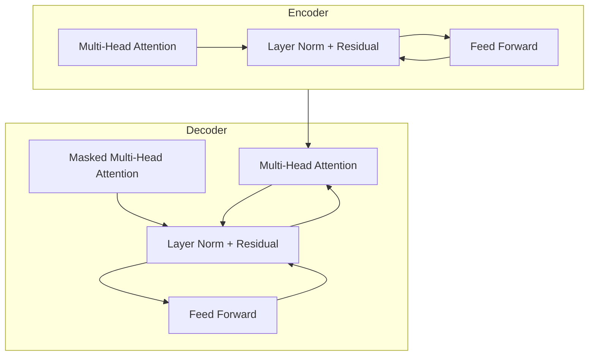

# Transformer模型在移动端的部署

## 1.背景介绍

随着人工智能技术的不断发展,Transformer模型在自然语言处理(NLP)领域取得了巨大的成功。作为一种新型的基于注意力机制的神经网络架构,Transformer模型展现出了卓越的性能,在机器翻译、文本生成、问答系统等任务中表现出色。然而,将这些大型模型部署到资源受限的移动设备上仍然面临着诸多挑战。

移动设备通常具有有限的计算能力、内存和电池续航时间,这使得直接在移动设备上运行庞大的Transformer模型变得困难。此外,移动应用程序需要快速响应和流畅的用户体验,而Transformer模型的推理过程往往需要大量的计算资源和时间。因此,如何高效地将Transformer模型部署到移动端,同时保持其性能和用户体验,成为了一个亟待解决的问题。

## 2.核心概念与联系

### 2.1 Transformer模型

Transformer是一种全新的基于注意力机制的序列到序列(Seq2Seq)模型,由Google的Vaswani等人在2017年提出。它不同于传统的基于循环神经网络(RNN)或卷积神经网络(CNN)的架构,而是完全依赖于注意力机制来捕获输入序列和输出序列之间的长程依赖关系。

Transformer模型主要由编码器(Encoder)和解码器(Decoder)两个部分组成。编码器将输入序列映射到一个连续的表示,而解码器则基于编码器的输出生成目标序列。两者之间通过注意力机制建立联系,允许解码器关注编码器输出的不同位置,从而捕获长程依赖关系。

Transformer模型的核心创新在于引入了多头自注意力(Multi-Head Attention)机制,它能够同时关注输入序列中的不同位置,捕获序列中的重要信息。此外,Transformer还采用了位置编码(Positional Encoding)来注入序列的位置信息,以及层归一化(Layer Normalization)和残差连接(Residual Connection)等技术来加速训练和提高模型性能。

### 2.2 移动端部署的挑战

尽管Transformer模型在NLP任务中表现出色,但将其部署到移动设备上仍然面临着诸多挑战:

1. **计算资源限制**: 移动设备的CPU和GPU计算能力有限,无法高效地运行大型的Transformer模型。
2. **内存限制**: Transformer模型通常需要大量的内存来存储参数和中间计算结果,而移动设备的内存资源往往较小。
3. **延迟和能耗**: 在移动设备上运行复杂的模型会导致较高的延迟和能耗,影响用户体验和设备续航时间。
4. **在线推理**: 许多移动应用需要在线推理,而不是离线推理,这对模型的响应时间和网络带宽提出了更高的要求。
5. **硬件异构性**: 不同的移动设备拥有不同的硬件配置,需要针对不同的硬件平台进行优化和部署。

为了解决这些挑战,需要采用一系列优化策略和技术,包括模型压缩、量化、并行计算、异构计算等,以在保持模型性能的同时,满足移动设备的资源限制和用户体验要求。

## 3.核心算法原理具体操作步骤

### 3.1 Transformer模型架构

Transformer模型的核心架构由编码器(Encoder)和解码器(Decoder)两个部分组成,如下图所示:

编码器(Encoder)的主要作用是将输入序列映射到一个连续的表示,它由多个相同的层组成,每一层包含两个子层:

1. **Multi-Head Attention层**: 计算输入序列中每个单词与其他单词之间的注意力权重,捕获序列中的重要信息。
2. **前馈全连接层(Feed Forward)**: 对每个单词的表示进行非线性转换,以提供更高层次的特征表示。

解码器(Decoder)的作用是基于编码器的输出生成目标序列,它也由多个相同的层组成,每一层包含三个子层:

1. **Masked Multi-Head Attention层**: 计算目标序列中每个单词与其之前单词的注意力权重,以捕获序列的先验信息。
2. **Multi-Head Attention层**: 计算目标序列中每个单词与编码器输出的注意力权重,建立输入和输出序列之间的关联。
3. **前馈全连接层(Feed Forward)**: 对每个单词的表示进行非线性转换,以提供更高层次的特征表示。

在编码器和解码器的每一层中,还采用了残差连接(Residual Connection)和层归一化(Layer Normalization)等技术,以加速训练并提高模型性能。

### 3.2 注意力机制(Attention Mechanism)

注意力机制是Transformer模型的核心,它允许模型关注输入序列中的不同位置,捕获长程依赖关系。Transformer模型中采用了多头自注意力(Multi-Head Attention)机制,它可以同时关注多个不同的位置,并将这些注意力权重组合起来,形成更丰富的表示。

多头自注意力机制的计算过程如下:

1. 将输入序列 $X = (x_1, x_2, ..., x_n)$ 映射到查询(Query)、键(Key)和值(Value)向量:

$$
Q = XW^Q, K = XW^K, V = XW^V
$$

其中 $W^Q, W^K, W^V$ 分别是查询、键和值的权重矩阵。

2. 计算查询和键之间的点积,得到注意力分数矩阵:

$$
\text{Attention}(Q, K, V) = \text{softmax}\left(\frac{QK^T}{\sqrt{d_k}}\right)V
$$

其中 $d_k$ 是缩放因子,用于防止注意力分数过大或过小。

3. 对注意力分数矩阵进行多头操作,将不同头的注意力权重组合起来:

$$
\text{MultiHead}(Q, K, V) = \text{Concat}(head_1, ..., head_h)W^O
$$

$$
head_i = \text{Attention}(QW_i^Q, KW_i^K, VW_i^V)
$$

其中 $W_i^Q, W_i^K, W_i^V$ 分别是第 $i$ 个头的查询、键和值的权重矩阵, $W^O$ 是最终的输出权重矩阵。

通过多头自注意力机制,Transformer模型可以同时关注输入序列中的多个位置,捕获更丰富的上下文信息,从而提高模型的表现。

### 3.3 位置编码(Positional Encoding)

由于Transformer模型不再依赖于循环或卷积结构来捕获序列信息,因此需要引入位置编码(Positional Encoding)来注入序列的位置信息。位置编码是一种将单词在序列中的位置信息编码为向量的方法,它被添加到输入的嵌入向量中,以提供位置信息。

Transformer模型采用了基于正弦和余弦函数的位置编码方式,它可以让模型更好地学习相对位置信息,而不会随着序列长度的增加而失去精度。具体计算公式如下:

$$
PE_{(pos, 2i)} = \sin\left(pos / 10000^{2i / d_{model}}\right)
$$

$$
PE_{(pos, 2i+1)} = \cos\left(pos / 10000^{2i / d_{model}}\right)
$$

其中 $pos$ 是单词在序列中的位置, $i$ 是位置编码的维度索引, $d_{model}$ 是模型的嵌入维度。

通过将位置编码与输入嵌入相加,模型可以获得单词在序列中的位置信息,从而更好地捕获长程依赖关系。

## 4.数学模型和公式详细讲解举例说明

在前面的章节中,我们介绍了Transformer模型的核心概念和算法原理。现在,让我们通过一个具体的例子来详细解释Transformer模型中的数学模型和公式。

假设我们有一个机器翻译任务,需要将英文句子 "I love machine learning" 翻译成中文。我们将使用一个简化版的Transformer模型来完成这个任务。

### 4.1 嵌入层(Embedding Layer)

首先,我们需要将输入序列和输出序列转换为嵌入向量表示。对于输入序列 "I love machine learning",我们可以将每个单词映射到一个固定维度的向量,例如 $d_{model} = 512$:

$$
\begin{aligned}
\text{I} &\rightarrow (0.2, -0.1, 0.3, ...) \\
\text{love} &\rightarrow (-0.4, 0.5, -0.2, ...) \\
\text{machine} &\rightarrow (0.1, -0.3, 0.6, ...) \\
\text{learning} &\rightarrow (-0.2, 0.4, -0.1, ...)
\end{aligned}
$$

同样,对于目标序列(例如中文翻译),我们也需要将每个单词映射到相同维度的嵌入向量。

### 4.2 编码器(Encoder)

接下来,我们将输入序列的嵌入向量输入到编码器中。编码器由多个相同的层组成,每一层包含两个子层:多头自注意力层和前馈全连接层。

**多头自注意力层**

在多头自注意力层中,我们需要计算输入序列中每个单词与其他单词之间的注意力权重。假设我们使用 $h=8$ 个注意力头,每个注意力头的维度为 $d_k = d_v = 64$。

对于第 $i$ 个注意力头,我们将输入序列的嵌入向量 $X$ 映射到查询 $Q_i$、键 $K_i$ 和值 $V_i$ 向量:

$$
Q_i = XW_i^Q, \quad K_i = XW_i^K, \quad V_i = XW_i^V
$$

其中 $W_i^Q \in \mathbb{R}^{d_{model} \times d_k}$, $W_i^K \in \mathbb{R}^{d_{model} \times d_k}$, $W_i^V \in \mathbb{R}^{d_{model} \times d_v}$ 是可训练的权重矩阵。

然后,我们计算查询和键之间的点积,得到注意力分数矩阵:

$$
\text{Attention}_i(Q_i, K_i, V_i) = \text{softmax}\left(\frac{Q_iK_i^T}{\sqrt{d_k}}\right)V_i
$$

最后,我们将所有注意力头的输出拼接起来,并乘以一个输出权重矩阵 $W^O \in \mathbb{R}^{hd_v \times d_{model}}$,得到多头自注意力层的输出:

$$
\text{MultiHead}(Q, K, V) = \text{Concat}(head_1, ..., head_h)W^O
$$

**前馈全连接层**

在前馈全连接层中,我们对多头自注意力层的输出进行两次线性变换,中间使用ReLU激活函数:

$$
\text{FFN}(x) = \max(0, xW_1 + b_1)W_2 + b_2
$$

其中 $W_1 \in \mathbb{R}^{d_{model} \times d_{ff}}$, $W_2 \in \mathbb{R}^{d_{ff} \times d_{model}}$ 是可训练的权重矩阵, $b_1 \in \mathbb{R}^{d_{ff}}$, $b_2 \in \mathbb{R}^{d_{model}}$ 是可训练的偏置向量, $d_{ff}$ 是前馈全连接层的隐藏维度。

在编码器的每一层中,我们还采用了残差连接和层归一化,以加速训练并提高模型性能。

### 4.3 解码器(Decoder)

解码器的结构与编码器类似,也由多个相同的层组成,每一层包含三个子层:masked多头自注意力层、多头注意力层和前馈全连接层。

**Masked多头自注意力层**

在masked多头自注意力