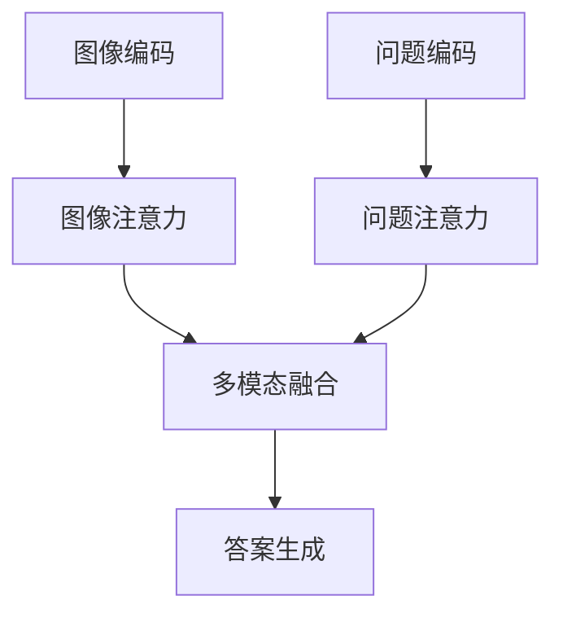
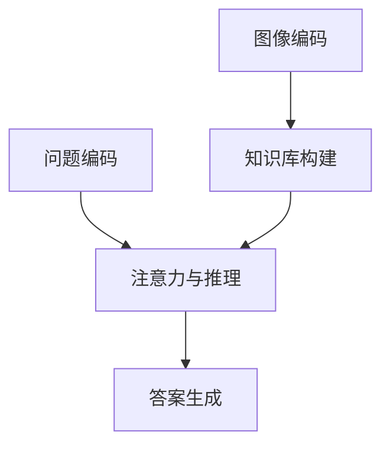

# Visual Question Answering原理与代码实例讲解

## 1.背景介绍

视觉问答(Visual Question Answering, VQA)是计算机视觉和自然语言处理领域中一个极具挑战性的任务。它要求计算机系统能够理解图像中的内容,并基于图像和自然语言问题,给出正确的答案。这个看似简单的任务,实际上需要机器具备多模态理解和推理的能力,涉及计算机视觉、自然语言处理、知识表示与推理等多个领域。

VQA任务的应用前景十分广阔,可以用于智能助手、智能家居、自动驾驶等多个领域。例如,智能助手可以回答用户基于图像提出的各种问题;自动驾驶汽车需要理解路况图像并回答相关问题等。因此,VQA被视为人工智能系统通向通用智能的一个重要里程碑。

## 2.核心概念与联系

### 2.1 多模态融合

VQA任务需要同时处理视觉和文本两种模态的信息,并将它们有效地融合起来。常见的做法是使用双通道编码器,分别对图像和问题进行编码,然后将两个编码器的输出进行融合。

### 2.2 注意力机制

由于图像和问题中包含大量无关信息,注意力机制可以帮助模型关注重点区域和词语,提高模型性能。常见的做法包括空间注意力、语义注意力等。

### 2.3 知识推理

VQA任务往往需要一定的先验知识和推理能力,才能正确回答问题。例如回答"这是什么动物"需要识别动物种类的知识,"两只狗在做什么"需要对动作行为进行推理。

### 2.4 开放词汇集

与传统分类任务不同,VQA任务的答案集合是开放的,答案可以是任意的短语或单词。这给模型的生成能力带来了新的挑战。

## 3.核心算法原理具体操作步骤 

### 3.1 基于注意力的VQA模型

一种典型的基于注意力的VQA模型流程如下:



1. 图像编码: 使用CNN等模型对输入图像进行编码,获得图像特征。
2. 问题编码: 使用RNN、Transformer等模型对输入问题进行编码,获得问题特征。
3. 注意力机制: 分别对图像特征和问题特征应用空间注意力和语义注意力,获得对应的注意力权重。
4. 多模态融合: 将加权的图像特征和问题特征进行融合,获得多模态融合特征。
5. 答案生成: 基于多模态融合特征,生成答案,可以使用分类或生成的方式。

### 3.2 基于记忆机制的VQA模型

另一种流行的VQA模型架构是基于记忆机制,它试图构建一个显式的知识库,并在回答问题时参考知识库进行推理。



1. 图像编码: 使用CNN等模型对输入图像进行编码,获得图像特征。
2. 知识库构建: 基于图像特征,构建显式的知识库,存储图像中的实体、属性和关系等知识。
3. 问题编码: 使用RNN、Transformer等模型对输入问题进行编码,获得问题特征。
4. 注意力与推理: 根据问题特征,在知识库中进行注意力选择和推理,获得相关知识。
5. 答案生成: 基于选择的知识,生成对应的答案。

## 4.数学模型和公式详细讲解举例说明

### 4.1 注意力机制

注意力机制是VQA模型中一个关键组件,它能够帮助模型关注输入的重点区域。给定一个查询$q$和一组键值对$(k_i, v_i)$,注意力机制的计算过程如下:

$$\begin{aligned}
e_i &= f(q, k_i) \\
\alpha_i &= \frac{exp(e_i)}{\sum_j exp(e_j)} \\
o &= \sum_i \alpha_i v_i
\end{aligned}$$

其中$f$是一个评分函数,用于计算查询$q$与每个键$k_i$的相关性分数$e_i$。常见的评分函数包括点乘评分、缩放点乘评分、concat评分等。$\alpha_i$是通过softmax归一化得到的注意力权重。最终的输出$o$是所有值向量$v_i$的加权和。

在VQA任务中,查询$q$可以是问题的编码向量,键$k_i$和值$v_i$可以是图像区域的特征向量。通过注意力机制,模型可以自适应地选择与问题相关的图像区域,并聚合这些区域的特征,从而提高模型的性能。

### 4.2 多模态融合

多模态融合是将视觉和文本信息有效融合的关键。一种常见的融合方法是外积(Outer Product):

$$z = f_{fusion}([v; q; v \odot q; v \circ q])$$

其中$v$和$q$分别表示图像和问题的编码向量,$\odot$表示元素乘积,$\circ$表示外积。$f_{fusion}$是一个融合函数,通常使用全连接层或其他非线性变换。外积可以有效地捕获视觉和文本之间的高阶交互信息。

另一种常见的融合方法是门控融合(Gated Fusion):

$$\begin{aligned}
z &= \sigma(W_v v + W_q q) \odot v + (1 - \sigma(W_v v + W_q q)) \odot q \\
\sigma(x) &= \frac{1}{1 + e^{-x}}
\end{aligned}$$

其中$W_v$和$W_q$是可学习的权重矩阵,$\sigma$是sigmoid函数。门控融合通过学习两个模态的相对重要性,动态地控制它们的融合程度。

除了上述方法,还有一些其他的融合方法,如双线性池化、矩阵乘法等。合适的融合方法对于VQA模型的性能至关重要。

## 5.项目实践:代码实例和详细解释说明

以下是一个基于Pytorch实现的简单VQA模型示例,包括图像编码器、问题编码器、注意力模块和答案解码器。为了简洁,我们使用了预训练的ResNet作为图像编码器,使用LSTM作为问题编码器。

```python
import torch
import torch.nn as nn

# 图像编码器
class ImageEncoder(nn.Module):
    def __init__(self, pretrained=True):
        super().__init__()
        self.resnet = torchvision.models.resnet152(pretrained=pretrained)
        
    def forward(self, images):
        features = self.resnet(images)
        return features

# 问题编码器
class QuestionEncoder(nn.Module):
    def __init__(self, vocab_size, embedding_dim, hidden_dim):
        super().__init__()
        self.embedding = nn.Embedding(vocab_size, embedding_dim)
        self.lstm = nn.LSTM(embedding_dim, hidden_dim, batch_first=True)
        
    def forward(self, questions):
        embeddings = self.embedding(questions)
        _, (h, _) = self.lstm(embeddings)
        return h.squeeze(0)

# 注意力模块
class AttentionModule(nn.Module):
    def __init__(self, visual_dim, question_dim, attention_dim):
        super().__init__()
        self.visual_proj = nn.Linear(visual_dim, attention_dim)
        self.question_proj = nn.Linear(question_dim, attention_dim)
        self.attention = nn.MultiheadAttention(attention_dim, num_heads=8)
        
    def forward(self, visual_features, question_features):
        visual_proj = self.visual_proj(visual_features)
        question_proj = self.question_proj(question_features.unsqueeze(1))
        attended, _ = self.attention(question_proj, visual_proj, visual_proj)
        return attended.squeeze(1)

# 答案解码器
class AnswerDecoder(nn.Module):
    def __init__(self, joint_dim, answer_vocab_size):
        super().__init__()
        self.joint_proj = nn.Linear(joint_dim, answer_vocab_size)
        
    def forward(self, joint_features):
        scores = self.joint_proj(joint_features)
        return scores

# 整体VQA模型
class VQAModel(nn.Module):
    def __init__(self, image_encoder, question_encoder, attention_module, answer_decoder):
        super().__init__()
        self.image_encoder = image_encoder
        self.question_encoder = question_encoder
        self.attention_module = attention_module
        self.answer_decoder = answer_decoder
        
    def forward(self, images, questions):
        visual_features = self.image_encoder(images)
        question_features = self.question_encoder(questions)
        attended_features = self.attention_module(visual_features, question_features)
        joint_features = torch.cat([attended_features, question_features], dim=1)
        scores = self.answer_decoder(joint_features)
        return scores
```

在这个示例中,我们首先使用预训练的ResNet对输入图像进行编码,得到视觉特征。然后使用LSTM对问题进行编码,得到问题特征。接下来,我们使用一个多头注意力模块,将视觉特征和问题特征融合,得到加权的视觉特征。最后,我们将加权的视觉特征和问题特征拼接,并通过一个全连接层得到答案的分数。

在实际应用中,您可以根据需求调整模型的结构和超参数,并使用更大的预训练模型(如BERT、ViT等)来提高性能。此外,还可以尝试其他的注意力机制、融合方法和解码器,以获得更好的效果。

## 6.实际应用场景

VQA技术在多个领域都有广泛的应用前景:

1. **智能助手**: 智能助手可以基于VQA技术回答用户提出的各种视觉相关问题,如"这张图片中有几只狗?""这个人在做什么?"等。这将极大提高助手的交互能力和用户体验。

2. **自动驾驶**: 自动驾驶汽车需要理解复杂的交通场景,VQA技术可以帮助汽车回答诸如"前方是否有行人""那个标志是什么意思"等问题,从而做出正确的决策。

3. **医疗影像辅助诊断**: 医生可以基于VQA系统提出各种与病理相关的问题,系统分析医疗影像并给出答复,为医生的诊断决策提供参考。

4. **教育领域**: VQA技术可以开发出智能教学助手,回答学生在学习过程中提出的各种问题,提高教学效率。

5. **机器人视觉**: 服务机器人需要理解环境并回答相关问题,以完成各种任务。VQA技术可以赋予机器人这种能力。

6. **智能安防**: VQA系统可以分析监控视频,回答诸如"这个人是否可疑""发生了什么事情"等问题,提高安防效率。

总的来说,VQA技术有望在多个领域发挥重要作用,推动人工智能系统向通用智能迈进。

## 7.工具和资源推荐

在VQA领域,有许多优秀的开源工具和资源可供使用:

1. **数据集**:
   - VQA数据集: 最著名的VQA数据集,包含超过20万张图像和60多万个问题。
   - Visual Genome: 包含10万张密集标注的图像和170万个问题。
   - GQA: 另一个高质量的VQA数据集,专注于测试模型的推理能力。

2. **模型库**:
   - pythia: Facebook AI Research开源的多任务视觉与语言模型库,支持VQA等多个任务。
   - ViLBERT: 基于BERT的视觉与语言双向模型,在多个任务上表现出色。
   - VisualBERT: 另一个基于BERT的视觉与语言预训练模型。

3. **评测平台**:
   - EvalAI: 提供在线评测和公开比赛的平台,包括VQA任务。
   - Kaggle: 知名的数据科学竞赛平台,也有VQA相关的比赛。

4. **教程和资源**:
   - CS131n课程笔记: Stanford的这门课程提供了优秀的VQA教程和资源。
   - VQA论文开源目录: Github上整理的VQA相关论文开源代码。

利用这些优秀的开源资源,您可以快速入