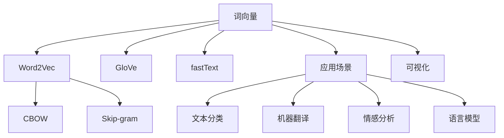
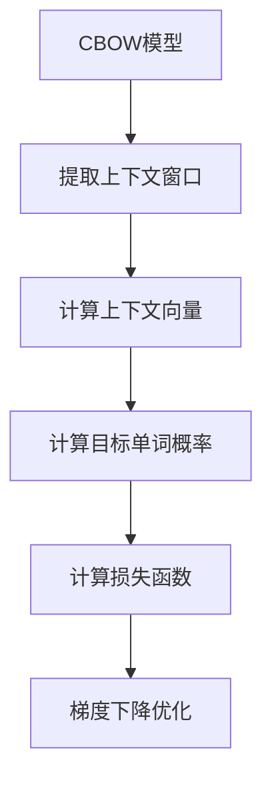
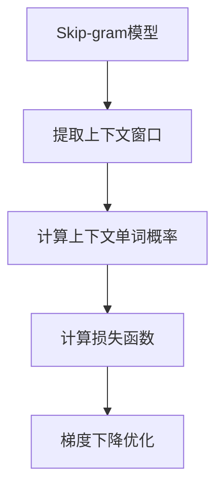

# Word Embeddings 原理与代码实战案例讲解

## 1. 背景介绍

在自然语言处理(NLP)领域,词向量(Word Embeddings)是一种将单词映射到连续向量空间的技术,使得这些向量能够捕捉单词之间的语义和语法关系。传统的单词表示方法,如one-hot编码,将每个单词表示为一个高维稀疏向量,无法体现单词之间的相似性。而词向量通过将单词映射到低维连续空间,使得语义相似的单词在该向量空间中彼此靠近,从而捕获了单词之间的语义关系。

词向量的出现极大地推动了NLP领域的发展,为许多下游任务提供了强大的单词表示能力,如机器翻译、文本分类、情感分析等。目前,词向量已经成为NLP领域中最基础和最重要的技术之一,广泛应用于各种NLP任务中。

## 2. 核心概念与联系

### 2.1 词向量的表示

词向量是将单词映射到一个固定长度的实值向量,通常是一个低维的密集向量。每个单词对应一个向量,向量中的每个元素(或称为embeddings)表示该单词在对应维度上的数值。

例如,如果我们将单词映射到一个100维的向量空间,那么每个单词都可以用一个100维的向量来表示。这些向量可以通过神经网络模型从大量语料中学习得到。

### 2.2 词向量的训练方法

目前,最常用的词向量训练方法有以下几种:

1. **Word2Vec**:由Google提出,包括CBOW(连续词袋模型)和Skip-gram(跳元模型)两种模型架构。
2. **GloVe**(Global Vectors for Word Representation):由斯坦福大学提出,利用词与词之间的共现信息来训练词向量。
3. **fastText**:由Facebook人工智能研究院提出,能够处理词的子词结构,对于未见词有较好的表现。

### 2.3 词向量的应用

词向量可以应用于各种NLP任务中,如:

1. **文本分类**:将文本映射为向量后,可以训练分类器对文本进行分类。
2. **机器翻译**:将源语言和目标语言的单词映射到同一个向量空间中,捕捉跨语言的语义关系。
3. **情感分析**:通过分析情感词的向量表示,可以判断文本的情感倾向。
4. **语言模型**:词向量可以作为语言模型的输入特征,提高模型的性能。

### 2.4 词向量的可视化

由于词向量是低维密集向量,因此我们可以使用降维技术(如PCA、t-SNE等)将高维向量映射到二维或三维空间进行可视化,直观地观察单词之间的语义关系。

## 3. 核心算法原理具体操作步骤

在这一部分,我们将重点介绍Word2Vec中的两种核心算法模型:CBOW(Continuous Bag-of-Words)和Skip-gram。

### 3.1 CBOW模型

CBOW模型的目标是基于上下文单词来预测目标单词。具体来说,给定一个上下文窗口大小 $C$,模型的输入是一个长度为 $2C$ 的上下文单词向量序列,输出是一个目标单词向量。

算法步骤如下:

1. 对于每个目标单词 $w_t$,从语料库中提取上下文窗口 $(w_{t-C}, ..., w_{t-1}, w_{t+1}, ..., w_{t+C})$。
2. 将上下文单词的词向量 $\vec{v}(w_{t-C}), ..., \vec{v}(w_{t-1}), \vec{v}(w_{t+1}), ..., \vec{v}(w_{t+C})$ 求平均,得到上下文向量 $\vec{x}$。
3. 使用softmax函数计算目标单词 $w_t$ 的概率 $P(w_t | context)$:

$$P(w_t | context) = \frac{e^{\vec{v}(w_t)^T \vec{x}}}{\sum_{w \in V} e^{\vec{v}(w)^T \vec{x}}}$$

其中 $V$ 是词汇表, $\vec{v}(w)$ 是单词 $w$ 的词向量。

4. 定义损失函数为目标单词的负对数似然,并使用梯度下降法对模型参数(词向量)进行优化。

### 3.2 Skip-gram模型

与CBOW模型相反,Skip-gram模型的目标是基于目标单词来预测上下文单词。具体来说,给定一个目标单词,模型需要预测其上下文窗口内的单词。

算法步骤如下:

1. 对于每个目标单词 $w_t$,从语料库中提取上下文窗口 $(w_{t-C}, ..., w_{t-1}, w_{t+1}, ..., w_{t+C})$。
2. 使用softmax函数计算每个上下文单词 $w_c$ 的概率 $P(w_c | w_t)$:

$$P(w_c | w_t) = \frac{e^{\vec{v}(w_c)^T \vec{v}(w_t)}}{\sum_{w \in V} e^{\vec{v}(w)^T \vec{v}(w_t)}}$$

3. 定义损失函数为所有上下文单词的负对数似然之和,并使用梯度下降法对模型参数(词向量)进行优化。

两种模型都需要对词汇表 $V$ 中的所有单词进行softmax计算,计算复杂度为 $O(|V|)$,当词汇表很大时会变得非常耗时。因此,通常采用一些技巧来加速训练,如Hierarchical Softmax或者Negative Sampling。

## 4. 数学模型和公式详细讲解举例说明

在上一部分,我们介绍了CBOW和Skip-gram模型的核心算法步骤,其中涉及到一些重要的数学概念和公式,接下来我们将详细讲解这些内容。

### 4.1 One-hot编码

在训练词向量模型之前,我们需要对单词进行数值编码。最简单的方法是One-hot编码,即将每个单词表示为一个长度为 $|V|$ 的向量,其中只有一个位置为1,其余全为0。

例如,假设我们有一个包含4个单词的词汇表 $V = \{a, b, c, d\}$,那么单词 $a$ 的One-hot编码为 $[1, 0, 0, 0]$, 单词 $b$ 的One-hot编码为 $[0, 1, 0, 0]$,以此类推。

One-hot编码的缺点是编码向量非常高维且稀疏,无法体现单词之间的相似性。因此,我们需要将单词映射到低维密集向量,也就是词向量。

### 4.2 Softmax函数

在CBOW和Skip-gram模型中,我们需要计算目标单词或上下文单词的概率,这里使用了Softmax函数。

对于一个 $K$ 维的实值向量 $\vec{x} = (x_1, x_2, ..., x_K)$,其Softmax函数定义为:

$$\text{softmax}(\vec{x})_i = \frac{e^{x_i}}{\sum_{j=1}^K e^{x_j}}$$

其中 $i = 1, 2, ..., K$。可以看出,Softmax函数将一个 $K$ 维实值向量映射到一个 $K$ 维概率向量,每个分量的值在 $(0, 1)$ 之间,并且所有分量之和为1。

在词向量模型中,我们将单词 $w$ 的词向量记为 $\vec{v}(w)$,上下文向量记为 $\vec{x}$,那么目标单词 $w_t$ 的概率可以表示为:

$$P(w_t | context) = \text{softmax}(\vec{v}(w_t)^T \vec{x})$$

### 4.3 负采样 (Negative Sampling)

在训练CBOW和Skip-gram模型时,我们需要对所有单词进行softmax计算,计算复杂度为 $O(|V|)$,当词汇表 $V$ 很大时会变得非常耗时。因此,我们可以采用Negative Sampling技巧来加速训练。

Negative Sampling的核心思想是:对于一对正样本(目标单词和上下文单词),我们随机采样一些负样本(目标单词和随机单词),然后使用逻辑回归来区分正负样本。

具体来说,对于每个正样本 $(w_t, w_c)$,我们从词汇表 $V$ 中随机采样 $k$ 个负样本 $\{w_i^{(n)}\}_{i=1}^k$,其中 $w_i^{(n)} \neq w_t$。然后,我们最大化如下的对数似然函数:

$$\log \sigma(\vec{v}(w_c)^T \vec{v}(w_t)) + \sum_{i=1}^k \mathbb{E}_{w_i^{(n)} \sim P_n(w)} \left[ \log \sigma(-\vec{v}(w_i^{(n)})^T \vec{v}(w_t)) \right]$$

其中 $\sigma(x) = 1 / (1 + e^{-x})$ 是sigmoid函数, $P_n(w)$ 是负采样的噪声分布(通常设置为单词频率的单调下降函数)。

通过Negative Sampling,我们只需要对 $k+1$ 个单词进行计算,而不是对整个词汇表进行softmax计算,大大降低了计算复杂度。

### 4.4 Word Mover's Distance

除了词向量之外,我们还可以定义文档向量或句子向量,用于捕捉更高层次的语义信息。一种常用的方法是将文档或句子表示为其所包含单词的词向量的加权平均。

基于文档向量,我们可以定义Word Mover's Distance(WMD)来衡量两个文档之间的语义距离。WMD的思想来源于土地运输问题(Earth Mover's Distance),它将一个文档视为一个单词分布,另一个文档视为另一个单词分布,然后计算将一个分布转换为另一个分布所需的最小"运输费用"。

更formally地,对于两个文档 $D_1$ 和 $D_2$,它们的单词集合分别为 $\{w_1^1, ..., w_n^1\}$ 和 $\{w_1^2, ..., w_m^2\}$,单词 $w$ 在两个文档中的归一化词频分别为 $d_1(w)$ 和 $d_2(w)$,那么 $D_1$ 和 $D_2$ 之间的WMD定义为:

$$\text{WMD}(D_1, D_2) = \min_{\substack{T \geq 0 \\ \sum_{i=1}^n T_{i,j} = d_1(w_i^1) \\ \sum_{j=1}^m T_{i,j} = d_2(w_j^2)}} \sum_{i=1}^n \sum_{j=1}^m T_{i,j} c(w_i^1, w_j^2)$$

其中 $T$ 是一个流动矩阵, $T_{i,j}$ 表示从文档 $D_1$ 中的单词 $w_i^1$ 到文档 $D_2$ 中的单词 $w_j^2$ 的流动量, $c(w_i^1, w_j^2)$ 是两个单词之间的距离度量,通常使用它们的词向量之间的欧几里得距离或余弦距离。

WMD可以用于文本聚类、文本相似度计算等任务,并且已被证明比简单的词袋模型(Bag-of-Words)具有更好的性能。

## 5. 项目实践:代码实例和详细解释说明

在这一部分,我们将使用Python中的Gensim库