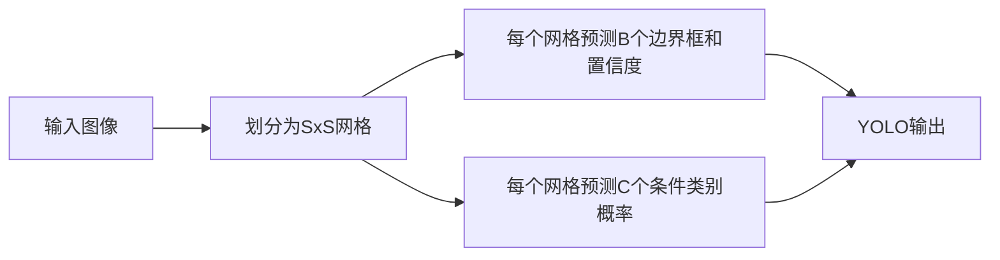
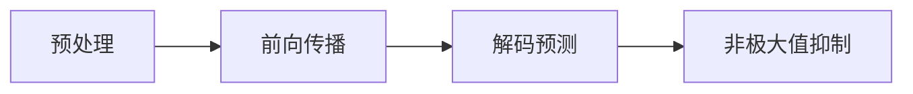

## 1.背景介绍

YOLO（You Only Look Once）是一个非常流行的实时物体检测系统。它的名字来源于其核心思想：只需要对图像进行一次查看就可以检测到物体。这与传统的物体检测方法有很大的不同，传统的方法通常需要多次查看图像或对图像的不同部分进行多次查看。YOLO的这种独特之处使得它在实时物体检测任务中表现出色。

## 2.核心概念与联系

YOLO的基本思想是将物体检测视为一个回归问题，而不是传统的分类问题。它将输入图像划分为$S \times S$个网格，每个网格负责预测一个物体。每个网格预测$B$个边界框和它们的置信度，以及$C$个条件类别概率。这样，YOLO的输出就是一个$S \times S \times (B \times 5 + C)$的张量。



## 3.核心算法原理具体操作步骤

YOLO的操作步骤可以分为以下几个步骤：

1. **预处理**：首先，将输入图像调整为网络需要的大小（例如，YOLOv1使用448x448的输入）。

2. **前向传播**：将预处理后的图像传递给神经网络。YOLO使用一个单一的卷积神经网络来进行这个任务。

3. **解码预测**：网络的输出是一个$S \times S \times (B \times 5 + C)$的张量，需要将其解码为物体的边界框、置信度和类别。

4. **非极大值抑制（NMS）**：由于每个网格预测$B$个边界框，可能会有多个边界框预测同一个物体。因此，需要使用NMS来消除冗余的预测。



## 4.数学模型和公式详细讲解举例说明

YOLO的损失函数是一个复合的损失函数，包括坐标预测的均方误差、物体置信度的均方误差、背景置信度的均方误差和类别预测的交叉熵损失。具体来说，损失函数$L$可以表示为：

$$
L = \lambda_{coord} \sum_{i=0}^{S^2} \sum_{j=0}^{B} 1_{ij}^{obj} [(x_i - \hat{x}_i)^2 + (y_i - \hat{y}_i)^2] \\
+ \lambda_{coord} \sum_{i=0}^{S^2} \sum_{j=0}^{B} 1_{ij}^{obj} [(\sqrt{w_i} - \sqrt{\hat{w}_i})^2 + (\sqrt{h_i} - \sqrt{\hat{h}_i})^2] \\
+ \sum_{i=0}^{S^2} \sum_{j=0}^{B} 1_{ij}^{obj} (C_i - \hat{C}_i)^2 \\
+ \sum_{i=0}^{S^2} \sum_{j=0}^{B} 1_{ij}^{noobj} (C_i - \hat{C}_i)^2 \\
+ \sum_{i=0}^{S^2} 1_{i}^{obj} \sum_{c \in classes} (p_i(c) - \hat{p}_i(c))^2
$$

其中，$1_{i}^{obj}$表示网格$i$中是否有物体，$1_{ij}^{obj}$表示网格$i$的第$j$个边界框是否负责预测这个物体。

## 5.项目实践：代码实例和详细解释说明

以下是一个简单的YOLOv1的PyTorch实现的代码片段：

```python
class YOLOv1(nn.Module):
    def __init__(self, num_classes):
        super(YOLOv1, self).__init__()
        self.num_classes = num_classes
        # 定义YOLOv1的网络结构
        self.features = nn.Sequential(
            # ...
        )
        self.classifier = nn.Sequential(
            # ...
        )

    def forward(self, x):
        x = self.features(x)
        x = x.view(x.size(0), -1)
        x = self.classifier(x)
        return x
```

## 6.实际应用场景

YOLO在许多实际应用场景中都有广泛的应用，例如无人驾驶、视频监控、工业视觉等。它的实时性和准确性使得它在这些任务中都表现得非常优秀。

## 7.工具和资源推荐

对于YOLO的学习和实践，以下是一些推荐的工具和资源：

- **Darknet**：YOLO的原始实现是在Darknet中完成的，这是一个由YOLO的作者开发的开源神经网络框架。

- **YOLOv1论文**：YOLOv1的论文是理解YOLO的最好资源，其中详细介绍了YOLO的设计和实现。

- **PyTorch**：PyTorch是一个非常流行的深度学习框架，有许多开源的YOLO实现是基于PyTorch的。

## 8.总结：未来发展趋势与挑战

YOLO的设计虽然简洁，但是它的性能和准确性还有很大的提升空间。例如，YOLO对小物体的检测性能较差，对物体的形状和姿态的识别也有一定的局限性。未来YOLO的发展趋势可能会更加注重这些问题的解决，例如通过引入更复杂的模型或更强大的特征来提升性能。

## 9.附录：常见问题与解答

1. **为什么YOLO可以做到实时物体检测？**

答：YOLO的实时性主要来源于其设计思想，即将物体检测视为一个回归问题，只需要对图像进行一次查看就可以得到所有物体的位置和类别。这大大减少了计算量，使得YOLO可以在实时任务中表现优秀。

2. **YOLO有哪些局限性？**

答：YOLO的一些局限性包括对小物体的检测性能较差，对物体的形状和姿态的识别有一定的局限性，以及对遮挡物体的处理不足等。

作者：禅与计算机程序设计艺术 / Zen and the Art of Computer Programming