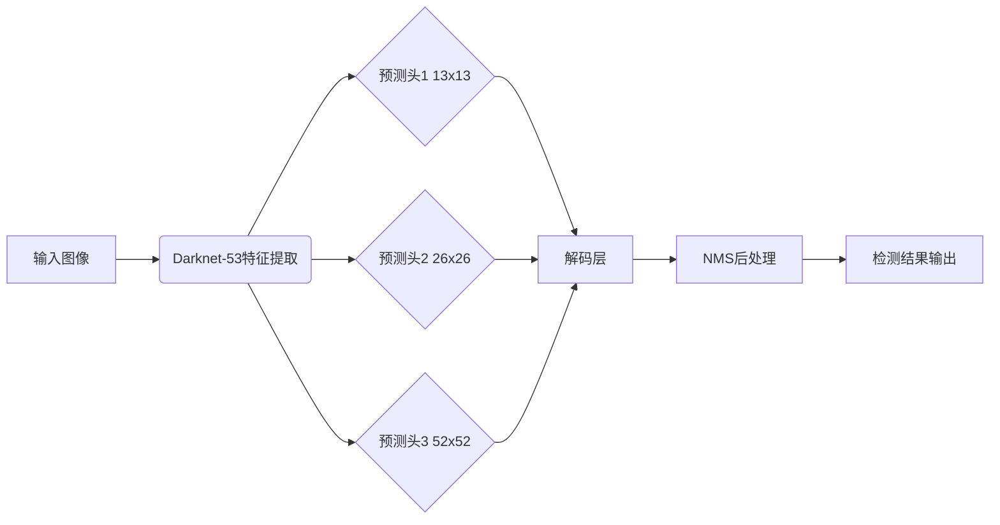

# YOLOv3原理与代码实例讲解

## 1. 背景介绍
### 1.1 目标检测的发展历程
#### 1.1.1 传统目标检测方法
#### 1.1.2 基于深度学习的目标检测方法
#### 1.1.3 One-stage目标检测算法的兴起
### 1.2 YOLO算法家族
#### 1.2.1 YOLOv1
#### 1.2.2 YOLOv2
#### 1.2.3 YOLOv3的诞生

## 2. 核心概念与联系
### 2.1 卷积神经网络(CNN)
#### 2.1.1 卷积层
#### 2.1.2 池化层 
#### 2.1.3 全连接层
### 2.2 锚框(Anchor Box)
#### 2.2.1 锚框的概念
#### 2.2.2 锚框的作用
#### 2.2.3 如何选择锚框
### 2.3 非极大值抑制(NMS)
#### 2.3.1 NMS的概念
#### 2.3.2 NMS的作用
#### 2.3.3 NMS的实现

## 3. 核心算法原理具体操作步骤
### 3.1 特征提取网络
#### 3.1.1 Darknet-53网络结构
#### 3.1.2 残差结构
#### 3.1.3 特征融合
### 3.2 预测层设计
#### 3.2.1 预测头的设计
#### 3.2.2 锚框先验
#### 3.2.3 预测输出的解码
### 3.3 损失函数设计
#### 3.3.1 分类损失
#### 3.3.2 定位损失 
#### 3.3.3 置信度损失
### 3.4 训练过程
#### 3.4.1 数据增强
#### 3.4.2 批量归一化
#### 3.4.3 学习率调整策略

## 4. 数学模型和公式详细讲解举例说明
### 4.1 交并比(IoU)
$$
IoU = \frac{A \cap B}{A \cup B} = \frac{A \cap B}{A + B - A \cap B}
$$
### 4.2 目标分类损失
$$
L_{cls}(p_i,c_i) = -c_i\log(p_i) - (1-c_i)\log(1-p_i)
$$
### 4.3 目标定位损失
$$
L_{loc} = \sum_{i=0}^{S^2}\sum_{j=0}^{B} I_{ij}^{obj} [(x_i-\hat{x_i})^2 + (y_i-\hat{y_i})^2] 
$$
$$
+ \sum_{i=0}^{S^2}\sum_{j=0}^{B} I_{ij}^{obj} [(\sqrt{w_i}-\sqrt{\hat{w_i}})^2 + (\sqrt{h_i}-\sqrt{\hat{h_i}})^2]
$$

## 5. 项目实践：代码实例和详细解释说明
### 5.1 环境配置
#### 5.1.1 安装CUDA和cuDNN
#### 5.1.2 安装Darknet框架
### 5.2 准备数据集
#### 5.2.1 标注数据集
#### 5.2.2 划分训练集和测试集
#### 5.2.3 生成标签文件
### 5.3 修改配置文件
#### 5.3.1 修改cfg文件
#### 5.3.2 修改data文件
#### 5.3.3 下载预训练权重
### 5.4 训练模型
#### 5.4.1 单GPU训练
```bash
./darknet detector train cfg/coco.data cfg/yolov3.cfg yolov3.weights
```
#### 5.4.2 多GPU训练
```bash
./darknet detector train cfg/coco.data cfg/yolov3.cfg yolov3.weights -gpus 0,1,2,3
```
### 5.5 测试模型
#### 5.5.1 测试单张图片
```bash
./darknet detect cfg/yolov3.cfg yolov3.weights image.jpg
```
#### 5.5.2 测试视频文件
```bash
./darknet detector demo cfg/coco.data cfg/yolov3.cfg yolov3.weights video.mp4
```
### 5.6 计算mAP
```bash
./darknet detector map cfg/coco.data cfg/yolov3.cfg yolov3.weights
```

## 6. 实际应用场景
### 6.1 智能安防
#### 6.1.1 入侵检测
#### 6.1.2 人脸识别
#### 6.1.3 车辆检测与识别
### 6.2 无人驾驶
#### 6.2.1 行人检测
#### 6.2.2 车道线检测
#### 6.2.3 交通标志检测
### 6.3 智慧零售
#### 6.3.1 货架商品检测
#### 6.3.2 结账商品检测
#### 6.3.3 顾客行为分析

## 7. 工具和资源推荐
### 7.1 标注工具
- LabelImg
- LabelMe
- Labelbox
### 7.2 开源数据集
- COCO
- PASCAL VOC
- ImageNet
### 7.3 相关开源项目
- Darknet
- PyTorch-YOLOv3
- TensorFlow-YOLOv3
### 7.4 学习资源
- YOLO官方网站
- 深度学习与计算机视觉实战
- 目标检测综述

## 8. 总结：未来发展趋势与挑战
### 8.1 算法优化
#### 8.1.1 改进特征提取网络
#### 8.1.2 改进预测头设计
#### 8.1.3 改进损失函数
### 8.2 模型压缩与加速
#### 8.2.1 模型剪枝
#### 8.2.2 模型量化
#### 8.2.3 模型蒸馏
### 8.3 小目标检测
#### 8.3.1 数据增强策略
#### 8.3.2 特征融合机制
#### 8.3.3 上下文信息利用
### 8.4 检测新场景
#### 8.4.1 旋转目标检测
#### 8.4.2 密集目标检测
#### 8.4.3 域自适应目标检测

## 9. 附录：常见问题与解答
### 9.1 为什么要使用锚框？
锚框可以极大地减少候选区域的数量,加快检测速度。同时锚框可以预设不同尺度和宽高比,更好地适应不同形状的目标。

### 9.2 YOLOv3相比YOLOv2有哪些改进？
- 使用了更深更强的特征提取网络Darknet-53
- 在3个不同尺度上进行预测
- 使用了更多的锚框先验
- 改进了损失函数设计

### 9.3 目标检测评价指标mAP是怎么计算的？
mAP是mean Average Precision的缩写,即各类别AP的平均值。其中AP的计算方法是:对于某一个类别,根据置信度对检测结果排序,然后计算Precision-Recall曲线下面积即可得到AP值。

### 9.4 如何选择合适的锚框尺度和宽高比？
可以对训练集中的真实框进行K-Means聚类,根据聚类中心选择锚框。也可以手工设计一些常见目标的尺度和宽高比组合。

### 9.5 NMS算法是怎么实现的？
1. 根据置信度对检测框排序,选中置信度最高的框 
2. 计算选中框与其他框的IoU,去除IoU大于阈值的框
3. 重复以上过程直到所有框都被处理

### 9.6 YOLOv3的检测速度如何？
在COCO数据集上,YOLOv3-320的mAP为51.5%,在Titan X GPU上可达45FPS;YOLOv3-416的mAP为55.3%,速度为35FPS;YOLOv3-608的mAP为57.9%,速度为20FPS。



以上就是YOLOv3目标检测算法的原理与代码实例详解。YOLOv3凭借其优异的检测速度和精度,已成为目标检测领域的主流算法之一。未来随着算法的不断改进和优化,以及更多场景的应用拓展,YOLOv3及其变种算法必将在智慧安防、无人驾驶、工业视觉等领域大放异彩。让我们一起期待目标检测技术更加美好的明天!

作者：禅与计算机程序设计艺术 / Zen and the Art of Computer Programming